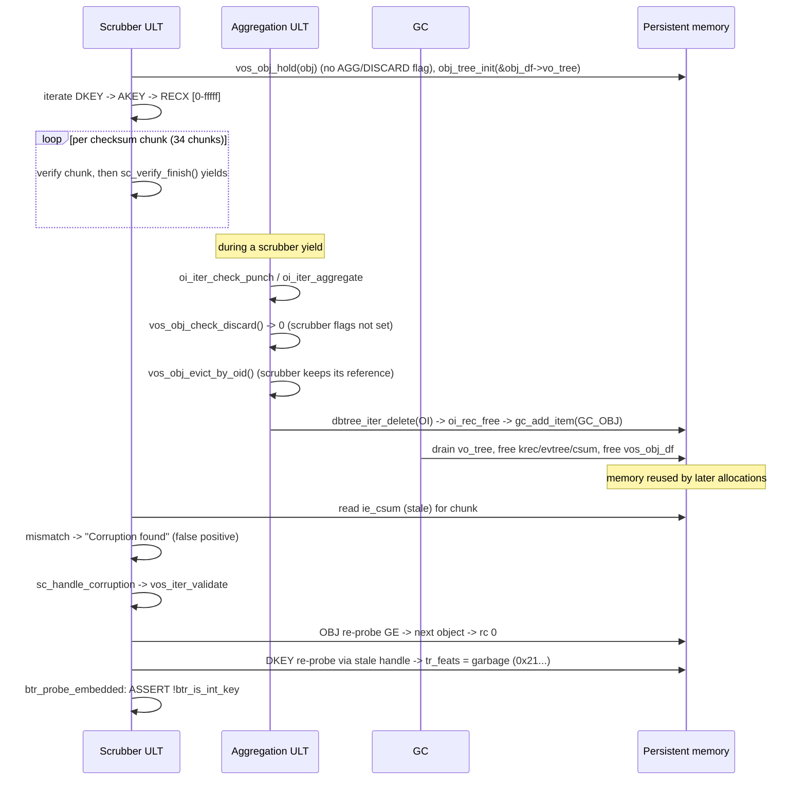

# DAOS-19721: engine abort in `btr_probe_embedded()` during checksum scrubbing

- **Ticket:** [DAOS-19721](https://daosio.atlassian.net/browse/DAOS-19721)
- **Report date:** 2026-09-29
- **Status:** Analysis only. No code changes, no ticket updates.
- **Root-cause confidence:** Medium (about 65%). Code analysis strongly supports
  the mechanism. It is not proven, because no core dump or matching binaries
  were available.

## Contents

1. [Executive summary](#executive-summary)
2. [Incident facts](#incident-facts)
3. [Artifacts examined](#artifacts-examined)
4. [Log timeline](#log-timeline)
5. [Stack decoding](#stack-decoding)
6. [Why the assertion cannot fire on a valid tree](#why-the-assertion-cannot-fire-on-a-valid-tree)
7. [Root-cause mechanism](#root-cause-mechanism)
8. [Relationship to DAOS-18153](#relationship-to-daos-18153)
9. [Hypotheses evaluated](#hypotheses-evaluated)
10. [Evidence gaps and confidence](#evidence-gaps-and-confidence)
11. [Secondary risks](#secondary-risks)
12. [Recommended verification](#recommended-verification)
13. [Candidate fix directions](#candidate-fix-directions)
14. [Code references](#code-references)

## Executive summary

`daos_engine` on `aurora-daos-0869` (rank 35) aborted on this assertion in
`btr_probe_embedded()`:

```text
Embedded root is incompatible with integer keys   (!btr_is_int_key(tcx))
```

It fired while the VOS checksum scrubber was revalidating its iterator after
reporting a checksum corruption. The corruption message and the assertion were
68 µs apart on the same ULT.

**Most likely root cause:** a use-after-free of an object's durable record
(`vos_obj_df`) that the scrubber holds across yields. The sequence is:

1. The scrubber holds an array object and keeps a dkey btree handle that points
   directly at `obj->obj_df->vo_tree`, which is persistent memory.
2. The scrubber yields between checksum chunks. During a yield, VOS
   aggregation (or discard) finds the object fully punched and deletes it from
   the object index. The record goes to GC and is later freed.
   `vos_obj_check_discard()` only checks the `obj_aggregate`/`obj_discard`
   flags, so it does not see the scrubber's reference.
3. The scrubber resumes and checks a chunk against a checksum read from stale
   memory. The mismatch is logged as corruption, which is almost certainly a
   **false positive**.
4. `sc_handle_corruption()` calls `vos_iter_validate()`. The object-level
   re-probe uses `BTR_PROBE_GE`, lands on the next object, and returns success
   without checking that the object ID is the same. The dkey-level re-probe then
   reads `tr_feats` from the freed and reused tree root. The garbage value has
   both `BTR_FEAT_UINT_KEY` (0x1) and `BTR_FEAT_EMBEDDED` (0x20) set, so the
   assertion fires.

This is a gap in the DAOS-18153 fix (commit `390ff59deb`). That fix handled a
scrubber yield during which the tree root's feature bits **changed**. It did not
handle the case where the root was **freed**.

## Incident facts

| Item | Value |
|---|---|
| Host / rank | `aurora-daos-0869`, rank 35, engine PID 50549 |
| Thread | xstream 18, ULT 1313 |
| Build | 2.8.1-rc2, `20260923-184531_dbohning_28_pr19131` |
| Pool / container | `5d952992` / `40d25379` |
| Scrub message | `Corruption found for chunk #34 of recx [0-fffff], epoch 2896131397299208196` |
| Assertion | `src/common/btree.c` `btr_probe_embedded()`, `!btr_is_int_key(tcx)` |
| Outcome | SIGABRT, engine exit |

The build PR (#19131) is a release/2.8 container and rebuild change. It does not
touch btree, VOS iterator, or scrubber code, so it is unlikely to have caused the
problem.

## Artifacts examined

- **Location:** `hsw-209:/mnt/nfs_shares/jira-largefiles/DAOS-19721/csum_scrubber_assert.tar`
  (13.2 GB).
- **Contents:** `logs-20260928-210825/<host>/`, which holds engine logs
  (`daos_server_*.log.<pid>.rank=N`), control-plane logs, and
  `daos_nvme.conf`.
- **Missing:** no core dump and no binaries or debuginfo. The core path in the
  ticket and the build directory do not exist on `hsw-209`.
- **Failing log:** `aurora-daos-0869/daos_server_1.log.50549.rank=35`
  (2,395 lines, INFO level only).
- **Other logs:** no other rank-35 or rank-31 log segment has a similar
  assertion. The previous incarnation (PID 42636) exited normally with
  "pool is stopping, scrubber exiting" at 23:41.
- **Source:** current worktree and local `release/2.8`. Both have identical
  assertion and scrubber code.

## Log timeline

All times are from the rank-35 log (engine PID 50549).

| Time | Event |
|---|---|
| 09/26 23:42 | Engine starts |
| 09/26 23:58:51 | EC aggregation callbacks for container `4182d76a` on all xstreams, including 18 |
| 09/27 00:11:42.229 | `vos_set_dtx_resync_version()` 0 → 1 for container `40d25379`, all xstreams |
| 09/27 00:11:42.229 | Pool map version 0 → 1 for `5d952992` |
| 09/27 00:11:42–44 | `vos_dtx_cmt_reindex()` for `5d952992/40d25379`, 0 entries, all xstreams |
| 09/27 00:11:50.226 | EC aggregation callbacks for `5d952992/40d25379`, all xstreams |
| 09/27 00:13:11.946262 | Scrubber: `Corruption found for chunk #34 of recx [0-fffff]` |
| 09/27 00:13:11.946330 | Assertion in `btr_probe_embedded()`, then SIGABRT |

**Observations:**

- Container `40d25379` had just become active: resync version, pool map,
  reindex, and aggregation all happened about 90 seconds before the crash.
  Background VOS aggregation and discard run in the same window as the scrubber.
- This is the first corruption message from this engine incarnation. A single
  real media error that immediately precedes an unrelated tree-metadata
  corruption would be an unusual coincidence.
- The log is INFO level. The `DB_EPC`/`DB_IO` debug messages that would show
  aggregation deleting an object ("Removing object ... from tree", "Moving
  object ... to gc heap") are not present, so the deletion cannot be confirmed
  from logs.

## Stack decoding

Backtrace frames, innermost first, with source mapping:

| # | Frame | Meaning |
|---|---|---|
| 1 | `libdaos_common_pmem +0x5bad5` | `btr_probe()` → `btr_probe_embedded()` (assert) |
| 2 | `dbtree_iter_probe+0xc7` | btree iterator probe |
| 3 | `libvos_srv +0x6f1d2` | `iop_probe` implementation (`key_iter_probe`) |
| 4 | `libvos_srv +0x1de85` | `iop_probe` call in `vos_iter_validate_internal()` |
| 5 | `libvos_srv +0x1e065` | recursive call `vos_iter_validate_internal(it_parent)` |
| 6 | `libvos_srv +0x1e065` | same recursive call site again |
| 7 | `libvos_srv +0xe6cb7` | `sc_handle_corruption()` / `sc_verify_recx()` |
| 8 | `libvos_srv +0xe9e4f` | `obj_iter_scrub_pre_cb()` |
| 9 | `libvos_srv +0x23b6b` | `vos_iterate` internals |

**Conclusion:** the probe that asserts is on the **DKEY iterator**.

`vos_iter_validate_internal()` recurses to the parent first, then probes its own
level. There are two identical recursion return addresses (frames 5 and 6), so
the validation started at the RECX iterator and recursed through AKEY to DKEY.
The top of the recursion (OBJ) had already returned 0, and the call that is still
active is the DKEY-level `iop_probe`.

This also rules out the object-index tree. It is registered with feature bits 0
(`src/vos/vos_obj_index.c`), so it could never have `UINT_KEY` set.

The tree being probed is therefore `obj->obj_df->vo_tree`, the object's dkey
tree.

## Why the assertion cannot fire on a valid tree

The assertion requires `tc_feats` to have both `BTR_FEAT_EMBEDDED` (0x20, which
selects `btr_probe_embedded`) and `BTR_FEAT_UINT_KEY` (0x1).

Feature bits (`src/include/daos/btree.h`):

| Bit | Name |
|---|---|
| 0x01 | `BTR_FEAT_UINT_KEY` |
| 0x02 | `BTR_FEAT_DIRECT_KEY` |
| 0x04 | `BTR_FEAT_DYNAMIC_ROOT` |
| 0x08 | `BTR_FEAT_SKIP_LEAF_REBAL` |
| 0x10 | `BTR_FEAT_EMBED_FIRST` |
| 0x20 | `BTR_FEAT_EMBEDDED` |

Several invariants make this combination impossible on a correctly formed tree:

1. **The dkey tree never gets `EMBED_FIRST`.** `obj_tree_init()`
   (`src/vos/vos_tree.c` ~1339) creates the dkey tree with
   `tree_obj2feats(obj, true)` only. `EMBED_FIRST` is added only in
   `tree_open_create()` for key subtrees (akey/value level).
2. **`EMBEDDED` requires `EMBED_FIRST`.** `BTR_FEAT_EMBEDDED` is set only in
   `btr_root_start()` (when `btr_use_embedded_value()` is true) and in
   `btr_node_del_embed()`. Both require `EMBED_FIRST` in `tc_feats`.
3. **`UINT_KEY` removes `EMBED_FIRST`.** `btr_class_feats_init()`
   (`src/common/btree.c` ~4536) strips `EMBED_FIRST` whenever `UINT_KEY` is set.
4. **VOS aggregation-time bits cannot leak into the low bits.**
   `VOS_TF_AGG_BIT` = 60, `VOS_AGG_NR_BITS` = 42, so the aggregation-time field
   uses bits 19–60 (`src/vos/vos_internal.h` ~533–555). `VOS_KEY_CMP_LEXICAL` is
   bit 63, and the other `VOS_TF_*` flags are bits 61–62. `dbtree_feats_set()`
   also refuses to change the low 6 bits (`BTR_FEAT_MASK`).
5. **`UINT_KEY` on this dkey tree is expected.** Recx `[0-fffff]` means an array
   object, and `DAOS_OT_ARRAY` uses uint64 dkeys (`VOS_KEY_CMP_UINT64_SET`). The
   unexpected bit is `EMBEDDED`.

Since `btr_probe()` reloads `tc_feats` from `ti_root->tr_feats` on every probe
(commit `390ff59deb`), the value that reached the assertion is what was in the
root's memory at that moment. No legitimate code path writes that value to a dkey
root. The memory is therefore either:

- (a) random media or firmware corruption of that exact word, or
- (b) memory that was freed and reused, or never belonged to a live root.

Option (b) fits the scrubber's yield-and-revalidate design and the timing. See
[Hypotheses evaluated](#hypotheses-evaluated).

## Root-cause mechanism

### Actors

- **Scrubber ULT** (`vos_scrub_pool` → `vos_iterate` → `obj_iter_scrub_pre_cb`
  → `sc_verify_recx`) on xstream 18.
- **VOS aggregation or discard ULT** on the same xstream and pool. These run
  concurrently with the scrubber because ULTs yield cooperatively.
- **GC ULT**, which drains and frees objects that aggregation queued.

### Step-by-step sequence



### Details per step

**1. The scrubber holds the object and its dkey tree in persistent memory.**

- `dkey_nested_iter_init()` (`src/vos/vos_obj.c` ~2040) calls `vos_obj_hold()`.
  For a scrub iterator, the flags contain neither `VOS_OBJ_AGGREGATE` nor
  `VOS_OBJ_DISCARD`, so `obj_aggregate`/`obj_discard` stay clear.
- It then calls `obj_tree_init()`, which opens a btree handle whose root is
  `&obj->obj_df->vo_tree`. That is a direct pointer into the object's durable
  record.

**2. The scrubber yields repeatedly within a single recx.**

- `sc_verify_recx()` checks the extent one checksum chunk at a time.
  `sc_verify_finish()` (`src/vos/vos_pool_scrub.c` ~320) calls
  `sc_wait_until_should_continue()` after each chunk, so there are up to 34
  yield points before chunk #34.
- The expected checksum (`ctx->sc_csum_to_verify`, set from `entry->ie_csum` in
  `sc_obj_val_setup()`) points into the evtree record's checksum buffer in
  persistent memory. It was captured before the yields.

**3. Aggregation or discard can delete an object the scrubber holds.**

- Both `oi_iter_check_punch()` (`src/vos/vos_obj_index.c` ~930) and
  `oi_iter_aggregate()` (~993) are protected only by `vos_obj_check_discard()`
  (`src/vos/vos_obj_cache.c` ~500) → `check_discard()` (~468).
- `check_discard()` returns a conflict only when the cached object has
  `obj_discard` or `obj_aggregate` set. It does **not** consider other holders,
  such as a scrubber or any plain read iterator.
- When the object's ilog shows it fully punched or aggregated away, the code:
  - calls `vos_obj_evict_by_oid()`, which only marks the LRU entry evicted, so
    the scrubber's reference and its `obj_df` pointer stay alive; then
  - calls `dbtree_iter_delete()` → `oi_rec_free()` → `gc_add_item(GC_OBJ, ...)`.
- GC then runs `gc_drain_obj()` → `gc_drain_btr(&obj->vo_tree)`, which frees
  dkeys, akeys, evtrees, and checksum buffers, and finally frees the
  `vos_obj_df` itself.
- By contrast, the explicit delete API `vos_obj_delete_internal()`
  (`src/vos/vos_obj.c` ~700) checks `daos_lru_is_last_user()`, returns
  `-DER_BUSY` if others hold the object, and sets `obj_zombie`. The aggregation
  and discard paths have neither protection.

**4. The false corruption.**

When the scrubber resumes, the checksum at `sc_csum_to_verify` (and possibly the
data location from the evtree entry) refers to memory that has been freed or
reused. The recomputed checksum does not match, and `sc_verify_recx()` logs
"Corruption found for chunk #34".

**5. Revalidation lets the stale handle through.**

`sc_handle_corruption()` (`src/vos/vos_pool_scrub.c` ~364) is written with
deleted entries in mind:

```c
/* ...If the entry has been deleted, we can ignore any corruption we found and
 * move on. */
rc = vos_iter_validate(ctx->sc_vos_iter_handle);
if (rc > 0) /** value no longer exists */
    return 0;
```

`vos_iter_validate_internal()` (`src/vos/vos_iterator.c` ~355) revalidates from
the top down: first the parent, then `iop_probe(..., VOS_ITER_PROBE_AGAIN)` at
each level.

- **OBJ level.** `oi_iter_probe()` (`src/vos/vos_obj_index.c` ~776) uses
  `BTR_PROBE_GE` on the saved anchor. The deleted OID is gone, so it lands on the
  **next** object. `oi_iter_match_probe()` skips the filter callback under
  `PROBE_AGAIN` and checks only that object's ilog. It returns 0 and never
  compares the OID with the anchor. The OBJ level reports "unchanged".
- **DKEY level.** `key_iter_probe()` (`src/vos/vos_obj.c` ~1284) calls
  `dbtree_iter_probe()` on the **old** handle, whose root pointer is still
  `&old_obj_df->vo_tree`. `btr_probe()` reloads `tc_feats` from that freed or
  reused root (`src/common/btree.c` ~1738). The value has bits 0x1 and 0x20 set,
  so control goes to `btr_probe_embedded()` and the assertion at ~1635 aborts the
  engine.

Because the OBJ level passes, the "value no longer exists" (`rc > 0`) path that
was designed for this situation is never reached.

## Relationship to DAOS-18153

Commit `390ff59deb` ("DAOS-18153 vos: re-initialize tcx feats on probe",
#17179) is on `release/2.8` and in the failing build. Its commit message
describes nearly the same scenario:

> 1. Scrubbing ULT iterates into dkey tree when the tree is non-embedded.
> 2. Scrubbing ULT yield.
> 3. Discarding ULT deletes some dkeys and turns the dkey tree into embedded
>    tree.
> 4. Scrubbing ULT resumes and try to revalidate by probe, the feats in it's
>    context is stale now...

The fix makes `btr_probe()` re-read `tr_feats` from the root. That is correct
when the root is **still valid but modified**. It cannot help when the root is
**freed**, and it actually ensures the garbage value is loaded into `tc_feats`.

DAOS-19721 is the "object deleted" version of the same scrubber yield race.

> **Caveat.** The 18153 description says a dkey tree became embedded. That
> contradicts invariant 1 above, unless that pool's dkey trees were created with
> different feature bits. It may have been an akey tree, or a stale root in that
> case as well. Either way, 18153 shows that scrubber-versus-discard races on
> held trees are a known problem area.

Related history worth reviewing:

- DAOS-18531: md-on-ssd phase-2 re-probe fixes (`bb891501bf`, `c88589150e`).
- DAOS-16951: discard of invalid records.

## Hypotheses evaluated

| # | Hypothesis | Verdict | Reasoning |
|---|---|---|---|
| H1 | Use-after-free of held `obj_df` after aggregation or discard deletes the object during a scrubber yield | **Most likely** | Explains both the false checksum error and the impossible feature bits. Matches the code paths, timing, and DAOS-18153 precedent. |
| H2 | Real media corruption hit data (checksum error), and separately corrupted the dkey root | Unlikely | Needs two unrelated corruptions in different structures, observed 68 µs apart. |
| H3 | Legitimate code path set `EMBEDDED` on a `UINT_KEY` dkey tree | Ruled out | Invariants 1–3. No writer produces this combination. |
| H4 | VOS agg-time feature bits leaked into the low btree bits | Ruled out | Bit layout (19–60, 61–63) plus the `dbtree_feats_set` mask. |
| H5 | Probe was on the OI tree or on akey or evtree levels | Ruled out | Stack recursion depth identifies DKEY. The OI class has feats 0. |
| H6 | Stale `tc_feats` in the context (the pre-18153 bug) | Ruled out for this build | `390ff59deb` is present. Feats are reloaded from the root on each probe. |
| H7 | PR #19131 (build under test) introduced the bug | Unlikely | Touches container and rebuild code only. |
| H8 | DTX abort freed the records instead of aggregation | Possible variant of H1 | `dtx_act_ent_cleanup()` also evicts objects by OID. Same missing holder check. |

## Evidence gaps and confidence

**What is proven from artifacts and code:**

- Crash location, thread, timing, and the order: corruption message first,
  then the assertion.
- The asserting probe is at DKEY level (from the stack).
- A valid VOS dkey tree cannot have `UINT_KEY` + `EMBEDDED`.
- Aggregation and discard can delete an object a scrubber is holding, and
  eviction does not invalidate the scrubber's `obj_df` pointer.
- OBJ-level `PROBE_AGAIN` returns success after landing on a different object.

**What is inferred:**

- That an aggregation, discard, or DTX delete of **this** object actually
  happened during the scrubber's yields. INFO-level logs cannot show it.
- That GC reused the freed memory before the revalidation.
- That the logged checksum corruption is false.

**What would raise confidence to high:**

- A core dump plus the matching `pr19131` binaries and debuginfo.
- A reproduction; see [Recommended verification](#recommended-verification).

## Secondary risks

These follow from the same mechanism and could matter beyond this crash:

1. **False RAS corruption events and target eviction.** If revalidation does not
   assert (for example, the freed memory looks like a non-embedded root),
   `sc_handle_corruption()` continues to `ras_notify_event()`,
   `sc_mark_corrupt()`, and the corruption counters. With enough false
   positives, `sc_pool_drain()` would drain a healthy target.
2. **Writes into freed persistent memory.** `sc_mark_corrupt()` →
   `VOS_ITER_PROC_OP_MARK_CORRUPT` would modify the extent through the stale
   iterator, which could corrupt whatever reused that memory.
3. **Other long-lived read iterators.** Any iterator that holds an object across
   yields without `VOS_OBJ_AGGREGATE`/`DISCARD` has the same exposure. The
   scrubber is most exposed because it yields many times per extent.

## Recommended verification

1. **Core dump analysis.** This needs the core from the ticket, which was not in
   the tar, plus the matching build.
   - Inspect `oiter->it_obj->obj_df` and `->vo_tree.tr_feats`.
   - Check whether the `obj_df` offset is in GC bins or free heap.
   - Check `obj_llink` evicted state and refcount.
   - Compare the anchor OID with the OID at the object iterator's current
     position.
2. **Targeted unit test** in `src/vos/tests`:
   - Create an array object with a large recx (many checksum chunks) and a
     low-yield scrubber schedule.
   - At a scrubber yield (fault injection or test hook in
     `sc_wait_until_should_continue`), punch the object, run
     `vos_aggregate()` over the punched range, then run GC to completion.
   - Expected on current code: a spurious corruption and/or this assertion, or
     an ASan/Valgrind use-after-free report.
3. **Debug logging on reproducer clusters.** Enable `DD_MASK=epc,io` (or
   equivalent) on the VOS subsystem to capture "Removing object" and "Moving
   object ... to gc heap" messages next to scrubber activity.
4. **Check the scrub counters on other ranks.** If the corruption were real, it
   should reproduce when `aurora-daos-0869` rank 35 is re-scrubbed, or appear in
   NVMe or SMART error counters. A clean re-scrub supports the false-positive
   explanation.

## Candidate fix directions

These are not implemented; they are listed for discussion.

1. **Block deletion of held objects.** In `vos_obj_check_discard()`, return
   `-DER_BUSY` when `!daos_lru_is_last_user()`. This matches
   `vos_obj_delete_internal()`. Aggregation already retries on `-DER_BUSY`.
2. **Detect deleted objects on revalidation.** Mark the cached object
   (`obj_zombie` or a new flag) in `vos_obj_evict_by_oid()` when it is deleted
   from the OI. Make `vos_iter_validate_internal()` or `key_iter_probe()` return
   "changed" for a zombie `it_obj`, so the existing `rc > 0` path in
   `sc_handle_corruption()` skips the entry.
3. **Verify OID on OBJ-level `PROBE_AGAIN`.** In `oi_iter_probe()` with
   `VOS_ITER_PROBE_AGAIN`, compare the found OID with the anchor. If they differ,
   return a positive or "changed" result so child iterators are not re-probed
   through stale handles.
4. **Scrubber hardening.** Revalidate the iterator after yields and before
   comparing checksums, not only after detecting corruption. Also avoid keeping
   raw persistent-memory checksum pointers across yields.

Option 1 or 2, combined with option 3, closes the hole generally. Option 4 would
remove the false-positive corruption reports on its own.

## Code references

Line numbers are approximate for the current worktree. `release/2.8` differs by
a few lines; for example, the assertion is at `btree.c:1640` there.

| Area | Location |
|---|---|
| Assertion | `src/common/btree.c` `btr_probe_embedded()` ~1626–1635 |
| Feats reload per probe | `src/common/btree.c` `btr_probe()` ~1738 |
| `EMBEDDED` set/clear | `src/common/btree.c` `btr_root_start()` ~1115, `btr_node_del_embed()` ~2659, `btr_root_del_rec_last()` ~3307 |
| Class feats (strips `EMBED_FIRST` for `UINT_KEY`) | `src/common/btree.c` `btr_class_feats_init()` ~4536 |
| Feature enum | `src/include/daos/btree.h` ~497–518 |
| Dkey tree creation | `src/vos/vos_tree.c` `obj_tree_init()` ~1339 |
| Subtree `EMBED_FIRST` | `src/vos/vos_tree.c` `tree_open_create()` ~930 |
| VOS feat bit layout | `src/vos/vos_internal.h` ~533–555, ~667 |
| Scrub yield | `src/vos/vos_pool_scrub.c` `sc_verify_finish()` ~320 |
| Scrub corruption handling | `src/vos/vos_pool_scrub.c` `sc_handle_corruption()` ~364 |
| Scrub recx verify / log message | `src/vos/vos_pool_scrub.c` `sc_verify_recx()` ~417, ~474 |
| Iterator revalidation | `src/vos/vos_iterator.c` `vos_iter_validate_internal()` ~355 |
| Object hold for dkey iter | `src/vos/vos_obj.c` `dkey_nested_iter_init()` ~2040 |
| Key probe | `src/vos/vos_obj.c` `key_iter_match_probe()` / `key_iter_probe()` ~1252–1290 |
| Safe delete (last-user check) | `src/vos/vos_obj.c` `vos_obj_delete_internal()` ~700 |
| Discard/agg conflict check | `src/vos/vos_obj_cache.c` `check_discard()` ~468, `vos_obj_check_discard()` ~500 |
| Eviction (does not invalidate holders) | `src/vos/vos_obj_cache.c` `vos_obj_evict_by_oid()` ~800 |
| OI probe (GE, no OID check) | `src/vos/vos_obj_index.c` `oi_iter_probe()` ~776, `oi_iter_match_probe()` ~685 |
| OI delete → GC | `src/vos/vos_obj_index.c` `oi_rec_free()` ~143, `oi_iter_check_punch()` ~930, `oi_iter_aggregate()` ~993 |
| GC object drain | `src/vos/vos_gc.c` `gc_drain_obj()` ~230 |
| DTX eviction | `src/vos/vos_dtx.c` `dtx_act_ent_cleanup()` ~160 |
| Aggregation punch check | `src/vos/vos_aggregate.c` ~377, ~2462 |
