# EFA RDM Communication Protocol version 4

## 0. Overview

This document describes version 4 of the Elastic Fabric Adapter (EFA) Reliable Datagram (RDM) communication protocol (protocol v4),
which is adopted by libfabric EFA provider's RDM endpoint since libfabric 1.10.0 release.

The purpose of this document is to provide a definition of the protocol that is
not tied to a specific implementation. It is useful to distinguish protocol and
implementation since protocol change can cause backward compatibility issues
and needs to be handled with extra care.

It is organized as the following:

Chapter 1 "Basics" introduces some basic facts/concepts of the EFA RDM protocol, including:

 * Section 1.1 Why is the EFA RDM protocol needed?

 * Section 1.2 A list of features/subprotocols.

 * Section 1.3 Packet, packet base header, and a list of packet types.

 * Section 1.4 The raw address

Chapter 2 "Handshake subprotocol" describes the handshake subprotocol, including:

 * Section 2.1 "Handshake subprotocol and backward compatibility" describes how to introduce
   backward compatible changes to protocol v4, and how the handshake subprotocol is used to
   facilitate the process.

 * Section 2.2 "Handshake subprotocol and raw address exchange" describes how handshake subprotocol
   impacts the behavior of including raw address in packet header.

 * Section 2.3 "Implementation tips" include tips when implementing handshake subprotocol.

Chapter 3 "Baseline features" describes the baseline features of protocol v4.

 *  Section 3.1 "REQ packets" introduces the binary format of REQ packets, which all baseline features
    use to initialize the communication.

 *  Section 3.2 "baseline features for two-sided communications" describe 3 two-sided communication baseline features:

    - eager message transfer
    - medium message transfer
    - long-cts message transfer

 *  Section 3.3 "baseline features for one-sided communications" describe 7 one-sided communication baseline features:

    - emulated eager write
    - emulated long-cts write
    - emulated short read
    - emulated long-cts read
    - emulated write atomic
    - emulated fetch atomic
    - emulated compare atomic

Chapter 4 "extra features/requests" describes the extra features/requests defined in version 4.

 *  Section 4.1 describes the extra feature: RDMA-Read based message transfer.

 *  Section 4.2 describes the extra feature: delivery complete.

 *  Section 4.3 describes the extra request: constant header length.

 *  Section 4.4 describe the extra request: connid (connection ID) header.

 *  Section 4.5 describe the extra feature: runting read message subprotocol.

 *  Section 4.6 describe the extra feature: RDMA-Write based message transfer.

Chapter 5 "What's not covered?" describes the contents that are intentionally left out of
this document because they are considered "implementation details".

## 1. Basics

The EFA RDM communication protocol is for two lifabric endpoints to use an EFA device to
communicate with each other.

### 1.1 Why is the EFA RDM communication protocol needed?

The reason we need an EFA RDM communication protocol is to support features that the
EFA device does not directly support. Currently, the EFA device supports the following
two types of communication:

 1. send/receive a message up to the EFA device's Maximum Transmission Unit (MTU) size.
 2. RDMA read of a memory buffer up to 1GB (if both endpoints' software stacks support RDMA read).

Additionally, for send/receive, the EFA device does not guarantee ordered delivery; e.g. when a
sender sends multiple messages to a receiver, the receiver may receive the packets in an order
different from how they were sent.

Protocol v4 defines how two endpoints can use the EFA device's capability to achieve:

 * send/receive up to 2^64-1 bytes
 * read up to 2^64-1 bytes
 * write up to 2^64-1 bytes
 * atomics up to MTU size

Moreover, protocol v4 provides mechanisms to meet extra requirements of an application, which the
EFA device does not support in hardware, such as ordered send/receive (`FI_ORDER_SAS`) and
delivery complete (DC).

### 1.2 A list of subprotocols

To meet an application's specific needs, protocol v4 defines a set of subprotocols
as listed in table 1.1:

Table: 1.1 A list of subprotocols

| Sub Protocol Name             | Used For  | Defined in |
|---|---|---|
| Eager message                 | Two sided | Section 3.2   |
| Medium message                | Two sided | Section 3.2   |
| Long-CTS message              | Two sided | Section 3.2   |
| Long READ message             | Two sided | Section 4.1   |
| DC Eager message              | Two sided | Section 4.2   |
| DC Medium message             | Two sided | Section 4.2   |
| DC Long-CTS message           | Two sided | Section 4.2   |
| Emulated eager write          | One sided | Section 3.3   |
| Emulated long-CTS write       | One sided | Section 3.3   |
| Emulated long-read write      | One sided | Section 4.1   |
| Emulated DC eager write       | One sided | Section 4.2   |
| Emulated DC long-CTS write    | One sided | Section 4.2   |
| Emulated short read           | One sided | Section 3.3   |
| Emulated long-CTS read        | One sided | Section 3.3   |
| Direct read                   | One sided | Section 4.1   |
| Direct write                  | One sided | Section 4.6   |
| Emulated atomic               | One sided | Section 3.3   |
| Emulated fetch atomic         | One sided | Section 3.3   |
| Emulated compare atomic       | One sided | Section 3.3   |
| Handshake                     | Backward compatibility | Chapter 2 |

### 1.3 Packet, packet base header and a list of packets

All the subprotocols (except the Direct Read protocol) use packet(s) to exchange
information between two endpoints.

A packet is a message that does not exceed MTU size and is exchanged between
two endpoints using the EFA device's send/receive capability.

Protocol v4 defines a set of packet types. They can be split into two categories:
REQ packet types and non-REQ packet types.

A REQ packet is the 1st packet the sender/requester sends to the receiver/responder
in the workflow of a subprotocol. Each subprotocol is unique, thus each
subprotocol defines its own REQ packet type.

A non-REQ packet is used by some subprotocols to transfer additional
information that is not covered in the REQ packet.

To distinguish various types of packets sent/received between two endpoints,
each packet type was assigned an unique packet type ID. Table 1.2 lists
all the packet types in protocol v4 and subprotocol(s) that use it:

Table: 1.2 A list of packet type IDs

| Packet Type ID  | Nickname          | Full Name                 | Category | Used by                       |
|---|---|---|---|---|
| 1               | `RTS`               | Request To Send           | non-REQ  | Deprecated                    |
| 2               | `CONNACK`           | CONNection ACKnowlegement | non-REQ  | Deprecated                    |
| 3               | `CTS`               | Clear To Send             | non-REQ  | long-CTS message/read/write |
| 4               | `CTSDATA`           | CTS Data                  | non-REQ  | long-CTS message/read/write |
| 5               | `READRSP`           | READ ReSPonse             | non-REQ  | emulated short/long-read      |
| 6               | _reserved_          | N/A                       | non-REQ  | reserved for internal use      |
| 7               | `EOR`               | End Of Read               | non-REQ  | long-read message/write     |
| 8               | `ATOMRSP`           | ATOMic ResSPonse          | non-REQ  | emulated write/fetch/compare atomic |
| 9               | `HANDSHAKE`         | Handshake                 | non-REQ  | handshake                     |
| 10              | `RECEIPT`           | Receipt                   | non-REQ  | delivery complete (DC)         |
| 11              | `READ_NACK`         | Read Nack packet          | non-REQ  | Long read and runting read nack protocols         |
| 64              | `EAGER_MSGRTM`      | Eager non-tagged Request To Message       | REQ  | eager message |
| 65              | `EAGER_TAGRTM`      | Eager tagged Request To Message           | REQ  | eager message |
| 66              | `MEDIUM_MSGRTM`     | Medium non-tagged Request To Message      | REQ  | medium message |
| 67              | `MEDIUM_TAGRTM`     | Medium tagged Request To Message          | REQ  | medium message |
| 68              | `LONGCTS_MSGRTM`    | Long-CTS non-tagged Request To Message    | REQ  | long-CTS message |
| 69              | `LONGCTS_TAGRTM`    | Long-CTS tagged Request To Message        | REQ  | long-CTS message |
| 70              | `EAGER_RTW`         | Eager Request To Write                    | REQ  | emulated eager write |
| 71              | `LONGCTS_RTW`       | Long-CTS Request To Write                 | REQ  | emulated long-CTS write |
| 72              | `SHORT_RTR`         | Eager Request To Read                     | REQ  | emulated short read |
| 73              | `LONGCTS_RTR`       | Long-CTS Request To Read                  | REQ  | emulated long-CTS read |
| 74              | `WRITE_RTA`         | Write Request To Atomic                   | REQ  | emulated write atomic |
| 75              | `FETCH_RTA`         | Fetch Request To Atomic                   | REQ  | emulated fetch atomic |
| 76              | `COMPARE_RTA`       | Compare Request To Atomic                 | REQ  | emulated compare atomic |
| 128             | `LONGREAD_MSGRTM`   | Long-read non-tagged Request To Message   | REQ  | Long-read message |
| 129             | `LONGREAD_TAGRTM`   | Long-read tagged Request To Message       | REQ  | Long-read message |
| 130             | `LONGREAD_RTW`      | Long-read Request To Write                | REQ  | Long-read message |
| 131             | _reserved_          | N/A                                       | N/A  | N/A               |
| 132             | _reserved_          | N/A                                       | N/A  | N/A               |
| 133             | `DC_EAGER_MSGRTM`   | DC Eager non-tagged Request To Message    | REQ  | DC eager message |
| 134             | `DC_EAGER_TAGRTM`   | DC Eager tagged Request To Message        | REQ  | DC eager message |
| 135             | `DC_MEDIUM_MSGRTM`  | DC Medium non-tagged Request To Message   | REQ  | DC medium message |
| 136             | `DC_MEDIUM_TAGRTM`  | DC Medium tagged Request To Message       | REQ  | DC medium message |
| 137             | `DC_LONGCTS_MSGRTM` | DC long-CTS non-tagged Request To Message | REQ  | DC long-CTS message |
| 138             | `DC_LONTCTS_TAGRTM` | DC long-CTS tagged Request To Message     | REQ  | DC long-CTS message |
| 139             | `DC_EAGER_RTW`      | DC Eager Request To Write                 | REQ  | DC emulated eager write |
| 140             | `DC_LONGCTS_RTW`    | DC long-CTS Request To Write              | REQ  | DC emulated long-CTS write |
| 141             | `DC_WRITE_RTA`      | DC Write Request To Atomic                | REQ  | DC emulated write atomic |

The packet type ID is included in the 4 byte EFA RDM base header, which every packet must start
with. The format of the EFA RDM base header is listed in table 1.3:

Table: 1.3 Format of the EFA RDM base header

| Name | Length (bytes) | Type | C language type |
|---|---|---|---|
| `type`    | 1 | integer | `uint8_t` |
| `version` | 1 | integer | `uint8_t` |
| `flags`   | 2 | integer | `uint16_t` |

In the table, `type` is the packet type ID.

`version` is the EFA RDM protocol version, which is 4 for protocol v4.

`flags` is a set of flags each packet type uses to customize its behavior. Typically, it is used
to indicate the existence of optional header(s) in the packet header. Each packet type defines its own flags.

Protocol v4 define the following universal flag, which every packet type should use:

Table: 1.4 A list of universal flags

| Bit ID | Value | Name | Description | Used by |
|---|---|---|---|---|
| 15     | 0x8000 | CONNID_HDR | This packet has "connid" in header | extra request "connid header" (section 4.4) |

Note, the flag `CONNID_HDR` only indicate the presence of connid in the header. The exact location of connid
would be different for each packet type.

Other then the universal flags, each packet type defines its own flags.

The format of each packet type is introduced in the sections where the subprotocols are introduced.

### 1.4 The raw address

The raw address is the ID of an EFA RDM endpoint.

To send a message to an EFA endpoint, the sender needs to know the remote endpoint's raw address.
The sender will call `fi_av_insert` to insert the raw address to the sender's address vector.
`fi_av_insert` will return a libfabric internal address, which is used to send the message.
(see [fi_av](https://ofiwg.github.io/libfabric/v1.1.1/man/fi_av.3.html) for more details)

Interestingly, to receive a message from an EFA endpoint, the receiver does not need to know
the sender's raw address. See section 2.2 for more discussion on this topic.

Each provider defines its own address format. The raw address of the EFA RDM endpoint uses the
format described in the following table 1.5.

Table: 1.5 Binary format of the EFA RDM raw address

| Name | Lengths (bytes) | Type | C language type | Notes |
|---|---|---|---|---|
| `gid`  | 16 | array   | `uint8_t[16]` | ipv6 format |
| `qpn`  |  2 | integer | `uint16_t`    | queue pair number |
| `pad`  |  2 | integer | `uint16_t`    | pad to 4 bytes |
| `connid` | 4 | integer | `uint32_t`   | connection ID |
| `reserved` | 8 | integer | `uint64_t` | reserved for internal use |

The field `connid` warrants extra explanation: it is a 4-byte random integer generated
during endpoint initialization, which can be used to identify the endpoint. When protocol v4
was initially introduced, the field `connid` was named `qkey`, which is a concept of the
EFA device. This is used as a connection ID, which we happen to use the EFA device's
Q-Key for.

Currently, the raw address of EFA is 32 bytes, but it can be expanded in the future without
breaking backward compatibility.

## 2. Handshake subprotocol

The handshake subprotocol serves two purposes in protocol v4:

First, it is used to exchange two endpoints' capability information, which allows us to introduce
changes to protocol v4 without breaking backward compatibility. (section 2.1)

Second, it is used to adjust the behavior of including the EFA raw address in a REQ packet header
(section 2.2)

### 2.1 Handshake subprotocol and backward compatibility

The biggest problem when designing a communication protocol is how to maintain backward compatibility
when introducing changes to the protocol. Imagine the following scenario: there are endpoints that are
using protocol v4 in its current form. If a change is made to the protocol, how to make sure that
the existing endpoints still be able to communicate with endpoints that have adopted changes?

To tackle this issue, protocol v4 first introduced the concepts of "feature" and "request".

- A feature is a functionality that an endpoint can support. Typically, a feature
is the support of  a set of subprotocols.

- A request is an expectation an endpoint has on its peer. Typically, a request is
for its peer to include some extra information in packet header.

Protocol v4 defines the following 10 features as baseline features:

- Eager message (send/receive)
- Medium message (send/receive)
- Long-CTS message (send/receive)
- Emulated eager write
- Emulated long-CTS write
- Emulated short read
- Emulated long-CTS read
- Emulated write atomic
- Emulated fetch atomic
- Emulated compare atomic

The definition of these baseline features are in chapter 3. Any endpoint that adopts protocol
v4 must support these baseline features.

Protocol v4 then allow changes to be introduced as "extra feature" and "extra request".
Each extra feature/request will be assigned an ID, when it is introduce to protocol v4.
The ID starts from 0, and increases by 1 for each extra feature/request. Typically,
new extra feature/request is introduced with libfaric minor releases, and will NOT be
back ported.

Currently there are 5 such extra features/requests, as listed in table 2.1:

Table: 2.1 a list of extra features/requests

| ID | Name              |  Type    | Introduced since | Described in |
|---|---|---|---|---|
| 0  | RDMA-Read based data transfer    | extra feature | libfabric 1.10.0 | Section 4.1 |
| 1  | delivery complete                | extra feature | libfabric 1.12.0 | Section 4.2 |
| 2  | keep packet header length constant | extra request | libfabric 1.13.0 | Section 4.3 |
| 3  | sender connection id in packet header  | extra request | libfabric 1.14.0 | Section 4.4 |
| 4  | runting read message protocol    | extra feature | libfabric 1.16.0 | Section 4.5 |
| 5  | RDMA-Write based data transfer   | extra feature | libfabric 1.18.0 | Section 4.6 |
| 6  | Read nack packets                | extra feature | libfabric 1.20.0 | Section 4.7 |
| 7  | User recv QP            | extra feature & request| libfabric 1.22.0 | Section 4.8 |

How does protocol v4 maintain backward compatibility when extra features/requests are introduced?

First, protocol v4 states that endpoint's support of an extra feature/request is optional,
therefore cannot be assumed.

Second, protocol v4 defines the handshake subprotocol for two endpoint to exchange its extra
feature/request status. Its workflow is:

1. If an endpoint has never communicated with a peer, it does not know the peer's
   extra/feature request status. Therefore, it can only use the baseline features to
   communicate with a peer, which means it will send REQ packets (section 3.1) to the peer
   to initialize a communication.
2. Upon receiving the 1st packet from a peer, an endpoint must send back a handshake
   packet, which contains the endpoint's capability information.
3. Upon receiving the handshake packet, an endpoint will know the peer's extra feature/request
   status.

Regarding extra feature, if the peer support the extra feature the endpoint want to use,
the endpoint can start using the extra feature. Otherwise, one of the following should happen:

- a. the communication continues without using the extra feature/request, though
   the performance may be sub-optimal. For example, if the peer does not support
   the extra feature "RDMA-Read based data transfer", the endpoint can choose to
   use baseline features to carry on the communication, though the performance will
   be sub-optimal (section 4.1).

- b. the requester of the communication aborts the communication and return an error
   to the application. For example, if application requires delivery complete, but
   the peer does not support it (this can happen when endpoint is using libfabric 1.12,
   but the peer is using libfabric 1.10), the requester need to return an error to the
   application (section 4.2)

Regarding extra request, if an endpoint can support an extra request the peer has requested,
it should comply the request. Otherwise, it can ignore the request. Peer should be do
one of the following:

- a. carry on the communication without using the extra request.

- b. abort the communication and return an error to application. (see section 4.3
     for example)

For example, if sender is using libfabric 1.10, and receiver is using libfabric 1.13.
If receiver is in zero copy receive mode, it will have the extra request
"constant header length", but sender does not support it. In this case, it is OK
for sender to ignore the request, and send packets with different header length.
It is receiver's responsibility to react accordingly. (section 4.3)

This concludes the workflow of the handshake subprotocol.

The binary format of a HANDSHAKE packet is listed in table 2.2.

Table: 2.2 binary format of the HANDSHAKE packet

| Field            | Length (bytes)        | Type          | C data type  | Flag (optional fields)         |
| -----            | --------------        | ----          | -----------  | ----------------------         |
| `type`           | 1                     | integer       | `uint8_t`    | _Required_                     |
| `version`        | 1                     | integer       | `uint8_t`    | _Required_                     |
| `flags`          | 2                     | integer       | `uint16_t`   | _Required_                     |
| `nextra_p3`      | 4                     | integer       | `uint32_t`   | _Required_                     |
| `extra_info`     | 8 * (`nextra_p3` - 3) | integer array | `uint64_t[]` | _Required_                     |
| `connid`         | 4                     | integer       | `uint32_t`   | `CONNID_HDR`                   |
| _padding_        | 4                     | _N/A_         | _N/A_        | `CONNID_HDR`                   |
| `host_id`        | 8                     | integer       | `uint64_t`   | `HANDSHAKE_HOST_ID_HDR`        |
| `device_version` | 4                     | integer       | `uint32_t`   | `HANDSHAKE_DEVICE_VERSION_HDR` |
| _reserved_       | 4                     | _N/A_         | _N/A_        | `HANDSHAKE_DEVICE_VERSION_HDR` |
| `qpn`            | 4                     | integer       | `uint32_t`   | `HANDSHAKE_USER_RECV_QP_HDR`   |
| `qkey`           | 4                     | integer       | `uint32_t`   | `HANDSHAKE_USER_RECV_QP_HDR`   |

The first 4 bytes (3 fields: `type`, `version`, `flags`) is the EFA RDM base header (section 1.3).

Immediately after the base header, there are 2 fields `nextra_p3` and `extra_info`.

The field `extra_info` is an array of 8 byte integers, which stores the capability of an endpoint.

As mentioned before, each extra feature/request was assigned an ID when it was introduced to protocol v4.
When constructing the handshake packet, for each extra feature it supports (or an extra request it want to impose),
an endpoint need to toggle on a corresponding bit in the `extra_info` array. Specifically, if an endpoint supports
the extra feature with ID `i` (or want to impose extra request with ID `i`), it needs to toggle on the
No. `i%64` bit of the No. `i/64` member of the `extra_info` array.

For example, if an endpoint supports the extra feature "RDMA-Read based data transfer" (ID 0), it needs to
toggle on the No. 0 (the first) bit of `extra_info[0]`. (section 4.1)

If an endpoint wants to impose the "constant header length" extra request it need to toggle on bit No 2.
in `extra_info[0]`. (section 4.3)

Note, the field `extra_info` was named `features` when protocol v4 was initially introduced, at that time we
only planned for extra features. Later, we discovered that the handshake subprotocol can also be used to pass
additional request information, thus introduced the concept of "extra request" and renamed this field `extra_info`.

`nextra_p3` is number of `extra_info` flags of the endpoint plus 3. The "plus 3" is for historical reasons.
When protocol v4 was initially introduced, this field is named `maxproto`. The original plan was that protocol
v4 can only have 64 extra features/requests. If the number of extra feature/request ever exceeds 64, the next
feature/request will be defined as version 5 feature/request, (version 6 if the number exceeds 128, so on so
forth). The field `maxproto` means the maximally supported protocol version by an endpoint. The recipient of the
HANDSHAKE packet uses `maxproto` to calculate how many members `extra_info` has, which is `maxproto - 4 + 1`.
(Starting from v4, each version has 1 flag, so if `maxproto` is 5, there are 2 members in `extra_info`. One
for v4, the other for v5. Therefore the formula to compute number of number of members is `maxproto - 4 + 1`)

However, it was later realized the original plan is overly complicated, and can cause a lot of confusion.
For example, if an endpoint support a feature defined in version 5, what version number should it put in
the base header? Given that the sole purpose of the field `maxproto` is to provide a way to calculate
how many members the `extra_info` array has, the protocol would be much easier to understand if we re-interpret
the field `maxproto` as `nextra_p3` and allow protocol v4 to have more than 64 extra feature/requests.

#### 2.1.1 Handshake subprotocol optional fields

All fields following the `extra_info` array are optional; implementations are
not required to include them. They are designated by toggling flags in the
HANDSHAKE packet's header (table 2.3).

- `connid` is a universal field explained in detail in section 4.4.
- `host_id` is an unsigned integer representing the host identifier of the sender.
- `device_version` represents the version of the sender's EFA device.
- `qpn` and `qkey` represent the QP number of the user receive QP, explained in detail in section 4.8.

Table 2.3 Flags for optional HANDSHAKE packet fields

| Flag                           | Value    | Hex      | Field            |
| ----                           | -----    | ---      | -----            |
| `CONNID_HDR`                   | $2^{15}$ | `0x8000` | `connid`         |
| `HANDSHAKE_HOST_ID_HDR`        | $2^0$    | `0x0001` | `host_id`        |
| `HANDSHAKE_DEVICE_VERSION_HDR` | $2^1$    | `0x0002` | `device_version` |
| `HANDSHAKE_USER_RECV_QP_HDR`   | $2^2$    | `0x0004` | `qpn` and `qkey` |

Refer to table 2.2 for field attributes, such as corresponding C data
types and length in bytes (including padding).

While each field following `extra_info` is optional, their order must be
retained as defined by the binary packet format in table 2.2. If an optional
field is missing (flag is unset), its space will _not_ be reserved in the
HANDSHAKE packet header. For example, if a HANDSHAKE packet should contain only
the `host_id`, it would directly follow `extra_info` (no empty space left for
`connid`).

### 2.2 Handshake subprotocol and raw address exchange

Another functionality of the handshake subprotocol is to adjust behavior of including raw address in packet header.

Currently, if an endpoint is communicating with a peer for the first time, it will include its raw address
in the REQ packets it sends.

After the endpoint received the HANDSHAKE packet from the peer, it will stop including its raw address
in the header (see section 4.3 for an exception).

This behavior is to compensate for a limitation of EFA device, which is EFA device cannot report
the address of a packet of an unknown sender.

The EFA device keeps an address book, which contains a list of raw addresses of its peer. Each address is assigned
an address handle number (AHN). When EFA device received a message, it will report the AHN of the address.

However, if the address of a received message is not in the address book, there is no AHN assigned to
the address. In this case, EFA device will not be able to report the AHN.

For the communication to proceed, an endpoint needs to have to the address of any received packet, because
it need to send packets back.

Therefore, if an endpoint is communicating with a peer for the 1st time, it will have to include its raw
address in the header of REQ packets it sends to the peer. (see section 3.1 for the details of REQ packets).

Upon receiving the packet, if the peer does not have the endpoint's address in peer's address book,
the peer can get the endpoint's raw address from REQ packet header, then insert the raw address to its address book.

This insertion only need to happen once, for the next packets from the endpoint, the EFA device will be able
to report AHN. Therefore, it is desirable to have a mechanism for an endpoint to stop including raw address
in packet header to reduce packet header length.

As it turns out, the handshake subprotocol is the perfect mechanism for that.

In handshake subprotocol, an endpoint will send a HANDSHAKE packet upon receiving 1st REQ packet from
a peer. At that point, the peer's raw address must have been inserted to its address book.

If an endpoint received a HANDSHAKE packet from a peer, the peer must know the endpoint's address, therefore
the endpoint can stop including raw address in packet header.

This concludes the discussion of the workflow.

### 2.3 Implementation tips

When implementing the handshake subprotocol, keep in mind that the application
does not know the existence of a HANDSHAKE packet and therefore will not wait
for its completion.

For example, it is normal that a HANDSHAKE packet encounters a send error
because the peer has already been closed since the application might just send
1 message and close the endpoint.

It is also possible to close an endpoint when there are inflight HANDSHAKE
packets, because the application might just want to receive 1 message, then
close the endpoint. However, the action of receiving a message, will cause
a HANDSHAKE packet to be sent.

## 3. Baseline features

This part describes the 10 baseline features in protocol v4, which uses only the send/receive
functionality of EFA device and should be supported by any endpoint that implements protocol v4.

### 3.1 REQ packet types

Before getting into the details of each baseline feature, we give a general introduction to
the REQ packet types, which the baseline features use to initialize the communication.

REQ packets is a category of packet types. In this chapter, 10 REQ packet types will be
covered, as each baseline feature has its own REQ packet type.

According to the type of communication it is used for, REQ packet types can be further divided into
4 categories:

RTM (Request To Message) is used by message subprotocols (for two-sided communication). RTM can be
further divided into MSGRTM and TAGRTM. TAGRTM is used when application calls libfabric's tagged
send/receive API (such as `fi_tsend` and `fi_trecv`), MSGRTM is used by the non-tagged send/receive
API (such as `fi_send` and `fi_recv`).

RTW (Request To Write) is used by emulated write subprotocols.

RTR (Request To Read) is used by emulated read subprotocols.

RTA (Request To Atomic) is used by emulated atomic subprotocols.

Regardless, all REQ packets are consisted of 3 parts: REQ mandatory header, REQ optional header and
application data (optional).

**REQ mandatory header** is unique for each individual REQ packet type. However, they all must start with
the same 4 bytes EFA RDM base header (section 1.3). Recall that a base header consists of 3 fields:
`type`, `version` and `flags`. Among them, `flags` warrants more discussion here, as all REQ packets share
the same set of flags, which is listed in table 3.1:

Table: 3.1 A list of REQ packet flags

| Bit Id | Value | Name | Meaning |
|---|---|---|---|
|  0     | 0x1    | `REQ_OPT_RAW_ADDR_HDR` | This REQ packet has the optional raw address header |
|  1     | 0x2    | `REQ_OPT_CQ_DATA_HDR`  | This REQ packet has the optional CQ data header |
|  2     | 0x4    | `REQ_MSG`              | This REQ packet is used by two-sided communication |
|  3     | 0x8    | `REQ_TAGGED`           | This REQ packet is used by tagged two-sided communication |
|  4     | 0x10   | `REQ_RMA`              | This REQ packet is used by an emulated RMA (read or write) communication |
|  5     | 0x20   | `REQ_ATOMIC`           | This REQ packet is used by an emulated atomic (write,fetch or compare) communication |
| 15     | 0x8000 | `CONNID_HDR`           | This REQ packet has the optional connid header |

Note, the CONNID_HDR flag is a universal flag (table 1.4), and is listed here for completeness.

**REQ optional headers** contain additional information needed by the receiver of the REQ packets.
As mentioned earlier, the existence of optional header in a REQ packet is indicated by bits in the `flags`
field of the base header. There are currently 3 REQ optional headers defined:

1. The raw address header, which has the following format:

Table: 3.2 Format of the REQ optional raw address header

| Field | Type    | Length | C language type |
|---|---|---|---|
| `size`  | integer | 4      | `uint32_t` |
| `addr`  | array   | `size` | `uint8_t[]` |

As can be seen, the optional raw address consists of two fields `size` and `addr`. The field `size` describes the
number of bytes in the `addr` array. The field `addr` contains the raw address. The `size` field is necessary because
the raw address format of EFA can be expanded in the future.

As mentioned before, an endpoint will include raw address in REQ packets before it receives a handshake packet back
from a peer. This is because the peer might not have the endpoint's raw address in its address vector, thus being
unable to communicate with the endpoint.

2. The CQ data header, which is an 8 byte integer. The CQ data header is used when an application calls libfabric's
CQ data send/write API (such as `fi_senddata`, `fi_tsenddata` and `fi_writedata`), which will include extra data
in the RX completion entry written to application.

3. The connid (connection ID) header, which is a 4 byte integer. It is used when peer has the "connid header"
extra request, and the endpoint can support it. More information about this header in section 4.4.

Note, it is possible to have multiple optional REQ headers in one REQ packet. In this case, the order they appear
in the REQ packets must be the same as the order their  bit appears in the `flags` field. E.g. the raw address
header must precede the CQ data header, and the CQ data header must precede the connid header.

**Application data** follows immediately after the optional header. Note that not all REQ packet types contain
application data. For example, the RTR (Request To Read) packet type does not contain application data.

### 3.2 Baseline features for two-sided communication

This section describes the 3 baseline features for two sided communication: eager message, medium message, and
long-CTS message. Each of them corresponds to the same named subprotocol. When describing a subprotocol, we
always follow the same structure: workflow, packet format, and implementation tips.

#### Eager message feature/subprotocol

Eager message feature/subprotocol is used when the application's send buffer is small enough to fit in one packet.
This protocol works in the following order:

1. On sender side, the application calls libfabric's send API and provides a send buffer.
2. On receiver side, the application calls libfabric's receive API and provides a receive buffer.
3. Sender sends an EAGER_RTM (EAGER_MSGRTM or EAGER_TAGRTM) packet which contains the application's data.
4. Upon receiving the packet, the receiver will process the received packet and make sure the received
   data is in the application's receive buffer.

The following diagram illustrates the workflow:

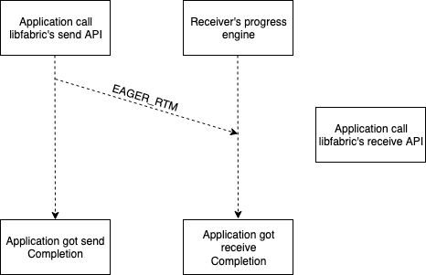

The mandatory header of an EAGER_RTM packet is described in table 3.3:

Table: 3.3 Format of the EAGER_RTM packet

| Name | Length (bytes) | Type | C language type | Notes |
|---|---|---|---|---|
| `type`      | 1 | integer | `uint8_t`  | part of base header |
| `version`   | 1 | integer | `uint8_t`  | part of base header|
| `flags`     | 2 | integer | `uint16_t` | part of base header |
| `msg_id`    | 4 | integer | `uint32_t` | message ID |
| `tag`       | 8 | integer | `uint64_t` | for eager TAGRTM only |

The field `msg_id` records the sending order of all RTM packets between two endpoint.
Receiver can use it to re-order the received RTM packets from the endpoint.

When implementing the eager message subprotocol, there are a few points worth mentioning:

1. Notice that `msg_id` is a 4 byte integer, therefore its maximum value is 4,294,967,295.
After it reaches the maximum value, the next message's `msg_id` will became 0. This "wrap around" of
message id can happen when two endpoints communicate for an extended period of time. Implementation
must be able to handle it.

2. Receiver can either use the application buffer to receive data directly (such an implementation is called zero copy receive),
or it can use a bounce buffer to temporarily hold the application data and copy the data to the application's receive buffer
later. The difficulty of implementing zero copy receive is that the EFA device does not guarantee ordered delivery (see section
1.1). Therefore, if the application wants ordered send (`FI_ORDER_SAS`), using a bounce buffer may be the only choice.

3. If a bounce buffer is to be used to receive packets, the receiver needs to be able to handle an "unexpected message", which
occurs when the eager RTM packet arrives before the application calls libfabric's receive API.

4. If the application does not require ordered send, it would be possible to use the application's receive buffer to receive
data directly. In this case, the receiver might need the sender to send packets without any headers to its dedicated user recv
QP - see section 4.8 for more discussion on this topic.

5. One might notice that there is no application data length in the header, so how can the receiver of an eager RTM packet
   know how many application bytes are in the packet? The answer is to use the following formula:

        application_data_length = total_packet_size - RTM mandatory header length - REQ optional header length

   total_packet_size is reported by the EFA device when a packet is received.  The REQ optional header length can be derived
   from the `flags` field in the base header. The choice of not including data length in the header is to keep the header
   length as compact as possible, since eager messages are sensitive to header length.

#### Medium message feature/subprotocol

The medium message protocol has the sender split application data into multiple MEDIUM_RTM (either
MEDIUM_MSGRTM or MEDIUM_TAGRTM) packets which the sender will attempt to send all at once.

In principal, the medium message subprotocol can be used on messages of any size. However, it is
not recommended to use the medium message subprotocol for long messages because it does not include
flow control and thus can overwhelm the receiver, causing network congestion.  The exact size threshold
for the medium message protocol to be used is up to the implementation to decide.

The following diagram illustrates its workflow:

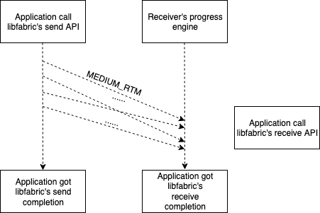

Table: 3.4 Format of the MEDIUM_RTM packet's mandatory header

| Name | Length (bytes) | Type | C language type | Notes |
|---|---|---|---|---|
| `type`        | 1 | integer | `uint8_t`  | part of base header |
| `version`     | 1 | integer | `uint8_t`  | part of base header|
| `flags`       | 2 | integer | `uint16_t` | part of base header |
| `msg_id`      | 4 | integer | `uint32_t` | message ID |
| `seg_length` | 8 | integer | `uint64_t` | application data length |
| `seg_offset` | 8 | integer | `uint64_t` | application data offset |
| `tag`         | 8 | integer | `uint64_t`  | for medium TAGRTM only |

Most of the fields have been introduced and have the same function. The two
new fields are `seg_length` and `seg_offset`. (`seg` means segment, which
refers to the segment of data in the packet)

`seg_length` is the length of the data segment in the medium RTM packet.

`seg_offset` is the offset of the data segment in the original send buffer.

`seg_offset` seems redundant at first glance, as it can be deduced from the
`seg_length` of other packets. However, because the EFA device does not
guarantee ordered delivery, the MEDIUM_RTM packets of same message can
arrive in a different order. Therefore, the recipient of MEDIUM_RTM packets
needs `seg_offset` to put the data in the correct location in the receive
buffer.

When implementing the medium message protocol, please keep in mind
that because the EFA device has a limited TX queue (e.g. it can only send
a limited number of packets at a time), it is possible when sending multiple
medium RTM packets for some packets to be sent successfully and others to
not be sent due to temporarily being out of resources. Implementation needs
to be able to handle this case.

Note, this "partial send" situation is unique to the medium message
subprotocol because the medium message subprotocol is the only one that
sends multiple REQ packets. In all other protocols, only 1 REQ packet is
sent to initialize the communication, and if the REQ fails to send, the
whole communication is cancelled.

#### Long-CTS message feature/subprotocol

The long-CTS message protocol is designed for long messages because it supports
flow control.

In the long-CTS message protocol, the sender will send a LONGCTS_RTM (either
LONGCTS_MSGRTM or LONGCTS_TAGRTM) packet to the receiver. Upon receiving the
LONGCTS_RTM, the receiver will match it with an application's call to
libfabric's receive API. The receiver will then calculate how many bytes of
data it can handle and include that information in a CTS packet it sends back
to the sender.

Upon receiving the CTS packet, the sender will send multiple CTSDATA packets
according to the information in the CTS packet.

After receiving all the CTSDATA packets it was expecting, the receiver will
recalculate how many bytes it can handle and send another CTS packet to the
sender.

The above process repeats until all data has been sent/received.

The workflow of the long-CTS protocol is demonstrated in the following diagram:

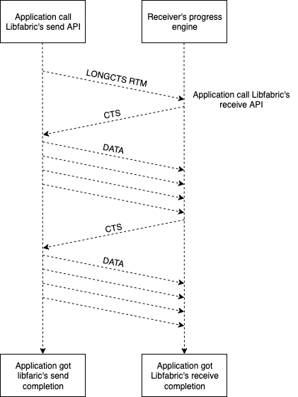

There are 3 packet types involved in the long-CTS message subprotocol:
LONGCTS_RTM, CTS and CTSDATA.

A LONGCTS_RTM packet, like any REQ packet, consists of 3 parts:
LONGCTS RTM mandatory header, REQ optional header, and application data.
A LONGCTS_RTM packet sent as part of the read nack protcol (Section 4.7)
does not contain any application data.

The format of the LONGCTS_RTM mandatory header is listed in table 3.5:

Table: 3.5 Format of the LONGCTS_RTM packet's mandatory header

| Name | Length (bytes) | Type | C language type | Notes |
|---|---|---|---|---|
| `type`           | 1 | integer | `uint8_t`  | part of base header |
| `version`        | 1 | integer | `uint8_t`  | part of base header|
| `flags`          | 2 | integer | `uint16_t` | part of base header |
| `msg_id`         | 4 | integer | `uint32_t` | message ID |
| `msg_length`     | 8 | integer | `uint64_t` | total length of the whole message |
| `send_id`        | 4 | integer | `uint32_t` | ID of the ongoing TX operation |
| `credit_request` | 4 | integer | `uint32_t` | number of data packets preferred to send |
| `tag`            | 8 | integer | `uint64_t` | for `LONGCTS_TAGRTM` only |

There are 3 fields that are new:

`msg_length` is the length of the whole application message.

`send_id` is an ID the sending endpoint assigned to the send operation, and the receiver should
include the `send_id` in subsequent CTS packets. An endpoint will have multiple send operations
at the same time. Thus, when processing a CTS packet from a receiver, the sender needs a way to
locate the send operation the CTS packet is referring to.

Admittedly, the introduction of `send_id` is not absolute necessary because the receiver could
have included `msg_id` in the CTS header, and the sender should be able to locate the send
operation using the combination of the receiver's address and message ID. However, that approach
would require the sending endpoint to set up a map between (address + `msg_id`) and send
operation and a map look up for every received CTS packet. We considered that approach too
burdensome for an endpoint to implement and decided to introduce a 4 byte `send_id` in
LONGCTS_RTM header instead.

Another note about `send_id` is that it can be reused between messages. Because `send_id` is used to
distinguish on-the-fly TX operations, a send operation may have the same `send_id` as a previous
one that has already finished.

The field `send_id` was named `tx_id` when the protocol was initially introduced. It was renamed
for clarity.

The field `credit_request` is how many CTSDATA packets the sender wishes to send to the receiver.
The receiver will try to honor the request, but it is not obligated to. However, the receiver must
allow the sender to send at least 1 CTSDATA packet, to keep the communication moving forward.

Besides the LONGCTS_RTM packet, there are two other packet types used by the long-CTS message protocol:
CTS and CTSDATA.

The binary format of a CTS (Clear to Send) packet is listed in table 3.6:

Table: 3.6 Format a CTS packet

| Name | Length (bytes) | Type | C language type | Notes |
|---|---|---|---|---|
| `type`           | 1 | integer | `uint8_t`  | part of base header |
| `version`        | 1 | integer | `uint8_t`  | part of base header|
| `flags`          | 2 | integer | `uint16_t` | part of base header |
| `multiuse(connid/padding)`  | 4 | integer | `uint32_t` | `connid` if CONNID_HDR flag is set, otherwise `padding` |
| `send_id`        | 4 | integer | `uint32_t` | send id from LONGCTS_RTM |
| `recv_id`        | 4 | integer | `uint32_t` | receive id to be used in CTSDATA packet |
| `recv_length`    | 8 | integer | `uint64_t` | number of bytes the receiver is ready to receive |

The 3 new fields in the header are `multiuse`, `recv_id` and `recv_length`.

The field `multiuse` is a 4 byte integer. As the name indicates, it is a multi-purpose field.
Its exact usage is determined by the `flags` field.

If the CONNID_HDR universal flag is toggled in `flags`, this field is the sender's connection ID (connid).
Otherwise, it is a padding space.

An implementation is free to choose how to use this field.

Note, when protocol v4 was originally introduced. This field was simply a 4-bytes padding space.
Later, when we introduce the "connid header" extra feature, we re-purposed this field to to store
connid. Because "connid header" is an extra request, an endpoint is not obligated to comply.
In practice, if an endpoint is using libfabric 1.10 to 1.13, it uses this field as padding.
If an endpoint is using libfabric 1.14 and above, it uses this field to store `connid`.

The field `recv_id` is similar to `send_id` introduced earlier but for an on-going receive operation.
The sender should include `recv_id` in the CTSDATA packet.

The field `recv_length` is the number of bytes receiver is ready to receive for this operation,
it must be > 0 to make the communication move forward.

The CTS packet header has 1 flag `CTS_EMULATED_READ` that can be set in the `flags` field. This flag
indicates the CTS packet is used by the long-CTS emulated read protocol.  The Bit ID for this flag
is 7, and its value is 0x80.

The CTS packet does not contain application data.

A CTSDATA packet is consisted of two parts: CTSDATA packet header and application data.
Table 3.7 shows the binary format of CTSDATA packet header:

Table: 3.7 Format of the CTSDATA packet header

| Name | Length (bytes) | Type | C language type | Notes |
|---|---|---|---|---|
| `type`           | 1 | integer | `uint8_t`  | part of base header |
| `version`        | 1 | integer | `uint8_t`  | part of base header|
| `flags`          | 2 | integer | `uint16_t` | part of base header |
| `recv_id`        | 4 | integer | `uint32_t` | `recv_id` from the CTS packet |
| `seg_length`     | 8 | integer | `uint64_t` | length of the application data in the packet |
| `seg_offset`     | 8 | integer | `uint64_t` | offset of the application data in the packet |
| `connid`         | 4 | integer | `uint32_t` | sender connection id, optional |
| `padding`        | 4 | integer | `uint32_t` | padding for connid, optional |

The last two fields `connid` and `padding` was introduced with the extra request "connid header".
They are optional, which means an implementation is not required to include them in the DATA of the
data packet. If an implementation does include them in the CTSDATA packet header, the implementation
needs to toggle on the CONNID_DHR flag in the `flags` field (Table 1.4).

When implementing the long-CTS protocol, please keep in mind that although each implementation is allowed
to choose its own flow control algorithm, they must allow some data to be sent in each CTS packet, e.g
the `recv_length` field in CTS packet must be > 0. This is to avoid an infinite loop.

### 3.3 Baseline features for one-sided communication

This section explains the 7 baseline features for one-sided communication. These features/sub-procotols
emulate one-sided operations by using the send/receive functionality of the device. The 7 features are:
emulated eager write, emulated long-CTS write, emulated short read, emulated long-CTS read, emulated write
atomic, emulated fetch atomic, and emulated compare atomic.

Before getting into the details of each feature, we will discuss some topics related to one-sided operation.

There are 3 types of one-sided operations: write, read, and atomic.

Like in two-sided communication, there are also two endpoints involved in one-sided communication.
However, only on one side will the application call libfabric's one-sided API (such as `fi_write`,
`fi_read` and `fi_atomic`). In protocol v4, this side is called the requester.

On the other side (which is called the responder), the application does not make calls to 
lifabric's API, but the EFA provider requires the application to keep the progress engine running
to facilitate the communication. This is because the EFA provider only supports `FI_PROGRESS_MANUAL`.

Generally, in one-sided communication, only on the requester side will lifabric write a completion
to notify the application that a one-sided communication is finished. The only exception to this
rule is when the application added the `FI_REMOTE_CQ_DATA` flag when calling libfabric's write API.
In this case, the provider is required to write a CQ entry on the responder with the CQ data in it.

(In fact, there is another exception to this rule: which is if a provider claims support for the
`FI_RMA_EVENT` capability. The provider will need to write a CQ entry for any one-sided operation
on the responder. However, this exception does not apply to the EFA provider because the EFA
provider does not support the `FI_RMA_EVENT` capability.)

One key difference between one-sided and two-sided communication is that: in one-sided communication, the
requester must know the remote buffer's information when submitting the request.

In protocol v4, because one-sided operations are emulated, the remote buffer's information is stored
in the REQ packet header. For that, protocol v4 defines a data type `efa_rma_iov`, which is used by
all REQ packets for one-sided communication.

An `efa_rma_iov` struct consists of 3 members: `addr`, `len`, and `key`. Each member is an 8 byte integer.
`addr` is the remote buffer address, `len` is the remote buffer length, and `key` is the memory registration
key for the remote buffer, which is provided by the responder through prior communication.

Another difference is that one-sided operations do not support tag matching, thus each one-sided
subprotocol only needs to define 1 REQ packet type.

#### Emulated eager write feature/subprotocol

The emulated eager write subprotocol is used when the buffer size is small enough to fit in one
packet.

The workflow of the emulated eager write protocol is shown in the following diagram:

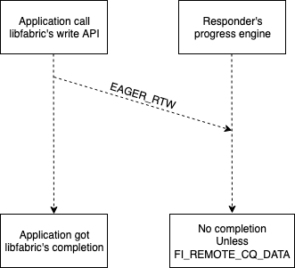

The emulated eager write protocol is similar to the eager message protocol, except an EAGER_RTW
is used to initiate the communication. Like other REQ packets, an eager RTW packet consists
of an eager RTW mandatory header, REQ optional header, and application data. The binary format
of the EAGER_RTW mandatory header is listed in table 3.8:

Table: 3.8 Format of the EAGER_RTW packet's mandatory header

| Name | Length (bytes) | Type | C language type | Notes |
|---|---|---|---|---|
| `type`           | 1 | integer | `uint8_t`  | part of base header |
| `version`        | 1 | integer | `uint8_t`  | part of base header|
| `flags`          | 2 | integer | `uint16_t` | part of base header |
| `rma_iov_count`  | 4 | integer | `uint32_t` | number of RMA iov structures |
| `rma_iov`        | `rma_iov_count` * 24 | array of `efa_rma_iov` | `efa_rma_iov[]` | remote buffer information |

One thing worth noting is that there is no `msg_id` in the eager RTW header because the EFA provider
does not support ordered write operation.

#### Emulated long-CTS write feature/subprotocol

The emulated long-CTS write subprotocol is used when the buffer size is too big to fit in one packet.

The workflow of the emulated long-CTS write generally follows the long-CTS message subprotocol, as
illustrated in the following diagram:

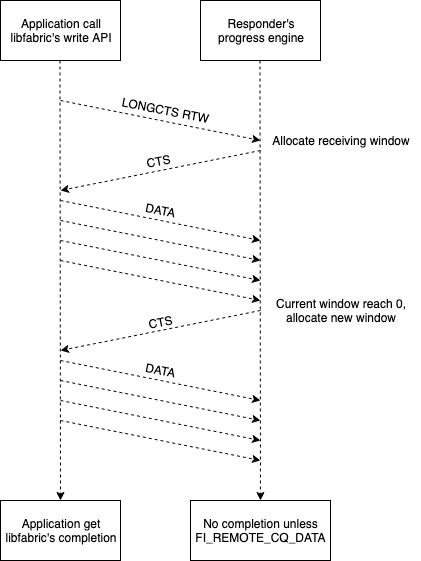

The main difference between the two protocols is that the LONGCTS_RTW packet is used instead of the
LONGCTS_RTM packet. The binary format of the LONGCTS_RTW packet's mandatory header is listed in table 3.9:

Table: 3.9 Format of the LONGCTS_RTW packet's mandatory header

| Name | Length (bytes) | Type | C language type | Notes |
|---|---|---|---|---|
| `type`           | 1 | integer | `uint8_t`  | part of base header |
| `version`        | 1 | integer | `uint8_t`  | part of base header|
| `flags`          | 2 | integer | `uint16_t` | part of base header |
| `rma_iov_count`  | 4 | integer | `uint32_t` | number of RMA iov structures |
| `msg_length`     | 8 | integer | `uint64_t` | total length of the application buffer |
| `send_id`        | 4 | integer | `uint32_t` | ID of send operation |
| `credit_request` | 4 | integer | `uint32_t` | number of packets requester is ready to send |
| `rma_iov`        | `rma_iov_count` * 24 | array of `efa_rma_iov` | `efa_rma_iov[]` | remote buffer information |

All fields have been described before, but some explanation is warranted for the `send_id` field. It is not
named `write_id` because this protocol is using send/receive to emulate write, therefore it is implied that
the requester is treating this communication as a send operation internally, and this communication is subject
to the same flow control as a long-CTS message communication.

#### Emulated read features/subprotocols

This section describes two emulated read subprotocols: emulated short read and emulated long-CTS read. Both
subprotocols use send/receive to emulate read. The interesting part is, in an emulated read communication,
the responder is the sender and the requester is the receiver.

The workflow of emulated short read protocol is illustrated in the following diagram:

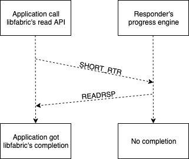

As can be seen, in this protocol, the requester sends a short RTR packet to the responder and the responder sends
a READRSP packet back to the requester.

The binary format of a SHORT_RTR mandatory header is listed in the table 3.10:

Table: 3.10 Format of the SHORT_RTR packet's mandatory header

| Name | Length (bytes) | Type | C language type | Notes |
|---|---|---|---|---|
| `type`           | 1 | integer | `uint8_t`  | part of base header |
| `version`        | 1 | integer | `uint8_t`  | part of base header|
| `flags`          | 2 | integer | `uint16_t` | part of base header |
| `rma_iov_count`  | 4 | integer | `uint32_t` | number of RMA iov structures |
| `msg_length`     | 8 | integer | `uint64_t` | total length of the application buffer |
| `recv_id`        | 4 | integer | `uint32_t` | ID of the receive operation, to be included in READRSP packet |
| `padding`	   | 4 | integer | `uint32_t` | alignment for 8 bytes |
| `rma_iov`        | `rma_iov_count` * 24 | array of `efa_rma_iov` | `efa_rma_iov[]` | remote buffer information |

Among the fields, the `recv_id` is the most interesting. As mentioned before, in an emulated read protocol, the requester
is the receiver, so it is necessary to include `recv_id` in the request. The responder needs to include this `recv_id` in
the READRSP packet, for the requester to properly process it.

A READRSP (READ ReSPonse) packet consists of two parts: READRSP header and application data. The binary format
of the READRSP header is in table 3.11:

Table: 3.11 Format of the READRSP packet's header

| Name | Length (bytes) | Type | C language type | Notes |
|---|---|---|---|---|
| `type`           | 1 | integer | `uint8_t`  | part of base header |
| `version`        | 1 | integer | `uint8_t`  | part of base header|
| `flags`          | 2 | integer | `uint16_t` | part of base header |
| `multiuse(padding/connid)`         | 4 | integer | `uint32_t` | `connid` if CONNID_HDR flag is set, otherwise `padding` |
| `send_id`        | 4 | integer | `uint32_t` | ID of the send operation, to be included in the CTS header |
| `recv_id`        | 4 | integer | `uint32_t` | ID of the receive operation|
| `recv_length`    | 8 | integer | `uint64_t` | length of the application data in the packet |

The field `multiuse` has been introduced before when introducing the CTS packet (table 3.6).
It is a multi-purpose field, which can be used to store `connid` or as a padding space, depending
on whether the CONNID_HDR universal flag is toggled in `flags`. See section 4.4 for more
information about the field `connid`.

The workflow of the emulated long-CTS read subprotocol is illustrated in the following diagram:

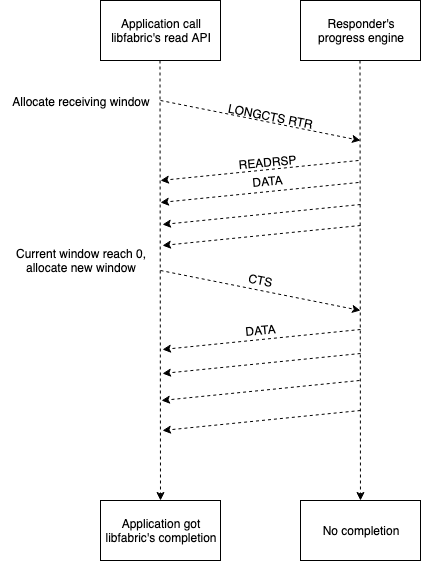

The protocol started by the requester sends a LONGCTS_RTR packet. After that, the workflow generally follow that of the
long-CTS message subprotocol, except the responder is the sender and the requester is the receiver.

The mandatory header of LONGCTS_RTR packet is listed in table 3.12:

Table: 3.12 Format of the LONGCTS_RTR packet's mandatory header

| Name | Length (bytes) | Type | C language type | Notes |
|---|---|---|---|---|
| `type`           | 1 | integer | `uint8_t`  | part of base header |
| `version`        | 1 | integer | `uint8_t`  | part of base header|
| `flags`          | 2 | integer | `uint16_t` | part of base header |
| `rma_iov_count`  | 4 | integer | `uint32_t` | number of RMA iov structures |
| `msg_length`     | 8 | integer | `uint64_t` | total length of the application buffer |
| `recv_id`        | 4 | integer | `uint32_t` | ID of the receive operation, to be included in READRSP packet |
| `recv_length`	   | 4 | integer | `uint32_t` | Number of bytes the requester is ready to receive |
| `rma_iov`        | `rma_iov_count` * 24 | array of `efa_rma_iov` | `efa_rma_iov[]` | remote buffer information |

The only difference between LONGCTS_RTR and SHORT_RTR is the field `padding` in SHORT_RTR is replaced by the field `recv_length`.
Here, the LONGCTS_RTR packet serves the same functionality af the first CTS packet in the long-CTS message subprotocol. The
reason is: when the endpoint is preparing the LONGCTS_RTR, it already knows it is going to receive some data, thus it should
calculate how many bytes it is ready to receive using the flow control algorithm and put that number in the packet.

The short RTR protocol can only be used if the read buffer can fit in one READRSP packet, so the maximum size of a short emulated
read protocol is (MTU size - READRSP header size). For messages whose size is larger, the emulated long-CTS read protocol has
to be used.

#### Emulated atomic protocols

This section describes the 3 emulated atomic protocols: emulated write atomic, emulate fetch atomic, and emulated compare atomic.

The workflow of emulated write atomic is illustrated in the following diagram:

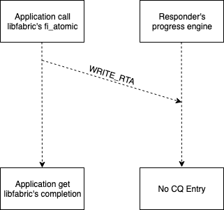

It is similar to the emulated eager write subprotocol, except a WRITE_RTA packet was
sent. Table 3.13 lists the binary structure of a WRITE_RTA packet's mandatory
header:

Table: 3.13 Format of the WRITE_RTA packet's mandatory header

| Name | Length (bytes) | Type | C language type | Notes |
|---|---|---|---|---|
| `type`           | 1 | integer | `uint8_t`  | part of base header |
| `version`        | 1 | integer | `uint8_t`  | part of base header|
| `flags`          | 2 | integer | `uint16_t` | part of base header |
| `msg_id`         | 4 | integer | `uint32_t` | message ID |
| `rma_iov_count`  | 4 | integer | `uint32_t` | number of RMA iov structures |
| `atomic_datatype`| 4 | integer | `uint32_t` | atomic data type |
| `atomic_op`      | 4 | integer | `uint32_t` | atomic operation ID |
| `pad`            | 4 | integer | `uint32_t` | atomic operation ID |
| `rma_iov`        | `rma_iov_count` * 24 | array of `efa_rma_iov` | `efa_rma_iov[]` | remote buffer information |

The two new fields introduced are `atomic_datatype` and `atomic_op`. There are atomic data type sand atomic operations
defined in the libfabric standard. A list of atomic datatypes can be found in the libfabric [fi_atomic](https://ofiwg.github.io/libfabric/v1.4.0/man/fi_atomic.3.html) man page.

The field `msg_id` provides the message ID. It is used to implement ordered atomic operations, which is supported by
the libfabric EFA provider and is required by some applications such as MPICH.

The workflows of emulated fetch/compare atomic are the same, as illustrated in the following diagram:

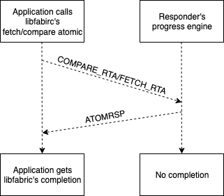

Compared to write atomic, the differences are:

First, a FETCH_RTA/COMPARE_RTA is used to initiate the communication.
Second, that responder will send an ATOMRSP (atomic response) packet back.

The binary format of FETCH_RTA and COMPARE_RTA are the same.
Table 3.14 shows the binary format of the mandatory header of a FETCH_RTA/COMPARE_RTA packet:

Table: 3.14 Format of the FETCH_RTA/COMPARE_RTA packet's mandatory header

| Name | Length (bytes) | Type | C language type | Notes |
|---|---|---|---|---|
| `type`           | 1 | integer | `uint8_t`  | part of base header |
| `version`        | 1 | integer | `uint8_t`  | part of base header|
| `flags`          | 2 | integer | `uint16_t` | part of base header |
| `msg_id`         | 4 | integer | `uint32_t` | message ID |
| `rma_iov_count`  | 4 | integer | `uint32_t` | number of RMA iov structures |
| `atomic_datatype`| 4 | integer | `uint32_t` | atomic data type |
| `atomic_op`      | 4 | integer | `uint32_t` | atomic operation ID |
| `recv_id`        | 4 | integer | `uint32_t` | ID of the receive operation on the requester side |
| `rma_iov`        | `rma_iov_count` * 24 | array of `efa_rma_iov` | `efa_rma_iov[]` | remote buffer information |

The differences between a FETCH_RTA and a COMPARE_RTA are:

First, The value of `atomic_op` is different between FETCH_RTA and COMPARE_RTA.

Second, the application data part of a COMPARE_RTA packet contains two segments of data: `buf` and `compare`.
(see [fi_atomic](https://ofiwg.github.io/libfabric/v1.4.0/man/fi_atomic.3.html))

The difference between a WRITE_RTA and a FETCH_RTA/COMPARE_RTA is that the field `pad` was replaced by `recv_id` because
we are using send/receive to emulate a fetch/compare atomic operation. As the requester is going to receive
data from the responder, the field `recv_id` is the ID of the receive operation on the requester side, which is to
be included in the header of the ATOMRSP packet.

An ATOMRSP packet consists of two parts: header and application data. Table 3.15 shows the format of the header of an ATOMRSP packet:

Table: 3.15 Format of the ATOMRSP packet's header.

| Name | Length (bytes) | Type | C language type | Notes |
|---|---|---|---|---|
| `type`           | 1 | integer | `uint8_t`  | part of base header |
| `version`        | 1 | integer | `uint8_t`  | part of base header|
| `flags`          | 2 | integer | `uint16_t` | part of base header |
| `multiuse(connid/padding)` | 4 | integer | `uint32_t` | `connid` if CONNID_HDR is set, otherwise `padding` |
| `reserved`       | 4 | integer | `uint32_t` | reserved for future use |
| `recv_id`        | 4 | integer | `uint32_t` | ID of the receive operation on the requester side |
| `seg_length`     | 8 | integer | `uint64_t` | length of the application data in the packet |

The field `multiuse` has been introduced before when introducing the CTS packet (table 3.6).
It is a multi-purpose field which can be used to store `connid` or as a padding
space, depending on whether the CONNID_HDR universal flag is toggled in `flags`. See section 4.4
for more information about the field `connid`.

## 4. Extra features and requests

This chapter describes the extra features and requests of protocol v4.

### 4.1 RDMA-Read based data transfer (RDMA Read)

The extra feature "RDMA-Read based data transfer" (RDMA read) was introduced together
with protocol v4, when libfabric 1.10 was released. It was assigned ID 0.

It is defined as an extra feature because there is a set of requirements (firmware,
EFA kernel module and rdma-core) to be met before an endpoint can use the RDMA
read capability, therefore an endpoint cannot assume the other party supports RDMA read.

The "RDMA read" extra feature corresponds to the following subprotocols:
long-read message, emulated long-read write, and direct read.

#### Long-read message subprotocol

The long-read message subprotocol uses RDMA read to implement two-sided communication.

The work flow of the long-read message subprotocol is illustrated in the following diagram:

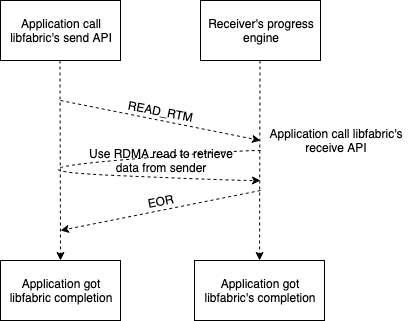

There are two packet types involved in this protocol: LONGREAD_RTM and EOR (End Of Read).

LONGREAD_RTM is sent by the sender to initiate the communication.

Like all REQ packets, a LONGREAD_RTM consists of 3 parts: the mandatory header, the REQ
optional header, and the application data. However, the application data part of a
LONGREAD_RTM is special: it is not the data in the application's send buffer.
Instead, it is the information of the sender buffer.

In the long-read message subprotocol, the sender needs to construct a `read_iov`, which is
an array of `efa_rma_iov` of the application's send buffer. The `read_iov` is used
as the application data in the LONGREAD_RTM packet. These packets are generally
small as they are only ferrying buffer pointer and lengths to the remote side.

The binary format of a LONGREAD_RTM packet's mandatory header is listed in table 4.1

Table: 4.1 Format of the LONGREAD_RTM packet's mandatory header

| Name | Length (bytes) | Type | C language type | Notes |
|---|---|---|---|---|
| `type`           | 1 | integer | `uint8_t`  | part of base header |
| `version`        | 1 | integer | `uint8_t`  | part of base header|
| `flags`          | 2 | integer | `uint16_t` | part of base header |
| `msg_id`         | 4 | integer | `uint32_t` | message ID |
| `msg_length`     | 8 | integer | `uint64_t` | total length of the message |
| `send_id`        | 4 | integer | `uint32_t` | ID of the receive operation  |
| `read_iov_count` | 4 | integer | `uint32_t` | number of iov to read |

Notice the new field `read_iov_count`, which is the number of `struct efa_rma_iov` in `read_iov`.

To construct `read_iov`, the sender needs to make sure that the send buffer is registered with the
EFA device and fills in the registration key in `read_iov`.

There are two ways to achieve that:

First, if the buffer has already been registered with the device, the application will provide
a memory descriptor along with the send buffer. The registration key can be extracted from this
descriptor.

Second, if the buffer has not been registered with the EFA device, the sender needs to register
the buffer in-line and can retrieve the key from the registrtion. Note, because memory registration
is a limited resource, it is possible for memory registration to fail and the sender needs to be
able to handle this case.

Upon receiving a long-read RTM, the receiver will use RDMA read to read data from the
application's send buffer (sender) to the application's receive buffer
(receiver) - which will avoid copies into the receiver's posted bounce buffer
pool. That is why this subprotocol is sometimes referred to as zero-copy.

After all reads are finished, the receiver will send an EOR packet to the requester to notify it
that the work has completed.

The binary format of the EOR packet is listed in table 4.2

Table: 4.2 Format of the EOR packet

| Name | Length (bytes) | Type | C language type | Notes |
|---|---|---|---|---|
| `type`           | 1 | integer | `uint8_t`  | part of base header |
| `version`        | 1 | integer | `uint8_t`  | part of base header|
| `flags`          | 2 | integer | `uint16_t` | part of base header |
| `send_id`        | 4 | integer | `uint32_t` | ID of the send operation |
| `recv_id`        | 4 | integer | `uint32_t` | ID of the receive operation |
| `multiuse(connid/padding)`  | 4 | integer | `uint32_t` | `connid` if CONNID_HDR is set, otherwise `padding` |

The field `multiuse` has been introduced before when introducing the CTS packet (table 3.6).
It is a multi-purpose field which can be used to store `connid` or as a padding
space, depending on whether the CONNID_HDR universal flag is toggled in `flags`. See section 4.4
for more information about the field `connid`.

#### Emulated long-read write subprotocol

The emulated long-read write subprotocol uses RDMA read to emulate a write operation.

The workflow of this protocol is illustrated in the following diagram:

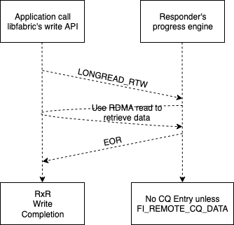

The workflow is similar to that of the long-read message subprotocol. Some key differences are that
a LONGREAD_RTW packet is used to initiate the communication and the receiver side does not receive a
completion event by default. The binary format of the LONGREAD_RTW packet mandatory header is listed
in table 4.3.

Table: 4.3 Format of the LONGREAD_RTW packet's mandatory header

| Name | Length (bytes) | Type | C language type | Notes |
|---|---|---|---|---|
| `type`           | 1 | integer | `uint8_t`  | part of base header |
| `version`        | 1 | integer | `uint8_t`  | part of base header|
| `flags`          | 2 | integer | `uint16_t` | part of base header |
| `rma_iov_count`  | 4 | integer | `uint32_t` | number of RMA iov on the responder |
| `msg_length`     | 8 | integer | `uint64_t` | total length of the message |
| `send_id`        | 4 | integer | `uint32_t` | ID of the receive operation  |
| `read_iov_count` | 4 | integer | `uint32_t` | number of iov on requester (to be read by responder) |
| `rma_iov`        | `rma_iov_count` * 24 | array | `efa_rma_iov[]` | write iov information |

One thing worth noting is the existence of both `rma_iov_count` and `read_iov_count`.

Though both have been explained before, this is the first time they appear in
the same header, so we will revisit them.

The field `rma_iov_count` (and  `rma_iov`) is provided by the application, when the application called
libfabric's write API. This contains information of the target buffer (of write) on the responder side.

The field `read_iov_count` (and a `read_iov`) is constructed by the write requester,
which contains information of the source buffer (of write) on the requester side.
The `read_iov` is not part of the mandatory header because it is considered as
application data, which is located right after the REQ optional header.

#### Direct read subprotocol

The direct read subprotocol is the simplest read subprotocol in protocol v4. It does not involve a REQ packet.
The workflow is just for the read requester keep using RDMA read on the responder. For this protocol, it is
not necessary for the responder to keep the progress engine running.

### 4.2 Delivery complete

The extra feature "delivery complete" was introduced with libfabric 1.12.0 and was assigned ID 1.

Delivery complete is a requirement the application can impose on an endpoint when opening the endpoint.
It requires that when application receives the send/write completion, the application data must have
been delivered to the application's receiving target buffer.

The reason it is implemented as an extra feature is because not all subprotocols in the baseline
features support delivery complete. Specifically, the following 6 subprotocols do NOT:

* eager message
* medium message
* long-CTS message
* eager write
* long-CTS write
* write atomic

These subprotocols are designed to support a weaker completion model: transmit complete.
Transmit complete requires that when the send/write completion was written, the data has been transmitted
to the receiver/responder.

The difference between transmit complete and delivery complete is that transmit complete indicates
that data has arrived at a buffer on the receiver/responder, but the buffer is not necessarily the application's
target buffer. In fact, because of the limitation of the EFA device (no ordering guarantee) and the nature
of the communications (emulated write) for some protocols, the implementation needs to use a temporary
buffer to receive data and copy the data to application buffer at a later point, where the time difference
can be indefinite.

The "delivery complete" extra feature was introduced to support applications with such requirements.
It comes with 6 subprotocols:

* DC eager message
* DC medium message
* DC long-CTS message
* DC eager write
* DC long-CTS write
* DC write atomic

The workflow of these subprotocols are the same as that of their non-DC counterparts, with 3 differences:

First, each DC capable subprotocol defines its own REQ packet type.

Second, after data is delivered to the application buffer, the receiver/responder will send a RECEIPT
packet back to the sender/requester.

Third, the sender/responder will not write a completion until it receives the RECEIPT packet.

The binary format of a RECEIPT packet is as follows:

| Name | Length (bytes) | Type | C language type | Notes |
|---|---|---|---|---|
| `type`           | 1 | integer | `uint8_t`  | part of base header |
| `version`        | 1 | integer | `uint8_t`  | part of base header|
| `flags`          | 2 | integer | `uint16_t` | part of base header |
| `send_id`        | 4 | integer | `uint32_t` | ID of the send operation |
| `msg_id`         | 4 | integer | `uint32_t` | message ID |
| `multiuse(connid/padding)`  | 4 | integer | `uint32_t` | `connid` if CONNID_HDR is set in `flags`, otherwise `padding` |

The field `multiuse` has been introduced before when introducing the CTS packet (table 3.6).
It is a multi-purpose field which can be used to store `connid` or as a padding
space, depending on whether the CONNID_HDR universal flag is toggled in `flags`. See section 4.4
for more information about the field `connid`.

### 4.3 Keep packet header length constant (constant header length) and zero-copy receive

**This mode bit is deprecated since libfabric 1.22.0 and replaced by the "user recv qp" feature/request (See 4.8)**

The extra request "keep packet header length constant" (constant header length) was introduced in the libfabric 1.13.0
release and was assigned the ID 2.

This extra request would be useful if an endpoint wants to implement the "zero copy receive" optimization.

As can be seen from previous discussions, because the EFA device does not support ordered delivery, an endpoint
usually needs to use a temporary buffer to receive incoming packets and copy data to the application's receive
buffer at a later time. However, if an application has the following set of requirements:

   1. Does not need ordered send/receive (`FI_ORDER_SAS`)
   2. Only sends/receives eager messages
   3. Does not use tagged send
   4. Does not require `FI_DIRECTED_RECV` (the ability to receive only from certain addresses)

it should be possible to receive data directly using the application buffer since, under such conditions, the
receiver does not have special requirements on the data it is going to receive, and it will thus accept any
message from the sender.

However, there is one more hurdle to overcome in implementing "zero copy receive" - the packet header
length.

Under the condition that endpoints "will only send eager messages" and "do not use tag matching", a sender will
send data in an EAGER_MSGRTM packet. An EAGER_MSGRTM packet consists of the packet header and application data.
However, we cannot put the packet header in the application's receive buffer. Therefore, for "zero copy receive"
to work, the receiver needs to:

   a. Be able to estimate the packer header length of an incoming EAGER_MSGRTM packet
   b. The packet header length of the EAGER_MSGRTM cannot change throughout the communication

However, there is no guarantee in the base protocol that the packet header length of EAGER_MSGRTM will not
change.

In fact, because of the existence of the handshake subprotocol, the packet header length of an EAGER_MSGRTM
will definitely change. Recall that the handshake subprotocol's workflow is:

Before receiving handshake packet, an endpoint will always include the optional raw address header in REQ packets.

After receiving handshake packet, an endpoint will stop including the optional raw address header in REQ packets.

The extra feature "keep packet header length constant" (constant header length) is designed to solve this problem.

When an endpoint toggles on this extra request, its peer will try to satisfy it by keeping the header length
constant.  Exactly how to achieve that is up to the implementation to decide.  The easiest way to do so is to keep
including the raw address header in the EAGER_MSGRTM even after receiving the handshake packet.

Note, because this is an extra request, an endpoint cannot assume its peer will comply with the request. Therefore,
the receiving endpoint must be able to handle the situation that a received packet does not have the expected header
length.

In that case, implementation will have two choices:

1. Write a truncated error completion entry
2. Move the application data to the right place

Note, this extra request was initially introduced as an extra feature named "zero copy receive", but later it was realized
that this is not a feature because the peer does not do anything different.  Rather, it is an expectation that the
receiving endpoint has for the sender. Therefore, it was re-interpreted as an extra request named "constant header length".
This re-interpretation does not change the implementation, and thus, it does not cause backward incompatibility.

### 4.4 Have connection ID in packet header (connid header)

The "have connection ID in packet header" extra request was introduced with the libfabric 1.14.0 release and was
assigned the ID 3.

This extra feature is designed to solve the "QP collision" problem, which is commonly experienced in
client-server types of application.

The "QP collision" problem arose from the fact that the EFA device uses the Device ID (GID) + QP number (QPN)
as the unique identifier of a peer. Recall that the raw address of the EFA endpoint consists of 3 parts:
GID + QPN + Connection ID (CONNID). The EFA device only recognizes GID and QPN.  The connection ID was generated
by the endpoint itself during its initialization.

Because of that, it is possible for an endpoint to receive packets from a destroyed QP, which was used
by a previous process that used the same QPN. As can be seen throughout the document, each packet in the
EFA RDM communication protocol is not independent. The correct processing of a packet needs prior knowledge.

For example, there is a `recv_id` in the header of a CTSDATA packet (section 3.2) which assumes that
the receiver maintains a list of receive operations and can find the operation corresponding to
the message using `recv_id`.

To solve this problem, the receiver needs to know the full address of the sender. As shown in table
1.5, EFA's full address consists of: GID, QPN and CONNID. Currently, the EFA device will report the
Address Handle Number (AHN) and QPN of a received packet. Because the GID can be obtained from AHN,
the only unknown part is CONNID.

The extra request "connid header" was introduced to address the issue. Also because this is an extra request,
an endpoint cannot assume that the peer supports it, thus the endpoint needs to be able to handle the case 
that incoming packets do not have the sender connection ID in it. It is up to the implementation to decide
whether the endpoint should abort the communication or continue without using the extra request in this case.

A universal flag, CONNID_HDR (Table 1.4), was designated for CONNID in the packet header. An implementation is
not required to set connid. However, when it does include connid in the packet header, it needs to toggle on
the CONNID_HDR flag in the `flags` field of the base header. The exact location of connid is different for
each packet type.

### 4.5 Runting read message subprotocol

The "runting read message protocol support" extra feature was introduced with the libfabric 1.16.0 release (together with the runting read message subprotocol) and was assigned the ID 4.

The runting read message subprotocol is introduced in 1.16.0 to as an alternative to
long read message subprotocol (section 4.1). Runting read message protocol may provide better performance when there are low number of inflight messages.

The workflow of runting read message subprotocol is illustrated in the following
diagram:

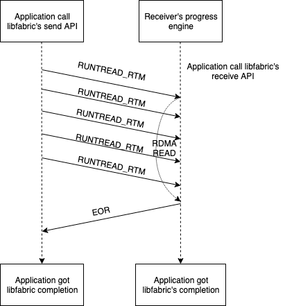

As can be seen, the main difference between runting read message subprotocol and
long read message subprotocol is the `LONGREAD_RTM` packet was replaced by multiple
`RUNTREAD_RTM` packets, with each `RUNTREAD_RTM` carry some application data.

Like all REQ packets, a RUNTREAD_RTM packet consists of 3 parts: the mandatory header,
the REQ optional header, and the application data.

Application data part consists of two parts:

First part is `read_iov`, which is an array of `efa_rma_iov` of the application's send buffer.

Second part is application data, whose offset and length is saved in the
in the mandatory header.

The binary format of a RUNTREAD_RTM packet's mandatory header is listed in table 4.4

| Name | Length (bytes) | Type | C language type | Notes |
|---|---|---|---|---|
| `type`           | 1 | integer | `uint8_t`  | part of base header |
| `version`        | 1 | integer | `uint8_t`  | part of base header|
| `flags`          | 2 | integer | `uint16_t` | part of base header |
| `msg_id`         | 4 | integer | `uint32_t` | message ID |
| `msg_length`     | 8 | integer | `uint64_t` | total length of the message |
| `send_id`        | 4 | integer | `uint32_t` | ID of the receive operation  |
| `read_iov_count` | 4 | integer | `uint32_t` | number of iov to read |
| `seg_offset`     | 8 | integer | `uint64_t` | offset of the application data |
| `runt_length`    | 8 | integer | `uint64_t` | length of the application data |
| `tag`            | 8 | integer | `uint64_t` | tag for RUNTREAD_TAGRTM only |

### 4.6 RDMA-Write based data transfer (RDMA Write)

The "RDMA-Write based data transfer" (RDMA write) is an extra feature that was
introduced with the libfabric 1.18.0 release and was assigned the ID 5.  It is
defined as an extra feature because there is a set of requirements (firmware,
EFA kernel module and rdma-core) to be met before an endpoint can use the RDMA
write capability, therefore an endpoint cannot assume the other party supports
RDMA write.

#### Direct write subprotocol

The direct write subprotocol is the simplest write subprotocol in protocol v4.
It does not involve a REQ packet.  The workflow is just for the writer to keep
using RDMA write on the responder. Although the write itself is accomplished
by the NIC hardware, the responder must still keep the progress engine running
in order to support CQ entry generation in case the sender uses
`FI_REMOTE_CQ_DATA`.

### 4.7 Long read and runting read nack protocol

Long read and runting read protocols in Libfabric 1.20 and above use a nack protocol
when the receiver is unable to register a memory region for the RDMA read operation.
Failure to register the memory region is typically because of a hardware limitation.

Table: 4.2 Format of the READ_NACK packet

| Name | Length (bytes) | Type | C language type | Notes |
|---|---|---|---|---|
| `type`           | 1 | integer | `uint8_t`  | part of base header |
| `version`        | 1 | integer | `uint8_t`  | part of base header|
| `flags`          | 2 | integer | `uint16_t` | part of base header |
| `send_id`        | 4 | integer | `uint32_t` | ID of the send operation |
| `recv_id`        | 4 | integer | `uint32_t` | ID of the receive operation |
| `multiuse(connid/padding)`  | 4 | integer | `uint32_t` | `connid` if CONNID_HDR is set, otherwise `padding` |

The nack protocols work as follows
* Sender has decided to use the long read or runting read protocol
* The receiver receives the RTM packet(s)
   - One LONGREAD_RTM packet in case of long read protocol
   - Multiple RUNTREAD_RTM packets in case of runting read protocol
* The receiver attempts to register a memory region for the RDMA operation but fails
* After all RTM packets have been processed, the receiver sends a READ_NACK packet to the sender 
* The sender then switches to the long CTS protocol and sends a LONGCTS_RTM packet
* The receiver sends a CTS packet and the data transfer continues as in the long CTS protocol

The LONGCTS_RTM packet sent in the nack protocol does not contain any application data.
This difference is because the LONGCTS_RTM packet does not have a `seg_offset` field.
While the LONGREAD_RTM packet does not contain any application data, the RUNTREAD_RTM
packets do. So if the LONGCTS_RTM data were to contain application data, it must have a
non-zero `seg_offset` to account for the data sent in the RUNTREAD_RTM packets. Instead
of introducing a `seg_offset` field to LONGCTS_RTM packet, the nack protcol simply
doesn't send any data in the LONGCTS_RTM packet.

The workflow for long read protocol is shown below

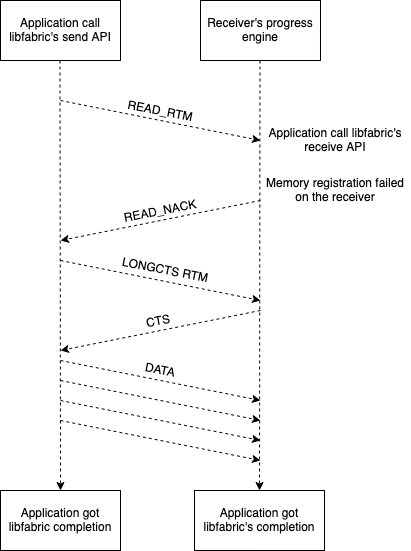

The workflow for runting read protocol is shown below

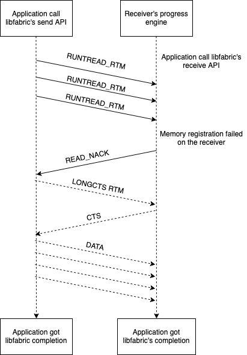

### 4.8 User receive QP feature & request and zero-copy receive

The extra feature/request "user recv(receive) qp" was introduced in the libfabric 1.22.0
release and was assigned the ID 7. It is used if an endpoint wants to implement the "zero copy receive" optimization.
(see 4.3)

Historically, zero copy receive was implemented via the "constant header length" extra request (See 4.3). But
such approach has the following drawbacks:

1. It still keeps protocol headers (48 bytes) in the payload, which makes it impossible to make the payload
fit into EFA device's inline data size (32 bytes). Especially the raw address header, which is 40 bytes, can
be replaced by the connid header (8 bytes) after a handshake is made. But with this request, the raw address
header will always be included and cause a waste of payload space. It will also require applications to use
the FI_MSG_PREFIX mode that reserve some space in the receive buffers.

2. It cannot address the buffer mix issue: When zero copy receive mode is enabled, Libfabric should mostly only
post user recv buffers to rdma-core to maximize the possibility that the packets are delivered
to the user buffers. However, each ep can still get the handshake packets from its peers. For a client/server
model where each ep only talks to 1 peer, it needs to post 1 internal bounce buffer to get handshake packet
, because user may only use the ep for send and never posts a receive buffer. For MPI/NCCL applications where 1
ep talks to multiple peers, posting internal bounce buffers and user buffers to the same QP will never be
safe or efficient because of the following buffer mix issues.

   a. A bounce buffer receives a RTM packet. In zero copy receive mode, Libfabric posts
   user receive buffer to rdma-core directly, and such post cannot be cancelled. If
   libfabric chooses to copy data from the bounce buffer to the user receive buffer and
   write completion, and later another packet delivers to the same user buffer, it will
   cause a data corruption. There is no good way to avoid this case unless the ep knows
   the number of peers it will send to and also make sure no peers will send RTM pkts to it
   before it get all handshakes from its peers, which is impossibile.

   b. A user receive buffer receives a handshake pkt. In this case, Libfabric needs to repost
   the user receive buffer to rdma-core.

The "user recv qp" approach is proposed to address the deficits above.

When zero-copy recv is enabled, an EP creates an additional QP to post user receive buffers. This
QP expects to get packets delivered to user buffers without any headers. The default QP
is still used to receive the packets with headers. The user receive QP and default QP share the
same AH but differ in QPN and QKEY. Only the default QP is exposed by fi_getname and inserted
to AV.

This mode bit is interpreted as an extra feature for both senders and receivers, and an extra
request from receivers. For senders, it means senders can send packets to receivers' user
recv QP for optimized performance. For receivers, it means receivers support getting packets
that carries application data delivered to the user recv QP, and receivers only
allow getting such packets delivered to the user recv QP.

When the mode bit is turned on, a sender triggers a handshake (via a REQ) with the receiver
before it does any real data transfer. The receiver includes the qpn and qkey of the user
receive QP as an optional header in the handshake packet and sends back to the sender. Upon
getting a handshake, the sender checks whether the receiver supports such extra feature.
If the receiver supports it, sender will then send packets with user data to the user recv qp. Because
there is no ordering or tagging requirement, and the receiver already knows the sender, sender can
send packets without any headers in the payload. If the receiver doesn't support this extra feature,
the sender will continue send packets with headers to the receiver's default QP.
If a receiver gets RTM packets delivered to its default QP, it raises an error
because it requests all RTM packets must be delivered to its user recv QP.

## 5. What's not covered?

The purpose of this document is to define the communication protocol. Therefore, it is intentionally written
as "implementation neutral". It should be possible to rewrite a libfabric EFA provider from scratch by
following this document, and the newly written EFA provider should be able to interoperate with any
libfabric EFA provider implementation since libfabric 1.10.0.

Because of this, in various places, the document provides tips on how to implement certain aspects
of the protocol while not giving specific instruction about what an implementation should do.

There are a few things that this document considers as implementation specific and is not covered.

For example, this document does not specify the selection logic of various protocols. There are
three message subprotocols (medium message, long-CTS message, and long-read message) that can be used for
long messages, and an implementation can choose an appropriate switch point without breaking protocol.

On a similar note, this document does not describe the shared memory (SHM) implementation of the EFA provider,
which is an optimization technique an endpoint can use to speed up intra-instance communication. The idea
is that if two endpoints are on same instance and opened by same user, they can use the SHM mechanism on the
instance to communicate, taking advantage of shared memory's higher bandwidth and lower latency. It is not
covered in this document because the EFA device is not used. Also, because two endpoints are opened
on the same instance by the same user, they should be using the same libfabric library, thus negating any
concerns of backward compatibility in this case.
