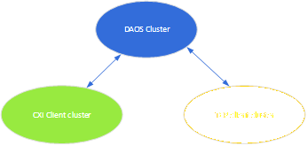
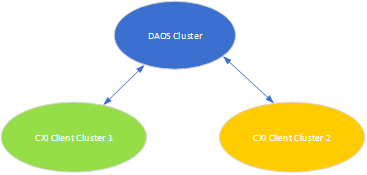
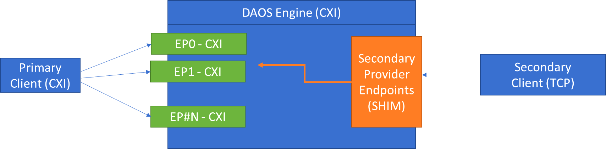
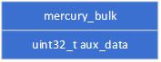
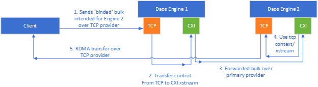

# High-Level Design: Multi-Provider Support for DAOS

## 1. Summary

DAOS and CaRT currently assume a single fabric provider per deployment path. That limitation makes it difficult to run one DAOS deployment across multiple network fabrics or to support separate client populations that must reach the same servers through different providers.

This design adds initial multi-provider support with one **primary** provider and one **secondary** provider. The primary provider remains the normal server execution and server-to-server communication path. The secondary provider is introduced as a client ingress path: requests received on the secondary provider are forwarded to the appropriate primary execution target inside the engine.

The result is a single DAOS deployment that can serve multiple client populations across different providers or network paths without requiring a separate DAOS instance per fabric.

## 2. Background

Today, DAOS and CaRT assume a single fabric provider for the DAOS cluster. All clients are expected to use the same network subnet and fabric provider. However, it can be useful to allow a different client cluster with a different network configuration to access the same DAOS storage used by the high-speed clients.

The main intended configurations are:

1. Different providers on the same interface, for example `ofi+cxi` and `ofi+tcp;ofi_rxm`.
2. The same provider on different interfaces or domains.
3. A high-performance primary client cluster and a secondary client cluster that still needs access to the same DAOS servers.



*Figure 1. Example topology with a primary CXI client cluster and a secondary TCP client cluster.*



*Figure 2. Example topology using the same provider across different client clusters or subnets.*

In the initial scope, the deployment still has a clear ordering: one provider is primary and one is secondary. This design does not attempt to make the two paths equivalent at runtime.

## 3. Requirements and Out of scope

### 3.1 Requirements

1. Support one primary provider and one secondary provider in the initial implementation.
2. Allow providers to use either the same or different interfaces and domains.
3. Preserve the existing primary-provider server execution model.
4. Minimize client-side changes required to use the secondary provider.
5. Keep the design extensible so future work can support more than two providers.

### 3.2 Out of scope

- No runtime failover from the primary provider to the secondary provider.
- No automatic load balancing between providers.
- No server-to-server traffic over the secondary provider.
- No simultaneous use of both providers by a client within one attach session.
- No attempt to make the secondary provider performance-equivalent to the primary provider.

## 4. Design

### 4.1 Provider Roles

Each configured provider is assigned a role:

- **Primary provider**: the normal DAOS engine execution path.
- **Secondary provider**: an alternate client ingress path.

The provider ordering is significant. Provider index `0` is primary. Provider index `1` is secondary.

Although the first implementation only supports one primary and one secondary provider, the design should avoid hard-coding assumptions that permanently limit it to exactly two providers.

### 4.2 Configuration and Initialization

CaRT and DAOS configuration need to accept ordered provider lists instead of a single provider value.

The initial proposal uses comma-separated lists for:

- `D_PROVIDER`
- `D_INTERFACE`
- `D_DOMAIN`
- `D_PORT`

Example:

```sh
D_PROVIDER="ofi+cxi,ofi+tcp;ofi_rxm"
D_INTERFACE="cxi0,hsn0"
D_DOMAIN="cxi0,hsn0"
D_PORT="31416,31416"
```

In this example, `ofi+cxi` is the primary provider and `ofi+tcp;ofi_rxm` is the secondary provider.

A client running on the secondary path also needs a way to identify itself as such. The current proposal uses:

```sh
CRT_PROVIDER_SECONDARY=1
```

That should also be representable through CaRT initialization options so that the role choice (primary vs secondary)
is not environment-variable only.

On the DAOS server side, the configuration needs ordered multi-value support for:

- `provider`
- `fabric_iface`
- `domain`
- `port`

The future extension to more than two providers would establish one primary and multiple secondary providers.

The configuration should also define the number of secondary ingress endpoints, for example `secondary_provider_endpoints`, with an initial default of `1`.

### 4.3 Engine Execution Model

On the primary provider, the engine keeps the current model of normal per-target execution: one CaRT context and one execution stream path per DAOS target as configured today.

On the secondary provider, the engine creates one or more shim contexts. In the initial implementation, one shim context is sufficient by default. That secondary context does not own the real target execution. Instead, it receives client RPCs and forwards their execution to the correct primary xstream.



*Figure 3. The secondary provider terminates client ingress traffic and transfers execution to the appropriate primary xstream.*

### 4.4 RPC Handling and Forwarding

Primary-provider contexts register the normal RPC handlers.

Secondary-provider contexts register a shim handler that:

1. Receives the RPC on the secondary provider.
2. Determines the intended destination target or tag.
3. Schedules work on the matching primary xstream.
4. Executes the normal handler there.
5. Sends the reply back on the original secondary-provider RPC handle.

To support this cleanly, CaRT should provide a way to preserve and retrieve the intended destination target from `crt_rpc_t` even when the transport-side tag used for ingress is not the real execution target.

A secondary-provider client should continue to issue ordinary RPCs. When CaRT detects that the client is using the secondary path, it should route transmission to the secondary ingress context and encode the real destination target in the RPC metadata.

In the initial implementation, where the secondary side may expose only one ingress context, the transmitted tag can be normalized to that ingress endpoint while the actual destination target is carried separately.

### 4.5 Management Service and Address Storage

The management service currently assumes one URI per rank. Multi-provider support requires rank metadata to store one URI per configured provider.

That means:

- rank registration must carry multiple URIs
- lookup responses must return provider-indexed URI sets
- provider ordering must remain consistent with server configuration

These changes have interoperability implications and require explicit review anywhere message layouts or persisted control-plane state change.

### 4.6 Client Attach and Agent Selection

The attach-info path needs to return provider-specific data so the agent can select the appropriate provider for the client.

`GetAttachInfo` should therefore return all provider-specific attach data. The agent then chooses the provider that matches the client environment.

The agent selection policy should support:

- a configured `provider_idx`
- provider index `0` as primary
- provider index `1` as secondary
- client overrides through `D_INTERFACE` and `D_DOMAIN`

A client still uses exactly one provider for a given attach session. After selecting the provider, the agent returns only the provider-specific URI set and network hints needed by the client, which keeps normal libdaos-to-agent interaction unchanged.

### 4.7 Control-Plane Networking

Secondary-provider support changes the DAOS data plane, not the management-plane transport.

The control-plane components, including `daos_server` and `daos_agent`, continue to communicate over the management network using gRPC over TCP. All server and client nodes therefore still need access to a shared management TCP network so that the agent can communicate with the server even when the data-plane provider selected for the client is not TCP.

### 4.8 Group Membership and Address Management

Server-to-server communication remains primary-only.

Because of that, the logical group model does not need to become multi-provider aware for server-internal traffic. Servers do not need to exchange secondary-provider addresses with each other for group communication. The management plane still needs to preserve those addresses so clients and agents can select the correct provider-specific URI.

On the client side, group membership remains conceptually unchanged. A client communicates with a rank through one provider-specific URI at a time.

### 4.9 Bulk Transfer

Bulk transfer is the area with the strongest provider-coupling requirements. The source and destination of a bulk operation must use compatible providers and contexts.

The bulk handle therefore needs enough metadata to describe:

- the provider type associated with the handle
- whether the originating side is operating on the primary or secondary path



*Figure 4. The draft proposes auxiliary bulk metadata to identify provider role and provider type.*

This allows CaRT to select the correct context automatically when a bulk transfer is initiated.

The initial implementation can start with on-demand secondary-provider bulk-handle creation rather than introducing provider-specific bulk caches immediately. If necessary later, the design can evolve toward separate bulk-handle caches per provider.

### 4.10 Binding-Bulk Flow

Binding-bulk flows need explicit handling because control traffic and data traffic may use different providers.

A representative case is:

1. A client sends an RPC and bulk handle over the secondary provider.
2. The first engine receives that RPC on the secondary ingress context.
3. Control is transferred to a primary xstream.
4. If the operation is forwarded to another engine, server-to-server control traffic still uses the primary provider.
5. The actual bulk transfer must still happen on provider-compatible contexts for the original client data path.



*Figure 5. Control traffic between engines stays on the primary provider, while the client data path continues to use the provider-compatible transfer context.*

Reply handling must preserve enough transport context to send the response on the same provider path on which the request arrived.

### 4.11 Subsystem Scope

Expected subsystem behavior in the initial implementation:

- **SWIM** remains primary-provider only.
- **IV** should not rely on secondary-provider client bulk handles.
- **Control plane** must understand provider-indexed address registration and attach-info exchange.
- **Agent** must select one provider and return the matching URI set.

## 5. Compatibility and Interoperability

### 5.1 Configuration Compatibility

Existing single-provider deployments should continue to work unchanged. A single configured provider is treated as the primary provider.

### 5.2 Wire Compatibility

Any message-layout changes related to multi-URI registration or provider-indexed attach information must be reviewed for compatibility across mixed-version deployments.

### 5.3 Runtime Compatibility

The initial implementation assumes that all nodes participating in multi-provider mode understand the new configuration and message formats. Mixed-version behavior should be validated explicitly rather than assumed.

### 5.4 Bulk Compatibility

As described in section 4.9, the multi-proivder implementation requires additional metadata to be transferred along with each bulk handle.
This breaks backwards compatibility with previous DAOS versions.

## 6. External Interfaces

### 6.1 Environment Variables

- `D_PROVIDER`
- `D_INTERFACE`
- `D_DOMAIN`
- `D_PORT`
- `CRT_PROVIDER_SECONDARY`

### 6.2 Server Configuration

- `provider`
- `fabric_iface`
- `domain`
- `port`
- `secondary_provider_endpoints`

### 6.3 Proposed CaRT API Changes

Potential additions include:

- extended initialization options that describe provider role
- extended context-creation APIs that describe provider type or role
- a query API to retrieve the intended target from `crt_rpc_t` when the RPC was received on a secondary ingress context

## 7. Testing and Validation

### 7.1 Unit Tests

- Parse and validate ordered provider, interface, domain, and port lists.
- Validate provider-role selection during initialization.
- Validate preservation and retrieval of the intended RPC destination target.
- Validate bulk metadata encoding for primary and secondary paths.

### 7.2 Integration Tests

- Client attach over the primary provider.
- Client attach over the secondary provider.
- Different providers on the same interface.
- Same provider on different interfaces or domains.
- Binding-bulk flows where control and data paths differ.
- Restart scenarios that verify provider-address mappings remain stable.

### 7.3 Negative Tests

- Missing secondary-provider metadata.
- Mismatched provider ordering across configuration fields.
- Bulk transfer attempted across incompatible providers.
- Primary-provider outage while the client is attached through the secondary provider.

The expected result of the last case is failure rather than failover, because failover is out of scope for this design.

## 8. Risks, Open Issues, and Future Work

### 8.1 Risks and Open Issues

- **Shared secondary context concurrency**: multiple primary xstreams may depend on a small number of secondary ingress or transfer contexts.
- **Persistent address consistency**: restart behavior must preserve both provider settings and provider-to-URI mappings.
- **Wire compatibility**: management and attach-info changes require explicit interoperability review.
- **Operational clarity**: provider ordering rules must be consistent across all configuration surfaces.

### 8.2 Future Work

- Support more than one secondary provider.
- Support multiple secondary ingress contexts with load distribution.
- Add explicit configuration overrides for provider auto-detection behavior.
- Revisit runtime failover only after the primary-secondary execution model is stable.

## Appendix A. Figures

The original design draft included embedded diagrams. This final local Markdown version preserves those figures as extracted PNG assets in the sibling directory `multi-provider-design-doc-assets` and links them inline above for review.
