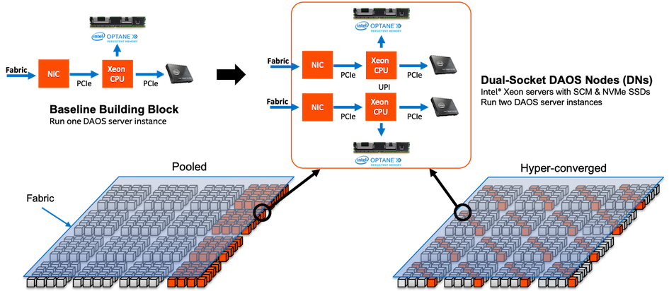

# DAOS Architecture 

DAOS is an open-source software-defined scale-out object store that provides high bandwidth and high IOPS storage containers to applications and enables next-generation data-centric workflows combining simulation, data analytics, and machine learning.

Unlike the traditional storage stacks that were primarily designed for
rotating media, DAOS is architected from the ground up to exploit new
NVM technologies and is extremely lightweight since it operates
End-to-End (E2E) in user space with full OS bypass. DAOS offers a shift
away from an I/O model designed for block-based and high-latency storage
to one that inherently supports fine-grained data access and unlocks the
performance of the next-generation storage technologies.

Unlike traditional Burst Buffers, DAOS is a high-performant independent
and fault-tolerant storage tier that does not rely on a third-party tier
to manage metadata and data resilience.

## DAOS Features

DAOS relies on OFI for low-latency communications and stores data on
both storage-class memory and NVMe storage. DAOS presents a native
key-array-value storage interface that offers a unified storage model
over which domain-specific data models are ported, such as HDF5, MPI-IO,
and Apache Arrow. A POSIX I/O emulation layer implementing files and
directories over the native DAOS API is also available.

DAOS I/O operations are logged and then inserted into a persistent index
maintained in SCM. Each I/O is tagged with a particular timestamp called
epoch and is associated with a particular version of the dataset. No
read-modify-write operations are performed internally. Write operations
are non-destructive and not sensitive to alignment. Upon read request,
the DAOS service walks through the persistent index and creates a
complex scatter-gather Remote Direct Memory Access (RDMA) descriptor to
reconstruct the data at the requested version directly in the buffer
provided by the application.

The SCM storage is memory-mapped directly into the address space of the
DAOS service that manages the persistent index via direct load/store.
Depending on the I/O characteristics, the DAOS service can decide to
store the I/O in either SCM or NVMe storage. As represented in Figure
2‑1, latency-sensitive I/Os, like application metadata and byte-granular
data, will typically be stored in the former, whereas checkpoints and
bulk data will be stored in the latter. This approach allows DAOS to
deliver the raw NVMe bandwidth for bulk data by streaming the data to
NVMe storage and maintaining internal metadata index in SCM. The
Persistent Memory Development Kit (PMDK)[^1] allows managing
transactional access to SCM and the Storage Performance Development Kit
(SPDK)[^2] enables user-space I/O to NVMe devices.

Figure 2‑1. DAOS Storage

DAOS aims at delivering:

-   High throughput and IOPS at arbitrary alignment and size

-   Fine-grained I/O operations with true zero-copy I/O to SCM

-   Support for massively distributed NVM storage via scalable
    collective communications across the storage servers

-   Non-blocking data and metadata operations to allow I/O and
    computation to overlap

-   Advanced data placement taking into account fault domains

-   Software-managed redundancy supporting both replication and erasure
    code with an online rebuild

-   End-to-end data integrity

-   Scalable distributed transactions with guaranteed data consistency
    and automated recovery

-   Dataset snapshot

-   Security framework to manage access control to storage pools

-   Software-defined storage management to provision, configure, modify
    and monitor storage pools over COTS hardware

-   Native support for Hierarchical Data Format (HDF)5, MPI-IO and POSIX
    namespace over the DAOS data model

-   Tools for disaster recovery

-   Seamless integration with the Lustre parallel filesystem

-   Mover agent to migrate datasets among DAOS pools and from parallel
    filesystems to DAOS and vice versa

## DAOS Components

A data center may have hundreds of thousands of compute nodes
interconnected via a scalable high-performance fabric, where all, or a
subset of the nodes called storage nodes, have direct access to NVM
storage. A DAOS installation involves several components that can be
either collocated or distributed.

### DAOS Target, Server and System

The DAOS server is a multi-tenant daemon running on a Linux instance
(i.e. natively on the physical node or in a VM or container) of each
storage node and exporting through the network the locally-attached NVM
storage. It listens to a management port, addressed by an IP address and
a TCP port number, plus one or more fabric endpoints, addressed by
network URIs. The DAOS server is configured through a YAML file and can
be integrated with different daemon management or orchestration
frameworks (e.g., a systemd script, a Kubernetes service or even via a
parallel launcher like pdsh or srun).

A DAOS system is identified by a system name and consists of a set of
DAOS servers connected to the same fabric. Membership of the DAOS
servers is recorded into the system map that assigns a unique integer
rank to each server. Two different systems comprise two disjoint sets of
servers and do not coordinate with each other.

Inside a DAOS server, the storage is statically partitioned across
multiple targets to optimize concurrency. To avoid contention, each
target has its private storage, own pool of service threads and
dedicated network context that can be directly addressed over the fabric
independently of the other targets hosted on the same storage node. A
target is typically associated with a single-ported SCM module and NVMe
SSD attached to a single storage node. Moreover, a target does not
implement any internal data protection mechanism against storage media
failure. As a result, a target is a single point of failure. A dynamic
state is associated with each target and is set to either up and
running, or down and not available.

A target is the unit of performance. Hardware components associated with
the target, such as the backend storage medium, the server, and the
network, have limited capability and capacity.

The number of targets exported by a DAOS server instance is configurable
and depends on the underlying hardware (i.e., the number of SCM modules,
CPUs, NVMe SSDs ...). A target is the unit of fault.

### Storage API, Application Interface and Tools

Applications, users, and administrators can interact with a DAOS system
through two different client APIs. The management API offers the ability
to administrate a DAOS system. It is intended to be integrated with
different vendor-specific storage management or open-source
orchestration frameworks. A CLI tool is built over the DAOS management
API. On the other hand, the DAOS library (i.e., libdaos) implements the
DAOS storage model and is primarily targeted at application and I/O
middleware developers who want to store datasets in a DAOS system. User
utilities are also built over the API to allow users to manage datasets
from a CLI.

Applications can access datasets stored in DAOS either directly through
the native DAOS API or an I/O middleware libraries (e.g. POSIX
emulation, MPI-IO, HDF5) or frameworks (e.g., Spark, TensorFlow) already
integrated with the native DAOS storage model.

### Agent

The DAOS agent is a daemon residing on the client node that interacts
with the DAOS library to authenticate the application process. It is a
trusted entity that can sign the DAOS Client credentials using
certificates. The agent can support different authentication frameworks
and uses a Unix Domain Socket to communicate with the client library.

## Storage Model

A DAOS pool is a storage reservation distributed across a collection of
targets. The actual space allocated to the pool on each target is called
a pool shard. The total space allocated to a pool is decided at creation
time and can be expanded over time by resizing all the pool shards
(within the limit of the storage capacity dedicated to each target) or
by spanning more targets (i.e., adding more pool shards). A pool offers
storage virtualization and is the unit of provisioning and isolation.
DAOS pools cannot span across multiple systems.

A pool can host multiple transactional object store called DAOS
containers. Each container is a private object address space, which can
be modified transactional and independently of the other containers
stored in the same pool. A container is the unit of snapshot and data
management. DAOS objects belonging to a container can be distributed
across any target of the pool for both performance and resilience and
can be accessed through different APIs to represent
structured, semi-structured and unstructured data efficiently.

Figure 2‑2 illustrates the different DAOS abstractions.

Figure 2‑2. Example of
four Storage Nodes, eight DAOS Targets, and three DAOS Pools

Table 2‑1 shows the targeted level of scalability for each DAOS
abstraction.

Table 2‑1. DAOS
Scalability

|DAOS Concept|Component Order of Magnitude Limit|
|-|-|
|System|102 Pools (hundreds)|
|Pool|102 Containers (hundreds)|
|Container|109 Objects (billions)|

### DAOS Pool

A Pool is identified by a unique UUID and maintains target memberships in the pool map stored in persistent memory. The pool map not only records the list of active targets, it also contains the storage topology under the form of a tree that is used to identify targets sharing common hardware components. For instance, the first level of the tree can represent targets sharing the same motherboard, and then the second level can represent all motherboards sharing the same rack and finally the third level can represent all racks in the same cage. This framework effectively represents hierarchical fault domains, which are then used to avoid placing redundant data on targets subject to correlated failures. At any point in time, new targets can be added to the pool map, and failed ones can be excluded. Moreover, the pool map is fully versioned, which effectively assigns a unique sequence to each modification of the map, more particularly for failed node removal.

A pool shard is a reservation of NVM storage (i.e., SCM optionally
combined with a pre-allocated space on NVMe storage) on a specific
target. It has a fixed capacity and fails operations when full. Current
space usage can be queried at any time and reports the total amount of
bytes used by any data type stored in the pool shard. Space consumed on
the different type of storage is reported separately.

Upon target failure and exclusion from the pool map, data redundancy
inside the pool is automatically restored while the pool remains online.
Rebuild progress is recorded regularly in special logs in the pool
stored in persistent memory to address cascading failures. When new
targets are added, data is automatically migrated to the newly added
targets to redistribute space usage equally among all the members. This
process is known as space rebalancing and uses dedicated persistent logs
as well to support interruption and restart. A pool is a set of targets
spread across different storage nodes over which data and metadata are
distributed to achieve horizontal scalability, and replicated or
erasure-coded to ensure durability and availability.

When creating a pool, a set of system properties must be defined to
configure the different features supported by the pool. In addition,
the user can define their own attributes that will be stored persistently.

A pool is only accessible to authenticated and authorized applications.
Multiple security frameworks could be supported, from NFSv4 access
control lists to third party-based authentication (such as Kerberos).
Security is enforced when connecting to the pool. Upon successful
connection to the pool, a connection context is returned to the
application process.

A pool stores many different sorts of persistent metadata, such as the
pool map, authentication, and authorization information, user attributes,
properties, and rebuild logs. Such metadata are critical and require the
highest level of resiliency. Therefore, the pool metadata are replicated
on a few nodes from distinct high-level fault domains. For very large
configurations with hundreds of thousands of storage nodes, only a very
small fraction of those nodes (in the order of tens) run the pool
metadata service. With a limited number of storage nodes, DAOS can
afford to rely on a consensus algorithm to reach agreement and to
guarantee consistency in the presence of faults and to avoid split-brain
syndrome.

### DAOS Container

A container represents an object address space inside a pool and is
identified by a UUID. Applications (i.e., directly or via I/O middleware,
domain-specific data format, big data or AI frameworks) store all
related datasets into a container which is the unit of storage
management for the user.

Like pools, containers can store user attributes and a set of
properties must be passed at container creation time to configure
different features like checksums.

Objects in a container are identified by a unique 128-bit object address
and may have different schemas for data distribution and redundancy over
targets. Dynamic or static striping, replication or erasure code are
some parameters required to define the object schema. The object class
defines common schema attributes for a set of objects. Each object class
is assigned a unique identifier and is associated with a given schema at
the pool level. A new object class can be defined at any time with a
configurable schema, which is then immutable after creation, or at least
until all objects belonging to the class have been destroyed. For
convenience, several object classes expected to be the most commonly
used will be predefined by default when the pool is created, as shown in
Table 2‑2.

Table 2‑2. Sample of
Pre-defined Object Classes

|Object Class (RW = read/write, RM = read-mostly|   Redundancy     |Metadata in OIT, (SC = stripe count, RC = replica count, PC = parity count, TGT = target
|-|-|-|  
|Small size & RW|Replication|No (static SCxRC, e.g. 1x4)
|Small size & RM|Erasure code|No (static SC+PC, e.g. 4+2)
|Large size & RW|Replication|No (static SCxRC over max \#targets)
|Large size & RM|Erasure code|No (static SCx(SC+PC) w/ max \#TGT)
|Unknown size & RW|Replication|SCxRC (e.g. 1x4 initially and grows)
|Unknown size & RM|Erasure code|SC+PC (e.g. 4+2 initially and grows)

A container is the unit of transaction and snapshot. Container metadata
(i.e. list of snapshots, container open handles, object class, user
attributes, properties, etc.) are stored in persistent memory and
maintained by a dedicated container metadata service that either uses
the same replicated engine as the parent metadata pool service, or has
its own engine.

### DAOS Object

To avoid scaling problems and overhead common to a traditional storage
system, DAOS objects are intentionally simple. No default object
metadata beyond the type and schema are provided. This means that the
system does not maintain time, size, owner, permissions or even track
openers. To achieve high availability and horizontal scalability, many
object schemas (replication/erasure code, static/dynamic striping, and others)
are provided. The schema framework is flexible and easily expandable to
allow for new custom schema types in the future. The layout is generated
algorithmically on an object open from the object identifier and the pool
map. End-to-end integrity is assured by protecting object data with
checksums during network transfer and storage.

A DAOS object can be accessed through different native interfaces
exported by libdaos: multi-level key-array, key-value or array APIs that
allows representing efficiently structured, semi-structured or
unstructured data.

[^1]: http://pmem.io/pmdk/

[^2]: http://www.spdk.io/
