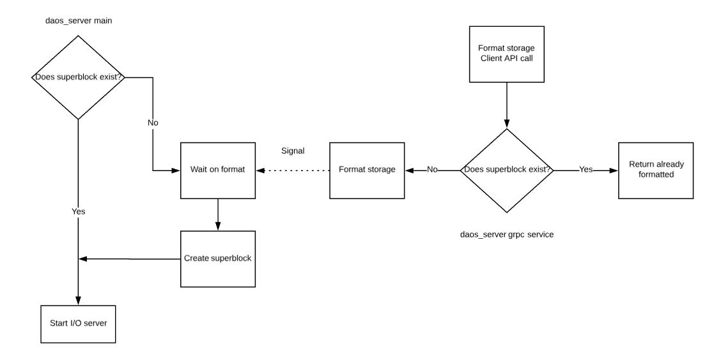

# DAOS System Deployment

## Preflight Checklist

This section covers the preliminary setup required on the compute and
storage nodes before deploying DAOS.

### Time Synchronization

The DAOS transaction model relies on timestamps and requires time to be
synchronized across all the storage and client nodes. This can be done
using NTP or any other equivalent protocol.

### Users and Groups

DAOS requires users and groups to be synchronized on both storage and
client nodes.

### Runtime Directory Setup

DAOS uses a series of Unix Domain Sockets to communicate between its
various components. On modern Linux systems, Unix Domain Sockets are
typically stored under /run or /var/run (usually a symlink to /run) and
are a mounted tmpfs file system. There are several methods for ensuring
the necessary directories are setup.

A sign that this step may have been missed is when starting daos\_server
or daos\_agent, you may see the message:
```
mkdir /var/run/daos\_server: permission denied
Unable to create socket directory: /var/run/daos\_server
```
#### Non-default Directory

By default, daos\_server and daos\_agent will use the directories
/var/run/daos\_server and /var/run/daos\_agent respectively. To change
the default location that daos\_server uses for its runtime directory,
either uncomment and set the socket\_dir configuration value in
install/etc/daos\_server.yml, or pass the location to daos\_server on
the command line using the -d flag. For the daos\_agent, an alternate
location can be passed on the command line using the -runtime\_dir flag.

#### Default Directory (non-persistent)

Files and directories created in /run and /var/run only survive until
the next reboot. However, if reboots are infrequent, an easy solution
while still utilizing the default locations is to create the
required directories manually. To do this execute the following commands.

daos\_server:
```
mkdir /var/run/daos\_server
chmod 0755 /var/run/daos\_server
chown user:user /var/run/daos\_server (where user is the user you
    will run daos\_server as)
```
daos\_agent:
```
mkdir /var/run/daos\_agent
chmod 0755 /var/run/daos\_agent
chown user:user /var/run/daos\_agent (where user is the user you
    will run daos\_agent as)
```

#### Default Directory (persistent)

If the server hosting daos\_server or daos\_agent will be rebooted often,
systemd provides a persistent mechanism for creating the required
directories called tmpfiles.d. This mechanism will be required every
time the system is provisioned and requires a reboot to take effect.

To tell systemd to create the necessary directories for DAOS:

-   Copy the file utils/systemd/daosfiles.conf to /etc/tmpfiles.d\
    cp utils/systemd/daosfiles.conf /etc/tmpfiles.d

-   Modify the copied file to change the user and group fields
    (currently daos) to the user daos will be run as

-   Reboot the system, and the directories will be created automatically
    on all subsequent reboots.

### Elevated Privileges

Several tasks (e.g., storage access, hugepages configuration) performed
by the DAOS server require elevated permissions on the storage nodes
(requiring certain commands to be run as root or with sudo).

## Hardware Provisioning

### Storage Preparation

#### SCM Preparation

This section addresses how to verify that Optane DC Persistent Memory
(DCPM) is correctly installed on the storage nodes, and how to configure
it in interleaved mode to be used by DAOS in AppDirect mode.
Instructions for other types of SCM may be covered in the future.

Provisioning the SCM occurs by configuring DCPM modules in AppDirect memory regions
(interleaved mode) in groups of modules local to a specific socket (NUMA), and
resultant nvdimm namespaces are defined by a device identifier (e.g., /dev/pmem0).

DCPM can be configured and managed through the
[ipmctl](https://github.com/intel/ipmctl) library and associated tool. The
ipmctl command can be run as root and has detailed man pages and
help output (use "ipmctl help" to display it).

The list of NVDIMMs can be displayed as follows:

```
ipmctl show -dimm
```

| DimmID | Capacity  | HealthState | ActionRequired | LockState | FWVersion     |
| ------ | --------- | ----------- | -------------- | --------- | ------------- |
| 0x0001 | 502.5 GiB | Healthy     | 0              | Disabled  | 01.00.00.5127 |
| 0x0101 | 502.5 GiB | Healthy     | 0              | Disabled  | 01.00.00.5127 |
| 0x1001 | 502.5 GiB | Healthy     | 0              | Disabled  | 01.00.00.5127 |
| 0x1101 | 502.5 GiB | Healthy     | 0              | Disabled  | 01.00.00.5127 |

Moreover, DAOS requires DCPM to be configured in interleaved mode. A
storage subcommand (prepare --scm-only) can be used as a "command mode"
invocation of *daos\_server* and must be run as root. SCM modules will
be configured into interleaved regions with memory mode set to
"AppDirect" mode with one set per socket (each module is assigned to a socket,
and reports this via its NUMA rating).

`sudo daos_server [<app_opts>] storage prepare [--scm-only|-s] [<cmd_opts>]`
The first time the command is run, the SCM AppDirect regions will be created as
resource allocations on any available DCPM modules (one region per NUMA
node/socket). The regions are activated after BIOS reads the new resource
allocations, and after initial completion the command prints a
message to ask for a reboot (the command will not initiate reboot itself).

'sudo daos_server storage prepare --scm-only' should be run for a second time after
system reboot to create the pmem kernel devices (/dev/pmemX
namespaces created on the new SCM regions).

One namespace per region is created, and each namespace may take up to a few
minutes to create. Details of the pmem devices will be displayed in JSON format
on command completion.

Example output from the initial call (with the SCM modules set to default MemoryMode):

```bash
Memory allocation goals for SCM will be changed and namespaces modified, this
will be a destructive operation.  ensure namespaces are unmounted and SCM is
otherwise unused.
Are you sure you want to continue? (yes/no)
yes
A reboot is required to process new memory allocation goals.
```

Example output from the subsequent call (SCM modules configured to AppDirect
mode, and host rebooted):

```bash
Memory allocation goals for SCM will be changed and namespaces modified. This
will be a destructive operation. Ensure namespaces are unmounted and the SCM
is otherwise unused.
Are you sure you want to continue? (yes/no)
yes
creating SCM namespace, may take a few minutes...
creating SCM namespace, may take a few minutes...
Persistent memory kernel devices:
[{UUID:5d2f2517-9217-4d7d-9c32-70731c9ac11e Blockdev:pmem1 Dev:namespace1.0 NumaNode:1} {UUID:2bfe6c40-f79a-4b8e-bddf-ba81d4427b9b Blockdev:pmem0 Dev:namespace0.0 NumaNode:0}]
```

`sudo daos_server [<app_opts>] storage prepare [--scm-only|-s] --reset [<cmd_opts>]`

All namespaces are disabled and destroyed. The SCM regions are removed by
resetting modules into "MemoryMode" through resource allocations.

Note that undefined behavior may result if the namespaces/pmem kernel
devices are mounted before running reset (as per the printed warning).

A subsequent reboot is required for BIOS to read the new resource
allocations.

Example output when resetting the SCM modules:

```bash
Memory allocation goals for SCM will be changed and namespaces modified, this
will be a destructive operation.  ensure namespaces are unmounted and SCM is
otherwise unused.
Are you sure you want to continue? (yes/no)
yes
removing SCM namespace, may take a few minutes...
removing SCM namespace, may take a few minutes...
resetting SCM memory allocations
A reboot is required to process new memory allocation goals.
```

#### NVMe Preparation

DAOS supports only NVMe-capable SSDs that are accessed directly from
userspace through the SPDK library.

NVMe access through SPDK as an unprivileged user can be enabled by
running the example command
`sudo daos_server storage prepare --nvme-only -p 4096 -u bob`.

This will perform the required setup in order for `daos_server` to be run
by user "bob" who will own the hugepage mountpoint directory and vfio
groups as needed in SPDK operations.

If the target-user is unspecified (`-u` short option), the target user
will be the issuer of the sudo command (or root if not using sudo).

The specification of hugepages (`-p` short option) defines the number
of huge pages to allocate for use by SPDK.

A list of PCI addresses can also be supplied to avoid unbinding all
PCI devices from the kernel, using the `-w` / `--pci-whitelist` option.

The `sudo daos_server [<app_opts>] storage prepare [--nvme-only|-n] [<cmd_opts>]`
command wraps the SPDK setup script to unbind the devices from
original kernel drivers and then binds the devices to a UIO driver
through which SPDK can communicate.

When a PCI address whitelist is not specified, SPDK access to all SSDs
will be enabled for the user (either the user executing sudo, the user
specified as --target-user, or effective user - in that order of precedence)
involving changing the ownership of relevant files in addition to SPDK setup.

The devices can then be bound back to the original drivers with the command
`sudo daos_server [<app_opts>] storage prepare [--nvme-only|-n] --reset [<cmd_opts>]`.

### Storage Detection & Selection

While the DAOS server auto-detects all the usable
storage, the administrator will still be provided with the ability through
the configuration file (see next section) to whitelist or blacklist the
storage devices to be (or not) used. This section covers how to manually
detect the storage devices potentially usable by DAOS to
populate the configuration file when the administrator wants to have
finer control over the storage selection.

`sudo daos_server storage scan` can be used to display locally-attached SSDs
and Intel Persistent Memory Models usable by DAOS.

```bash
$ daos_server storage scan
[...]
NVMe SSD controller and constituent namespaces:
        PCI Addr:0000:da:00.0 Serial:PHKS7505005Y750BGN   Model:INTEL SSDPED1K750GA  Fwrev:E2010325 Socket:1
                Namespace: id:1 capacity:750
        PCI Addr:0000:81:00.0 Serial:PHKS7505007J750BGN   Model:INTEL SSDPED1K750GA  Fwrev:E2010325 Socket:1
                Namespace: id:1 capacity:750
        PCI Addr:0000:87:00.0 Serial:CVFT5392000G1P6DGN   Model:INTEL SSDPEDMD016T4  Fwrev:8DV10171 Socket:1
                Namespace: id:1 capacity:1600
SCM modules:
        PhysicalID:36 Capacity:539661172736 Location:(socket:0 memctrlr:0 chan:0 pos:1)
        PhysicalID:40 Capacity:539661172736 Location:(socket:0 memctrlr:0 chan:1 pos:1)
        PhysicalID:44 Capacity:539661172736 Location:(socket:0 memctrlr:0 chan:2 pos:1)
        PhysicalID:50 Capacity:539661172736 Location:(socket:0 memctrlr:1 chan:0 pos:1)
        PhysicalID:52 Capacity:539661172736 Location:(socket:0 memctrlr:1 chan:1 pos:0)
        PhysicalID:55 Capacity:539661172736 Location:(socket:0 memctrlr:1 chan:2 pos:0)
        PhysicalID:62 Capacity:539661172736 Location:(socket:1 memctrlr:0 chan:0 pos:1)
        PhysicalID:66 Capacity:539661172736 Location:(socket:1 memctrlr:0 chan:1 pos:1)
        PhysicalID:70 Capacity:539661172736 Location:(socket:1 memctrlr:0 chan:2 pos:1)
        PhysicalID:76 Capacity:539661172736 Location:(socket:1 memctrlr:1 chan:0 pos:1)
        PhysicalID:78 Capacity:539661172736 Location:(socket:1 memctrlr:1 chan:1 pos:0)
        PhysicalID:81 Capacity:539661172736 Location:(socket:1 memctrlr:1 chan:2 pos:0)
```

The pciaddr field above is what should be used in the server
configuration file to identified NVMe SSDs.

Devices with the same NUMA node/socket should be used in the same per-server
section of the server configuration file for best performance.

### Network Interface Detection and Selection

To display the supported OFI provider, use the following command:
```
 /scratch/standan/daos\_m/opt/ofi/bin/fi\_info -l
```

```
psm2:

version: 1.7

ofi\_rxm:

version: 1.0

ofi\_rxd:

version: 1.0

verbs:

version: 1.0

UDP:

version: 1.1

sockets:

version: 2.0

tcp:

version: 0.1

ofi\_perf\_hook:

version: 1.0

ofi\_noop\_hook:

version: 1.0

shm:

version: 1.0

ofi\_mrail:

version: 1.0
```
The fi\_pingpong test (delivered as part of OFI/libfabric) can be used
to verify that the targeted OFI provider works fine:
```
node1\$ fi\_pingpong -p psm2

node2\$ fi\_pingpong -p psm2 \${IP\_ADDRESS\_NODE1}

bytes \#sent \#ack total time MB/sec usec/xfer Mxfers/sec

64 10 =10 1.2k 0.00s 21.69 2.95 0.34

256 10 =10 5k 0.00s 116.36 2.20 0.45

1k 10 =10 20k 0.00s 379.26 2.70 0.37

4k 10 =10 80k 0.00s 1077.89 3.80 0.26

64k 10 =10 1.2m 0.00s 2145.20 30.55 0.03

1m 10 =10 20m 0.00s 8867.45 118.25 0.01

Further details will be added to this section in a future revision.
```
### Storage Firmware Upgrade

Firmware on an NVMe controller can be updated from an image on local
storage (initially installing from a local path on the host that is
running *daos\_server* but to be extended to downloading remotely from
central storage location).

When the controller is selected, and an update firmware task runs,
controller data is accessed through an existing linked list through the
binding fwupdate call, and a raw command specifying a firmware update with
the local image (specified by file path) and slot identifier. The firmware
update is followed by a hard reset on the controller.

### Storage Burn in

Burn-in testing can be performed on discovered NVMe controllers. By
default, this involves a 15-minute slow burn-in test with a mixed
read/write workload issued by fio, but test duration and load strength
should be user-configurable. Burn-in should run in the background to
allow administrators to use the control-plane for other tasks in the
meantime.

The fio repo is to be built and needs to be referenced when building the
SPDK fio\_plugin. The plug-in can then be run by fio to exercise the
NVMe device through SPDK. Currently, the output of the burn-in is
displayed in the shell, and control is returned to the user after
completion. Future iterations may perform this as a background task.

## Server Configuration

This section addresses how to configure the DAOS servers on the storage
nodes before starting it.

### Certificate Generation

The DAOS security framework relies on certificates to authenticate
administrators. The security infrastructure is currently under
development and will be delivered in DAOS v1.0. Initial support for certificates
has been added to DAOS and can be disabled either via the command line or in the
DAOS server configuration file. Currently, the easiest way to disable certificate
support is to pass the -i flag to daos\_server.

### Server Configuration File

The `daos_server` configuration file is parsed when starting the
`daos_server` process. The configuration file location can be specified
on the command line (`daos_server -h` for usage) or default location
(`install/etc/daos_server.yml`).

Parameter descriptions are specified in [daos_server.yml](https://github.com/daos-stack/daos/blob/master/utils/config/daos_server.yml)
and example configuration files in the [examples](https://github.com/daos-stack/daos/tree/master/utils/config/examples)
directory.

Any option supplied to `daos_server` as a command line option or flag will
take precedence over equivalent configuration file parameter.

For convenience, active parsed configuration values are written to a temporary
file for reference, and the location will be written to the log.

#### Configuration File Options

The example configuration file lists the default empty configuration, listing all the
options (living documentation of the config file). Live examples are
available at
<https://github.com/daos-stack/daos/tree/master/utils/config>

The location of this configuration file is determined by first checking
for the path specified through the -o option of the daos\_server command
line. Otherwise, /etc/daos\_server.conf is used.

Refer to the example configuration file ([daos_server.yml](https://github.com/daos-stack/daos/blob/master/utils/config/daos_server.yml)) for latest information and examples.

## Server Startup

DAOS currently relies on PMIx for server wire-up and application to
server connection. As a result, the DAOS servers can only be started via
orterun (part of OpenMPI). A new bootstrap procedure is under
implementation and will be available for DAOS v1.0. This will remove the
dependency on PMIx and will allow the DAOS servers to be started
individually (e.g. independently on each storage node via systemd) or
collectively (e.g. pdsh, mpirun or as a Kubernetes Pod).

### Parallel Launcher

As stated above, only orterun(1) is currently supported.

The list of storage nodes can be specified in a host file (referred to
as \${hostfile}). The DAOS server and the application can be started
separately but must share a URI file (referred to as \${urifile}) to
connect. The \${urifile} is generated by orterun using (--report-uri
filename) at the server and used at the application with (--ompi-server
file:filename). Also, the DAOS server must be started with the
--enable-recovery option to support server failure. See the orterun(1)
man page for additional options.

To start the DAOS server, run:
```
orterun -np &lt;num\_servers&gt; --hostfile \${hostfile}
--enable-recovery --report-uri \${urifile} daos\_server -i
```
The --enable-recovery is required for fault tolerance to guarantee that
the fault of one server does not cause the others to be stopped.

The hostfile used here is the same as the ones used by Open MPI. See the
mpirun documentation[^3] for additional details.

The --allow-run-as-root option can be added to the command line to
allow the daos\_server to run with root privileges on each storage
nodes (for example when needing to perform privileged tasks relating
to storage format).

<details>
<summary>Example output from invoking `daos_server` on multiple hosts with `orterun` (with logging to stdout for illustration purposes)</summary>
<p>

```bash
[tanabarr@boro-45 daos_m]$ orterun -np 2 -H boro-44,boro-45 --report-uri /tmp/urifile --enable-recovery daos_server -o /home/tanabarr/projects/daos_m/utils/config/examples/daos_server_sockets.yml start -t 1
2019/03/28 12:28:07 config.go:85: debug: DAOS config read from /home/tanabarr/projects/daos_m/utils/config/examples/daos_server_sockets.yml
2019/03/28 12:28:07 config.go:85: debug: DAOS config read from /home/tanabarr/projects/daos_m/utils/config/examples/daos_server_sockets.yml
2019/03/28 12:28:07 main.go:79: debug: Switching control log level to DEBUG
boro-44.boro.hpdd.intel.com 2019/03/28 12:28:07 config.go:121: debug: Active config saved to /home/tanabarr/projects/daos_m/utils/config/examples/.daos_server.active.yml (read-only)
Starting SPDK v18.07-pre / DPDK 18.02.0 initialization...
[ DPDK EAL parameters: spdk -c 0x1 --file-prefix=spdk234203216 --base-virtaddr=0x200000000000 --proc-type=auto ]
EAL: Detected 72 lcore(s)
EAL: Auto-detected process type: PRIMARY
2019/03/28 12:28:07 main.go:79: debug: Switching control log level to DEBUG
boro-45.boro.hpdd.intel.com 2019/03/28 12:28:07 config.go:121: debug: Active config saved to /home/tanabarr/projects/daos_m/utils/config/examples/.daos_server.active.yml (read-only)
EAL: Detected 72 lcore(s)
Starting SPDK v18.07-pre / DPDK 18.02.0 initialization...
[ DPDK EAL parameters: spdk -c 0x1 --file-prefix=spdk290246766 --base-virtaddr=0x200000000000 --proc-type=auto ]
EAL: Auto-detected process type: PRIMARY
EAL: No free hugepages reported in hugepages-1048576kB
EAL: No free hugepages reported in hugepages-1048576kB
EAL: Multi-process socket /home/tanabarr/.spdk234203216_unix
EAL: Probing VFIO support...
EAL: Multi-process socket /home/tanabarr/.spdk290246766_unix
EAL: Probing VFIO support...
EAL: PCI device 0000:81:00.0 on NUMA socket 1
EAL:   probe driver: 8086:2701 spdk_nvme
EAL: PCI device 0000:81:00.0 on NUMA socket 1
EAL:   probe driver: 8086:2701 spdk_nvme
Starting SPDK v18.07-pre / DPDK 18.02.0 initialization...
[ DPDK EAL parameters: daos -c 0x1 --file-prefix=spdk290246766 --base-virtaddr=0x200000000000 --proc-type=auto ]
EAL: Detected 72 lcore(s)
Starting SPDK v18.07-pre / DPDK 18.02.0 initialization...
[ DPDK EAL parameters: daos -c 0x1 --file-prefix=spdk234203216 --base-virtaddr=0x200000000000 --proc-type=auto ]
EAL: Auto-detected process type: SECONDARY
EAL: Detected 72 lcore(s)
EAL: Auto-detected process type: SECONDARY
EAL: Multi-process socket /home/tanabarr/.spdk234203216_unix_141938_a591f56066dd7
EAL: Probing VFIO support...
EAL: WARNING: Address Space Layout Randomization (ASLR) is enabled in the kernel.
EAL:    This may cause issues with mapping memory into secondary processes
EAL: Multi-process socket /home/tanabarr/.spdk290246766_unix_23680_14e5a164a3bd1db
EAL: Probing VFIO support...
EAL: WARNING: Address Space Layout Randomization (ASLR) is enabled in the kernel.
EAL:    This may cause issues with mapping memory into secondary processes
EAL: PCI device 0000:81:00.0 on NUMA socket 1
EAL:   probe driver: 8086:2701 spdk_nvme
boro-44.boro.hpdd.intel.com 2019/03/28 12:28:11 main.go:188: debug: DAOS server listening on 0.0.0.0:10001
DAOS I/O server (v0.0.2) process 141938 started on rank 1 (out of 2) with 1 target xstream set(s).
EAL: PCI device 0000:81:00.0 on NUMA socket 1
EAL:   probe driver: 8086:2701 spdk_nvme
boro-45.boro.hpdd.intel.com 2019/03/28 12:28:11 main.go:188: debug: DAOS server listening on 0.0.0.0:10001
DAOS I/O server (v0.0.2) process 23680 started on rank 0 (out of 2) with 1 target xstream set(s).
```

</p>
</details>

### Systemd Integration

Systemd support for daos_server is still experimental as it will start the
daos_server and daos_io_server components in PMIXless mode, which is still in
development.

DAOS Server can be started as a systemd service. The DAOS Server
unit file is installed in the correct location when installing from RPMs.
If you wish to use systemd with a development build, you must copy the service
file from utils/systemd to /usr/lib/systemd/system. Once the file is copied
modify the ExecStart line to point to your in tree daos_server binary.

Once the service file is installed you can start daos_server
with the following commands:

```bash
systemctl enable daos-server
systemctl start daos-server
```

To check the component status use:

```bash
systemctl status daos-server
```

If DAOS Server failed to start, check the logs with:

```bash
journalctl --unit daos-server
```

### Kubernetes Pod

DAOS service integration with Kubernetes is planned and will be
supported in a future DAOS version.

### Service Monitoring

On start-up, the daos\_server will create and initialize the following
components:

- gRPC server to handle requests over client API

- dRPC server to handle requests from IO servers over the UNIX domain
    socket

- storage subsystems for handling interactions with NVM devices

- SPDK environment using a shared memory segment identifier, causing
the process to act as a primary in multi-process mode. From there,
the main process can respond to requests over the client API for
information through the SPDK interface.

The daos\_shell is a transitory tool used to exercise the management api
and can be used to verify that the DAOS servers are up and running. It
is to be run as a standard, unprivileged user as follows:
```
\$ daos\_shell -l storagenode1:10001,storagenode2:10001 storage scan
```
"storagenode" should be replaced with the actual hostname of each
storage node. This command will show whether the DAOS server is properly
running and initialized on each storage node. A more comprehensive and
user-friendly tool built over the management API is under development. A
first version will be available for DAOS v1.0.

## DAOS Storage & Server Formatting

### Storage Format

When 'daos_server' is started for the first time (and no SCM directory exists),
it enters "maintenance mode" and waits for a `daos_shell storage format` call to
be issued from the management tool.
This remote call will trigger the formatting of the locally attached storage on
the host for use with DAOS using the parameters defined in the server config file.

`daos_shell -i -l <host:port>[,...] storage format` will normally be run on a login
node specifying a hostlist (`-l <host:port>[,...]`) of storage nodes with SCM/DCPM
modules and NVMe SSDs installed and prepared.

#### SCM Format

When the command is run, the pmem kernel devices created on SCM/DCPM regions are
formatted and mounted based on the parameters provided in the server config file.

- `scm_mount` specifies the location of the mountpoint to create.
- `scm_class` can be set to `ram` to use a tmpfs in the situation that no SCM/DCPM
is available (scm_size dictates the size of tmpfs in GB), when set to `dcpm` the device
specified under `scm_list` will be mounted at `scm_mount` path.

#### NVMe Format

When the command is run, NVMe SSDs are formatted and set up to be used by DAOS
based on the parameters provided in the server config file.

`bdev_class` can be set to `nvme` to use actual NVMe devices with SPDK for DAOS
storage.
Other `bdev_class` values can be used for emulation of NVMe storage as specified
in the server config file.
`bdev_list` identifies devices to use with a list of PCI addresses (this can be
populated after viewing results from `storage scan` command).

After the format command is run, the path specified by the server configuration
file `scm_mount` parameter should be mounted and should contain a file named
`daos_nvme.conf`.
The file should describe the devices with PCI addresses as listed in the
`bdev_list` parameter of the server config file.
The presence and contents of the file indicate that the specified NVMe SSDs have
been configured correctly for use with DAOS.

The contents of the NVMe SSDs listed in the server configuration file `bdev_list`
parameter will be reset on format.

### Server Format

Before the format command is run, no `superblock` file should exist under the
path specified by `scm_mount` parameter in the server configuration file.

After the `storage format` command is run, the path specified by the server
configuration file `scm_mount` parameter should be mounted and should contain
a file named `superblock` indicating that the server has been formatted.

When starting, `daos_server` will skip `maintenance mode` and attempt to start
IO services if the `superblock` is found in `scm_mount`.

## Basic Workflow

Control plane server ([daos_server](/src/control/server)) instances will
listen for requests from the management tool ([daos_shell](/src/control/cmd/dmg)),
enabling users to perform provisioning operations on network and storage
hardware remotely on storage nodes (from for example a login node).

When `daos_server` instances have been started on each storage node
for the first time, calling
`daos_shell -l <host:port>,... storage format -f` formats persistent
storage on the server node (skipping confirmation) on devices specified
in the server configuration file, then writes the superblock and
starts the data plane.



Typically an administrator will perform the following tasks:

1. Prepare NVMe and SCM Storage
    - `sudo daos_server [<app_opts>] storage prepare [<cmd_opts>]`
    [NVMe details](#nvme-preparation)
    [SCM details](#scm-preparation)

2. Scan Storage
    - `sudo daos_server [<app_opts>] storage scan [<cmd_opts>]`
    [details](#storage-detection--selection)

3. Add device identifiers to Server config file
    - `vim <daos>/utils/config/examples/daos_server_sockets.yml`
    [details](#server-configuration)
    - just specify NVMe PCI addresses with `bdev_list` for now

4. Start DAOS control plane
    - `orterun -np 2 -H boro-44,boro-45 --report-uri /tmp/urifile --enable-recovery daos_server -o <daos>/utils/config/examples/daos_server_sockets.yml start -t 1 -i`
    [details](#parallel-launcher)

5. Provision Storage
    - firmware update [details](#firmware-upgrade)
    - burn-in testing [details](#storage-burn-in)

6. Amend Server config file (adjust based on the results of storage provisioning,
requires a subsequent restart of `daos_server`)
    - `vim <daos>/utils/config/examples/daos_server_sockets.yml`
    [details](#server-configuration)
    - populate the `scm_*` and `bdev_*` parameters as used in format (below)

7. Format Storage (from any node)
    - When `daos_server` is started for the first time (and no SCM directory exists),
`daos_server` enters "maintenance mode" and waits for a `daos_shell storage format` call to be issued from the management tool. This remote call will trigger the formatting of the locally attached storage on the host for use with DAOS using the parameters defined in the server config file.
    - `daos_shell -i -l <host:port>,... storage format -f`
[management tool details](/src/control/cmd/dmg/README.md#storage-format)
    - [SCM specific details](/src/control/server/README.md#scm-format)
    - [NVMe specific details](/src/control/server/README.md#nvme-format)

<div style="margin-left: 4em;">
<details>
<summary>Example output</summary>
<p>

```bash
[tanabarr@<hostname> daos_m]# daos_shell -i -l <hostname>:10001 -i storage format -f
Active connections: [<hostname):10001]
This is a destructive operation and storage devices specified in the server config file will be erased.
Please be patient as it may take several minutes.

NVMe storage format results:
<hostname>:10001:
        pci-address 0000:da:00.0: status CTRL_SUCCESS
        pci-address 0000:81:00.0: status CTRL_SUCCESS

SCM storage format results:
<hostname>:10001:
        mntpoint /mnt/daos: status CTRL_SUCCESS
```

</p>
</details>
</div>

8. Create Pool (DAOS I/O - data plane - should now be running)
TODO: add instructions

## Agent Configuration

This section addresses how to configure the DAOS agents on the storage
nodes before starting it.

### Agent Certificate Generation

The DAOS security framework relies on certificates to authenticate
administrators. The security infrastructure is currently under
development and will be delivered in DAOS v1.0. Initial support for certificates
has been added to DAOS and can be disabled either via the command line or in the
DAOS Agent configuration file. Currently, the easiest way to disable certificate
support is to pass the -i flag to daos\_agent.

### Agent Configuration File

The `daos_agent` configuration file is parsed when starting the
`daos_agent` process. The configuration file location can be specified
on the command line (`daos_agent -h` for usage) or default location
(`install/etc/daos_agent.yml`).

Parameter descriptions are specified in [daos_agent.yml](https://github.com/daos-stack/daos/blob/master/utils/config/daos_agent.yml).

Any option supplied to `daos_agent` as a command line option or flag will
take precedence over equivalent configuration file parameter.

For convenience, active parsed config values are written to a temporary
file for reference, and the location will be written to the log.

The following section lists the format, options, defaults, and
descriptions available in the configuration file.

#### Configuration File Options

The example configuration file lists the default empty configuration listing all the
options (living documentation of the config file). Live examples are
available at
<https://github.com/daos-stack/daos/tree/master/utils/config>

The location of this configuration file is determined by first checking
for the path specified through the -o option of the daos\_agent command
line. Otherwise, /etc/daos\_agent.conf is used.

Refer to the example configuration file ([daos_server.yml](https://github.com/daos-stack/daos/blob/master/utils/config/daos_server.yml)) for latest information and examples.

## Agent Startup

DAOS Agent is a standalone application to be run on each compute node.
It can be configured to use secure communications (default) or can be allowed
to communicate with the control plane over unencrypted channels. The following
example shows daos_agent being configured to operate in insecure mode due to
incomplete integration of certificate support as of the 0.6 release.

To start the DAOS Agent from the command line, run:

```bash
daos_agent -i
```

Alternatively, the DAOS Agent can be started as a systemd service. The DAOS Agent
unit file is installed in the correct location when installing from RPMs.
If you wish to use systemd with a development build, you must copy the service
file from utils/systemd to /usr/lib/systemd/system. Once the file is copied
modify the ExecStart line to point to your in tree daos_agent binary.

Once the service file is installed, you can start daos_agent
with the following commands:

```bash
systemctl enable daos-agent
systemctl start daos-agent
```

To check the component status use:

```bash
systemctl status daos-agent
```

If DAOS Agent failed to start check the logs with:

```bash
journalctl --unit daos-agent
```

## System Validation

To validate that the DAOS system is properly installed, the daos\_test
suite can be executed. Ensure the DAOS Agent is configured and running before
running daos\_test:

orterun -np
&lt;num\_clients&gt; --hostfile \${hostfile} --ompi-server
file:\${urifile} ./daos\_test

daos\_test requires at least 8GB of SCM (or DRAM with tmpfs) storage on
each storage node.

[^1]: https://github.com/intel/ipmctl

[^2]: https://github.com/daos-stack/daos/tree/master/utils/config

[^3]: [*https://www.open-mpi.org/faq/?category=running\#mpirun-hostfile*](https://www.open-mpi.org/faq/?category=running#mpirun-hostfile)

[^4]: https://github.com/daos-stack/daos/tree/master/src/control/README.md
