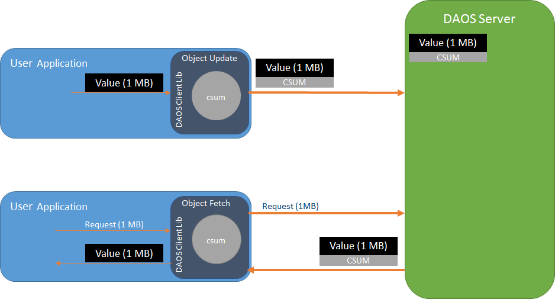
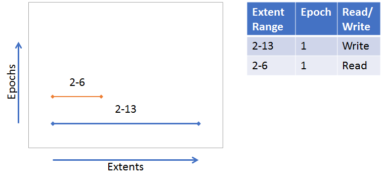
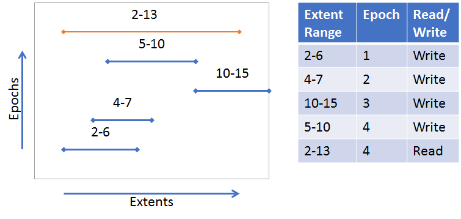
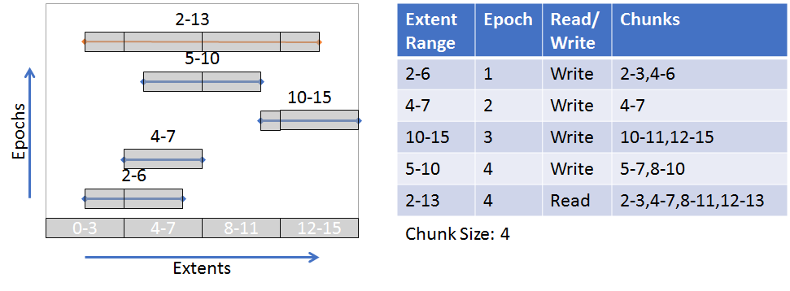

# Introduction
Arguably, one of the worst things a data storage system can do is to return
 incorrect data without the requester knowing. While each component in the
 system (network layer, storage devices) may offer protection against silent
 data corruption, DAOS provides end-to-end data integrity using checksums to
 better ensure that user data is not corrupted silently.

For DAOS, end-to-end means that the client will calculate and verify checksums,
providing protection for data through the entire I/O stack. During a write or
update, the DAOS Client library (libdaos.so) calculates a checksum and appends
it to the RPC message before transferred over the network.
Depending on the configuration, the DAOS Server may or may not calculate checksums
to verify the data on receipt. On a fetch, the DAOS Server will send a known
good checksum with the requested data to the DAOS Client, which will calculate
checksums on the data received and verify.

## Requirements
### Key Requirements
There are two key requirements that DAOS will support.
1. Detect silent data corruption - Corruption will be detected on the
 distribution and attribute keys and records within a DAOS object. At a minimum,
 when corruption is detected, an error will be reported.
1. Correct data corruption - When data corruption is detected, an attempt will
 be made to recover the data using data redundancy mechanisms.

### Supportive/Additional Requirements
Additionally, DAOS will support ...
1. End to End Data Integrity as a Quality of Service Attribute - Container
 properties are used to enable/disable the use of checksums for data integrity
 as well as define specific attributes of data integrity feature.  See
 https://daos-stack.github.io/user/container/#data-integrity for details on
 configuring a container with checksums enabled.
1. Minimize Performance Impact - When there is no data corruption, the End to
 End Data Integrity feature should have minimal performance impacted. If data
 corruption is detected, performance can be impacted to correct the data.
 Work is ongoing to minimize performance impact.
1. Inject Errors - The ability to corrupt data within a specific record, key,
 or checksum will be necessary for testing purposes. Fault injection is used to
 simulate corruption over the network and on disk. The DAOS_CSUM_CORRUPT_*
 flags used for data corruption are defined in src/include/daos/common.h.
1. Logging - When data corruption is detected, error logs are captured in
 the client and server logs.

Up coming features not supported yet
1. Event Logging - When silent data corruption is discovered, an event should
 be logged in such a way that it can be retrieved with other system health and
 diagnostic information.
1. Proactive background service task - A background task on
 the server which scans for and detects (audits checksums) silent data
 corruption and corrects.

# Keys and Value Objects
Because DAOS is a key/value store, the data for both keys and values is
protected, however, the approach for both is slightly different. For the two
different value types, single and array, the approach is also slightly
different.

## Keys
On an update and fetch, the client calculates a checksum for the data used
as the distribution and attribute keys and will send it to the server within the
RPC. The server verifies the keys with the checksum.
While enumerating keys, the server will calculate checksums for the keys and
pack within the RPC message to the client. The client will verify the keys
received.

!!! note
    Checksums for keys are not stored on the server. A hash of the key is
    calculated and used to index the key in the server tree of the keys
    (see [VOS Key Array Stores](../../src/vos/README.md#key-array-stores)).
    It is also expected that keys are stored only in Storage Class Memory which
    has reliable data integrity protection.

## Values
On an update, the client will calculate a checksum for the data of the value and
will send it to the server within the RPC. If "server verify" is enabled, the
server will calculate a new checksum for the value and compare with the checksum
received from the client to verify the integrity of the value. If the checksums
don't match, then data corruption has occurred and an error is returned to the
client indicating that the client should try the update again. Whether "server
verify" is enabled or not, the server will store the checksum.
See [VOS](../../src/vos/README.md) for more info about checksum management and
storage in VOS.

On a fetch, the server will return the stored checksum to the client with the
values fetched so the client can verify the values received. If the checksums
don't match, then the client will fetch from another replica if available in
an attempt to get uncorrupted data.

There are some slight variations to this approach for the two different types
of values. The following diagram illustrates a basic example.
 (See [Storage Model](storage.md) for more details about the single value
 and array value types)



### Single Value
A Single Value is an atomic value, meaning that writes to a single value will
update the entire value and reads retrieve the entire value. Other DAOS features
such as Erasure Codes might split a Single Value into multiple shards to be
distributed among multiple storage nodes. Either the whole Single Value (if
going to a single node) or each shard (if distributed) will have a checksum
calculated, sent to the server, and stored on the server.

Note that it is possible for a single value, or shard of a single value, to
be smaller than the checksum derived from it. It is advised that if an
application needs many small single values to use an Array Type instead.

### Array Values
Unlike Single Values, Array Values can be updated and fetched at any part of
an array. In addition, updates to an array are versioned, so a fetch can include
parts from multiple versions of the array. Each of these versioned parts of an
array are called extents. The following diagrams illustrate a couple examples
(also see [VOS Key Array Stores](../../src/vos/README.md#key-array-stores) for
more information):

<div>
A single extent update (blue line) from index 2-13. A fetched extent (orange
line) from index 2-6. The fetch is only part of the original extent written.


</div>

<div>
Many extent updates and different epochs. A fetch from index 2-13 requires parts
from each extent.



</div>

The nature of the array type requires that a more sophisticated approach to
creating checksums is used. DAOS uses a "chunking" approach where each extent
will be broken up into "chunks" with a predetermined "chunk size." Checksums
will be derived from these chunks. Chunks are aligned with an absolute offset
(starting at 0), not an I/O offset. The following diagram illustrates a chunk
size configured to be 4 (units is arbitrary in this example). Though not all
chunks have a full size of 4, an  absolute offset alignment is maintained.
The gray boxes around the extents represent the chunks.



(See [Object Layer](../../src/object/README.md) for more details about the
checksum process on object update and fetch)

# Checksum calculations
The actual checksum calculations are done by the
 [isa-l](https://github.com/intel/isa-l)
and [isa-l_crypto](https://github.com/intel/isa-l_crypto) libraries. However,
these libraries are abstracted away from much of DAOS and a common checksum
library is used with appropriate adapters to the actual isa-l implementations.
[common checksum library](../../src/common/README.md#checksum)

# Performance Impact
Calculating checksums can be CPU intensive and will impact performance. To
 mitigate performance impact, checksum types with hardware acceleration should
 be chosen. For example, CRC32C is supported by recent Intel CPUs, and many are
 accelerated via SIMD.

# Quality
Unit and functional testing is performed at many layers.

| Test executable   | What's tested | Key test files |
| --- | --- | --- |
| common_test | daos_csummer, utility functions to help with chunk alignment  | src/common/tests/checksum_tests.c |
| vos_test | vos_obj_update/fetch apis with checksum params to ensure updating and fetching checksums | src/vos/tests/vts_checksum.c |
| srv_checksum_tests | Server side logic for adding fetched checksums to an array request. Checksums are appropriately copied or created depending on extent layout. | src/object/tests/srv_checksum_tests.c |
| daos_test | daos_obj_update/fetch with checksums enabled. The -z flag can be used for specific checksum tests. Also --csum_type flag can be used to enable  checksums with any of the other daos_tests | src/tests/suite/daos_checksum.c |

## Running Tests
**With daos_server not running**

```
./commont_test
./vos_test -z
./srv_checksum_tests
```
**With daos_server running**
```
export DAOS_CSUM_TEST_ALL_TYPE=1
./daos_server -z
./daos_server -i --csum_type crc64
```

# Life of a checksum (WIP)
## Rebuild
- migrate_one_insert - mrone.iods_csums is allocated, iods_csums copied from
  dss_enum_unpack_io. Memory reference removed from iods_csums.data. It will be
  freed in migrate_one_destory
- migrate_fetch_update_inline - mrone.iods_csums sent to vos_obj_update

## VOS
- akey_update_begin - determines how much extra space needs to be allocated in
  SCM to account for the checksum
### Arrays
- evt_root_activate - evtree root is activated. If has a csum them the root csum
  properties are set (csum_len, csum_type, csum_chunk_size)
- evt_desc_csum_fill - if root was activated with a punched record then it won't
  have had the csum fields set correctly so set them here. Main purpose is to
  copy the csum to the end of persistent evt record (evt_desc). Enough SCM
  should have been reserved in akey_update_begin.
- evt_entry_csum_fill - Copy the csum from the persistent memory to the
  evt_entry returned. Also copy the csum fields from the evtree root to complete
  the csum_info structure in the evt_entry.
- akey_fetch_recx - checksums are saved to the ioc for each found extent. Will
  be used to be added to to the result later.

### Update/Fetch (copied from vos/README.md)
- SV Update: vos_update_end -> akey_update_single -> svt_rec_store
- Sv Fetch: vos_fetch_begin -> akey_fetch_single -> svt_rec_load
- EV Update: vos_update_end -> akey_update_recx -> evt_insert
- EV Fetch: vos_fetch_begin -> akey_fetch_recx -> evt_fill_entry

## Enumeration
For enumeration the csums for the keys and values are packed into an iov
dedicated to csums.
- fill_key_csum - Checksum is calcuated for the key and packed into the iov
- fill_data_csum - pack/serialize the csum_info structure into the iov.

---

# Checksum Scrubbing (In Development)
A background task will scan (when the storage server is idle to limit
performance impact) the Version Object Store (VOS) trees to verify the data
integrity with the checksums. Corrective actions can be taken when corruption is
detected. See [Corrective Actions](#corrective-actions)

## Scanner
### Goals/Requirements
- **Detect Silent Data Corruption Proactively** - The whole point of the
  scrubber is to detect silent data corruption before it is fetched.
- **Minimize CPU and I/O Bandwidth** - Checksum scrubbing scanner will impact
  CPU and the I/O bandwidth because it must iterate the VOS tree (I/O to SCM)
  fetch data (I/O to SSD) and calculate checksums (CPU intensive). To minimize
  both of these impacts, the server scheduler must be able to throttled the
  scrubber's I/O and CPU usage.
- **Minimize Media Wear** - The background task will minimize media wear by
  preventing objects from being scrubbed too frequently. A container
  config/tunable will be used by an operator to define the minimum number of
  days that should pass before an object is scanned again.
- **Continuous** - The background task will be a continuous processes instead of
  running on a schedule. Once complete immediately start over. Throttling
  approaches should prevent from scrubbing same objects too frequently.

### High Level Design
- Per Pool ULT (I/O xstream) that will iterate containers. If checksums and
  scrubber is enabled then iterate the object tree. If a record value (SV or
  array) is not marked corrupted then scan.
    - Fetch the data.
    - Create new ULTs (helper xstream) to calculate checksum for data
    - Compare calculated checksum with stored checksum.
    - After every checksum is calculated, determine if need to
      [sleep or yield](#sleep-or-yield).
    - If checksums don't match confirm record is still there (not deleted by
      aggregation) then update record as corrupted
- After each object scanned yield to allow the server scheduler to reschedule
  the next appropriate I/O.

#### Sleep or Yield
Sleep for sufficient amount of time to ensure that scanning completes no sooner
than configured interval (i.e. once a week or month). For example, if the
interval is 1 week and there are 70 checksums that need to be calculated, then
at a maximum 10 checksums are calculated a day, spaced roughly every 2.4 hours.
If it doesn't need to sleep, then it will yield to allow the server scheduler to
prioritize other jobs.

## Corrective Actions
There are two main options for corrective actions when data corruption is
discovered, in place data repair and SSD eviction.

### In Place Data Repair
If enabled, when corruption is detected, the value identifier (dkey, akey, recx)
will be placed in a queue. When there are available cycles, the value identifier
will be used to request the data from a replica if exists and rewrite the data
locally. This will continue until the SSD Eviction threshold is reached, in
which case, the SSD is assumed to be bad enough that it isn't worth fixing
locally and it will be requested to be evicted.

### SSD Eviction
If enabled, when the SSD Eviction Threshold is reached the SSD will be evicted.
Current eviction methods are pool and target based so there will need to be a
mapping and mechanism in place to evict an SSD. When an SSD is evicted, the
rebuild protocol will be invoked.

Also, once the SSD Eviction Threshold is reached, the scanner should quit
scanning anything on that SSD.

## Additional Checksum Properties > doc/user/container.md / doc/user/pool.md?
These properties are provided when a container or pool is created, but should
also be able to update them. When updated, they should be active right away.
- Scanner Interval - Minimum number of days scanning will take. Could take
  longer, but if only a few records will pad so takes longer. (Pool property)
- Disable scrubbing - at container level & pool level
- Threshold for when to evict SSD (number of corruption events)
- In Place Correction - If the number checksum errors is below the Eviction
  Threshold, DAOS will attempt to repair the corrupted data using replicas if
  they exist.

## Design Details & Implementation

### Pool ULT
The code for the pool ULT is found in `srv_pool_scrub.c`. It can be a bit
difficult to follow because there are several layers of callback functions due
to the nature of how ULTs and the vos_iterator work, but the file is organized
such that functions typically call the function above it (either directly or
indirectly as a callback). For example (~> is an indirect call, -> is a direct
call):

```
ds_start_scrubbing_ult ~> scrubbing_ult -> scrub_pool ~> cont_iter_scrub_cb ->
    scrub_cont ~> obj_iter_scrub_cb ...
```

#### Silent Data Corruption Detection (TODO)
::Still todo::
```c
obj_iter_scrub(coh, epr, csummer, pool_uuid, event_handlers, entry, type)
{
        build_iod
        vos_obj_fetch(coh, oid, epoch, dkey, iod, sgl);
        // for single value
        csum = calc_checksum(type, csummer, iod, sgl)
        compare(csum, entry.csum)
        // for recx
        for each chunk calc csum and compare
}

```

### VOS Layer
- In order to mark data as corrupted a flag field is added to bio_addr_t which
  includes a CORRUPTED bit.
- The vos update api already accepts a flag, so a CORRUPTED flag is added and
  handled during an update so that, if set, the bio address will be updated to
  be corrupted.
- On fetch, if a value is already marked corrupted, return -DER_CSUM

### Object Layer
- When corruption is detected on the server during a fetch, aggregation, or
  rebuild the server calls VOS to update value as corrupted.
- (TBD) Add Server Side Verifying on fetch so can know if media or network
  corruption (note: need something so extents aren't double verified?)


## Debugging
- In the server.yml configuration file set the following env_vars

```
- D_LOG_MASK=DEBUG
- DD_SUBSYS=pool
- DD_MASK=csum
```
