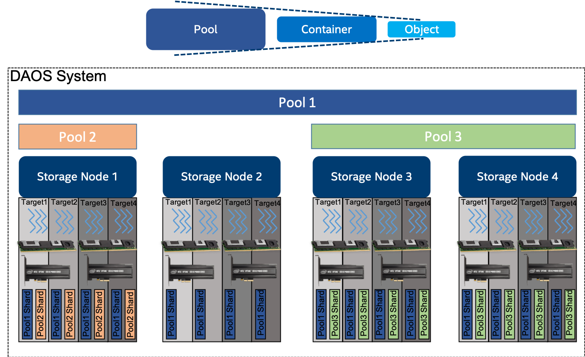
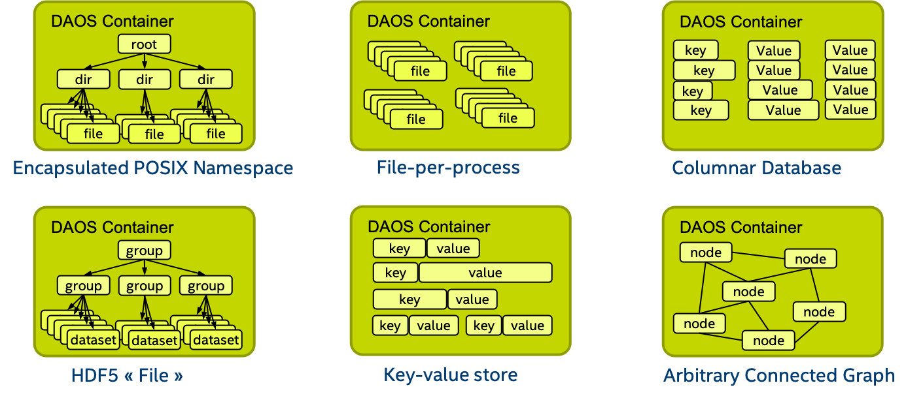

# Storage Model

The <a href="#f4.1">figure </a> below represents the fundamental abstractions 
of the DAOS storage model.

<a id="f4.1"></a>


A DAOS pool is a storage reservation distributed across a collection of targets. 
The actual space allocated to the pool on each target is called a pool shard. 
The total space allocated to a pool is decided at creation time and can be 
expanded over time by resizing all the pool shards (within the limit of the 
storage capacity dedicated to each target) or by spanning more targets 
(i.e., adding more pool shards). A pool offers storage virtualization and is 
the unit of provisioning and isolation. DAOS pools cannot span across multiple 
systems.

A pool can host multiple transactional object store called DAOS containers. 
Each container is a private object address space, which can be modified 
transactionally and independently of the other containers stored in the 
same pool. A container is the unit of snapshot and data management. 
DAOS objects belonging to a container can be distributed across any target 
of the pool for both performance and resilience and can be accessed through 
different APIs to represent structured, semi-structured and unstructured 
data efficiently

The table below shows the targeted level of scalability for each DAOS concept.

|DAOS Concept|Order of Magnitude|
|---|---|
|System|10<sup>5</sup> Servers (hundreds of thousands) and 10<sup>2</sup> Pools (hundreds)|
|Server|10<sup>1</sup> Targets (tens)|
|Pool|10<sup>2</sup> Containers (hundreds)|
|Container|10<sup>9</sup> Objects (billions)|

## DAOS Pool

A pool is identified by a unique UUID and maintains target memberships in a 
persistent versioned list called the pool map. The membership is definitive 
and consistent, and membership changes are sequentially numbered. 
The pool map not only records the list of active targets, it also contains 
the storage topology under the form of a tree that is used to identify targets 
sharing common hardware components. For instance, the first level of the tree 
can represent targets sharing the same motherboard, and then the second level 
can represent all motherboards sharing the same rack and finally the third 
level can represent all racks in the same cage. This framework effectively 
represents hierarchical fault domains, which are then used to avoid placing 
redundant data on targets subject to correlated failures. At any point in 
time, new targets can be added to the pool map, and failed ones can be 
excluded. Moreover, the pool map is fully versioned, which effectively 
assigns a unique sequence to each modification of the map, more particularly 
for failed node removal.

A pool shard is a reservation of persistent memory optionally combined with 
a pre-allocated space on NVMe storage on a specific target. It has a fixed 
capacity and fails operations when full. Current space usage can be queried 
at any time and reports the total amount of bytes used by any data type 
stored in the pool shard.

Upon target failure and exclusion from the pool map, data redundancy inside 
the pool is automatically restored online. This self-healing process is 
known as rebuild. Rebuild progress is recorded regularly in special logs 
in the pool stored in persistent memory to address cascading failures. 
When new targets are added, data is automatically migrated to the newly 
added targets to redistribute space usage equally among all the members. 
This process is known as space rebalancing and uses dedicated persistent 
logs as well to support interruption and restart. A pool is a set of targets 
spread across different storage nodes over which data and metadata are 
distributed to achieve horizontal scalability, and replicated or 
erasure-coded to ensure durability and availability.

When creating a pool, a set of system properties must be defined to 
configure the different features supported by the pool. Also, user can 
define their attributes that will be stored persistently.

A pool is only accessible to authenticated and authorized applications. 
Multiple security frameworks could be supported, from NFSv4 access control 
lists to third party-based authentication (such as Kerberos). Security is 
enforced when connecting to the pool. Upon successful connection to the pool, 
a connection context is returned to the application process.

As detailed previously, a pool stores many different sorts of persistent 
metadata, such as the pool map, authentication, and authorization 
information, user attributes, properties and rebuild logs. Such metadata 
are critical and require the highest level of resiliency. Therefore, 
the pool metadata are replicated on a few nodes from distinct high-level 
fault domains. For very large configurations with hundreds of thousands of 
storage nodes, only a very small fraction of those nodes (in the order of tens) 
run the pool metadata service. With a limited number of storage nodes, DAOS can 
afford to rely on a consensus algorithm to reach agreement and to guarantee 
consistency in the presence of faults and to avoid split-brain syndrome.

To access a pool, a user process should connect to this pool and pass the 
security checks. Once granted, a pool connection can be shared 
(via local2global() and global2local() operations) with any or all of its 
peer application processes (similar to the openg() POSIX extension). 
This collective connect mechanism allows avoiding metadata request storm 
when a massively distributed job is run on the datacenter. 
A pool connection is then revoked when the original process that issued 
the connection request disconnects from the pool.


<a id="4.1.3"></a>

## DAOS Container

A container represents an object address space inside a pool and is 
identified by a UUID. The diagram below represents how the user 
(i.e., I/O middleware, domain-specific data format, big data or AI 
frameworks ...) could use the container concept to store related datasets.



Like pools, containers can store user attributes, and a set of properties 
must be passed at container creation time to configure different features 
like checksums.

To access a container, an application must first connect to the pool and 
then open the container. If the application is authorized to access the 
container, a container handle is returned. This includes capabilities that 
authorize any process in the application to access the container and its 
contents. The opening process may share this handle with any or all of 
its peers. Their capabilities are revoked either on container close.

Objects in a container may have different schemas for data distribution 
and redundancy over targets. Dynamic or static striping, replication, 
or erasure code are some parameters required to define the object schema. 
The object class defines common schema attributes for a set of objects. 
Each object class is assigned a unique identifier and is associated with 
a given schema at the pool level. A new object class can be defined at any 
time with a configurable schema, which is then immutable after creation, 
or at least until all objects belonging to the class have been destroyed. 
For convenience, several object classes expected to be the most commonly 
used will be predefined by default when the pool is created, as shown the 
table below <a href="#t4.2">table</a> below.

<a id="t4.2"></a>
**Sample of Pre-defined Object Classes**

| Object Class (RW = read/write, RM = read-mostly|Redundancy|Layout (SC = stripe count, RC = replica count, PC = parity count, TGT = target|
|---|---|---|
|Small size & RW	|Replication	|static SCxRC, e.g. 1x4|
|Small size & RM	|Erasure code	|static SC+PC, e.g. 4+2|
|Large size & RW	|Replication	|static SCxRC over max #targets)|
|Large size & RM	|Erasure code	|static SCx(SC+PC) w/ max #TGT)|
|Unknown size & RW	|Replication	|SCxRC, e.g. 1x4 initially and grows|
|Unknown size & RM	|Erasure code	|SC+PC, e.g. 4+2 initially and grows|

As shown below, each object is identified in the container by a unique 
128-bit object address. The high 32 bits of the object address is reserved 
for DAOS to encode internal metadata such as the object class. 
The remaining 96 bits are managed by the user and should be unique inside 
the container. Those bits can be used by upper layers of the stack to encode 
their metadata as long as unicity is guaranteed. A per-container 64-bit 
scalable object ID allocator is provided in the DAOS API. The object ID to 
be stored by the application is the full 128-bit address which is for single 
use only and can be associated with only a single object schema.

**DAOS Object ID Structure**
<pre>
```
<---------------------------------- 128 bits ---------------------------------->
--------------------------------------------------------------------------------
|DAOS Internal Bits|                Unique User Bits                           |
--------------------------------------------------------------------------------
<---- 32 bits ----><------------------------- 96 bits ------------------------->
```
</pre>

A container is the basic unit of transaction and versioning. All object 
operations are implicitly tagged by the DAOS library with a timestamp called 

an epoch. The DAOS transaction API allows combining multiple object updates 
into a single atomic transaction with multi-version concurrency control 
based on epoch ordering. All the versioned updates may periodically be 
aggregated to reclaim space utilized by overlapping writes and to reduce 
metadata complexity. A snapshot is a permanent reference that can be placed 
on a specific epoch to prevent aggregation.

Container metadata (i.e., list of snapshots, container open handles, 
object class, user attributes, properties, and others) are stored in persistent 
memory and maintained by a dedicated container metadata service that either 
uses the same replicated engine as the parent metadata pool service or has 
its own engine. This is configurable when creating a container.

Like a pool, access to a container is controlled by the container handle. 
To acquire a valid handle, an application process must open the container 
and pass the security checks. This container handle may then be shared with 
other peer application processes via the container local2global() and 
global2local() operations.

<a id="4.1.4"></a>

## DAOS Object

To avoid scaling problems and overhead common to a traditional storage system, 
DAOS objects are intentionally simple. No default object metadata beyond the 
type and schema are provided. This means that the system does not maintain 
time, size, owner, permissions or even track openers. 
To achieve high availability and horizontal scalability, many object schemas 
(replication/erasure code, static/dynamic striping, and others) are provided. 
The schema framework is flexible and easily expandable to allow for new custom 
schema types in the future. The layout is generated algorithmically on object 
open from the object identifier and the pool map. End-to-end integrity is 
assured by protecting object data with checksums during network transfer 
and storage.

A DAOS object can be accessed through different APIs:

-    **Multi-level key-array** API is the native object interface with locality 
     feature. The key is split into a distribution (i.e., dkey) and an 
     attribute (i.e., akey) key. Both the dkey and akey can be of variable 
     length and type (i.e. a string, an integer or even a complex data 
     structure). All entries under the same dkey are guaranteed to be 
     collocated on the same target. The value associated with akey can be 
     either a single variable-length value that cannot be partially overwritten 
     or an array of fixed-length values. 
     Both the akeys and dkeys support enumeration.

-    **Key-value** API provides a simple key and variable-length value 
     interface. It supports the traditional put, get, remove and list operations.

-    **Array API** implements a one-dimensional array of fixed-size elements 
     addressed by a 64-bit offset. A DAOS array supports arbitrary extent read, 
     write and punch operations.

