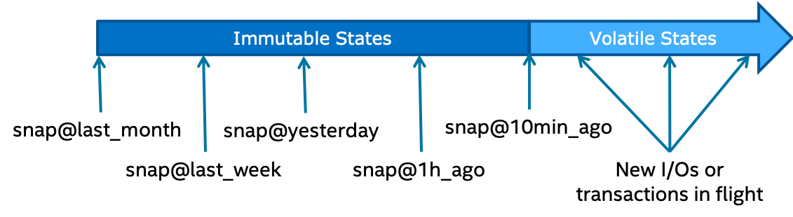
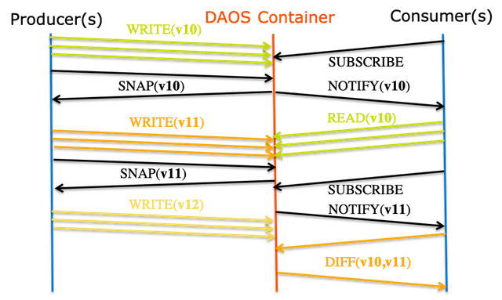

# Transaction Model

The DAOS API supports distributed transactions that allow any update 
operations against objects belonging to the same container to be combined 
into a single ACID transaction. Distributed consistency is provided via a 
lockless optimistic concurrency control mechanism based on multi-version 
timestamp ordering. DAOS transactions are serializable and can be used on 
an ad-hoc basis for parts of the datasets that need it.
	
The DAOS versioning mechanism allows creating persistent container 
snapshots which provide point-in-time distributed consistent views of a 
container which can be used to build producer-consumer pipeline.

## Epoch and Timestamp Ordering

Each DAOS I/O operation is tagged with a timestamp called epoch. An epoch 
is a 64-bit integer that integrates both logical and physical clocks 
(see [HLC paper](https://cse.buffalo.edu/tech-reports/2014-04.pdf)). 
The DAOS API provides helper functions to convert an epoch to traditional 
POSIX time (i.e., struct timespec, see clock_gettime(3)).

## Container Snapshot

As shown in the <a href="#f4.4">figure</a> below, the content of a container 
can be snapshot at any time.

DAOS snapshots are very lightweight and are tagged with the epoch associated 
with the time when the snapshot was created. Once successfully created, 
a snapshot remains readable until it is explicitly destroyed. The content of 
a container can be rolled back to a particular snapshot.

The container snapshot feature allows supporting native producer/consumer 
pipeline as represented in the diagram below.

The producer will generate a snapshot once a consistent version of the 
dataset has been successfully written. The consumer applications may 
subscribe to container snapshot events so that new updates can be processed 
as the producer commits them. The immutability of the snapshots guarantees 
that the consumer sees consistent data, even while the producer continues 
with new updates. Both the producer and consumer indeed operate on different 
versions of the container and do not need any serialization. Once the 
producer generates a new version of the dataset, the consumer may query the 
differences between the two snapshots and process only the incremental changes.

## Distributed Transactions

Unlike POSIX, the DAOS API does not impose any worst-case concurrency 
control mechanism to address conflicting I/O operations. Instead, 
individual I/O operations are tagged with a different epoch and applied 
in epoch order, regardless of execution order. This baseline model 
delivers the maximum scalability and performance to data models and 
applications that do not generate conflicting I/O workload. Typical 
examples are collective MPI-IO operations, POSIX file read/write 
or HDF5 dataset read/write.

For parts of the data model that require conflict serialization, 
DAOS provides distributed serializable transaction based on multi-version 
concurrency control. Transactions are typically needed when different user 
process can overwrite the value associated with a dkey/akey pair. 
Examples are a SQL database over DAOS or a consistent POSIX namespace 
accessed concurrently by uncoordinated clients. All I/O operations 
(include reads) submitted in the context of the same operation will use 
the same epoch. The DAOS transaction mechanism automatically detects the 
traditional read/write, write/read and write/write conflicts and aborts 
one of the conflicting transactions that have to be restarted by the user 
(i.e., transaction fails to commit with -DER_RESTART).

In the initial implementation, the transaction API has the following 
limitations that will be addressed in future DAOS versions:

-    no support for the array API
-    transactional object update and key-value put operations are not visible 
     via object fetch/list and key-value get/list operations executed in the 
     context of the same transaction.

