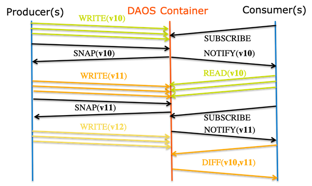

# DAOS Storage Model

In this section, we describe the DAOS storage paradigm including its transaction, security and fault models.
Acronyms are detailed in the <a href="/doc/terminology.md">terminology page</a>.

This document contains the following sections:

- <a href="#4.1">Storage Architecture</a>
    -  <a href="#4.1.1">DAOS Target</a>
    - <a href="#4.1.2">DAOS Pool</a>
    - <a href="#4.1.3">DAOS Container</a>
    - <a href="#4.1.4">DAOS Object</a>
- <a href="#4.2">Transaction Model</a>
    -  <a href="#4.2.1">Epoch & Timestamp Ordering</a>
    - <a href="#4.2.2">Container Snapshot</a>
    - <a href="#4.2.3">Distributed Transactions</a>
- <a href="#4.3">Fault Model</a>
    -  <a href="#4.3.1">Hierarchical Fault Domains</a>
    - <a href="#4.3.2">Fault Detection and Diagnosis</a>
    - <a href="#4.3.3">Fault Isolation</a>
    - <a href="#4.3.4">Fault Recovery</a>
- <a href="#4.4">Security Model</a>
    -  <a href="#4.4.1">Authentication</a>
    - <a href="#4.4.2">Authorization</a>

## Storage Architecture
We consider a data center with hundreds of thousands of compute nodes interconnected via a scalable high-performance fabric (i.e. Ethernet, RoCE or Infiniband), where all or a subset of the nodes, called storage nodes, have direct access to byte-addressable storage-class memory (SCM) and, optionally, block-based NVMe storage. The DAOS server is a multi-tenant daemon runing on a Linux instance (i.e. natively on the physical node or in a VM or container) of each storage node and exporting through the network the locally-attached storage. Inside a DAOS server, the storage is statically partitioned across multiple targets to optimize concurrency. To avoid contention, each target has its private storage, own pool of service threads and dedicated network context that can be directly addressed over the fabric independently of the other targets hosted on the same storage node. The number of target exported by a DAOS server instance is configurable and depends on the underlying hardware (i.e. number of SCM modules, CPUs, NVMe SSDs, ...). A target is the unit of fault. All DAOS servers connected to the same fabric are grouped to form a DAOS system, identified by a system name. Membership of the DAOS servers is recorded into the system map that assigns a unique integer rank to each server. Two different systems comprise two disjoint sets of servers and do not coordinate with each other.

The <a href="#f4.1">figure </a> below represents the fundamental abstractions of the DAOS storage model.

A DAOS pool is a storage reservation distributed across a collection of targets. The actual space allocated to the pool on each target is called a pool shard. The total space allocated to a pool is decided at creation time and can be expanded over time by resizing all the pool shards (within the limit of the storage capacity dedicated to each target) or by spanning more targets (i.e. adding more pool shards). A pool offers storage virtiualization and is the unit of provisionning and isolation. DAOS pools cannot span across multiple systems.

A pool can host multiple transactional object store called DAOS containers. Each container is a private object address space, which can be modified transactionaly and independently of the other containers stored in the same pool. A container is the unit of snapshot and data management. DAOS objects belonging to a container can be distributed across any target of the pool for both performance and resilience and can be accessed through different APIs to efficiently represent structured, semi-structured and unstructured data.

The table below shows the targeted level of scalability for each DAOS concept.

|DAOS Concept|Order of Magnitude|
|---|---|
|System|105 Servers (hundreds of thousands) and 102 Pools (hundreds)|
|Server|101 Targets (tens)|
|Pool|102 Containers (hundreds)|
|Container|109 Objects (billions)|

### DAOS Target

A target is typically associated with a single-ported SCM module and NVMe SSD attached to a single storage node. Moreover, a target does not implement any internal data protection mechanism against storage media failure. As a result, a target is a single point of failure. A dynamic state is associated with each target and is set to either up and running, or down and not available. A target is the unit of performance. Hardware components associated with the target, such as the backend storage medium, the server, and the network, have limited capability and capacity. Target performance parameters such as bandwidth and latency are exported to upper layers.

### DAOS Pool

A pool is identified by a unique UUID and maintains target memberships in a persistent versioned list called the pool map. The membership is definitive and consistent, and membership changes are sequentially numbered. The pool map not only records the list of active targets, it also contains the storage topology under the form of a tree that is used to identify targets sharing common hardware components. For instance, the first level of the tree can represent targets sharing the same motherboard, then the second level can represent all motherboards sharing the same rack and finally the third level can represent all racks in the same cage. This framework effectively represents hierarchical fault domains, which are then used to avoid placing redundant data on targets subject to correlated failures. At any point in time, new targets can be added to the pool map and failed ones can be excluded. Moreover, the pool map is fully versioned, which effectively assigns a unique sequence to each modification of the map, more particularly for failed node removal.

A pool shard is a reservation of persistent memory optionally combined with a pre-allocated space on NVMe storage on a specific target. It has a fixed capacity and fails operations when full. Current space usage can be queried at any time and reports the total amount of bytes used by any data type stored in the pool shard.

Upon target failure and exclusion from the pool map, data redundancy inside the pool is automatically restored online. This self-healing process is known as rebuild. Rebuild progress is recorded regularly in special logs in the pool stored in persistent memory to address cascading failures. When new targets are added, data is automatically migrated to the newly added targets to redistribute space usage equally among all the members. This process is known as space rebalancing and uses dedicated persistent logs as well to support interruption and restart.
A pool is a set of targets spread across different storage nodes over which data and metadata are distributed to achieve horizontal scalability, and replicated or erasure-coded to ensure durability and availability.

When creating a pool, a set of system properties must be defined to configure the different features supported by the pool. In addition, user can define their own attributes that will be stored persistently.

A pool is only accessible to authenticated and authorized applications. Multiple security frameworks could be supported, from NFSv4 access control lists to third party-based authentication (such as Kerberos). Security is enforced when connecting to the pool. Upon successful connection to the pool, a connection context is returned to the application process.

As detailed previously, a pool stores many different sorts of persistent metadata, such as the pool map, authentication and authorization information, user attributes, properties and rebuild logs. Such metadata are critical and require the highest level of resiliency. Therefore, the pool metadata are replicated on a few nodes from distinct high-level fault domains. For very large configurations with hundreds of thousands of storage nodes, only a very small fraction of those nodes (in the order of tens) run the pool metadata service. With a limited number of storage nodes, DAOS can afford to rely on a consensus algorithm to reach agreement and to guarantee consistency in the presence of faults and to avoid split-brain syndrome.

To access a pool, a user process should connect to this pool and pass the security checks. Once granted, a pool connection can be shared (via `local2global()` and `global2local()` operations) with any or all of its peer application processes (similar to the openg() POSIX extension). This collective connect mechanism allows to avoid metadata request storm when a massively distributed job run on the datacenter. A pool connection is then revoked when the original process that issued the connection request disconnects from the pool.

### DAOS Container

A container represents an object address space inside a pool and is identified by a UUID. The diagram below represents how the user (i.e. I/O middleware, domain-specific data format, big data or AI frameworks ...) could use the container concept to store related datasets.

Likewise to pools, containers can store user attributes and a set of properties must be passed at container creation time to configure different features like checksums.

To access a container, an application must first connect to the pool and then open the container. If the application is authorized to access the container, a container handle is returned. This includes capabilities that authorize any process in the application to access the container and its contents. The opening process may share this handle with any or all of its peers. Their capabilities are revoked either on container close.

Objects in a container may have different schemas for data distribution and redundancy over targets. Dynamic or static striping, replication or erasure code are some parameters required to define the object schema. The object class defines common schema attributes for a set of objects. Each object class is assigned a unique identifier and is associated with a given schema at the pool level. A new object class can be defined at any time with a configurable schema, which is then immutable after creation, or at least until all objects belonging to the class have been destroyed. For convenience, several object classes expected to be the most commonly used will be predefined by default when the pool is created, as shown the <a href="#t4.2">table</a> below.

**Sample of Pre-defined Object Classes**

| Object Class (RW = read/write, RM = read-mostly|Redundancy|Layout (SC = stripe count, RC = replica count, PC = parity count, TGT = target|
|---|---|---|
|Small size & RW	|Replication	|static SCxRC, e.g. 1x4|
|Small size & RM	|Erasure code	|static SC+PC, e.g. 4+2|
|Large size & RW	|Replication	|static SCxRC over max #targets)|
|Large size & RM	|Erasure code	|static SCx(SC+PC) w/ max #TGT)|
|Unknown size & RW	|Replication	|SCxRC, e.g. 1x4 initially and grows|
|Unknown size & RM	|Erasure code	|SC+PC, e.g. 4+2 initially and grows|

As shown below, each object is identified in the container by a unique 128-bit object address. The high 32 bits of the object address are reserved for DAOS to encode internal metadata such as the object class. The remaing 96 bits are managed by the user and should be unique inside the container. Those bits can be used by upper layers of the stack to encode their own metadata as long as unicity is guaranteed. A per-container 64-bit scalable object ID allocator is provided in the DAOS API. The object ID to be stored by the application is the full 128-bit address which is for single use only and can be associated with only a single object schema.

**DAOS Object ID Structure**
<pre>
<---------------------------------- 128 bits ---------------------------------->
--------------------------------------------------------------------------------
|DAOS Internal Bits|                Unique User Bits                           |
--------------------------------------------------------------------------------
<---- 32 bits ----><------------------------- 96 bits ------------------------->
</pre>

A container is the basic unit of transaction and versioning. All object operations are implicitely tagged by the DAOS library with a timestamp called an epoch. The DAOS transaction API allows to combine multiple object updates into a single atomic transaction with multi-version concurrency control based on epoch ordering.
All the versioned updates may periodically be aggregated to reclaim space utilized by overlapping writes and to reduce metadata complexity. A snapshot is a permanent reference that can be placed on a specific epoch to prevent aggregation.

Container metadata (i.e. list of snapshots, container open handles, object class, user attributes, properties, etc.) are stored in persistent memory and maintained by a dedicated container metadata service that either uses the same replicated engine as the parent metadata pool service, or has its own engine. This is configurable when creating a container.

Likewise to a pool, access to a container is controlled by the container handle. To acquire a valid handle, an application process must open the container and pass the security checks. This container handle may then be shared with other peer application processes via the container `local2global()` and `global2local()` operations.

### DAOS Object

To avoid scaling problems and overhead common to traditional storage system, DAOS objects are intentionally simple. No default object metadata beyond the type and schema are provided. This means that the system does not maintain time, size, owner, permissions or even track openers. To achieve high availability and horizontal scalability, many object schemas (replication/erasure code, static/dynamic striping, etc.) are provided. The schema framework is flexible and easily expandable to allow for new custom schema types in the future. The layout is generated algorithmically on object open from the object identifier and the pool map. End-to-end integrity is assured by protecting object data with checksums during network transfer and storage.

A DAOS object can be accessed through different APIs:
- <b>Multi-level key-array API</b> is the native object interface with locality feature. The key is split into a distribution (i.e. dkey) and an attribute (i.e. akey) keys. Both the dkey and akey can be of variables length and of any types (ie. a string, an integer or even a complex data structure). All entries under the same dkey are guaranteed to be collocated on the same target. The value associated with akey can be either a single variable-length value that cannot be partially overwritten or an array of fixed-length values. Both the akeys and dkeys support enumeration.
- <b>Key-value API</b> provides simple key and variable-length value interface. It supports the traditional put, get, remove and list operations.
- <b>Array API</b> implements one-dimensional array of fixed-size elements addressed by a 64-bit offset. A DAOS array supports arbitrary extent read, write and punch operations.

## Transaction Model

The DAOS API supports distributed transactions that allows any update operations against objects belonging to the same container to be combined into a single ACID transaction. Distributed consistency is provided via a lockless optimistic concurrency control mechanism based on multi-version timestamp ordering. DAOS transactions are serializable and can be used on an ad-hoc basis for parts of the datasets that need it.

The DAOS versioning mechanism allows to create persistent container snapshots which provide point-in-time distributed consistent views of a container which can be used to build producer-consumer pipeline.

### Epoch & Timestamp Ordering

Each DAOS I/O operation is tagged with a timestamp called epoch. An epoch is a 64-bit integer that integrates both a logical and physical clocks (see [HLC paper](https://cse.buffalo.edu/tech-reports/2014-04.pdf)). The DAOS API provides helper functions to convert an epoch to traditional POSIX time (i.e. struct timespec, see clock_gettime(3)).

### Container Snapshot

As shown in the <a href="#f4.4">figure</a> below below, the content of a container can be snapshot at any time.

DAOS snasphots are very lightweight and are tagged with the epoch associated with the time when the snapshot was created. Once successfully created, a snapshot remains readable until it is explicitely destroyed. The content of a container can be rolled back to a particular snapshot.

The container snapshot feature allows to support native producer/consumer pipeline as represented in the diagram below.

The producer will generate a snapshot once a consistent version of the dataset has been successfully written. The consumer applications may subscribe to container snapshot events so that new updates can be processed as the producer commits them. The immutability of the snapshots guarantees that the consumer sees consistent data, even while the producer continues with new updates. Both the producer and consumer indeed operate on different versions of the container and do not need any serialization. Once the producer generates a new version of the dataset, the consumer may just query the differences between the two snapshots and process only the incremental changes.

### Distributed Transactions

Unlike POSIX, the DAOS API does not impose any worst-case concurrency control mechanism to address conflicting I/O operations. Instead, individual I/O operations are tagged with a different epoch and applied in epoch order, regardless of execution order. This baseline model delivers the maximum scalability and performance to data models and applications that do not generate conflicting I/O workload. Typical examples are collective MPI-IO operations, POSIX file read/write or HDF5 dataset read/write.

For parts of the data model that require conflict serialization, DAOS provides distributed serializable transaction based on multi-version concurrency control. Transactions are typically needed when different user process can overwrite the value associated with a dkey/akey pair. Examples are a SQL database over DAOS or a consistent POSIX namespace accessed concurrently by uncoordinated clients. All I/O operations (include reads) submitted in the context of the same operation will use the same epoch. The DAOS transaction mechanism automatically detects the traditional read/write, write/read and write/write conflicts and aborts one of the conflicting transactions that has to be restarted by the user (i.e. transaction fails to commit with -DER_RESTART).

In the initial implementation, the transaction API has the following limitations that will be addressed in future DAOS versions:
- no support for the array API
- transactional object update and key-value put operations are not visible via object fetch/list and key-value get/list operations executed in the context of the same transaction.

## Fault Model

DAOS relies on massively distributed single-ported storage. Each target is thus effectively a single point of failure. DAOS achieves availability and durability of both data and metadata by providing redundancy across targets in different fault domains. DAOS internal pool and container metadata are replicated via a robust consensus algorithm. DAOS objects are then safely replicated or erasure-coded by transparently leveraging the DAOS distributed transaction mechanisms internally. The purpose of this section is to provide details on how DAOS achieves fault tolerance and guarantees object resilience.

### Hierarchical Fault Domains

A fault domain is a set of servers sharing the same point of failure and which are thus likely to fail altogether. DAOS assumes that fault domains are hierarchical and do no overlap. The actual hierarchy and fault domain membership must be supplied by an external database used by DAOS to generate the pool map.

Pool metadata are replicated on several nodes from different high-level fault domains for high availability, whereas object data is replicated or erasure-coded over a variable number of fault domains depending on the selected object class.

### Fault Detection

DAOS servers are monitored within a DAOS system through a gossip-based protocol called [SWIM](http://ieeexplore.ieee.org/stamp/stamp.jsp?arnumber=1028914) that provides accurate, efficient and scalable server fault detection.
Storage attached to each DAOS target is monitored through periodic local health assessment. Whenever a local storage I/O error is returned to the DAOS server, an internal health check procedure will be called automatically. This procedure will make an overall health assessment by analyzing the IO error code and device SMART/Health data. If the result is negative, the target will be marked as faulty, and further I/Os to this target will be rejected and re-routed.

### Fault Isolation

Once detected, the faulty target or servers (effectivelly a set of targets) must be excluded from the pool map. This process is triggered either manually by the administrator or automatically. Upon exclusion, the new version of the pool map is eagerly pushed to all storage targets. At this point, the pool enters a degraded mode that might require extra processing on access (e.g. reconstructing data out of erasure code). Consequently, DAOS client and storage nodes retry RPC indefinitely until they find an alternative replacement target from the new pool map. At this point, all outstanding communications with the evicted target are aborted and no further messages should be sent to the target until it is explicitly reintegrated (possibly only after maintenance action).

All storage targets are promptly notified of pool map changes by the pool service. This is not the case for client nodes, which are lazily informed of pool map invalidation each time they communicate with servers. To do so, clients pack in every RPC their current pool map version. Servers reply not only with the current pool map version. Consequently, when a DAOS client experiences RPC timeout, it regularly communicates with the other DAOS target to guarantee that its pool map is always current. Clients will then eventually be informed of the target exclusion and enter into degraded mode.

This mechanism guarantees global node eviction and that all nodes eventually share the same view of target aliveness.

### Fault Recovery

Upon exclusion from the pool map, each target starts the rebuild process automatically to restore data redundancy. First, each target creates a list of local objects impacted by the target exclusion. This is done by scanning a local object table maintained by the underlying storage layer. Then for each impacted object, the location of the new object shard is determined and redundancy of the object restored for the whole history (i.e., snapshots). Once all impacted objects have been rebuilt, the pool map is updated a second time to report the target as failed out. This marks the end of collective rebuild process and the exit from degraded mode for this particular fault. At this point, the pool has fully recovered from the fault and client nodes can now read from the rebuilt object shards.

This rebuild process is executed online while applications continue accessing and updating objects.

## Security Model

DAOS uses a flexible security model that seperates authentication from authorization. It is designed to have very minimal impact on the I/O path.

### Authentication

The DAOS security model is designed to support different authentication methods. By default, a local agent runs on the client node and authenticats the user process through AUTH_SYS. Authentication can be handle by a third party service like munge or Kerberos.

### Authorization

DAOS supports a subset of the NFSv4 ACLs for both pools and containers through the properties API.
