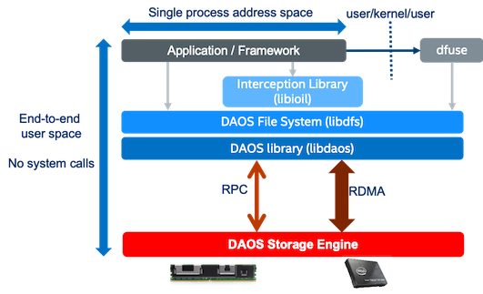

# POSIX Namespace

A regular POSIX namespace can be encapsulated into a DAOS container.  This
capability is provided by the `libdfs` library that implements the file and
directory abstractions over the native `libdaos` library. The POSIX emulation can
be exposed directly to applications or I/O frameworks (e.g., for
frameworks like Spark or TensorFlow, or benchmarks like IOR or mdtest that support
different storage backend plugins). 
It can also be exposed transparently via a FUSE daemon, combined
optionally with an interception library to address some of the FUSE performance
bottlenecks by delivering full OS bypass for POSIX read/write operations.



## libdfs

The DAOS File System (DFS) is implemented in the `libdfs` library, 
and allows a DAOS container to be accessed as a hierarchical POSIX namespace.
`libdfs` supports files, directories, and symbolic links, but not hard links. 
Access permissions are inherited from
the parent pool and are not implemented on a per-file or per-directory basis.
`setuid()` and `setgid()` programs, as well as supplementary groups, 
are currently not supported.

It is possible to use `libdfs` in a parallel application from multiple nodes.
When the same POSIX container is mounted concurrently by multiple
processes, a few limitations exist in DAOS v1.0. In particular:

* Unlinking a file in one process while another process has the same file
  open: This may or may not cause an I/O error on the open file.
* The atomicity of rename operations is not guaranteed.

These corner cases will be addressed in a future DAOS release. 

## DFuse

DFuse provides DAOS File System access through the standard libc/kernel/VFS
POSIX infrastructure.  This allows existing applications to use DAOS without
modification, and provides a path to upgrade those applications to native DAOS
support.  Additionally, DFuse provides an Interception Library `libioil` to transparently
allow POSIX clients to talk directly to DAOS servers, providing OS-Bypass for
I/O without modifying or recompiling of the application.

DFuse builds heavily on DFS. Data written via DFuse can be accessed by DFS and
vice versa.

### DFuse Daemon

The `dfuse` daemon runs a single instance per node to provide a user POSIX access
to DAOS. It should be run with the credentials of the user, and typically will
be started and stopped on each compute node as part of the prolog and epilog
scripts of any resource manager or scheduler in use.  One DFuse daemon per node
can process requests for multiple clients.

A single DFuse instance can provide access to multiple pools and containers
concurrently, or can be limited to a single pool, or a single container.

### Restrictions

DFuse is limited to a single user. Access to the filesystem from other users,
including root, will not be honored. As a consequence of this, the `chown`
and `chgrp` calls are not supported.  Hard links and special device files, except
symbolic links, are not supported, nor are any ACLs.

DFuse can run in the foreground, keeping the terminal window open, or it can
daemonize to run like a system daemon. 
However, to do this and still be
able to access DAOS it needs to daemonize before calling `daos_init()`. 
This in turns means it cannot report some kinds of startup errors either on
stdout/stderr or via its return code.  
When initially starting with DFuse it is recommended to run in foreground mode 
(`--foreground`) to better observe any failures.

Inodes are managed on the local node by DFuse. So while inode numbers
will be consistent on a node for the duration of the session, they are not
guaranteed to be consistent across restarts of DFuse or across nodes.

It is not possible to see pool/container listings through DFuse. 
So if `readdir`, `ls` or others are used, DFuse will return `ENOTSUP`.

### Launching

DFuse should be run with the credentials (user/group) of the user who will
be accessing it, and who owns any pools that will be used.

There are two mandatory command-line options, these are:

| **Command-line Option**  | **Description**     |
| ------------------------ | ------------------- |
| --svc=<ranks\>           | service replicas    |
| --mountpoint=<path\>     | path to mount dfuse |

The mount point specified should be an empty directory on the local node that
is owned by the user.

Additionally, there are several optional command-line options:

| **Command-line Option** | **Description**         |
| ----------------------- | ----------------------- |
| --pool=<uuid\>          | pool uuid to connect to |
| --container=<uuid\>     | container uuid to open  |
| --sys-name=<name\>      | DAOS system name        |
| --foreground            | run in foreground       |
| --singlethreaded        | run single threaded     |

When DFuse starts, it will register a single mount with the kernel, at the
location specified by the `--mountpoint` option. This mount will be
visible in `/proc/mounts`, and possibly in the output of `df`.  
The contents of multiple pools/containers will be accessible via this 
single kernel mountpoint.

### Pool/Container Paths

DFuse will only create one kernel level mount point regardless of how it is
launched. How POSIX containers are represented within that mount point varies 
depending on the DFuse command-line options:

If both a pool uuid and a container uuid are specified on the command line, then 
the mount point will map to the root of the container itself. Files can be
accessed by simply concatenating the mount point and the name of the file,
relative to the root of the container.

If neither a pool or container is specified, then pools and container can be
accessed by the path `<mount point>/<pool uuid>/<container uuid>`. However it
should be noted that `readdir()` and therefore `ls` do not work on either mount
points or directories representing pools here. So the pool and container uuids
will have to be provided from an external source.

If a pool uuid is specified but not a container uuid, then the containers can be
accessed by the path `<mount point>/<container uuid>`. The container uuid
will have to be provided from an external source.

It is anticipated that in most cases, both pool uuid and container uuid will be
used, so the mount point itself will map directly onto a POSIX container.

### Links into other Containers

It is possible to link to other containers in DFuse, where subdirectories
within a container resolve not to regular directories, but rather to
the root of entirely different POSIX containers.

To create a new container and link it into the namespace of an existing one,
use the following command.

```bash
$ daos container create --svc <svc> --type POSIX --pool <pool uuid> --path <path to entry point>
```

The pool uuid should already exist, and the path should specify a location
somewhere within a DFuse mount point that resolves to a POSIX container.
Once a link is created, it can be accessed through the new path. Following
the link is virtually transparent.  No container uuid is required. If one is
not supplied, it will be created.

To destroy a container again, the following command should be used.

```bash
$ daos container destroy --svc --path <path to entry point>
```

This will both remove the link between the containers and remove the container
that was linked to.

There is no support for adding links to already existing containers or removing
links to containers without also removing the container itself.

Information about a container, for example, the presence of an entry point between
containers, or the pool and container uuids of the container linked to can be
read with the following command.
```bash
$ daos container info --svc --path <path to entry point>
```

### Enabling Caching

DFuse in normal mode simply provides a communication path between the kernel and
DAOS. However, this can come with a performance impact. To help alleviate this
it is possible to turn on caching, both within dfuse itself and by allowing the
kernel to cache certain data.  Where and when data is cached, there is no attempt
made to invalidate the caches based on changes to DAOS, other than simple timeouts.

Enabling this option will turn on the following features:

* Kernel caching of dentries
* Kernel caching of negative dentries
* Kernel caching of inodes (file sizes, permissions etc)
* Kernel caching of file contents
* Readahead in dfuse and inserting data into kernel cache
* MMAP write optimization

To turn on caching use the `--enable-caching` command-line option for dfuse. This
will enable the feature for all accessed containers.  When this option is used,
the containers accessed should only be accessed from one node, so it may
be necessary to create a container per node in this model.

### Stopping DFuse

When done, the file system can be unmounted via fusermount:

```bash
$ fusermount3 -u /tmp/daos
```

When this is done, the local DFuse daemon should shut down the mount point,
disconnect from the DAOS servers, and exit.  You can also verify that the
mount point is no longer listed in `/proc/mounts`.

### Interception Library

An interception library called `libioil` is available to work with DFuse. This
library works in conjunction with DFuse and allows the interception of POSIX I/O
calls and issue the I/O operations directly from the application context through
`libdaos` without any application changes.  This provides kernel-bypass for I/O data,
leading to improved performance.
To use this, set the `LD_PRELOAD` to point to the shared library in the DAOS install
directory:

```
LD_PRELOAD=/path/to/daos/install/lib/libioil.so
LD_PRELOAD=/usr/lib64/libioil.so # when installed from RPMs
```

Support for `libioil` is currently planned for DAOS v1.2.
