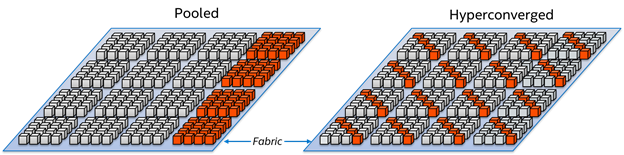
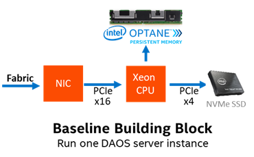
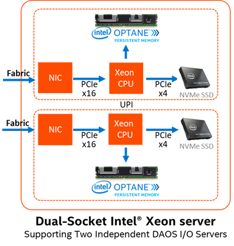

# Hardware Requirements

The purpose of this section is to describe processor, storage, and
network requirements to deploy a DAOS system.

## Deployment Options

As illustrated in the figure below, a DAOS storage system is deployed
as a **Pooled Storage Model**. The DAOS servers can run on dedicated
storage nodes in separate racks. This is a traditional pool model
where storage is uniformly accessed by all compute nodes. In order
to minimize the number of I/O racks and to optimize floor space,
this approach usually requires high-density storage servers.

While DAOS is currently deployed following the pooled model, active research is
conducted to efficiently support a hyper-converged model as well.

## Processor Requirements

DAOS requires a 64-bit processor architecture and is primarily developed
on Intel x86\_64 architecture. The DAOS software and the libraries it depends
on (e.g., ISA-L, SPDK, PMDK, and DPDK) can take advantage of Intel SSE
and AVX extensions.

Some success was also reported by the community on running the DAOS client
on 64-bit ARM processors configured in Little Endian mode. That being said,
ARM testing is not part of the current DAOS CI pipeline and is thus not
validated on a regular basis.

## Network Requirements

The DAOS network layer relies on libfabrics and supports OFI providers
for Ethernet/sockets, InfiniBand/verbs and RoCE.
An RDMA-capable fabric is preferred for better performance. DAOS can support
multiple network interfaces by binding different engines and different client
processes to individual network cards.

The DAOS control plane provides methods for administering and managing
the DAOS servers using a secure socket layer interface. An additional
out-of-band network connecting the nodes in the DAOS service cluster is required
for DAOS administration. Management traffic between clients and servers uses IP
over Fabric.

## Storage Requirements

DAOS requires each storage node to have direct access to storage-class
memory (SCM). While DAOS is primarily tested and tuned for Optane
Persistent Memory, the DAOS software stack is built over the Persistent
Memory Development Kit (PMDK) and the DAX feature of the Linux operating
systems as described in the SNIA NVM Programming Model[^1]. As a result,
the open-source DAOS software stack should be able to run transparently
over any storage-class memory supported by the PMDK.

The storage node can optionally be equipped with NVMe (non-volatile
memory express) SSDs to provide capacity. HDDs, as well as SATA and SAS
SSDs, are not supported by DAOS. Both NVMe 3D-NAND and Optane SSDs are
supported. Optane SSDs are preferred for DAOS installation that targets
a very high IOPS rate. NVMe-oF devices are also supported by the
userspace storage stack but have never been tested.

A minimum 6% ratio of SCM to SSD capacity will guarantee that DAOS has
enough space in SCM to store its internal metadata
(e.g., pool metadata, SSD block allocation tracking).

For testing purposes, SCM can be emulated with DRAM by mounting a tmpfs
filesystem, and NVMe SSDs can be also emulated with DRAM or a loopback
file.

## Storage Server Design

The hardware design of a DAOS storage server balances the network
bandwidth of the fabric with the aggregate storage bandwidth of the NVMe
storage devices.  This relationship sets the number of NVMe drives.
For example, 8 PCIe gen4 x4 NVMe SSDs balance two 200Gbps PCIe gen4 x16
network adapters.
The capacity of the SSDs will determine the minimum capacity of the
Optane PMem DIMMs needed to provide the 6% ratio for DAOS metadata.

## CPU Affinity

Recent Intel Xeon data center platforms use two processor CPUs connected
together with the Ultra Path Interconnect (UPI). PCIe lanes in these
servers have a natural affinity to one CPU.
Although globally accessible from any of the system cores, NVMe SSDs and
network interface cards connected through the PCIe bus may provide
different performance characteristics (e.g., higher latency, lower
bandwidth) to each CPU. Accessing non-local PCIe devices may involve
traffic over the UPI link that might become a point of congestion.
Similarly, persistent memory is non-uniformly
accessible (NUMA), and CPU affinity must be respected for maximal
performance.

Therefore, when running in a multi-socket and multi-rail environment,
the DAOS service must be able to detect the CPU to PCIe device and
persistent memory affinity and minimize as much as possible non-local
access. This can be achieved by spawning one instance of the I/O Engine
per CPU, then accessing only the persistent memory and PCI devices
local to that CPU from that engine instance. The DAOS control plane is
responsible for detecting the storage and network affinity and
starting the I/O Engines accordingly.

## Fault Domains

DAOS relies on single-ported storage massively distributed across
different storage nodes. Each storage node is thus a single point of
failure. DAOS achieves fault tolerance by providing data redundancy
across storage nodes in different fault domains.

DAOS assumes that fault domains are hierarchical and do not overlap. For
instance, the first level of a fault domain could be the racks and the
second one, the storage nodes.

For efficient placement and optimal data resilience, more fault
domains are better. As a result, it is preferable to distribute storage
nodes across as many racks as possible.

[^1]: <https://www.snia.org/sites/default/files/
technical_work/final/NVMProgrammingModel_v1.2.pdf>
