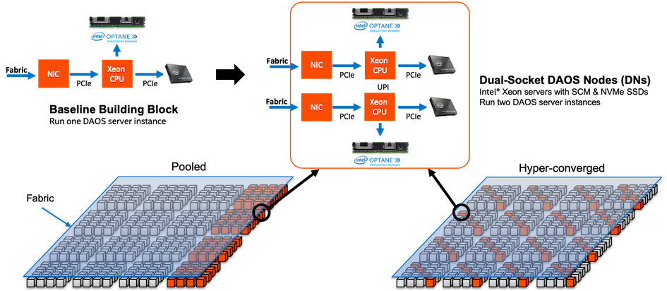

# Architecture

DAOS is an open-source software-defined scale-out object store that provides
high bandwidth and high IOPS storage containers to applications and enables
next-generation data-centric workflows combining simulation, data analytics,
and machine learning.

Unlike the traditional storage stacks that were primarily designed for
rotating media, DAOS is architected from the ground up to exploit new
NVM technologies and is extremely lightweight since it operates
End-to-End (E2E) in user space with full OS bypass. DAOS offers a shift
away from an I/O model designed for block-based and high-latency storage
to one that inherently supports fine-grained data access and unlocks the
performance of the next-generation storage technologies.

DAOS is a high-performant independent, fault-tolerant storage tier that
does not rely on a third-party tier to manage metadata and data resilience.

## DAOS Features

DAOS relies on [Open Fabric Interface](https://openfabrics.org/downloads/ofiwg/Industry_presentations/2015_HotI23/paper.pdf)
(OFI) for low-latency communications and stores data on
both storage-class memory (SCM) and NVMe storage. DAOS presents a native
key-array-value storage interface that offers a unified storage model
over which domain-specific data models are ported, such as
[HDF5](../../user/hdf5/), [MPI-IO](../../user/mpi-io/),
and Apache [Hadoop](../../user/spark/). A [POSIX](../../user/filesystem/)
I/O emulation layer implementing files and
directories over the native DAOS API is also available.

DAOS I/O operations are logged and then inserted into a persistent index
maintained in SCM. Each I/O is tagged with a particular timestamp called
epoch and is associated with a particular version of the dataset. No
read-modify-write operations are performed internally. Write operations
are non-destructive and not sensitive to alignment. Upon read request,
the DAOS service walks through the persistent index and creates a
complex scatter-gather Remote Direct Memory Access (RDMA) descriptor to
reconstruct the data at the requested version directly in the buffer
provided by the application.

The SCM storage is memory-mapped directly into the address space of the
DAOS service that manages the persistent index via direct load/store.
Depending on the I/O characteristics, the DAOS service can decide to
store the I/O in either SCM or NVMe storage. As represented in Figure
2-1, latency-sensitive I/Os, like application metadata and byte-granular
data, will typically be stored in the former, whereas checkpoints and
bulk data will be stored in the latter. This approach allows DAOS to
deliver the raw NVMe bandwidth for bulk data by streaming the data to
NVMe storage and maintaining internal metadata index in SCM. The
Persistent Memory Development Kit (PMDK) allows managing
transactional access to SCM and the Storage Performance Development Kit
(SPDK) enables user-space I/O to NVMe devices.

Figure 2-1. DAOS Storage

DAOS aims at delivering:

-   High throughput and IOPS at arbitrary alignment and size

-   Fine-grained I/O operations with true zero-copy I/O to SCM

-   Support for massively distributed NVM storage via scalable
    collective communications across the storage servers

-   Non-blocking data and metadata operations to allow I/O and
    computation to overlap

-   Advanced data placement taking into account fault domains

-   Software-managed redundancy supporting both replication and erasure
    code with an online rebuild

-   End-to-end data integrity

-   Scalable distributed transactions with guaranteed data consistency
    and automated recovery

-   Dataset snapshot

-   Security framework to manage access control to storage pools

-   Software-defined storage management to provision, configure, modify
    and monitor storage pools over COTS hardware

-   Native support for Hierarchical Data Format (HDF)5, MPI-IO and POSIX
    namespace over the DAOS data model

-   Tools for disaster recovery

-   Seamless integration with the Lustre parallel filesystem

-   Mover agent to migrate datasets among DAOS pools and from parallel
    filesystems to DAOS and vice versa

## DAOS System

A data center may have hundreds of thousands of compute instances
interconnected via a scalable high-performance network, where all, or a
subset of the instances called storage nodes, have direct access to NVM
storage. A DAOS installation involves several components that can be
either collocated or distributed.

A DAOS *system* is identified by a system name, and consists of a set of
DAOS *storage nodes* connected to the same network. The DAOS storage nodes
run one DAOS *server* instance per node, which in turn starts one
DAOS *Engine* process per physical socket. Membership of the DAOS
servers is recorded into the system map, that assigns a unique integer
*rank* to each *Engine* process. Two different DAOS systems comprise
two disjoint sets of DAOS servers, and do not coordinate with each other.

The DAOS *server* is a multi-tenant daemon running on a Linux instance
(either natively on the physical node or in a VM or container) of each
*storage node*. Its *Engine* sub-processes export the locally-attached
SCM and NVM storage through the network. It listens to a management port
(addressed by an IP address and a TCP port number), plus one or more fabric
endpoints (addressed by network URIs).
The DAOS server is configured through a YAML file in /etc/daos,
including the configuration of its Engine sub-processes.
The DAOS server startup can be integrated with different daemon management or
orchestration frameworks (for example a systemd script, a Kubernetes service,
or even via a parallel launcher like pdsh or srun).

Inside a DAOS Engine, the storage is statically partitioned across
multiple *targets* to optimize concurrency. To avoid contention, each
target has its private storage, its own pool of service threads, and its
dedicated network context that can be directly addressed over the fabric
independently of the other targets hosted on the same storage node.

* The SCM modules are configured in *AppDirect interleaved* mode.
  They are thus presented to the operating system as a single PMem
  namespace per socket (in `fsdax` mode).

!!! note
    When mounting the PMem devices with the `dax` option,
    the following warning will be logged in dmesg:
    `EXT4-fs (pmem0): DAX enabled. Warning: EXPERIMENTAL, use at your own risk`
    This warning can be safely ignored: It is issued because
    DAX does not yet support the `reflink` filesystem feature,
    but DAOS does not use this feature.

* When *N* targets per engine are configured,
  each target is using *1/N* of the capacity of the `fsdax` SCM capacity
  of that socket, independently of the other targets.

* Each target is also using a fraction of the NVMe capacity of the NVMe
  drives that are attached to this socket. For example, in an engine
  with 4 NVMe disks and 16 targets, each target will manage 1/4 of
  a single NVMe disk.

A target does not implement any internal data protection mechanism
against storage media failure. As a result, a target is a single point
of failure and the unit of fault.
A dynamic state is associated with each target: Its state can be either
"up and running", or "down and not available".

A target is the unit of performance. Hardware components associated with
the target, such as the backend storage medium, the CPU core(s), and the
network, have limited capability and capacity.

The number of targets exported by a DAOS Engine instance is
configurable, and depends on the underlying hardware (in particular,
the number of SCM modules and the number of NVMe SSDs that are served
by this engine instance). As a best practice, the number of targets
of an engine should be an integer multiple of the number of NVMe drives
that are served by this engine.

## SDK and Tools

Applications, users, and administrators can interact with a DAOS system
through two different client APIs. The management API offers the ability
to administer a DAOS system and is intended for integration with
vendor-specific storage management and open-source
orchestration frameworks. The `dmg` CLI tool is built over the DAOS management
API. On the other hand, the DAOS library (`libdaos`) implements the
DAOS storage model. It is primarily targeted at application and I/O
middleware developers who want to store datasets in a DAOS system. User
utilities like the `daos` command are also built over the API to allow
users to manage datasets from a CLI.

Applications can access datasets stored in DAOS either directly through
the native DAOS API, through an I/O middleware library (e.g. POSIX
emulation, MPI-IO, HDF5) or through frameworks like Spark or TensorFlow
that have already been integrated with the native DAOS storage model.

## Agent

The DAOS agent is a daemon residing on the client nodes that interacts
with the DAOS library to authenticate the application processes. It is a
trusted entity that can sign the DAOS library credentials using
certificates. The agent can support different authentication frameworks,
and uses a Unix Domain Socket to communicate with the DAOS library.
