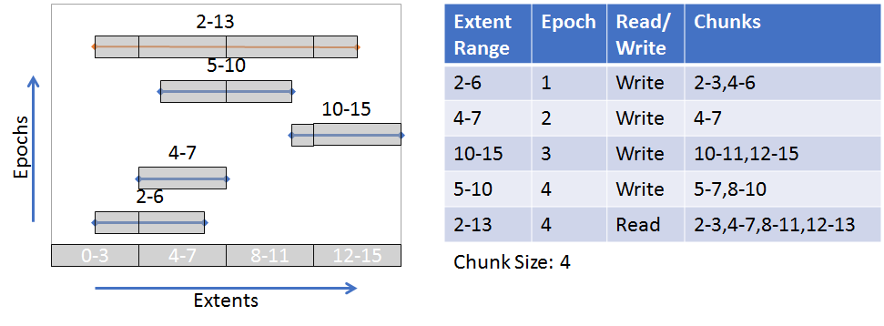

# Data Integrity

DAOS uses checksums internally to discover silent data corruption. While each
component in a system (network layer, storage devices) may offer protection
against silent data corruption, DAOS provides end-to-end data integrity to
better protect user data. If silent data corruption is detected, DAOS will
attempt to recover the corrupted data using data redundancy mechanisms
(Replication or Erasure Code).

## End-to-end Data Integrity

In simple terms, end-to-end means that the DAOS Client library will calculate a
checksum for data sent to the DAOS Server. The DAOS Server will
store the checksum and return it upon data retrieval. Then the client verifies
the data by calculating a new checksum and comparing it to the checksum received
from the server. There are variations in this approach depending on the type of
data being protected, but the following diagram shows the basic checksum flow.


## Configuring

Data integrity is configured for each container.
See [Storage Model](./storage.md) for more information about how data is
organized in DAOS. Also, see the Data Integrity in
the [Container User Guide](../user/container.md#data-integrity) for details on
setting up a container with data integrity.

## Keys and Value Objects

Because DAOS is a key/value store, the data for both keys and values are
protected; however, the approach is slightly different. In addition, for the two different
value types, single and array, the approach is also slightly different.

### Keys

On an update and fetch, the client calculates a checksum for the data used
as the distribution and attribute keys and will send it to the server within the
RPC. The server verifies the keys with the checksum.
While enumerating keys, the server will calculate checksums for the keys and
pack them within the RPC message to the client. Finally, the client will verify the keys
received.

!!! note
    Checksums for keys are not stored on the server. A hash of the key is
    calculated and used to index the key in the server tree of the keys
    (see [VOS Key Array Stores](https://github.com/daos-stack/daos/blob/release/2.2/src/vos/README.md#key-array-stores)).
    It is also expected that keys are stored only in Storage Class Memory which
    has reliable data integrity protection.

### Values

On an update, the client will calculate a checksum for the data of the value and
will send it to the server within the RPC. If "server verify" is enabled, the
server will calculate a new checksum for the value and compare it with the checksum
received from the client to verify the integrity of the value. If the checksums
don't match, then data corruption has occurred, and an error is returned to the
client, indicating that the client should try the update again. Again, when the "server
verifies" it is enabled, the server will store the checksum.
See [VOS](https://github.com/daos-stack/daos/blob/release/2.2/src/vos/README.md)
for more info about checksum management and storage in VOS.

On a fetch, the server will return the stored checksum to the client with the
values fetched so the client can verify the values received. If the checksums
don't match, then the client will fetch from another replica if available in
an attempt to get uncorrupted data.

There are slight variations to this approach for the two different types
of values. The following diagram illustrates a basic example.
 (See [Storage Model](storage.md) for more details about the single value
 and array value types)


#### Single Value

A Single Value is an atomic value, meaning that writes to a single value will
update the entire value and reads retrieve the entire value. Other DAOS features
such as Erasure Codes might split a Single Value into multiple shards to be
distributed among multiple storage nodes. The whole Single Value (if
going to a single node) or each shard (if distributed) will have a checksum
calculated, sent to the server, and stored on the server.

Note that it is possible for a single value, or shard of a single value, to
be smaller than the checksum derived from it. Therefore, if an
application needs many small single values, it is advised to use an Array Type instead.

#### Array Values

Unlike Single Values, Array Values can be updated and fetched at any part of
an array. In addition, updates to an array are versioned so that a fetch can include
parts from multiple versions of the array. Each of these versioned parts of an
array is called extents. The following diagrams illustrate a couple of examples
(also see [VOS Key Array Stores](https://github.com/daos-stack/daos/blob/release/2.2/src/vos/README.md#key-array-stores) for
more information):

A single extent update (blue line) from index 2-13. A fetched extent (orange
line) from index 2-6. The fetch is only part of the original extent written.


Many extent updates and different epochs. A fetch from index 2-13 requires parts
from each extent.


The nature of the array type requires that a more sophisticated approach to
creating checksums is used. DAOS uses a "chunking" approach where each extent
will be broken up into "chunks" with a predetermined "chunk size." Checksums
will be derived from these chunks. Chunks are aligned with an absolute offset
(starting at 0), not an I/O offset. For example, the following diagram illustrates a chunk
size configured to be 4 (units are arbitrary in this example). Though not all
chunks have a total size of 4, an absolute offset alignment is maintained.
The gray boxes around the extents represent the chunks.



(
See [Object Layer](https://github.com/daos-stack/daos/blob/release/2.2/src/object/README.md)
for more details about the checksum process on object update and fetch)

## Checksum calculations

The actual checksum calculations are done by the
 [isa-l](https://github.com/intel/isa-l)
and [isa-l_crypto](https://github.com/intel/isa-l_crypto) libraries. However,
these libraries are abstracted away from much of DAOS, and a common checksum
library is used with appropriate adapters to the actual isa-l implementations.
[common checksum library](https://github.com/daos-stack/daos/blob/release/2.2/src/common/README.md#checksum)

## Performance Impact

Calculating checksums can be CPU intensive and will impact performance. To
 mitigate performance impact, checksum types with hardware acceleration should
 be chosen. For example, CRC32C is supported by recent Intel CPUs, and many are
 accelerated via SIMD.

## Quality

Unit and functional testing are performed at many layers.

| Test executable   | What's tested | Key test files |
| --- | --- | --- |
| common_test | daos_csummer, utility functions to help with chunk alignment  | src/common/tests/checksum_tests.c |
| vos_test | vos_obj_update/fetch apis with checksum params to ensure updating and fetching checksums | src/vos/tests/vts_checksum.c |
| srv_checksum_tests | Server side logic for adding fetched checksums to an array request. Checksums are appropriately copied or created depending on extent layout. | src/object/tests/srv_checksum_tests.c |
| daos_test | daos_obj_update/fetch with checksums enabled. The -z flag can be used for specific checksum tests. Also --csum_type flag can be used to enable  checksums with any of the other daos_tests | src/tests/suite/daos_checksum.c |

### Running Tests

#### With daos_server not running

```bash
./commont_test
./vos_test -z
./srv_checksum_tests
```

#### With daos_server running

```bash
export DAOS_CSUM_TEST_ALL_TYPE=1
./daos_server -z
./daos_server -i --csum_type crc64
```
