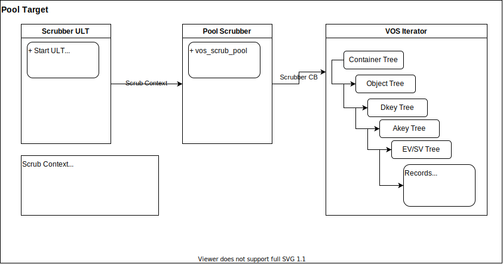

# Data Integrity

DAOS uses checksums internally to discover silent data corruption. While each
component in a system (network layer, storage devices) may offer protection
against silent data corruption, DAOS provides end-to-end data integrity to
better protect user data. If silent data corruption is detected, DAOS will
attempt to recover the corrupted data using data redundancy mechanisms
(Replication or Erasure Code).

## End-to-end Data Integrity

In simple terms, end-to-end means that the DAOS Client library will calculate a
checksum for data that is being sent to the DAOS Server. The DAOS Server will
store the checksum and return it upon data retrieval. Then the client verifies
the data by calculating a new checksum and comparing to the checksum received
from the server. There are variations on this approach depending on the type of
data being protected, but the following diagram shows the basic checksum flow.


## Configuring

Data integrity is configured for each container.
See [Storage Model](./storage.md) for more information about how data is
organized in DAOS. See the Data Integrity in
the [Container User Guide](../user/container.md#data-integrity) for details on
how to setup a container with data integrity.

## Keys and Value Objects

Because DAOS is a key/value store, the data for both keys and values is
protected, however, the approach is slightly different. For the two different
value types, single and array, the approach is also slightly different.

### Keys
On an update and fetch, the client calculates a checksum for the data used
as the distribution and attribute keys and will send it to the server within the
RPC. The server verifies the keys with the checksum.
While enumerating keys, the server will calculate checksums for the keys and
pack within the RPC message to the client. The client will verify the keys
received.

!!! note
Checksums for keys are not stored on the server. A hash of the key is
calculated and used to index the key in the server tree of the keys
(see [VOS Key Array Stores](https://github.com/daos-stack/daos/blob/master/src/vos/README.md#key-array-stores)).
It is also expected that keys are stored only in Storage Class Memory which
has reliable data integrity protection.

### Values
On an update, the client will calculate a checksum for the data of the value and
will send it to the server within the RPC. If "server verify" is enabled, the
server will calculate a new checksum for the value and compare with the checksum
received from the client to verify the integrity of the value. If the checksums
don't match, then data corruption has occurred and an error is returned to the
client indicating that the client should try the update again. Whether "server
verify" is enabled or not, the server will store the checksum.
See [VOS](https://github.com/daos-stack/daos/blob/master/src/vos/README.md)
for more info about checksum management and storage in VOS.

On a fetch, the server will return the stored checksum to the client with the
values fetched so the client can verify the values received. If the checksums
don't match, then the client will fetch from another replica if available in
an attempt to get uncorrupted data.

There are some slight variations to this approach for the two different types
of values. The following diagram illustrates a basic example.
(See [Storage Model](storage.md) for more details about the single value
and array value types)


#### Single Value
A Single Value is an atomic value, meaning that writes to a single value will
update the entire value and reads retrieve the entire value. Other DAOS features
such as Erasure Codes might split a Single Value into multiple shards to be
distributed among multiple storage nodes. Either the whole Single Value (if
going to a single node) or each shard (if distributed) will have a checksum
calculated, sent to the server, and stored on the server.

Note that it is possible for a single value, or shard of a single value, to
be smaller than the checksum derived from it. It is advised that if an
application needs many small single values to use an Array Type instead.

#### Array Values
Unlike Single Values, Array Values can be updated and fetched at any part of
an array. In addition, updates to an array are versioned, so a fetch can include
parts from multiple versions of the array. Each of these versioned parts of an
array are called extents. The following diagrams illustrate a couple examples
(also see [VOS Key Array Stores](https://github.com/daos-stack/daos/blob/master/src/vos/README.md#key-array-stores) for
more information):


A single extent update (blue line) from index 2-13. A fetched extent (orange
line) from index 2-6. The fetch is only part of the original extent written.


Many extent updates and different epochs. A fetch from index 2-13 requires parts
from each extent.


The nature of the array type requires that a more sophisticated approach to
creating checksums is used. DAOS uses a "chunking" approach where each extent
will be broken up into "chunks" with a predetermined "chunk size." Checksums
will be derived from these chunks. Chunks are aligned with an absolute offset
(starting at 0), not an I/O offset. The following diagram illustrates a chunk
size configured to be 4 (units is arbitrary in this example). Though not all
chunks have a full size of 4, an  absolute offset alignment is maintained.
The gray boxes around the extents represent the chunks.


(
See [Object Layer](https://github.com/daos-stack/daos/blob/master/src/object/README.md)
for more details about the checksum process on object update and fetch)

## Checksum calculations
The actual checksum calculations are done by the
[isa-l](https://github.com/intel/isa-l)
and [isa-l_crypto](https://github.com/intel/isa-l_crypto) libraries. However,
these libraries are abstracted away from much of DAOS and a common checksum
library is used with appropriate adapters to the actual isa-l implementations.
[common checksum library](../../src/common/README.md#checksum)

## Performance Impact
Calculating checksums can be CPU intensive and will impact performance. To
mitigate performance impact, checksum types with hardware acceleration should
be chosen. For example, CRC32C is supported by recent Intel CPUs, and many are
accelerated via SIMD.

## Quality
Unit and functional testing is performed at many layers.

| Test executable   | What's tested | Key test files |
| --- | --- | --- |
| common_test | daos_csummer, utility functions to help with chunk alignment  | src/common/tests/checksum_tests.c |
| vos_test | vos_obj_update/fetch apis with checksum params to ensure updating and fetching checksums | src/vos/tests/vts_checksum.c |
| srv_checksum_tests | Server side logic for adding fetched checksums to an array request. Checksums are appropriately copied or created depending on extent layout. | src/object/tests/srv_checksum_tests.c |
| daos_test | daos_obj_update/fetch with checksums enabled. The -z flag can be used for specific checksum tests. Also --csum_type flag can be used to enable  checksums with any of the other daos_tests | src/tests/suite/daos_checksum.c |

### Running Tests
**With daos_server not running**

```
./commont_test
./vos_test -z
./srv_checksum_tests
./pool_scrubbing_tests
```

**With daos_server running**

```
export DAOS_CSUM_TEST_ALL_TYPE=1
./daos_server -z
./daos_server -i --csum_type crc64
```

---

# Checksum Scrubbing

The Checksum Scrubber proactively detects silent data corruption by verifying
the checksums that are stored on the server. For each pool target a ULT is
created that will scan the pool target VOS tree. For every value, the data is
read, a new checksum is calculated and compared to the stored checksum when the
data was first written. A mismatch indicates that data corruption has been
detected.

There are four pool properties that alter the Checksum Scrubber behavior.

- **Scrubbing Mode** - Off, Pause, Freq, or Rate. The value of mode indicates
  the priority between the following two properties. A value of Off for
  scrubbing mode means that no scrubbing will occur for the pool target.
- **Frequency** - How often checksums should be scrubbed defined in seconds
- **Rate** - The rate at which checksums are scrubbed defined in milliseconds,
  meaning 1 checksum per M milliseconds.
- **Eviction Threshold** - Number of distinct silent data corruption events.
  When a target hits the threshold, the pool target will automatically be
  evicted. To evict the pool target, a Pool Target Drain is triggered which will
  use the pool target in the rebuild process. Any corrupted data that has data
  protection enabled should be recovered on the newly rebuilt pool target.
  Corrupt data that does not have data protection is lost. If set to a value of
  0, automatic eviction will be disabled.

## Scrubbing Mode

The Checksum Scrubber has three modes.

- **OFF** - No scrubbing occurs.
- **Pause** - No scrubbing occurs, but if the mode was changed to pause mid-pool
  target scrub, when resumed, the Checksum Scrubber will continue from where it
  left off.
- **Fixed Frequency** - The checksum scrubber will calculate the rate at which
  it needs to scrub checksums so that it completes scrubbing the pool target at
  the end of the frequency duration.
- **Fixed Rate** - The checksum scrubber will scrub the checksums at the set
  rate value.

### Fixed Frequency

In the Fixed Frequency mode, the checksum scrubber will calculate the rate at
which it needs to scrub checksums to have a constant scrubbing rate. The goal of
the Fixed Frequency mode is to complete scrubbing the pool target in time to
start scrubbing again and keeping the desired frequency duration. The checksum
scrubber must know the number of checksums it is going to scrub to make the rate
calculation accurate. VOS trees don't provide this information without scanning
the entire tree and counting beforehand. The Checksum Scrubber will remember the
number of checksums scrubbed in the previous pool target scrub. If the number of
checksums varies dramatically between pool target scrubs then scrubbing will not
be as continuous. If there are fewer checksums to scrub than previously then the
scrubber will complete scrubbing the pool target early and wait until it is time
to scrub again based on the frquency set. If there are more, then the Checksum
Scrubber will reach the time it should start scrubbing the pool target again but
not be complete. In this case it will finish scrubbing as quickly as it can and
then begin again.

### Fixed Rate

In the Fixed Rate mode, the Checksum Scrubber will scrub at a constant rate set
by the Rate Pool Property. If the Frequency Pool Property is set, then it will
act as a minimum frequency that the checksums should be scrubbed.

## Telemetry Metrics

To see the progress of the scrubber, several telemetry metrics are tracked for
each pool target.

- scrubs_completed: Number of times the pool target has been completely
  scrubbed.
- last_duration: How long it took to scrub all the checksums in the pool target.
- sleep: How long the checksum scrubber is waiting before it starts scrubbing
  another checksum.
- csums/current: Number of checksums scrubbed in the current pool target.
- csums/prev: Number of checksums scrubbed during the previous scrub of the pool
  target. This value is used as the expected number of checksum calculations for
  the current scrub.
- csums/total: Total number of checksums scrubbed over the life of the Scrubbing
  ULT
- corruption/current: Number of checksums that did not match the stored
  checksum, therefore discovering data corruption, in the current scrub.
- corruption/total: Total number of checksums that did not match the stored
  checksum.

## Data Corruption Discovery

If data corruption is discovered by the scrubber it will:

- mark the record's BIO address with the corrupt flag,
- raise a RAS event (```ds_notify_ras_event()```),
- increment the corruption counter telemetry metric,
- initiate Drain on the pool target, if the Eviction Threshold is enabled and
  reached

## Configuring a Pool's Checksum Scrubbing Properties

Command to create a pool with scrubbing enabled might look like:

```bash
dmg pool create --scm-size 1G --properties=scrub:freq,scrub-freq:7d,scrub-cred:1
```

The pool properties can also be changed after a pool is created:

```bash
dmg pool set-prop ${POOL} --properties=scrub:off
```

## Performance Impact

Checksum scrubbing scanner can impact CPU and the I/O bandwidth because it must
iterate the VOS tree (I/O to SCM), fetch data (I/O to SSD) and calculate
checksums (CPU intensive). To minimize these impacts, the Checksum Scrubber
either yields or sleeps very frequently allowing the Server Scheduler to
prioritize I/O.

## Design Overview



When a ```ds_pool_child (per target/thread pool object)``` is created, a new ULT
starts and defines a scrubbing context (```scrub_ctx```). Several callbacks are
added to the context to keep server dependencies out of the scrubber.

The server scheduling callbacks allow the pool scrubber to yield or sleep
depending on the scrubbing mode, frequency, and credits while removing the
dependency on the actual yielding and sleeping mechanisms. This makes unit
testing the scrubber's behavior easier at a unit level.

The container lookup callbacks also enable the pool scrubber to get the server
in memory container object. This provides the container's csummer and allows the
scrubber to check if the container is being destroyed and can stop any scrubbing
of the container.

The drain callbacks provide the scrubber to initiate a pool target drain
when the threshold is reached. Again, this enables  testing the pool
scrubber behavior without having to actually drain targets.

The Pool Scrubber has direct access to the Telemetry Framework.

The ```vos_iterate``` VOS API is used to iterate over all the containers,
objects, dkeys, akeys, and records within a pool target. A callback is passed
to ```vos_iterate``` which does the actual scrubbing. When iterating over
records, the bio address stored in the record is used to read the data. A new
checksum is calculated for the data and it is compared to the checksum stored in
the record. A flag in the bio address can be set if data corruption is detected
for the record. This prevents future scanning of the record and the need to
calculate checksums if the record is read using the daos_obj_fetch API.
