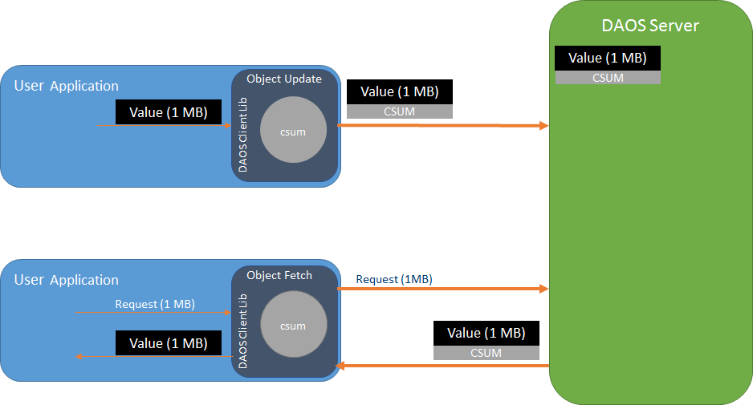
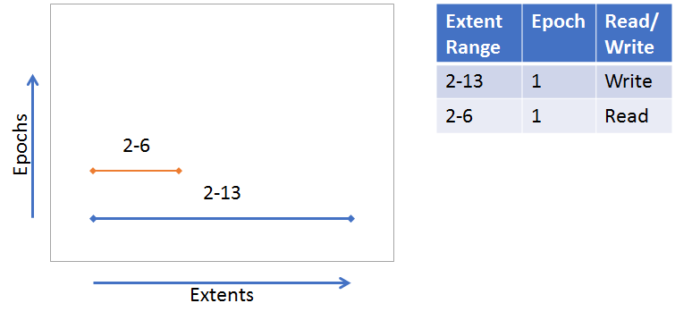
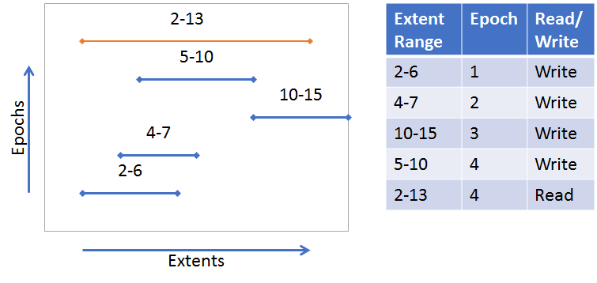

# Data Integrity

DAOS uses checksums internally to discover silent data corruption. While each
component in a system (network layer, storage devices) may offer protection
against silent data corruption, DAOS provides end-to-end data integrity to
better protect user data. If silent data corruption is detected, DAOS will
attempt to recover the corrupted data using data redundancy mechanisms
(Replication or Erasure Code).

## End-to-end Data Integrity

In simple terms, end-to-end means that the DAOS Client library will calculate a
checksum for data that is being sent to the DAOS Server. The DAOS Server will
store the checksum and return it upon data retrieval. Then the client verifies
the data by calculating a new checksum and comparing to the checksum received
from the server. There are variations on this approach depending on the type of
data being protected, but the following diagram shows the basic checksum flow.


## Configuring

Data integrity is configured for each container.
See [Storage Model](./storage.md) for more information about how data is
organized in DAOS. See the Data Integrity in
the [Container User Guide](../user/container.md#data-integrity) for details on
how to setup a container with data integrity.

## Keys and Value Objects

Because DAOS is a key/value store, the data for both keys and values is
protected, however, the approach is slightly different. For the two different
value types, single and array, the approach is also slightly different.

### Keys
On an update and fetch, the client calculates a checksum for the data used as
the distribution and attribute keys and will send it to the server within the
RPC. The server verifies the keys with the checksum. While enumerating keys, the
server will calculate checksums for the keys and pack within the RPC message to
the client. The client will verify the keys received.

!!! note Checksums for keys are not stored on the server. A hash of the key is
calculated and used to index the key in the server tree of the keys
(
see [VOS Key Array Stores](https://github.com/daos-stack/daos/blob/master/src/vos/README.md#key-array-stores))
. It is also expected that keys are stored only in Storage Class Memory which
has reliable data integrity protection.

### Values
On an update, the client will calculate a checksum for the data of the value and
will send it to the server within the RPC. If "server verify" is enabled, the
server will calculate a new checksum for the value and compare with the checksum
received from the client to verify the integrity of the value. If the checksums
don't match, then data corruption has occurred and an error is returned to the
client indicating that the client should try the update again. Whether "server
verify" is enabled or not, the server will store the checksum.
See [VOS](https://github.com/daos-stack/daos/blob/master/src/vos/README.md)
for more info about checksum management and storage in VOS.

On a fetch, the server will return the stored checksum to the client with the
values fetched so the client can verify the values received. If the checksums
don't match, then the client will fetch from another replica if available in an
attempt to get uncorrupted data.

There are some slight variations to this approach for the two different types of
values. The following diagram illustrates a basic example.
(See [Storage Model](storage.md) for more details about the single value and
array value types)


#### Single Value
A Single Value is an atomic value, meaning that writes to a single value will
update the entire value and reads retrieve the entire value. Other DAOS features
such as Erasure Codes might split a Single Value into multiple shards to be
distributed among multiple storage nodes. Either the whole Single Value (if
going to a single node) or each shard (if distributed) will have a checksum
calculated, sent to the server, and stored on the server.

Note that it is possible for a single value, or shard of a single value, to
be smaller than the checksum derived from it. It is advised that if an
application needs many small single values to use an Array Type instead.

#### Array Values
Unlike Single Values, Array Values can be updated and fetched at any part of
an array. In addition, updates to an array are versioned, so a fetch can include
parts from multiple versions of the array. Each of these versioned parts of an
array are called extents. The following diagrams illustrate a couple examples
(also see [VOS Key Array Stores](https://github.com/daos-stack/daos/blob/master/src/vos/README.md#key-array-stores) for
more information):


A single extent update (blue line) from index 2-13. A fetched extent (orange
line) from index 2-6. The fetch is only part of the original extent written.




Many extent updates and different epochs. A fetch from index 2-13 requires parts
from each extent.




The nature of the array type requires that a more sophisticated approach to
creating checksums is used. DAOS uses a "chunking" approach where each extent
will be broken up into "chunks" with a predetermined "chunk size." Checksums
will be derived from these chunks. Chunks are aligned with an absolute offset
(starting at 0), not an I/O offset. The following diagram illustrates a chunk
size configured to be 4 (units is arbitrary in this example). Though not all
chunks have a full size of 4, an  absolute offset alignment is maintained.
The gray boxes around the extents represent the chunks.


(
See [Object Layer](https://github.com/daos-stack/daos/blob/master/src/object/README.md)
for more details about the checksum process on object update and fetch)

## Checksum calculations
The actual checksum calculations are done by the
[isa-l](https://github.com/intel/isa-l)
and [isa-l_crypto](https://github.com/intel/isa-l_crypto) libraries. However,
these libraries are abstracted away from much of DAOS and a common checksum
library is used with appropriate adapters to the actual isa-l implementations.
[common checksum library](https://github.com/daos-stack/daos/blob/master/src/common/README.md#checksum)

## Performance Impact

Calculating checksums can be CPU intensive and will impact performance. To
mitigate performance impact, checksum types with hardware acceleration should be
chosen. For example, CRC32C is supported by recent Intel CPUs, and many are
accelerated via SIMD.

## Quality
Unit and functional testing is performed at many layers.

| Test executable   | What's tested | Key test files |
| --- | --- | --- |
| common_test | daos_csummer, utility functions to help with chunk alignment  | src/common/tests/checksum_tests.c |
| vos_tests | vos_obj_update/fetch apis with checksum params to ensure updating and fetching checksums | src/vos/tests/vts_checksum.c |
| srv_checksum_tests | Server side logic for adding fetched checksums to an array request. Checksums are appropriately copied or created depending on extent layout. | src/object/tests/srv_checksum_tests.c |
| daos_test | daos_obj_update/fetch with checksums enabled. The -z flag can be used for specific checksum tests. Also --csum_type flag can be used to enable  checksums with any of the other daos_tests | src/tests/suite/daos_checksum.c |

### Running Tests
**With daos_server not running**

```
commont_test
vos_tests -z
srv_checksum_tests
cli_checksum_tests
pool_scrubbing_tests
rpc_tests
```

**With daos_server running**

```
export DAOS_CSUM_TEST_ALL_TYPE=1
./daos_server -z
./daos_server -i --csum_type crc64
```

---

# Checksum Scrubbing

A background task will scan (when the storage server is idle to limit
performance impact) the Version Object Store (VOS) trees to verify the data
integrity with the checksums. Corrective actions can be taken when corruption is
detected.

## High Level Design

- Per Pool ULT (I/O xstream) that will iterate containers. If checksums and
  scrubber is enabled then iterate the object tree. If a record value (SV or
  array) is not already marked corrupted then scan.
  - Fetch the data.
  - Calculate checksu for the data
  - Compare calculated checksum with stored checksum.

### Silent Data Corruption

When silent data corruption has been detected the following actions will be
taken:

- Mark the record as corrupt
- Raise an event using the DAOS RAS Notification system
- Increment checksum error counters
- If a configurable threshold of corruption has been reached, initiate a
  rebuild/drain operation

### Checksum Scrubbing Properties

- **Pool Scrubber Mode** (scrub) - How the scrubber will run for each pool
  target. The container configuration can disable scrubbing for the container,
  but it cannot alter the mode.
  - **OFF** - The Scrubber will not run.
  - **Lazy** - Trigger the scrubber only when there is no IO activity. Trigger
    aggregation regularly despite of IO activities.
  - **Timed** - Trigger the scrubber regularly despite IO activities.
- **Pool Scrubber Frequency** (scrub-freq) - How frequently the scrubber should
  scrub a pool. This value indicates the regularity of scrubbing activity when
  the Scrubber Mode is set to Timed.
- **Threshold** (scrub-thresh) - Number of checksum errors when the pool target
  is evicted. A value of 0 disables auto eviction

The command to create a pool with scrubbing enabled might look like this:

```bash
dmg pool create --scm-size 1G --properties=scrub:lazy
# or
dmg pool create --scm-size 1G
dmg pool set-prop ${POOL} --properties=scrub:timed
```

### Container Properties (-> doc/user/container.md)

- **Container Disable Scrubbing** - If scrubbing is enabled for a pool, a
  container can disable it for itself.

### Telemetry

The following telemetry metrics are gathered and can be reported for better
understanding of how the scrubber is running.

- Number of times the VOS tree has been scanned and scrubbed (since the scrubber
  started)
- Time stamp when the current tree scrub started
- The duration of the previous tree scrub took
- Number of checksums scrubbed during current tree scrub
- Number of checksums calculated in last tree scrub
- Total number of checksums scrubbed (since the scrubber process started)
- Number of silent data corruption detected during the current tree scrub
- Total number of silent data corruption detected (since the pool was created)
- Amount of data that has been scrubbed since the scrubber began

Three additional "metrics" are reported by the telemetry system. They aren't
telemetry metrics per say, but helpful in understanding the status of the
scrubber.

- If currently in a tree scrub, the number of milliseconds until the next
  checksum is scrubbed. This is especially informative if in 'timed' mode.
- If not in a tree scrub, the number of seconds until the next tree scrub
  will start. If in 'lazy' mode then the scrubber might finish scrubbing the
  tree before the frequency window expires.
- If in lazy mode and the system is not in idle, the number of seconds 'busy'

Example output from daos_metrics:
```
scrubs_completed: 10, desc: Number of times the VOS tree has been scanned and scrubbed (since the scrubber started)
scrubber_started: Wed Jan 25 20:57:27 2023, desc: Time stamp when the current tree scrub started
next_csum_scrub: 0 msec, desc: milliseconds until next csum scrub, units: msec
next_tree_scrub: 5 sec, desc: seconds until next tree scrub, units: sec
busy_time: 0 sec, desc: seconds scrubber isn't able to proceed because of active IO, units: sec
prev_duration: 19023 us [min: 13, max: 19831, avg: 11169, stddev: 8589, samples: 10], desc: The duration the previous tree scrub took, units: us
csums
    current: 4639, desc: Number of checksums calculated during  current tree scrub
    prev: 4639, desc: Number of checksums calculated in last tree scrub
    total: 25495, desc: Total number of checksums scrubbed (since the scrubber process started)
bytes_scrubbed
    current: 1059448 bytes, desc: Number of bytes scrubbed during the current tree scrub, units: bytes
    prev: 1059448 bytes, desc: Number of bytes scrubbed in last tree scrub, units: bytes
    total: 9535032 bytes, desc: Total number of bytes scrubbed bytes (since the scrubber process started), units: bytes
corruption
    current: 0, desc: Number of silent data corruption detected during current tree scrub
    total: 0, desc: Total number of silent data corruption detected (since the pool was created)
```

## Design Details

### Pool ULT

The code for the pool ULT is found in `srv_pool_scrub.c`. It can be a bit
difficult to follow because there are several layers of callback functions due
to the nature of how ULTs and the vos_iterator work, but the file is organized
such that functions typically call the function above it (either directly or
indirectly as a callback). For example (~> is an indirect call, -> is a direct
call):

```
ds_start_scrubbing_ult ~> scrubbing_ult -> scrub_pool ~> cont_iter_scrub_cb ->
    scrub_cont ~> obj_iter_scrub_cb ...
```

### VOS

- In order to mark data as corrupted a flag field is added to bio_addr_t which
  includes a CORRUPTED bit.
- The vos update api already accepts a flag, so a CORRUPTED flag is added and
  handled during an update so that, if set, the bio address will be updated to
  be corrupted. (Documented in src/vos/README.md)
- On fetch, if a value is already marked corrupted, return -DER_CSUM

## Testing

- pool_scrubbing_tests
- daos_test -z

## Debugging

- In the server.yml configuration file set the following env_vars

```
- D_LOG_MASK=DEBUG
- DD_SUBSYS=pool
- DD_MASK=csum
```
