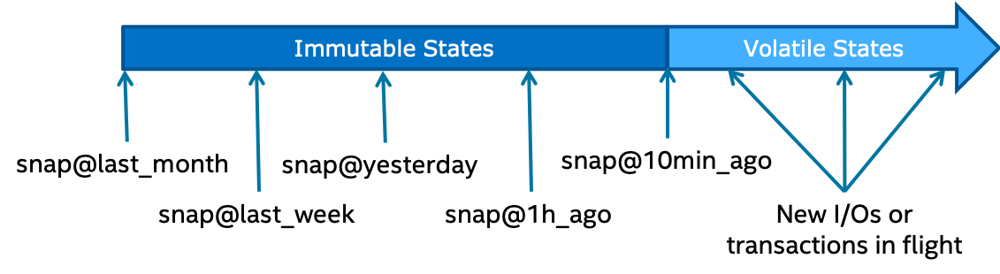

# Transaction Model

The DAOS API supports distributed transactions that allow multiple operations
against objects belonging to the same container to be combined into a single
ACID transaction. Distributed consistency is provided via a lockless optimistic
concurrency control mechanism based on multi-version timestamp ordering.
DAOS transactions are serializable and can be used on an ad-hoc basis for parts
of the datasets that need it.

The DAOS versioning mechanism allows creating persistent container snapshots
which provide point-in-time distributed consistent views of a container which
can be used to build producer-consumer pipeline.

## Epoch and Timestamp Ordering

Each DAOS I/O operation is tagged with a timestamp called *epoch*. An epoch
is a 64-bit integer that integrates both logical and physical clocks
(see [HLC paper](https://cse.buffalo.edu/tech-reports/2014-04.pdf)).
The DAOS API provides helper functions to convert an epoch to traditional
POSIX time (i.e., `struct timespec`, see `clock_gettime(3)`).

## Container Snapshot

As shown in the <a href="#f4.4">figure</a> below, the content of a container
can be snapshot at any time.

<a id="f4.4"></a>


DAOS snapshots are very lightweight and are tagged with the epoch associated
with the time when the snapshot was created. Once successfully created,
a snapshot remains readable until it is explicitly destroyed. The content of
a container can be rolled back to a particular snapshot.

The container snapshot feature allows supporting native producer/consumer
pipelines as represented in the diagram below.


The producer will generate a snapshot once a consistent version of the
dataset has been successfully written. The consumer applications may
subscribe to container snapshot events, so that new updates can be processed
as the producer commits them. The immutability of the snapshots guarantees
that the consumer sees consistent data, even while the producer continues
with new updates. Both the producer and consumer indeed operate on different
versions of the container and do not need any serialization. Once the
producer generates a new version of the dataset, the consumer may query the
differences between the two snapshots and process only the incremental changes.

## Distributed Transactions

Unlike POSIX, the DAOS API does not impose any worst-case concurrency
control mechanism to address conflicting I/O operations. Instead,
individual I/O operations are tagged with a different epoch and applied
in epoch order, regardless of execution order. This baseline model
delivers the maximum scalability and performance to data models and
applications that do not generate conflicting I/O workload. Typical
examples are collective MPI-IO operations, POSIX file read/write
or HDF5 dataset read/write.

For parts of the data model that require conflict serialization,
DAOS provides distributed serializable transaction based on multi-version
concurrency control. Transactions are typically needed when different user
processes can overwrite the value associated with a dkey/akey pair.
Examples are a SQL database over DAOS or a consistent POSIX namespace
accessed concurrently by uncoordinated clients. All I/O operations
(including reads) submitted in the context of the same transaction will use
the same epoch. The DAOS transaction mechanism automatically detects the
traditional read/write, write/read and write/write conflicts and aborts
one of the conflicting transactions (the transaction fails to commit
with `-DER_RESTART`). The failed transaction then has to be restarted
by the user/application.

In the initial implementation, the transaction API does not support reading
your own uncommitted changes. In other words, transactional object or key-value
modifications are invisible to the subsequent operations executed in the
context of the same transaction. The transaction API is supported for all
object types and can be combined with the the event and scheduler interface.

The typical flow of a transaction is as follows:

```C
daos_handle_t tx = DAOS_TX_NONE;
int           rc;

/* allocate transaction */
rc = daos_tx_open(dfs->coh, &th, 0, NULL);
if (rc)
	...

restart:
	/* execute operations under the same transaction */
	rc = daos_obj_fetch(..., th);
	...
	rc = daos_obj_update(..., th);
	...
	if (rc) {
		rc = daos_tx_abort(th, NULL);
		/* either goto restart or exit */
	}

	rc = daos_tx_commit(th, NULL);
	if (rc) {
		if (rc == -DER_TX_RESTART) {
			/* conflict with another transaction, try again */
			rc = daos_tx_restart(th, NULL);
			goto restart;
		}
		...
	}

/* free up all the resources allocated for the transaction */
rc = daos_tx_close(th, NULL);
```

daos\_tx\_open() is a local operation that will allocate the context
for the transaction. All non-modifying operations (e.g. fetch, list) are
served by the remote engines while all modifying operations (e.g. update,
punch) are buffered on the client side.

At commit time, all operations are packed into a compound RPC which is then
sent to the engine algorithmically elected as the leader for this transaction.
The leader engine then applies all the changes on all the storage nodes.
In the case of a conflict with another transaction, daos\_tx\_commit() fails
with -DER\_TX\_RESTART and the whole transaction should be re-executed by the
client after calling daos\_tx\_restart(). False conflicts might happen, but
should be the exception rather than the norm.

At any time, daos\_tx\_abort() may be invoked to cancel the transaction. Once
the transaction is completed or aborted, all resources allocated to the
transaction can be freed via daos\_tx\_close(). The th handle is then invalid.
