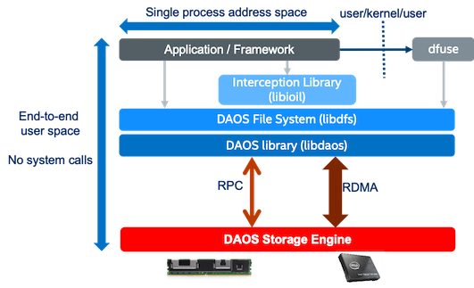

# File System

A container can be mounted as shared POSIX namespace on multiple compute nodes.
This capability is provided by the `libdfs` library that implements the file and
directory abstractions over the native `libdaos` library. The POSIX emulation can
be exposed directly to applications or I/O frameworks (e.g., for frameworks like
Spark or TensorFlow, or benchmarks like IOR or mdtest that support different
storage backend plugins).
It can also be exposed transparently via a FUSE daemon, combined optionally with
an interception library to address some of the FUSE performance bottlenecks by
delivering full OS bypass for POSIX read/write operations.



The performance is going to be best generally when using the DFS API directly.
Using the IO interception library with dfuse should yield the same performance
for IO operations (read/write) as the DFS API with minimal overhead. Performance
of metadata operations (file creation, deletion, rename, etc.) over dfuse will
be much slower than the DFS API since there is no interception to bypass the
fuse/kernel layer.

## libdfs

The DAOS File System (DFS) is implemented in the `libdfs` library,
and allows a DAOS container to be accessed as a hierarchical POSIX namespace.
`libdfs` supports files, directories, and symbolic links, but not hard links.
Access permissions are inherited from the parent pool and are not implemented on
a per-file or per-directory basis.

### Supported Operations

The DFS API closely represents the POSIX API. The API includes operations to:

* Mount: create/open superblock and root object
* Un-mount: release open handles
* Lookup: traverse a path and return an open file/dir handle
* IO: read & write with an iovec
* Stat: retrieve attributes of an entry
* Mkdir: create a dir
* Readdir: enumerate all entries under a directory
* Open: create/Open a file/dir
* Remove: unlink a file/dir
* Move: rename
* Release: close an open handle of a file/dir
* Extended Attributes: set, get, list, remove

### POSIX Compliance

The following features from POSIX are not supported:

* Hard links
* mmap support with MAP\_SHARED will be consistent from single client only. Note
  that this is supported through DFUSE only (i.e. not through the DFS API).
* Char devices, block devices, sockets and pipes
* User/group quotas
* setuid(), setgid() programs, supplementary groups, POSIX ACLs are not supported
  within the DFS namespace.
* [access/change/modify] time not updated appropriately, potentially on close only.
* Flock (maybe at dfuse local node level only)
* Block size in stat buf is not accurate (no account for holes, extended attributes)
* Various parameters reported via statfs like number of blocks, files,
  free/available space
* POSIX permissions inside an encapsulated namespace
  * Still enforced at the DAOS pool/container level
  * Effectively means that all files belong to the same "project"

!!! note
    DFS directories do not include the `.` (current directory) and `..` (parent directory)
    directory entries that are known from other POSIX filesystems.
    Commands like `ls -al` will not include these entries in their output.
    Those directory entries are not required by POSIX, so this is not a limitation to POSIX
    compliance. But scripts that parse directory listings under the assumption that those dot
    directories are present may need to be adapted to correctly handle this situation.
    Note that operations like `cd .` or `cd ..` will still succeed in dfuse-mounted POSIX
    containers.

It is possible to use `libdfs` in a parallel application from multiple nodes.
DFS provides two modes that offer different levels of consistency. The modes can
be set on container creation time:

1) Relaxed mode for well-behaved applications that generate conflict-free
operations for which a very high level of concurrency will be supported.

2) Balanced mode for applications that require stricter consistency at the cost
of performance. This mode is currently not fully supported and DFS by default
will use the relaxed mode.

On container access, if the container is created with balanced mode, it can be
accessed in balanced mode only. If the container was created with relaxed mode,
it can be accessed in relaxed or balanced mode. In either mode, there is a
consistency semantic issue that is not properly handled:

* Open-unlink semantics: This occurs when a client obtains an open handle on an
  object (file or directory), and accesses that object (reads/writes data or
  create other files), while another client removes that object that the other
  client has opened from under it. In DAOS, we don't track object open handles
  as that would be very expensive, and so in such conflicting cases, the worst
  case scenario is the lost/leaked space that is written to those orphan objects
  that have been unlinked from the namespace.

Other consistency issues are handled differently between the two consistency mode:

* Same Operation Executed Concurrently (Supported in both Relaxed and Balanced
  Mode): For example, clients try to create or remove the same file
  concurrently, one should succeed and others will fail.
* Create/Unlink/Rename Conflicts (Supported in Balanced Mode only): For example,
  a client renames a file, but another unlinks the old file at the same time.
* Operation Atomicity (Supported only in Balanced mode): If a client crashes in
  the middle of the rename, the state of the container should be consistent as
  if the operation never happened.
* Visibility (Supported in Balanced and Relaxed mode): A write from one client
  should be visible to another client with a simple coordination between the
  clients.

## Unified NameSpace (UNS)

Many clients support links to other containers as a layer on top of DFS, where a directory in a
POSIX container is interpreted as a instruction to access the root of a separate container, in much
the same way as symbolic links work on Unix.  DFS does not handle this directly, however the same
mechanism for accessing paths in this way is common across several higher layers.

## DFuse (DAOS FUSE)

DFuse provides DAOS File System access through the standard libc/kernel/VFS
POSIX infrastructure.  This allows existing applications to use DAOS without
modification, and provides a path to upgrade those applications to native DAOS
support.  Additionally, DFuse provides an Interception Library `libioil` to
transparently allow POSIX clients to talk directly to DAOS servers, providing
OS-Bypass for I/O without modifying or recompiling of the application.

DFuse is layered on top of DFS.  Data written via DFuse can be accessed by DFS and
vice versa, even simultaneously from different client applications.

### DFuse Daemon

The `dfuse` daemon runs a single instance per node to provide a user POSIX access
to DAOS. It should be run with the credentials of the user, and typically will
be started and stopped on each compute node as part of the prolog and epilog
scripts of any resource manager or scheduler in use.

### Core binding and threads

DFuse will launch one thread per available core by default, although this can be
changed by the `--thread-count` option. To change the cores that DFuse runs on
use kernel level tasksets which will bind DFuse to a subset of cores. This can be
done via the `tasket` or `numactl` programs or similar. If doing this then DFuse
will again launch one thread per available core by default.  Many metadata
operations will block a thread until completed so if restricting DFuse to a small
number of cores then overcommiting via the `--thread-count` option may be desirable.

DFuse will use two types of threads: fuse threads to accept and process requests
and event queue threads.  The `--thread-count` option will dictate the total number of
threads and each eq-thread will reduce this.  Each event queue thread will create a
daos event queue so consumes additional network resources.  The `--eq-count` option
will control the event queues and associated threads.

### Restrictions

DFuse by default is limited to a single user. Access to the filesystem from other users,
including root, will not be honored. As a consequence of this, the `chown`
and `chgrp` calls are not supported.  Hard links and special device files,
except symbolic links, are not supported, nor are any ACLs beyond standard
POSIX permissions.

DFuse can run in the foreground, keeping the terminal window open, or it can
daemonize to run like a system daemon.  The default is to run in the background
and when doing this it will remain attached to the terminal until after
initialization to be able to report back status or failure to start to the user.

Inodes are managed on the local node by DFuse. So while inode numbers
will be consistent on a node for the duration of the session, they are not
guaranteed to be consistent across restarts of DFuse or across nodes.

It is not possible to see pool/container listings through DFuse.
So if `readdir`, `ls` or others are used, DFuse will return `ENOTSUP`.

### Multi-user mode

The `--multi-user` option will put DFuse into multi user mode where it will tell the kernel to
make the filesystem available to all users on a node rather than only the user running the DFuse
process.  This makes DFuse appear like a generic multi-user filesystem and the standard `chown`
and `chgrp` calls are enabled, all filesystem entries will be owned by the user that created them
as is normal in a POSIX filesystem.

Links to other containers can be created in this mode even if the new containers are not owned
by the user running DFuse.  In this case the user running DFuse should be given 'r' access to the
pool if required and the container create command will apply permissions required to the container
at create time.

It is anticipated that in this mode DFuse will be configured to start at boot time and run as a
general purpose filesystem providing access to multiple users.

Multi-user mode requires the fuse package to be reconfigured as it's disabled by default.  The
setting `user_allow_other` needs to be set in `/etc/fuse.conf` or `/etc/fuse3.conf`, which will need
to be done as root and takes effect for all users on that node.

### Launching

#### Via dfuse command

DFuse should be run with the credentials (user/group) of the user who will
be accessing it, and who owns any pools that will be used.

There is one mandatory command-line option, this is a mount point to start dfuse and can be
supplied either via the `--mountpoint` option or the first positional argument.
The mount point specified should be an empty directory on the local node that
is owned by the user.

Additionally, there are several optional command-line options:

| **Command-line Option**    | **Description**                  |
| -------------------------- | -------------------------------- |
| --pool=<label\|uuid\>      | pool label or uuid to connect to |
| --container=<label\|uuid\> | container label or uuid to open  |
| --sys-name=<name\>         | DAOS system name                 |
| --foreground               | run in foreground                |
| --singlethreaded           | run single threaded              |
| --thread-count=<count>     | Number of threads to use         |
| --multi-user               | Run in multi user mode           |

The `--pool` and `--container` options can also be passed as the second and third positional
arguments.

When DFuse starts, it will register a single mount with the kernel, at the location specified.
This mount will be visible in `/proc/mounts`, and possibly in the output of `df`. The contents of
multiple pools/containers may be accessible via this single kernel mount.

Below is an example of creating and mounting a POSIX container under
the /scratch_fs/dfuse mountpoint.

```
$ mkdir /scratch_fs/dfuse

$ dfuse -m /scratch_fs/dfuse tank mycont

$ touch /scratch_fs/dfuse/foo

$ ls -l /scratch_fs/dfuse/
total 0
-rw-rw-r-- 1 samirrav samirrav 0 Sep 23 16:31 foo

$ df -h /scratch_fs/dfuse/
Filesystem      Size  Used Avail Use% Mounted on
dfuse           537G  5.1G  532G   1% /scratch_fs/dfuse
$
```
DFuse can be launched via fstab and the standard mount command, it will parse -o options
and extract pool=<name>,container=<name> if provided and ignore any other filesystem options given.

There are few use cases described below to explain how systemd or /etc/fstab can be used to mount
the daos container using dfuse.

#### Via mount.fuse3 command

```
$  dmg pool create --scm-size=8G --nvme-size=64G --label=samirrav_pool -u samirrav@
Creating DAOS pool with manual per-engine storage allocation: 8.0 GB SCM, 64 GB NVMe (12.50% ratio)
Pool created with 11.11%,88.89% storage tier ratio
--------------------------------------------------
  UUID                 : b43b06fe-4013-4177-911c-6d230b88fe6e
  Service Ranks        : [1-5]
  Storage Ranks        : [0-7]
  Total Size           : 576 GB
  Storage tier 0 (SCM) : 64 GB (8.0 GB / rank)
  Storage tier 1 (NVMe): 512 GB (64 GB / rank)

$  daos cont create samirrav_pool samirrav_cont --type=POSIX
  Container UUID : 6efdc02c-5eaa-4a29-a34b-a062f1fe3371
  Container Label: samirrav_cont
  Container Type : POSIX

Successfully created container 6efdc02c-5eaa-4a29-a34b-a062f1fe3371
$  daos cont get-prop samirrav_pool samirrav_cont
Properties for container samirrav_cont
Name                                    Value
----                                    -----
Highest Allocated OID                   0
Checksum                                off
Checksum Chunk Size                     32 KiB
Compression                             off
Deduplication                           off
Dedupe Threshold                        4.0 KiB
EC Cell Size                            64 KiB
Performance domain affinity level of EC 1
Encryption                              off
Global Version                          2
Group                                   samirrav@
Label                                   samirrav_cont
Layout Type                             POSIX (1)
Layout Version                          1
Max Snapshot                            0
Owner                                   samirrav@
Redundancy Factor                       rd_fac0
Redundancy Level                        node (2)
Performance domain affinity level of RP 3
Server Checksumming                     off
Health                                  HEALTHY
Access Control List                     A::OWNER@:rwdtTaAo, A:G:GROUP@:rwtT
$  mkdir /scratch_fs/daos_dfuse_samir
$  mount.fuse3 dfuse /scratch_fs/daos_dfuse_samir -o pool=samirrav_pool,container=samirrav_cont
$  touch /scratch_fs/daos_dfuse_samir/foo
$  ls -l /scratch_fs/daos_dfuse_samir/
total 0
-rw-rw-r-- 1 samirrav samirrav 0 Sep 23 15:49 foo
$  df -h | grep fuse
dfuse                         537G  5.1G  532G   1% /scratch_fs/daos_dfuse_samir
$
```

#### Via fstab

Only root can run 'mount -a' command so this example should be run as root user.

```
$  dmg pool create --scm-size=8G --nvme-size=64G --label=admin_pool
Creating DAOS pool with manual per-engine storage allocation: 8.0 GB SCM, 64 GB NVMe (12.50% ratio)
Pool created with 11.11%,88.89% storage tier ratio
--------------------------------------------------
  UUID                 : 97196853-a487-41b2-a5d2-286e62f14e9e
  Service Ranks        : [1-5]
  Storage Ranks        : [0-7]
  Total Size           : 576 GB
  Storage tier 0 (SCM) : 64 GB (8.0 GB / rank)
  Storage tier 1 (NVMe): 512 GB (64 GB / rank)

$  daos cont create admin_pool admin_cont --type=POSIX
  Container UUID : ac4fb4db-a15e-45bf-8225-b71d34e3e578
  Container Label: admin_cont
  Container Type : POSIX

Successfully created container ac4fb4db-a15e-45bf-8225-b71d34e3e578
$  daos cont get-prop admin_pool admin_cont
Properties for container admin_cont
Name                                    Value
----                                    -----
Highest Allocated OID                   0
Checksum                                off
Checksum Chunk Size                     32 KiB
Compression                             off
Deduplication                           off
Dedupe Threshold                        4.0 KiB
EC Cell Size                            64 KiB
Performance domain affinity level of EC 1
Encryption                              off
Global Version                          2
Group                                   root@
Label                                   admin_cont
Layout Type                             POSIX (1)
Layout Version                          1
Max Snapshot                            0
Owner                                   root@
Redundancy Factor                       rd_fac0
Redundancy Level                        node (2)
Performance domain affinity level of RP 3
Server Checksumming                     off
Health                                  HEALTHY
Access Control List                     A::OWNER@:rwdtTaAo, A:G:GROUP@:rwtT
$  echo 'dfuse /scratch_fs/root_dfuse fuse3 pool=admin_pool,container=admin_cont,auto,x-systemd.requires=daos_agent.service    0 0' >> /etc/fstab
$  mkdir /scratch_fs/root_dfuse
$  df -h | grep fuse
$  mount -a
$  df -h | grep fuse
dfuse                         537G  5.1G  532G   1% /scratch_fs/root_dfuse
$
```

#### Via systemd for user

User can mount/unmount the dfuse using systemd.

```
$ dmg pool create --scm-size=8G --nvme-size=64G samirrav_pool -u samirrav@ -g samirrav@
Creating DAOS pool with manual per-engine storage allocation: 8.0 GB SCM, 64 GB NVMe (12.50% ratio)
Pool created with 11.11%,88.89% storage tier ratio
--------------------------------------------------
  UUID                 : a635cc99-22b3-4af4-8cee-d756463b5ca0
  Service Ranks        : [0-1]
  Storage Ranks        : [0-1]
  Total Size           : 144 GB
  Storage tier 0 (SCM) : 16 GB (8.0 GB / rank)
  Storage tier 1 (NVMe): 128 GB (64 GB / rank)

$ daos cont create samirrav_pool --type='POSIX' samirrav_cont
  Container UUID : 8dc1a401-1b55-486e-ba70-c4a713eb3c0d
  Container Label: samirrav_cont
  Container Type : POSIX

Successfully created container 8dc1a401-1b55-486e-ba70-c4a713eb3c0d
$

$ cat ~/.config/systemd/user/samirrav_dfuse.service
[Service]
ExecStart=dfuse  --foreground -m /scratch_fs/samirrav_dfuse/  --pool samirrav_pool --cont samirrav_cont
ExecStop=fusermount3 -u /scratch_fs/samirrav_dfuse/

[Install]
WantedBy=default.target
$

$ systemctl --user daemon-reload

$ systemctl --user list-unit-files | grep samirrav
samirrav_dfuse.service         disabled

$ systemctl --user status samirrav_dfuse.service
● samirrav_dfuse.service
   Loaded: loaded (/home/samirrav/.config/systemd/user/samirrav_dfuse.service; disabled; vendor preset: enabled)
   Active: inactive (dead)

$ systemctl --user start samirrav_dfuse.service

$ systemctl --user status samirrav_dfuse.service
● samirrav_dfuse.service
   Loaded: loaded (/home/samirrav/.config/systemd/user/samirrav_dfuse.service; disabled; vendor preset: enabled)
   Active: active (running) since Thu 2022-10-20 15:41:46 UTC; 1s ago
 Main PID: 2845753 (dfuse)
   CGroup: /user.slice/user-11832957.slice/user@11832957.service/samirrav_dfuse.service
           └─2845753 /usr/bin/dfuse --foreground -m /scratch_fs/samirrav_dfuse/ --pool samirrav_pool --cont samirrav_cont

$ df -h | grep fuse
dfuse                         135G  1.3G  133G   1% /scratch_fs/samirrav_dfuse

$ touch /scratch_fs/samirrav_dfuse/test1

$ systemctl --user stop samirrav_dfuse.service
$ df -h | grep fuse
$ ls -l /scratch_fs/samirrav_dfuse/test1
ls: cannot access '/scratch_fs/samirrav_dfuse/test1': No such file or directory

$ systemctl --user start samirrav_dfuse.service
$ ls -l /scratch_fs/samirrav_dfuse/test1
-rw-rw-r-- 1 samirrav samirrav 0 Oct 20 15:42 /scratch_fs/samirrav_dfuse/test1
```

#### Via systemd for root

Root user can create the systemd file from /etc/fstab using the 'systemd-fstab-generator' command.
Consider the previous example /etc/fstab entry which has the admin_pool and admin_cont.
Steps mention below will explain, how to generate the systemd file and start/stop the dfuse service.

```
$  cat /etc/fstab | grep fuse
dfuse /scratch_fs/root_dfuse fuse3 pool=admin_pool,container=admin_cont,auto,x-systemd.requires=daos_agent.service    0 0
$  /usr/lib/systemd/system-generators/systemd-fstab-generator
Failed to create unit file /tmp/-.mount, as it already exists. Duplicate entry in /etc/fstab?
Failed to create unit file /tmp/var-tmp.mount, as it already exists. Duplicate entry in /etc/fstab?
Failed to create unit file /tmp/dev-sda2.swap, as it already exists. Duplicate entry in /etc/fstab?
$  cat /tmp/scratch_fs-root_dfuse.mount
# Automatically generated by systemd-fstab-generator

[Unit]
SourcePath=/etc/fstab
Documentation=man:fstab(5) man:systemd-fstab-generator(8)
Before=local-fs.target
After=daos_agent.service
Requires=daos_agent.service

[Mount]
Where=/scratch_fs/root_dfuse
What=dfuse
Type=fuse3
Options=pool=admin_pool,container=admin_cont,auto,x-systemd.requires=daos_agent.service
$  cp -rf /tmp/scratch_fs-root_dfuse.mount  /usr/lib/systemd/system/
$  systemctl daemon-reload
$  systemctl status scratch_fs-root_dfuse.mount
● scratch_fs-root_dfuse.mount - /scratch_fs/root_dfuse
   Loaded: loaded (/etc/fstab; generated)
   Active: inactive (dead) since Fri 2022-09-23 15:55:33 UTC; 1min 50s ago
    Where: /scratch_fs/root_dfuse
     What: dfuse
     Docs: man:fstab(5)
           man:systemd-fstab-generator(8)

Sep 23 15:55:33 wolf-170.wolf.hpdd.intel.com systemd[1]: scratch_fs-root_dfuse.mount: Succeeded.
$  systemctl start scratch_fs-root_dfuse.mount
$  df -h | grep fuse
dfuse                         537G  5.1G  532G   1% /scratch_fs/root_dfuse
$  ls -l /scratch_fs/root_dfuse/
total 0
$  systemctl status scratch_fs-root_dfuse.mount
● scratch_fs-root_dfuse.mount - /scratch_fs/root_dfuse
   Loaded: loaded (/etc/fstab; generated)
   Active: active (mounted) since Fri 2022-09-23 15:57:53 UTC; 31s ago
    Where: /scratch_fs/root_dfuse
     What: dfuse
     Docs: man:fstab(5)
           man:systemd-fstab-generator(8)
    Tasks: 63 (limit: 1648282)
   Memory: 51.5M
   CGroup: /system.slice/scratch_fs-root_dfuse.mount
           └─4173 dfuse /scratch_fs/root_dfuse -o rw pool=admin_pool container=admin_cont dev suid

Sep 23 15:57:52 wolf-170.wolf.hpdd.intel.com systemd[1]: Mounting /scratch_fs/root_dfuse...
Sep 23 15:57:53 wolf-170.wolf.hpdd.intel.com systemd[1]: Mounted /scratch_fs/root_dfuse.
$  systemctl stop scratch_fs-root_dfuse.mount
$  systemctl status scratch_fs-root_dfuse.mount
● scratch_fs-root_dfuse.mount - /scratch_fs/root_dfuse
   Loaded: loaded (/etc/fstab; generated)
   Active: inactive (dead) since Fri 2022-09-23 15:58:32 UTC; 2s ago
    Where: /scratch_fs/root_dfuse
     What: dfuse
     Docs: man:fstab(5)
           man:systemd-fstab-generator(8)
    Tasks: 0 (limit: 1648282)
   Memory: 540.0K
   CGroup: /system.slice/scratch_fs-root_dfuse.mount

Sep 23 15:57:52 wolf-170.wolf.hpdd.intel.com systemd[1]: Mounting /scratch_fs/root_dfuse...
Sep 23 15:57:53 wolf-170.wolf.hpdd.intel.com systemd[1]: Mounted /scratch_fs/root_dfuse.
Sep 23 15:58:32 wolf-170.wolf.hpdd.intel.com systemd[1]: Unmounting /scratch_fs/root_dfuse...
Sep 23 15:58:32 wolf-170.wolf.hpdd.intel.com systemd[1]: scratch_fs-root_dfuse.mount: Succeeded.
Sep 23 15:58:32 wolf-170.wolf.hpdd.intel.com systemd[1]: Unmounted /scratch_fs/root_dfuse.
$
```

#### Via systemd during system power ON

  Same systemd file mention in previous example is used to mount the fuse during system power ON.

```
$  echo -e '\n[Install]\nWantedBy = multi-user.target' >> /usr/lib/systemd/system/scratch_fs-root_dfuse.mount
$  cat /usr/lib/systemd/system/scratch_fs-root_dfuse.mount
# Automatically generated by systemd-fstab-generator

[Unit]
SourcePath=/etc/fstab
Documentation=man:fstab(5) man:systemd-fstab-generator(8)
Before=local-fs.target
After=daos_agent.service
Requires=daos_agent.service

[Mount]
Where=/scratch_fs/root_dfuse
What=dfuse
Type=fuse3
Options=pool=admin_pool,container=admin_cont,auto,x-systemd.requires=daos_agent.service

[Install]
WantedBy = multi-user.target

$  systemctl is-enabled  scratch_fs-root_dfuse.mount
generated
$  systemctl daemon-reload
$  rm -rf /run/systemd/generator/scratch_fs-root_dfuse.mount
$  systemctl enable  scratch_fs-root_dfuse.mount
Created symlink /etc/systemd/system/multi-user.target.wants/scratch_fs-root_dfuse.mount → /usr/lib/systemd/system/scratch_fs-root_dfuse.mount.
$  systemctl is-enabled  scratch_fs-root_dfuse.mount
enabled
$  reboot
$  dmesg | grep fuse
[   18.060203] systemd[1]: sysinit.target: Found dependency on scratch_fs-root_dfuse.mount/start
[   28.736227] fuse: init (API version 7.33)
$  df -h | grep fuse
dfuse                         537G  5.1G  532G   1% /scratch_fs/root_dfuse
$  systemctl status scratch_fs-root_dfuse.mount
● scratch_fs-root_dfuse.mount - /scratch_fs/root_dfuse
   Loaded: loaded (/etc/fstab; enabled; vendor preset: disabled)
   Active: active (mounted) since Fri 2022-09-23 16:13:35 UTC; 4min 8s ago
    Where: /scratch_fs/root_dfuse
     What: dfuse
     Docs: man:fstab(5)
           man:systemd-fstab-generator(8)
    Tasks: 63 (limit: 1648282)
   Memory: 56.2M
   CGroup: /system.slice/scratch_fs-root_dfuse.mount
           └─2346 dfuse /scratch_fs/root_dfuse -o rw pool=admin_pool container=admin_cont dev suid

Sep 23 16:13:34 wolf-170.wolf.hpdd.intel.com systemd[1]: Mounting /scratch_fs/root_dfuse...
Sep 23 16:13:35 wolf-170.wolf.hpdd.intel.com systemd[1]: Mounted /scratch_fs/root_dfuse.
$
```

### Links into other Containers

It is possible to link to other containers in DFuse, where subdirectories
within a container resolve not to regular directories, but rather to
the root of entirely different POSIX containers.

To create a new container and link it into the namespace of an existing one,
use the following command.

```bash
$ daos container create <pool_label> --type POSIX --path <path_to_entry_point>
```

The pool should already exist, and the path should specify a location
somewhere within a DFuse mount point that resolves to a POSIX container.
Once a link is created, it can be accessed through the new path. Following
the link is virtually transparent.  No container uuid is required. If one is
not supplied, it will be created.

To destroy a container again, the following command should be used.

```bash
$ daos container destroy --path <path to entry point>
```

This will both remove the link between the containers and remove the container
that was linked to.

Links to pre-existing containers can also be created via the `daos container link` command.

Information about a container, for example, the presence of an entry point between
containers, or the pool and container uuids of the container linked to can be
read with the following command.
```bash
$ daos container info --path <path to entry point>
```

Please find below an example.

```
$ dfuse -m /scratch_fs/dfuse --pool tank --cont mycont3
$ cd /scratch_fs/dfuse/
$ ls -l
total 0
-rw-rw-r-- 1 samirrav samirrav 0 Sep 23 16:31 foo
$ daos cont create tank mycont3 --type POSIX --path ./link_to_external_container
  Container UUID : 03f9dc7d-ca6a-4f1e-8246-fd89072cfeca
  Container Label: mycont3
  Container Type : POSIX

Successfully created container 03f9dc7d-ca6a-4f1e-8246-fd89072cfeca type POSIX
$ ls -lrt
total 0
-rw-rw-r-- 1 samirrav samirrav   0 Sep 23 16:31 foo
drwxr-xr-x 1 samirrav samirrav 120 Sep 23 16:32 link_to_external_container
$ daos cont destroy --path ./link_to_external_container/
Successfully destroyed container ./link_to_external_container/
$ pwd
/scratch_fs/dfuse
$ ls -l
total 0
-rw-rw-r-- 1 samirrav samirrav 0 Sep 23 16:31 foo
$

```

### Caching

For performance reasons caching will be enabled by default in DFuse, including both
data and metadata caching.  It is possible to tune these settings both at a high level
on the DFuse command line and fine grained control via container attributes.

The following types of data will be cached by default.

* Kernel caching of dentries
* Kernel caching of negative dentries
* Kernel caching of inodes (file sizes, permissions etc)
* Kernel caching of file contents
* Kernel caching of directory contents (when supported by libfuse)
* MMAP write optimization

!!! warning
    Caching is enabled by default in dfuse. This might cause some parallel
    applications to fail. Please disable caching (--disable-caching option) if
    you experience this or want up to date data sharing between nodes.

To selectively control caching within a container the following container
attributes should be used, if any attribute is set then the rest are assumed
to be set to 0 or off, except dentry-dir-time which defaults to dentry-time

| **Attribute name**      | **Description**                                                        |
| ----------------------- | ---------------------------------------------------------------------- |
| dfuse-attr-time         | How long file attributes are cached                                    |
| dfuse-dentry-time       | How long directory entries are cached                                  |
| dfuse-dentry-dir-time   | How long dentries are cached, if the entry is itself a directory       |
| dfuse-ndentry-time      | How long negative dentries are cached                                  |
| dfuse-data-cache        | Data caching enabled, duration or ("on"/"true"/"off"/"false")          |
| dfuse-direct-io-disable | Force use of page cache for this container ("on"/"true"/"off"/"false") |

For metadata caching attributes specify the duration that the cache should be
valid for, specified in seconds or with a 's', 'm', 'h' or 'd' suffix for seconds,
minutes, hours or days.

dfuse-data-cache can be set to a time value or "on", "true", "off" or "false". If set, other values
will log an error and result in the cache being off.  The O\_DIRECT flag for open files will be
honored with this option enabled. Files which do not set O\_DIRECT will be cached.  Data caching
is controlled by dfuse passing a flag to the kernel on open. If data-cache is enabled then it will
be allowed for files if that file is already open, and timeout value will be the duration between
a previous close call which reduced the open count to zero and the next subsequent call to open.

dfuse-direct-io-disable will enable data caching, similar to dfuse-data-cache,
however if this is enabled then the O\_DIRECT flag will be ignored, and all
files will use the page cache.  This default value for this is disabled.

With no options specified attr and dentry timeouts will be 1 second, dentry-dir
and ndentry timeouts will be 5 seconds, and data caching will be set to 10 minutes.

Readdir caching is available when supported by libfuse; however, on many distributions the system
libfuse is not able to support this feature. Libfuse version 3.5.0 or newer is required at both
compile and run-time.  Use `dfuse --version` or the runtime logs to see the fuse version used and if
the feature is compiled into dfuse.  Readdir caching is controlled by the dfuse-dentry-time setting.

These are two command line options to control the DFuse process itself.

| **Command line option** | **Description**           |
| ----------------------- | ------------------------- |
| --disable-caching       | Disables all caching      |
| --disable-wb-caching    | Disables write-back cache |

These will affect all containers accessed via DFuse, regardless of any container attributes.

### Managing memory usage and disconnecting from containers

DFuse can be instructed to evict paths from local memory which drops any open handles on containers
or pools as well as reducing the working set size and memory consumption.  This is an asynchronous
operation and there is no automatic way to tell if it's completed.  In addition, any lookup of the
path specified in the eviction call will cause a new lookup and prevent the eviction from
completing.

Paths can be requested for eviction from dfuse using the `daos filesystem evict` command.  This does
not change any data that is stored in DAOS in any way but rather releases local resources.  This
command will return the inode number of the path as well as key dfuse metrics.

DFuse metrics can be queried with the `daos filesystem query` command which takes an optional
`--inode` parameter.  This will return information on the number of inodes held in memory, the
number of open files as well as the number of pools and containers that DFuse is connected to.  If
the `--inode` option is given then this command will also report if the inode is in memory or not.

Together these two commands can be used to request eviction of a path and to poll for its release,
although lookups from other processes might block the eviction process.

If `daos filesystem evict` is passed the root of the DFuse mount then the path itself cannot be
evicted - in this case all top-level entries in the directory are evicted instead and no inode
number is returned.

### Permissions

DFuse can serve data from any user's container, but needs appropriate permissions in order to do
this.

File ownership within containers is set by the container being served, with the owner of the
container owning all files within that container, so if looking at the container of another user
then all entries within that container will be owned by that user, and file-based permissions
checks by the kernel will be made on that basis.

Should write permission be granted to another user then any newly created files will also be
owned by the container owner, regardless of the user used to create them.  Permissions are only
checked on connect, so if permissions are revoked users need to
restart DFuse for these to be picked up.

#### Pool permissions.

DFuse needs 'r' permission for pools only.

#### Container permissions.

DFuse needs 'r' and 't' permissions to run: read for accessing the data, 't' to read container
properties to know the container type. For older layout versions (containers created by DAOS v2.0.x
and before), 'a' permission is also required to read the ACLs to know the container owner.

Write permission 'w' for the container is optional; however, without it the container will be read-only.

### Stopping DFuse

When done, the file system can be unmounted via fusermount:

```bash
$ fusermount3 -u /scratch_fs/daos
```

When this is done, the local DFuse daemon should shut down the mount point,
disconnect from the DAOS servers, and exit.  You can also verify that the
mount point is no longer listed in `/proc/mounts`.

## Interception Library `libioil`

An interception library called `libioil` is available to work with DFuse. This
library works in conjunction with DFuse and allows the interception of POSIX I/O
calls and issue the I/O operations directly from the application context through
`libdaos` without any application changes.  This provides kernel-bypass for I/O data,
leading to improved performance.

### Using libioil

To use the interception library, set `LD_PRELOAD` to point to the shared library
in the DAOS install directory:

```
LD_PRELOAD=/path/to/daos/install/lib/libioil.so
LD_PRELOAD=/usr/lib64/libioil.so # when installed from RPMs
```

For instance:

```
$ dd if=/dev/zero of=./foo bs=1G count=20
20+0 records in
20+0 records out
21474836480 bytes (21 GB, 20 GiB) copied, 14.1946 s, 1.5 GB/s

$ LD_PRELOAD=/usr/lib64/libioil.so dd if=/dev/zero of=./bar bs=1G count=20
20+0 records in
20+0 records out
21474836480 bytes (21 GB, 20 GiB) copied, 5.0483 s, 4.3 GB/s
```

Alternatively, it's possible to simply link the interception library into the application
at compile time with the `-lioil` flag.

### Monitoring Activity

The interception library is intended to be transparent to the user, and no other
setup should be needed beyond the above.  However this can mean it's not easy to
tell if it is linked correctly and working or not, to detect this you can turn
on reporting of activity by the interception library via environment variable, in which
will case it will print reports to stderr.

If the `D_IL_REPORT` environment variable is set then the interception library will
print a short summary in the shared library destructor, typically as a program
exits, if you set this to a number then it will also log the first read and write
calls as well.  For example, if you set this to a value of 2 then the interception
library will print to stderr on the first two intercepted read calls, the first
two write calls and the first two stat calls.  To have all calls printed set the
value to -1.  A value of 0 means to print the summary at program exit only.

```bash
D_IL_REPORT=2
```

For instance:

```
$ D_IL_REPORT=1 LD_PRELOAD=/usr/lib64/libioil.so dd if=/dev/zero of=./bar bs=1G count=20
[libioil] Intercepting write of size 1073741824
20+0 records in
20+0 records out
21474836480 bytes (21 GB, 20 GiB) copied, 5.17297 s, 4.2 GB/s

$ D_IL_REPORT=3 LD_PRELOAD=/usr/lib64/libioil.so dd if=/dev/zero of=./bar bs=1G count=5
[libioil] Intercepting write of size 1073741824
[libioil] Intercepting write of size 1073741824
[libioil] Intercepting write of size 1073741824
5+0 records in
5+0 records out
5368709120 bytes (5.4 GB, 5.0 GiB) copied, 1.27362 s, 4.2 GB/s

$ D_IL_REPORT=-1 LD_PRELOAD=/usr/lib64/libioil.so dd if=/dev/zero of=./bar bs=1G count=5
[libioil] Intercepting write of size 1073741824
[libioil] Intercepting write of size 1073741824
[libioil] Intercepting write of size 1073741824
[libioil] Intercepting write of size 1073741824
[libioil] Intercepting write of size 1073741824
5+0 records in
5+0 records out
5368709120 bytes (5.4 GB, 5.0 GiB) copied, 1.29935 s, 4.1 GB/s
```

!!! note
    Some programs, most GNU utilities from the 'coreutils' package have a destructor
    function to close stderr on exit, so for many basic commands such as cp and cat
    whilst the interception library will work it is not possible to see the summary
    generated by the interception library.

### Advanced Usage

DFuse will only create one kernel level mount point regardless of how it is
launched. How POSIX containers are represented within that mount point varies
depending on the DFuse command-line options. In addition to mounting a single
POSIX container, DFuse can also operate in two other modes detailed below.

#### Pool Mode

If a pool uuid is specified but not a container uuid, then the containers can be
accessed by the path `<mount point>/<container uuid>`. The container uuid
will have to be provided from an external source.

```
$ daos cont create tank  mycont --type POSIX
  Container UUID : 7dee7162-8ab2-4704-ad22-8b43f2eb5279
  Container Label: mycont
  Container Type : POSIX

Successfully created container 7dee7162-8ab2-4704-ad22-8b43f2eb5279
$ daos cont create tank  mycont2 --type POSIX
  Container UUID : 8437e099-b19a-4b33-85da-81f5b3b7a833
  Container Label: mycont2
  Container Type : POSIX

Successfully created container 8437e099-b19a-4b33-85da-81f5b3b7a833
$ dfuse -m /scratch_fs/dfuse --pool tank
$ ls -l /scratch_fs/dfuse/
ls: cannot open directory '/scratch_fs/dfuse/': Operation not supported
$ ls -l /scratch_fs/dfuse/8437e099-b19a-4b33-85da-81f5b3b7a833
total 0
$ touch /scratch_fs/dfuse/7dee7162-8ab2-4704-ad22-8b43f2eb5279/foo
$ ls -l /scratch_fs/dfuse/7dee7162-8ab2-4704-ad22-8b43f2eb5279
total 0
-rw-rw-r-- 1 samirrav samirrav 0 Sep 23 17:00 foo
$ fusermount3 -u /scratch_fs/dfuse
$
```

#### System Mode

If neither a pool or container is specified, then pools and container can be
accessed by the path `<mount point>/<pool uuid>/<container uuid>`. However it
should be noted that `readdir()` and therefore `ls` do not work on either mount
points or directories representing pools here. So the pool and container uuids
will have to be provided from an external source.

```
$ dfuse -m /scratch_fs/dfuse
$ df -h /scratch_fs/dfuse/
Filesystem      Size  Used Avail Use% Mounted on
dfuse              -     -     -    - /scratch_fs/dfuse
$ daos pool query tank | grep -- -.*-
Pool 3559e4b2-7f55-41ad-8d37-f279a8f3f586, ntarget=128, disabled=0, leader=5, version=1
$
$ ls -l /scratch_fs/dfuse/3559e4b2-7f55-41ad-8d37-f279a8f3f586/8437e099-b19a-4b33-85da-81f5b3b7a833
total 0
$ ls -l /scratch_fs/dfuse/3559e4b2-7f55-41ad-8d37-f279a8f3f586/7dee7162-8ab2-4704-ad22-8b43f2eb5279
total 0
-rw-rw-r-- 1 samirrav samirrav 0 Sep 23 17:00 foo
$
```

While this mode is not expected to be used directly by users, it is useful for
the unified namespace integration.

## Interception Library `libpil4dfs`

libpil4dfs is similar to libioil, but it intercepts not only read/write, but also
metadata related functions. This provides similar performance as using native DFS
with POSIX interface.

### Using libpil4dfs with dfuse

Start dfuse daemon,
```
dfuse -m /scratch_fs/dfuse tank mycont
```

To use the interception library, set `LD_PRELOAD` to point to the shared library
in the DAOS install directory:

```
LD_PRELOAD=/path/to/daos/install/lib/libpil4dfs.so
or
LD_PRELOAD=/usr/lib64/libpil4dfs.so # when installed from RPMs
```

Example:

```
$ LD_PRELOAD=/usr/lib64/libpil4dfs.so mdtest -a POSIX -z 0 -F -C -i 1 -n 1667 -e 4096 -d /scratch_fs/dfuse/ -w 4096
```
### Print an interception summary

If the `D_IL_REPORT` environment variable is set then the interception library will
print a short summary of intercepted functions accessing DAOS filesystem through
POSIX as a program exits. Both "D_IL_REPORT=1" and "D_IL_REPORT=true" enable printing
the summary.

```
$ D_IL_REPORT=1 LD_PRELOAD=/usr/lib64/libpil4dfs.so mdtest -a POSIX -z 0 -F -C -i 1 -n 1667 -e 4096 -d /scratch_fs/dfuse -w 4096
...
libpil4dfs intercepting summary for ops on DFS:
[read   ]  0
[write  ]  1667

[open   ]  1667
[stat   ]  0
[opendir]  0
[readdir]  0
[unlink ]  0
[seek   ]  1667
[mkdir  ]  2
[rmdir  ]  0
[rename ]  0
[mmap   ]  0

[op_sum ]  5003
```

### Limitations of using libpil4dfs
Stability issues: This is a preview version. Some features are not implemented yet. Many APIs are involved in libpil4dfs. There may be bugs, uncovered/not intercepted functions, etc. 

Current code was developed and tested on x86_64. We do have ongoing work to port the library to Arm64, but we have not tested on Arm64 yet.

Large overhead for small tasks due to slow daos_init() (order of hundreds of milliseconds)

Not working for statically linked executable

dfuse is still required to handle some operations that libpil4dfs does not supported yet.

Support for multiple pool and containers within a singled dfuse mountpoint is not there yet (each container accessed should be mounted separately), i.e. no UNS support (concerns about the overhead of getfattr())

No support of creating a process with the executable and shared object files stored on DAOS yet

No support for applications using fork yet

Those unsupported features are still available through dfuse.
