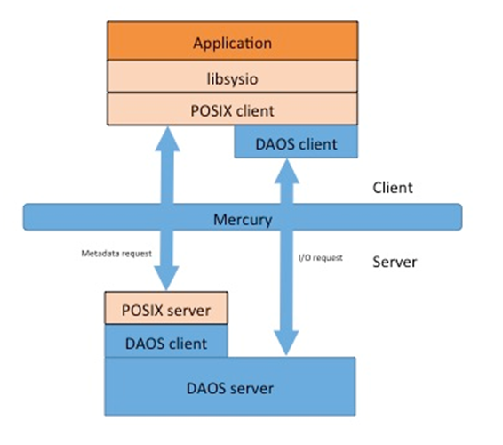

# POSIX Emulation

This section covers the internals of the POSIX namespace encapsulation inside a DAOS container. It first addresses generic considerations related to POSIX emulation over DAOS and then focuses on the private and system namespaces. Both the private and shared namespaces will use the same layout and software architecture, but implement different concurrency control and transaction strategy.

This document contains the following sections:

- <a href="#11.1">POSIX Representation</a>
    - <a href="#1.1.1">Directories</a>
    - <a href="#11.1.2">Files</a>
    - <a href="#11.1.3">Superblock and Reserved Objects</a>
- <a href="#11.2">Client/Server Architecture</a>
    - <a href="#11.2.1">Client Interface</a>
        - <a href="#11.2.1.1">Lilbsysio</a>
        - <a href="#11.2.1.2">FUSE Mountpoint</a>
    - <a href="#11.2.2">DAOS-POSIX Service</a>
        - <a href="#11.2.2.1">Epoch Distribution</a>
        - <a href="#11.2.2.2">Scalable Inode/Object Allocation</a>
        - <a href="#11.2.2.3">Distributed Caching</a>
    - <a href="#11.2.3">Client/Server Protocol</a>
- <a href="#11.3">Private POSIX Namespace</a> 
    - <a href="#11.3.1">Transaction Model</a>
    - <a href="#11.3.2">Concurrency Control and POSIX Compliance</a>
    - <a href="#11.3.3">Client/Server Protocol</a>
    - <a href="#11.3.4">Fault Handling</a>
- <a href="#11.4">System Namespace</a>
    - <a href="#11.4.1">Authentication and Authorization</a>
    - <a href="#11.4.2">Concurrency Control</a>
    - <a href="#11.4.3">Fault Handling</a>

## POSIX Representation

This section describes the layout of the POSIX namespace over DAOS objects.

### Directories

A directory will be represented by a dynamically striped document KV object. The directory entry name is used as the distribution key and the inode attributes will be stored in different attribute keys. The inode attributes include:

- **ino:** the object ID of the file or directory
- **type:** the inode type, either regular file, directory & soft link.
- **size:** the size of the file or directory.
- uid: the user owning the file or directory.
- **gid:** the group owning the file or directory.
- **user permission:** user access permission
- **roup permission:** group access permission
- **other permission:** access permission for uid/gid which are not the owner.
- **ctime:** last change time of the owner or access permission
- **mtime:** last modification time of the contents
- **atime:** last data access time
- **flags:** various flags of the file or directory for different purposes
- **EA-{extended attribute name}:** a different entry prefixed with “EA-“ will be created for each extended attributes.
- **First data block:** the first block of data (e.g. 4MB or 16MB) will be stored in an attribute which is then co-located with the inode attributes. This should improve latency for small POSIX files because this first block of data could be returned on open. This first data block support partial updates.
- **External object:** reference to an external DAOS object, which is either a byte array object for a regular file or a document KV object for a directory. This external object is stored when the POSIX file grows beyond the first data block.
- **Link path:** if the inode type is set to link, this entry will store the path to the target file or directory.

Each of these attributes will be stored under a different attribute key and are thus guaranteed to be stored on the same target and can be fetched altogether in a single RPC. Each attribute can be updated independently of the others, which avoids the need for read/modify write when updating only a single attribute. All attribute values are atomic, except the first data block entry, which can be partially updated.

Note that the simplicity and scalability of this model does not allow support for hard links, because the inode attributes are stored with a directory entry. As for open/unlink file, the directory entry will be migrated to an internal orphan directory and destroyed on the last close.

### Files

The content of a regular file that grows beyond the first data block (stored along with the other inode attributes) is stored in a DAOS-SR dynamic byte-array object. Reads and writes to POSIX files will be translated into array object reads and writes. The file size will be maintained as an inode attribute and will be updated more or less accurately depending on the use case. Please see the sub-sections dedicated to the private and system namespace for more details. 

The versioning object store guarantees internally that POSIX write semantics are honored, that's to say, after a write() has successfully returned: 

- Any subsequent successful read() from each byte position in the object that was modified by that write returns the data specified by the write() for that position until such byte positions are again modified.
- Any subsequent successful write() to the same byte position in the object overwrites that object data.

To address races between overwrites in the same epoch, the POSIX implementation will use asynchronous replication, which guarantees that replicas are always consistent.

Symbolic links will not use any external object and will just store the path to the target file or directory in a dedicated inode attribute.

Special character and block devices, sockets, and pipes are not supported, but can be easily added in the future if required.

### Superblock and Reserved Objects

A superblock recording file-system-wide information is stored in a document KV object with a pre-defined object identifier. The superblock is created when the container is initialized as a POSIX file system, via a dedicated library function. It is parsed during mount and if no valid superblock is found, then the mount fails.

The following information will be stored in different records of the superblock KV:

- magic number to testify if it is a POSIX file system
- file system creation time
- last time the file system was mounted
- feature flags used to detect incompatible features.
- version flag used for file system upgrade purpose.
- the number of allocated inodes
- the last allocated object ID, and the file system will allocate new ID from last objected ID + 1.

In addition to the superblock, some additional objects with reserved identifiers are created at initialization time, including:

- the root document KV object representing the file system root directory
- the orphan document KV object used to store open-unlinked files
- a quota KV object storing both space accounting and quota limits for users
- a quota KV object storing both space accounting and quota limits for groups
- a quota KV object storing both space accounting and quota limits for projects 

In the future, all quota information could be stored in a single KV object if range query and enumeration are supported.

## Client/Server Architecture

The DAOS-POSIX software framework provides the infrastructure to implement POSIX namespace encapsulation with different a locking and transaction strategy. It relies on a client/server architecture that interfaces with applications or system tools on the client side, and provides handlers on the servers to store POSIX files and directories in a common format described in the previous section.

### Client Interface

POSIX emulation will be provided through a client library, which will be built upon DAOS-SR. Any POSIX operation from the application will be intercepted, and forwarded to this DAOS POSIX(DSP) library, which will translate the POSIX request into the DAOS API. The POSIX call interception can be done via either libsysio or FUSE.

#### Lilbsysio

Libsysio  is an open source library providing POSIX-like file I/O and namespace support from the application program address space. Similarly to the VFS, libsysio intercepts a POSIX request, then resolves the path until the last parent and forwards the request to handlers registered by DSP client.

#### FUSE Mountpoint

A FUSE mount point can be registered to export the encapsulated POSIX file system. The FUSE methods to manage this mount point will be implemented by a system daemon linking with the DSP client library. This library will then use the function shipper to forward requests to the DSP servers.

The FUSE mount point will use the direct_io option to avoid using the page cache, because client nodes do not hold any locks to protect this cache. Caching capability will be offered by the server side.

### DAOS-POSIX Service

The DAOS-POSIX (DSP) service runs on the storage nodes and provides handlers for DSP functions shipped by the DSP clients. The DSP service threads communicate altogether to manage transactions, allocate unique inode numbers and manage a distributed cache.

#### Epoch Distribution

To guarantee consistency, all DAOS operations resulting from the processing of a POSIX operation will be submitted with the same epoch number. Multiple concurrent POSIX operations may use the same epoch number.

Epochs are managed by servers, which coordinate to submit I/O operations against the same epoch number. When a new persistent state of the file system must be generated (depending on the use case), a collective is initiated by one of the DSP servers to request that all other servers stop using HCE+1 and move to HCE+2. Upon completion of the collective, any new POSIX operation is guaranteed to be submitted under HCE+2 by the DSP servers. The DSP server that initiated the collective can then trigger a container flush and commit HCE+1 to generated a new committed state of the POSIX file system. 

#### Scalable Inode/Object Allocation

Inode number will be implemented by object ID. To make sure object ID is unique in the whole file system, a thread called object ID server (IDS), will be started to manage the object ID allocation.

IDS is started during mount, which retrieves the last consumed ID from the superblock, from which it allocates object IDs. To avoid the replication overhead of persisting the superblock, IDS should always request a large range of contiguous object IDs, then store the last consumed ID to the superblock and cache this range locally. Each time the IDS gets an ID allocation request from a DSP server, it gives a sub-range of the cached ID range to this DSP server. The IDS needs to access the superblock again only if the number of allocated IDs hits a low-water mark, at that time, the IDS should request another range of IDs from the superblock again.

After a DSP server requests a range of object IDs, it caches this range locally. When creating new objects, the DSP server will allocate an ID from locally cached object IDs without any communication. When the DSP server uses up all of its locally cached object IDs, it will remotely request a new range of object IDs.

If the IDS fails, all allocated but unused IDs cached on this IDS will be discarded. Those DSP servers that already have received ID ranges from the failed IDS can still use allocated IDs. Another instance of IDS will shortly start on a different node. This new IDS can load the last consumed ID and allocate a range of IDs from the superblock,and then begin to handle future ID allocation requests.

Object ID is 256 bits, but for application the maxim inode bits is 64 bits, so when last allocated ID reach to 2^64 -1, new allocation should return ENOSPC.

#### Distributed Caching

DSP servers will rely on a novel scalable mechanism to cache frequently accessed data structures like directory entries. The primary goal is to speed up path resolution when all compute node wants to resolve the same path.

A spanning tree is created for each DSP server over all the remaining storage servers, and is used to cache directory entries maintained by the root DSP server. Lookup requests may be satisfied immediately by any tree node caching the directory entry, otherwise lockup requests are forwarded toward the relevant root. All tree nodes maintain state to determine which child nodes currently cache the data structure, to ensure all cached replicas are invalidated before the directory entry is unlinked (or renamed) at the root.

Unlike traditional client/server locking mechanisms, the latency using this mechanism scales O(log(N)) because all communications are routed over a spanning tree rooted at the server, which aggregates messages as they approach the server and replicates messages as they heard towards replicas.

### Client/Server Protocol

The client/server protocol is specific to the private or system namespace. Each use-case will implement different mechanisms for concurrency control, and will thus ship different calls. The <a href="#f11.1">figure</a> below represents how data and metadata requests are handled.

For a metadata operation, DSP client library ships the metadata request to the DSP server. Then the DSP server unpacks the request, translates it into the DAOS operations, and submits them through the DSR client API.

As for a data operation, a POSIX read/write request could be translated immediately to DAOS read/write request. One caveat is that client nodes do not know what epoch to be used for a write (read can use the -1 epoch to always read the most up-to-date data). Therefore, write (and then read as well) operations must also go through the DSP server. The DSP client gets the object layout from SR to determine where writes go and sends writes there to the DSP, which assigns the epoch. To deal with layout change, the DSP server should check layout version and get the client to retry on mismatch.
 

**Client/server protocol for data and metadata operation**

## Private POSIX Namespace 

The private POSIX Namespace is intended for applications collaborating in an HPC workflow, and is designed for scalability and performance on the assumption that conflicting operations – e.g. create and unlink of the same file – are serialized both within and between applications. The private namespace is designed to be used directly or by POSIX-based middleware (e.g., HDF5, ADIOS, etc.) and supports massively scalable shared file as well as file-per-process I/O. 

### Transaction Model

The transaction model used by the private namespace is fairly simple. DSP servers use the same epoch number, which is committed on application demand (flush, sync or other API exported by DAOS) or eventually after some timeout. As explained in the previous section, one of the DSP servers will issue a collective to notify all the other DSP servers to increase the epoch number to be used. This latter will then flush and commit the epoch to generate a new persistent and consistent state of the private namespace. Upon completion of the collective, all new POSIX operation (data and metadata) are guaranteed to use HCE+2.

The application can also generate a named snapshot. The process is similar to a commit request except that a snapshot of the freshly committed epoch is taken. Named snapshots are then accessible in the namespace under a specific directory decided by the application when creating the snapshot. This allows producers to create snapshots that consumers can read.

### Concurrency Control and POSIX Compliance

To serialize concurrent accesses to the same object, the DSP server needs to implement a locking strategy. Given that well-behaved applications rarely generate conflicting metadata operations and also given the performance and complexity costs of distributed locking, the private namespace relies on server local locking. Consequently, a POSIX request for one object will always be shipped to the same DSP server, which locks the object locally to guarantee that no other process accesses the object at the same time. The DSP server location is determined by the SR layer, and is the target where the directory entry and the inode attributes are stored. For example, a file creation will be shipped to the DSP server managing the to-be-created directory entry in the parent document KV. This server locks the directory entry locally, checks whether the entry already exists, and creates it if it does not.

That said, some POSIX operations might still involve multiple DSP servers. One example is rmdir(2) which needs to make sure no other threads are creating directory entries under this directory. If the parent and child directory are not located in the same DSP server, then locking across different DSP servers might be required, which will obviously impact performance. The following solution is proposed to address this problem. Prior to allowing a directory entry creation, the DSP server managing a directory tablet (i.e. directory shard) must acquire a reference from the DSP server managing the directory inode. Only a single reference is required and nothing needs to be done if a reference is already taken. As a result, the reference will only be gotten once initially, and kept in memory, so it would involve an additional RPC the first time an entry in a directory is created on each server. A given DSP server would only get a single reference for all the entries it might cache in this directory. This reference needs to be held by the DSP server as long as it has valid entries in this directory. 

This way, when unlinking a directory, the DSP server in charge of the directory inode will perform as follows:

1.	Lock the parent directory inode locally; this prevents any further reference from being grabbed.
2.	Check whether the refcount is 0. If it is not, then fail with ENOTEMPTY.
3.	Read one entry from the parent directory KV stored in DAOS (for idle dirents). If an entry is returned, fail with ENOTEMPTY. This is required because refcount is only grabbed on explicit creation and some tablet might have pre-existing entry for which the DSP server hasn’t acquired any refcount since the directory was idle.
4.	Unlink the directory and return success.
5.	Unlock the parent directory.

As for file and directory creation under the directory:

1.	Check if there is local reference to the directory inode server. If there is already a reference, then do the creation. If there is no reference, request a reference. If the directory is being locked, then return error.
2.	Create the file or subdirectory under the directory. 
3.	Then increase the local reference count of the directory. 

Furthermore, on unlink, one needs to check if there is local reference count of the parent directory, then decrease the local reference count of the directory. If the reference count reaches to 0, then release the reference count and notify the parent.

The two other operations requiring cross-DSP server locking are rename(2), and unlink(2) of an open file which must be moved to the orphan directory. For those cases, the following exception to the POSIX semantics will be imposed:

- Renaming or unlinking an open file fails with EBUSY.
- Rename is not atomic which means that a reader could see both the old and new names. Rename will be handled in several steps, and for each step, it will only use local lock and make sure it is atomic:

    a.	Unlink the target entry on the target directory.
    
    b.	Clone the source entry into the target entry. All the inode attributes of source entry, including the external object ID if present, are copied.
    
    c.	Unlink the source entry in the source directory, which needs to delete associated inode attributes, but not the external object. 

This process is somewhat similar to what the mv(1) command does when moving a file from one mount point to another one, but without copying the file or directory content.

- Changing metadata attributes of a file that is being renamed might cause some of the metadata attribute changes to be lost during the inode migration. The same problem exists with the mv(1) command when moving a file between different mount points.
- Time attributes of both regular files and directories might not be accurate.

Those limitations are considered as acceptable for a "well-behaved" workflow.

Furthermore, to simplify file size management, truncate(2) is only supported as part of open(2) (i.e. O_TRUNC) and fails if the file is already opened. With this limitation, the file size can be maintained as followed:

- The file size is updated in the inode attribute on open(O_TRUNC) and on close if the size reported by the client is bigger than what is stored in the attribute.
- On open, the file size stored in the inode attribute is returned to the client
- Client node caches the file size in the file descriptor. Any successful write increases the local, cached file size.
- The file size reported in stat(2)/fstat(2) is the maximum between the one stored in the inode attribute and the size cached in any local file descriptor associated with this file.
- Read requests are always sent to the DSP servers. The following scenarios are considered:
1.	The DSP server reads from the local object and does not hit any hole or miss. In this case, the read region is guaranteed to be completely below EOF and the data is returned to the application.
2.	The DSP server encounters a hole or extent miss at the end of the read and it has a valid extent at a higher offset. The read region is again guaranteed to be entirely below EOF and the data along with the hole (i.e. zeros) is returned to the application.
3.	The DSP server encounters a hole and has no valid extent at higher offset. It returns a short read to the client. The DSP library then checks whether the read end offset is higher than its cached file size. If so, it completes the read data returned by the DSP server, if any, with zeros (hole) and returns success (no short read) to the application. Otherwise, the DSP library queries through the DSR client library the extent with the highest end offset. If there is no further extent beyond what the read request returned, then a short read is returned. Otherwise, a new read RPC is sent again in case the read request was racing with a write at the end of the file. Upon completion of the read, the result is returned to the caller based on the file size computed from the query.

### Client/Server Protocol

This section describes the private namespace protocol. A DSP client sends POSIX requests to the DSP server in charge of the directory entry and inode attributes. The server handles these requests through different handlers. Each handler translates the POSIX request into the DAOS operations and then calls the DAOS client API to execute these operations.

The POSIX operations will be handled as follows:

**Mount**

A client node opens the container, reads directly the superblock through the DSR client API, and sends a mount request to a random DSP server. This mount request can specify the epoch number of a snapshot, which will then be mounted read-only. The DSP server initiates a collective communication across all DSP servers to register the mount point, and distributes the epoch to be used (either a snapshot or HCE+1). Upon success, the private namespace is mounted locally on this client node. The local2global() and global2local() API can then be used to transfer the mount point (along with the container open handle) to other client nodes.

**Un-mount**

The private namespace can be independently un-mounted on each client node.

**Sync**

A client sends a sync request to a random DSP server, which triggers a collective across all DSP servers to request an epoch increase. Upon successful completion of the collective RPC, HCE+1 is guaranteed not to be used any more. At this point, HCE+1 can be safely flushed and committed by the DSP server that initiated the collective. A call to slip() is also issued to release the reference on the previous HCE and trigger aggregation.

**Snapshot**

This process is similar to sync except that a named snapshot is taken prior to calling slip. This creates a snapshot that is then accessible under a specific directory in the namespace.

**Statfs**

This operation retrieves the file system statistics by issuing a collective RPC to all the DSP servers, which report their current usage.

**Lookup**

The client sends the lookup request to the DSP server in charge of the directory entry. The server grabs a local read lock, looks up the directory entry in the local table and returns back the inode attributes if any and ENOENT otherwise. The read lock is then released.

**Readdir**

The client enumerates the distribution keys by sending RPCs to each DSP server storing a tablet of the directory. 

**Getattr**

The client ships the getattr call to the DSP server storing the directory entry. The server handler locks the entry for read, parses the inode attributes, and returns them back. The local lock is then released. 

**Setattr**

The client ships the setattr call to the DSP server storing the directory entry. The server handler locks the entry for write, updates the relevant inode attributes, and releases the lock.

**Mkdir/Create**

The client ships the call to the DSP server storing the directory entry. The server checks and gets a reference count from the DSP server in charge of the parent inode, if needed. If the reference cannot be grabbed (i.e., the parent directory is being removed), an error is returned. The server then locks the directory entry, checks if the directory entry already exists and reports an error it does. It allocates a new inode number and object ID from local ID cache if there is still ID left. Otherwise, it requests a new range of object IDs. Once the ID allocated, it creates a document KV for a directory and a byte array for a regular file and inserts the directory entry along with the inode attributes inside the local tablet. The directory entry is then unlocked and success is returned to the client.

**Symlink**

This operation is managed in the same way as create, except that no external object needs to be created. 

**Unlink**

The client ships the call to the DSP server storing the directory entry. The server locks the directory entry and then checks if the directory entry exists. If entry does not correspond to a file, the server reports an error. If the file is being opened, EBUSY is returned to the client. Then it deletes the directory entry from the tablet and destroys the external object, if any. The directory entry is then unlocked and success is returned to the client. If the server holds a reference on the parent directory while it is now empty, the reference is dropped by sending an RPC to the DSP server in charge of the parent inode.
**Rmdir**

This operation is similar to unlink except that the server checks whether the directory is empty and if the directory reference count is set to 0.

**Open**

The client ships the open call to the DSP server storing the directory entry. This server is responsible for tracking all open handles granted to clients. The server locks for read the directory entry, records the new opener, and returns back the open handle along with the file size stored in the inode attribute.

**Close**

The client ships the close call to the DSP server storing the directory entry, which releases the open handle. The file size cached on the client node is returned on close and updated by the DSP server if the file size value is bigger than the one stored in the inode attribute.

**Rename**

As mentioned in the previous section, the rename function is not atomic. It is handled by the client as follows: unlink the target entry, create the target entry, getattr the original entry, setattr the target entry, and finally, unlink the original entry. The setattr request allows the object ID of the external array to be set to that of the original entry. If any step fails, the rename operation reports an error. 

**Read**

The client calls the DSR client API to fetch the layout of the byte array associated with the file, and ships the read calls to the relevant DSP servers. The DSP server then forwards the read request to the local DSR module with the correct epoch number (i.e. HCE+1 to read the latest data or the snapshotted epoch). The DSP server returns to the client the read data, if any, along with its knowledge of the current file size (see previous section). The DSP library gathers all the file size information (size returned by the DSP servers and local cached file size) and eventually issues a DSR query to find out the actual file size. It finally returns to the application either a short- or full-size read. 

**Write**

The client calls the DSR client API to fetch the layout of the byte array associated with the file, and ships write calls to the relevant DSP servers. The DSP servers then fill the epoch to be used for the I/O, and hand the request to the local DSR server that performs the writes. Once the write is completed, the client increases the file size in its local cache.

### Fault Handling

For private namespace, if any server or clients fail during running, the application will fail. In other words, the user needs to restart the application, which will remount the file system and reopen the DAOS container. DAOS will roll-back to HCE and the application will start running from there. So if the user does not increase HCE actively in the application, then all of its data might be lost once failure happens. To let data survive over the failure, the application should issue a sync or snapshot call to generate new persistent rollback state.

## System Namespace

A shared global namespace accessible from all the compute nodes is provided to store application binaries, libraries, user files, and links to other containers. 

### Authentication and Authorization

Unlike the private namespace, the system namespace is multi-tenant and is accessed by many different users and groups. The FUSE context will be used to identify the UID/GID of the requester which are then transferred to the server through the function shipper. On the server side, the DSP server will enforce POSIX permission checks and return EACESS if the requester does not have the permissions to access the file.

### Concurrency Control

Unlike the private namespace, the system namespace handles requests from un-coordinated clients, which are not considered as “well-behaved” and could potentially generate contended POSIX operations. As a result, a distributed lock manager will be used to guarantee consistency of the POSIX namespace in the face of concurrent conflicting operations. Moreover, epochs will be managed by the DSP server which will regularly commit new epoch based on time or when explicitly requested by the user (e.g. via sync).

Updates are all submitted against HCE+1 until one of the DSP servers issues a collective RPC to request commit for this epoch. Each DSP server waits for outstanding operations using this epoch to complete and then acknowledge the collective request. At that point, any new operation will use HCE+2. Upon successful completion of the collective RPC, the commit requested can then flush the epoch and commit HCE+1. Reads are served as well from current epoch.

The distributed lock manager will be based on concepts developed in VAX, and will reuse/port an existing DLM implementation. Locks will be used to maintain the internal consistency of the namespace, but not for file I/O (aka extent locks). The <a href="#t11.1">table</a> below summarizes the locks that will be held for each metadata operation.

**Distributed Locking for System Namespace**

|Metadata Operations|Parent|Target Parent|Target Child|
|---|---|---|---|
|Create File/Dir|PW|None|None|
|Unlink File|PW|None|None|
|Unlink Dir|PW|None|None|
|Rename|PW|PW|EX|
|Link (soft)|PW|None|None|
|Link (hard)|PW|None|None

Where:

- Distributed Locking for System Namespace
- PW: Protective write lock mode[19].
- EX: Exclusive lock mode[19].
- No: No need lock.
- None: No such objects in the operation.

These locks will be acquired by the DSP server before processing a metadata request. This replaces the local locking approach of the private namespace and provides stronger consistency semantic. Initially, locks will be released after use and not cached. This can be enhanced in the future by implementing lock callback and LRU cache.

The file size will be maintained on the server side through a spanning tree across servers, which will be used as well for directory entry caching.

### Fault Handling
The system namespace supports a fault model similar to NFS in async mode, or a local file system. This means that, when a DSP server fails, the container storing the system namespace is rolled back to the latest committed state, which is HCE. This means that any updates submitted in a not-yet-committed epoch are lost. As a result, fsync and sync must be called whenever data and metadata are required to be persistent. This is mitigated by the commit frequency of the DSP server, which is expected to be fairly short (on the order of once-per-second, if not more often).
