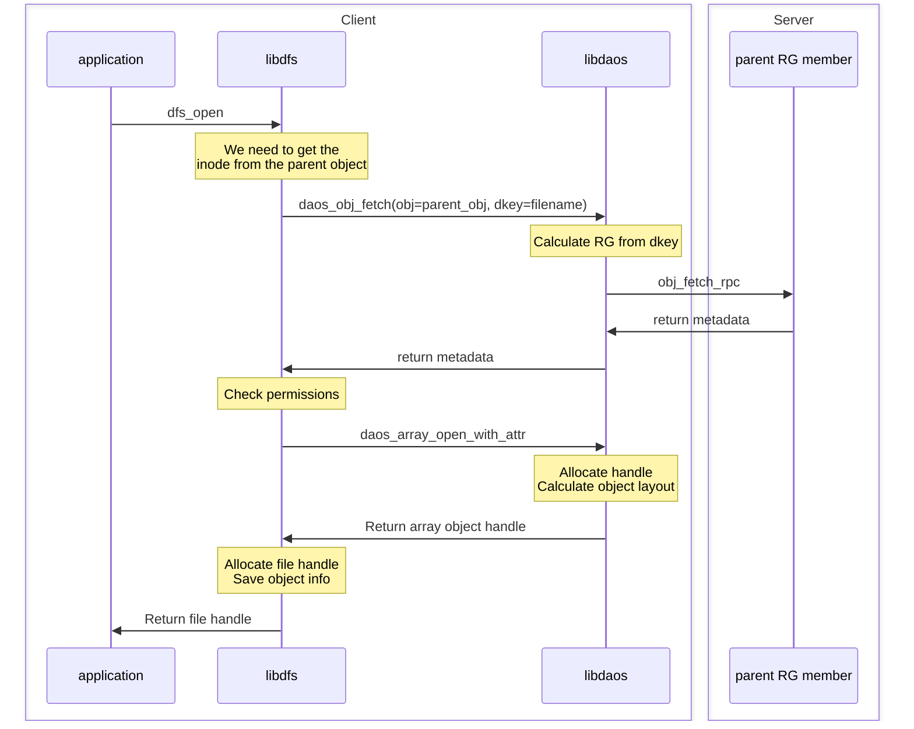
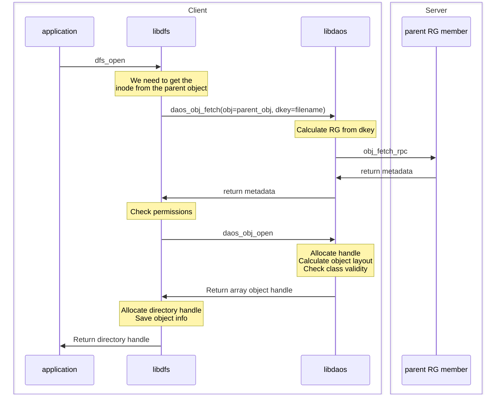

# DFS Overview

DFS stands for DAOS File System. The DFS API provides an encapsulated namespace
with a POSIX-like API directly on top of the DAOS API. The namespace is
encapsulated under a single DAOS container, where directories and files are
objects in that container.

The encapsulated namespace will be located in one DAOS Pool and a single DAOS
Container. The user provides a valid (connected) pool handle and an open
container handle where the namespace will be located.

## DFS Namespace

When the file system is created (i.e. when the DAOS container is initialized as
an encapsulated namespace), a reserved object (with a predefined object ID) will
be added to the container and will record superblock (SB) information about the
namespace. The SB object has the reserved OID 0.0. The object class is
determined either through the oclass parameter passed to container creation or
through automatic selection based on container properties such as the redundancy
factor.

The SB object contains an entry with a magic value to indicate it is a POSIX
filesystem. The SB object will contain also an entry to the root directory of
the filesystem, which will be another reserved object with a predefined OID
(1.0) and will have the same representation as a directory (see next
section). The OID of the root id will be inserted as an entry in the superblock
object.

The SB will look like this:

~~~~
D-key: "DFS_SB_METADATA"
A-key: "DFS_MAGIC"
single-value (uint64_t): SB_MAGIC (0xda05df50da05df50)

A-key: "DFS_SB_VERSION"
single-value (uint16_t): Version number of the SB. This is used to determine the layout of the SB (the DKEYs and value sizes).

A-key: "DFS_LAYOUT_VERSION"
single-value (uint16_t): This is used to determine the format of the entries in the DFS namespace (DFS to DAOS mapping).

A-key: "DFS_SB_FEAT_COMPAT"
single-value (uint64_t): flags to indicate feature set like extended attribute support, indexing

A-key: "DFS_SB_FEAT_INCOMPAT"
single-value (uint64_t): flags

A-key: "DFS_SB_MKFS_TIME"
single-value (uint64_t): time when DFS namespace was created

A-key: "DFS_SB_STATE"
single-value (uint64_t): state of FS (clean, corrupted, etc.)

A-key: "DFS_CHUNK_SIZE"
single-value (uint64_t): Default chunk size for files in this container

A-key: "DFS_OBJ_CLASS"
single-value (uint16_t): Default object class for all objects in this container

A-key: "DFS_DIR_OBJ_CLASS"
single-value (uint16_t): Default object class for directories in this container

A-key: "DFS_FILE_OBJ_CLASS"
single-value (uint16_t): Default object class for files in this container

A-key: "DFS_MODE"
single-value (uint16_t): Consistency mode of this container (Relaxed vs Balanced)

A-key: "DFS_HINTS"
single-value (string): Container hints for object class selection for files and directories

D-key: "/"
// rest of akey entries for root are same as in directory entry described below.
~~~~~~

## DFS Directories

A POSIX directory will map to a DAOS object with multiple dkeys, where each dkey
will correspond to an entry in that directory (for another subdirectory, regular
file, or symbolic link). The dkey value will be the entry name in that
directory. The dkey will contain an akey with all attributes of that entry in a
byte array serialized format. Extended attributes will each be stored in a
single value under a different akey. The mapping table will look like this
(includes two extended attributes: xattr1, xattr2):

~~~~~~
Directory Object
  D-key "entry1_name"
    A-key "DFS_INODE"
      RECX (byte array starting at idx 0):
        mode_t: permission bit mask + type of entry
        oid: object id of entry
        mtime: modify time (seconds)
        ctime: change time (seconds)
        chunk_size: chunk_size of file (0 if default or not a file)
        object class: default object class of objects under this dir
        mtime: modify time (nano-seconds)
        ctime: change time (nano-seconds)
        uid: user identifier
        gid: group identifier
        size: symlink size (0 for files/dirs)
        object HLC: internal timestamp used to track max epoch of a file
    A-key "x:xattr1"	// extended attribute name (if any)
    A-key "x:xattr2"	// extended attribute name (if any)
~~~~~~

The extended attributes are all prefixed with "x:".

This summarizes the mapping of a directory testdir with a file, directory, and
symlink:

~~~~~~
testdir$ ls
dir1
file1
syml1 -> dir1

Object testdir
  D-key "dir1"
    A-key "mode" , permission bits + S_IFDIR
    A-key "oid" , object id of dir1
    ...
  D-key "file1"
    A-key "mode" , permission bits + S_IFREG
    A-key "oid" , object id of file1
    ...
  D-key "syml1"
    A-key "mode" , permission bits + S_IFLNK
    A-key "oid" , empty
    A-key "syml", dir1
    ...
~~~~~~

By default, all directories are created with an object class with 1 shard. This means, that if the
container redundancy factor (RF) is 0, OC_S1 oclass will be used; if RF=1 OC_RP_2G1 is used, and so
on. The user can of course change that when creating the directory and set the desired object class
manually, or set the default object class when creating the container.

Note that with this mapping, the inode information is stored with the entry that it corresponds to
in the parent directory object. Thus, hard links won't be supported, since it won't be possible to
create a different entry (dkey) that actually points to the same set of akeys that the current ones
are stored within. This limitation makes the representation simple as described above.

## Files

As shown in the directory mapping above, the entry of a file will be inserted in
its parent directory object with an object ID that corresponds to that file. The
object ID for a regular file will be of a DAOS array object, which itself is a
DAOS object with some properties (the element size and chunk size). In the
POSIX file case, the cell size will always be 1 byte. The chunk size can be set
at create time only, with the default being 1 MB. The array object itself is
mapped onto a DAOS object with integer dkeys, where each dkey contains
chunk_size elements. So for example, if we have a file with size 10 bytes, and
chunk size is 3 bytes, the array object will contain the following:

~~~~
Object array
  D-key 0
    A-key NULL , array elements [0,1,2]
  D-key 1
    A-key NULL , array elements [3,4,5]
  D-key 2
    A-key NULL , array elements [6,7,8]
  D-key 3
    A-key NULL , array elements [9]
~~~~~~

For more information about the array object layout, please refer to the
README.md file for Array Addons.

By default, all files are created with an object class with max sharding. This means, that if the
container redundancy factor (RF) is 0, OC_SX oclass will be used; if RF=1 an EC oclass OC_EC_nP1GX
is used, and so on. The user can of course change that when creating the file and set the desired
object class manually, or set the default object class when creating the container.

Access to that object is done through the DAOS Array API. All read and write
operations to the file will be translated to DAOS array read and write
operations. The file size can be set (truncate) or retrieved by the DAOS array
set_size/get_size functions. Increasing the file size however in this case, does not
guarantee that space is allocated. Since DAOS logs I/Os across different epochs,
space allocation cannot be supported by a naïve set_size operation.

## Symbolic Links

As mentioned in the directory section, symbolic links will not have an object for the symlink
itself, but will have a value in the entry itself of the parent directory containing the actual
value of the symlink. In addition to inode akey, symlinks have an akey that contains a single value
of the symlink value itself:

Symlink Object
  D-key "entry1_name"
    A-key "DFS_INODE"
      ..
    A-key "DFS_SLINK" - only exists if entry is a symlink
      Single Value:
        Symlink value

## Access Permissions

All DFS objects (files, directories, and symlinks) inherit the access
permissions of the DFS container that they are created with. So the permission
checks are done on dfs_mount(). If that succeeds and the user has access to the
container, then they will be able to access all objects in the DFS
namespace.

setuid(), setgid() programs, supplementary groups, ACLs are not supported in the
DFS namespace.

## Time settings

DFS stores the mtime (modify) and ctime (change) in the inode information of an object. the mtime is
actively maintained for just file objects (changing a file contents updates the mtime value that
would be returned on stat). At this time, mtime for directory objects and ctime for all objects are
not actively maintained. atime (access) is not stored in DFS and stat returns the max value between
mtime and ctime for atime.

## Container Hints

A user can set container hints when creating a POSIX type container. Those hints are immutable and
are used internally to select a more suitable object class for files and directories than the
default selection that the internal object API would do. The hints are required to be passed in the
following format:

~~~~~~
type:value,type:value
type can be file or dir (directory is also accepted)
value can be:
 - single (single sharded objects for small files / directories) or
 - max (maximum sharded objects for large files / directories)
~~~~~~

If a hint is set to single, depending on the container redundancy factor, the oclass would be (same
for files and dirs in this case):
 - S1 if rd\_fac == 0
 - RP\_2G1 if rd\_fac == 1
 - RP\_3G1 if rd\_fac == 2

Otherwise if the hint is set to max, for directories, it would be the same as single except the
group would be X for max sharding (SX, RP_2GX, etc.). For files on the other hand, we use EC for
redundancy instead of replication in this case (n depends on the number of fault domains in the
pool):
 - SX if rd\_fac == 0
 - EC\_nP1GX if rd\_fac == 1
 - EC\_nP2GX if rd\_fac == 2

# DFS control flow

Below are a few sequence diagrams to illustrate what happens when a dfs API is
called.

## Opening an existing file with dfs_open

## Opening an existing directory with dfs_open

