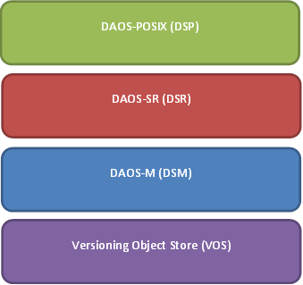
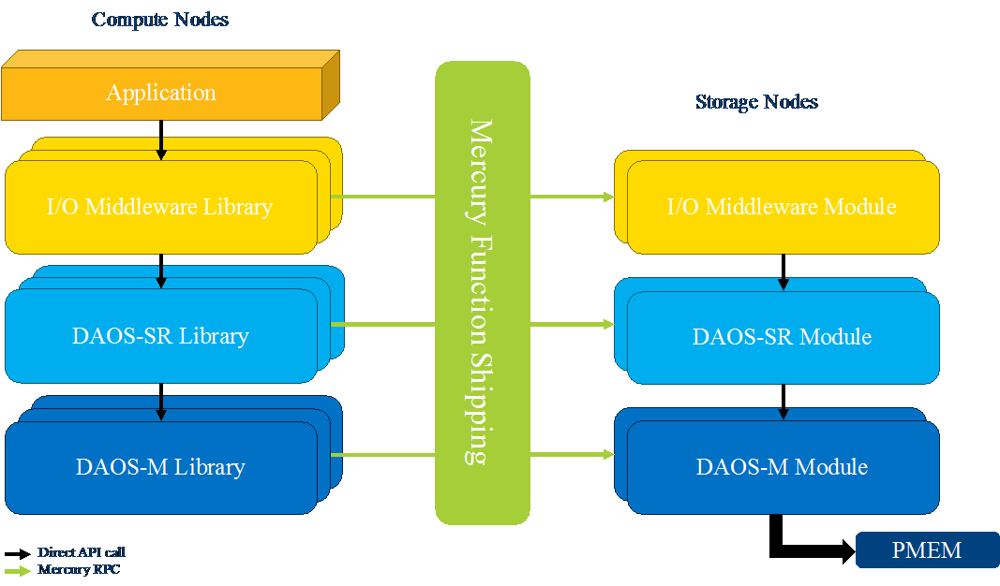

# DAOS Storage Stack

This section introduces the layered architecture of the storage stack.

This document contains the following sections:

- <a href="#51">DAOS Layering</a>
- <a href="#52">Client/Server Architecture</a>
    -  <a href="#53">DAOS Common Libraries</a>
    - <a href="#54">DAOS Client Libraries</a>
    - <a href="#55">DAOS Server and Server Modules</a>
    - <a href="#56">Integration with System Management</a>
    - <a href="#57">DAOS and mOS</a>
- <a href="#58">Network Transport</a>
    - <a href="#59">Mercury Function Shipper</a>
    - <a href="#60">Multi-layer Function Shipping</a>
    - <a href="#61">Node Addressing</a>
- <a href="#62">Persistent Memory based Storage</a>
    - <a href="#63">In-Memory Storage</a>
    - <a href="#64">Lightweight I/O Stack: NVM Library</a>
 - <a href="#65">Software compatibility</a>
    - <a href="#66">Protocol Compatibility</a>
    - <a href="#67">PM Schema Compatibility and Upgrade</a>
    

## DAOS Layering

The DAOS stack is organized in four different layers. Each layer provides a unique set of functionality based on the abstraction offered by the layer below. The layered architecture relies on a top-down dependency structure that allows each layer to be usable, independently of the upper layers. Application and middleware can then plug into any layer of the stack, depending on the level of functionality required. This architecture is also very convenient for testing, debugging, and performance analysis. The <a href="#5a">figure</a> below shows the logical layering of the DAOS stack.

The Versioning Object Store (VOS) is the essence of the DAOS object model. It provides object storage local to a storage node and represents the foundation of the storage target. A VOS instance supports multiple object address spaces and maintains multiple concurrent versions of each address space. VOS uses a persistent-memory storage model for all VOS metadata, and may use either persistent memory or block storage for VOS data. VOS logs all object update operations and maintains internal indexes to integrate object reads at arbitrary epochs efficiently. VOS also supports epoch aggregation to collapse the history, simplify metadata, and reclaim space.

DAOS-M (DSM) stands for memory-class DAOS. While VOS focuses on issues local to one storage node, the DAOS-M layer implements a DSM client library that communicates with different types of DSM services—one of which exports the VOS methods—and allows callers to interact with the distributed pool and container abstractions. A DSM pool manages pool connections, authentication and authorization, target membership, etc., and stores per-container metadata for upper layers. A DSM container manages container handles, distributed epoch state, etc., but provides only target-local objects. I/O accesses to these local objects go almost transparently to VOS with very little overhead. The DAOS-M layer runs the pool and container metadata services, which are replicated with strong consistency and fault tolerance. Object storage is partitioned over storage targets with no redundancy.

DAOS-SR (DSR) stands for the DAOS sharding and resilience layer. It provides a global object address space for each container and distributes object data across multiple DAOS-M objects stored on different targets, to achieve horizontal scalability and fail-out resilience. DSR supports a large variety of object schemas including replication and erasure codes, static or dynamic striping, algorithmic or explicit target enumeration, and specific target affinity.

DAOS-POSIX (DSP) is the POSIX emulation layer and is one possible top-layer API. This layer provides POSIX namespace encapsulation into a container. It implements basic POSIX semantics on top of DSR objects and leverages the epoch mechanism to support snapshots and guarantee consistency both for POSIX metadata and for application data. DSP implements its own concurrency control mechanism and is not fully POSIX compliant. 

## Client/Server Architecture

As represented in the <a href="#5b">figure</a> above, each DAOS layer (except VOS, which is only present on the storage nodes) is composed of both a client-side and a server-side component. For instance, the DSP server module is responsible for metadata locking and epoch distribution. All top-level layers can have a server-side component, if needed.

This approach allows upper layers of the stack to ship complex operations to storage nodes, which can result in multiple low-level DAOS operations.

### DAOS Common Libraries

Common functionality and infrastructure shared across all DAOS components are provided in external shared libraries. This includes the following features:

- Hash and checksum routines
- Event and event queue support for non-blocking operations
- Logging and debugging infrastructure
- Locking primitives
- Network transport

### DAOS Client Libraries

DAOS provides a collection of client libraries (one per-layer) that implement the external API exported to application developers. The DAOS client libraries as well as the networking parts do not spawn any internal threads and can be linked directly with the application. It supports the event and event queue interface for non-blocking operations. During execution, a client library can either call into the client library of the lower layer, or use the network transport to send a RPC to its server counterpart, as show in Figure 4 2.

### DAOS Server and Server Modules

The DAOS server is a persistent service running on all the storage nodes. It manages incoming requests for all targets hosted on the storage node and provides a stackable modular interface to load server-side modules on demand. Initially, only certified server-side modules can be loaded to address security concerns. In the future, untrusted modules can run in a sandbox managed by control groups (i.e. cgroup), allowing a fine-grained control over the resources (memory, CPU cycles, etc.) consumed by the module.

A server module can register handlers for processing RPCs issued by a counterpart client library or other instance of the same module on different servers. The DAOS server provides service threads with core and NUMA affinity to execute those RPC handlers. Service threads rely on event-based processing, which means that each service thread can manage multiple concurrent requests simultaneously.

Each module may call into the external API of the layer below to eventually access the local versioning object store library in charge of data persistency. 

### Integration with System Management

The DAOS servers embed a storage manager module that can be used by the resource manager to allocate and initialize the storage backend to create storage target. The storage management API is accessible to privileged users and offers its own provisioning interface to be used by the workflow scheduler.

Upon start up, each DAOS server scans local storage and reports it to a master rank that is in charge of aggregating all the available storage. This master rank serves storage allocation requests from the resource manager. The manager module is responsible for allocating a portion of persistent memory to a given DAOS pool and initializing it.

### DAOS and mOS

This section addresses the interaction between the DAOS stack and the multi-Operating System (mOS) environment. The application processes running on the light-weight kernel (LWK) will directly access the DAOS client libraries and stay in the context of this kernel. The client libraries are designed to execute a limited number of system calls that are supported natively by the LWK. The DAOS client side is thus suitable for minimum jitter runtime.

On the other hand, the DAOS server can be limited to a “noisy” core and will thus be started on the full-weight kernel (FWK). The DAOS service threads will be bound to the core assigned to this kernel. Except for the memory map feature, access to persistent memory is only required from the full-weight kernel. Direct-memory mapping will be supported via FUSE running on the FWK and should thus be compatible with the mOS.

## Network Transport

DAOS relies on a lightweight user-space communication stack based on function shipping, described in the following sections.

### Mercury Function Shipper

Mercury  is a user-space communication library designed for HPC systems. It provides an asynchronous RPC framework that abstracts a native fabric interface through a Network Abstraction Layer (NAL), guaranteeing portability. Mercury supports both small data transfers for metadata operations and bulk data transfers for actual data. The Mercury interface is generic to allow any function call to be shipped.

To serve as a network transport for DAOS, Mercury will be augmented with the following features:

- Process group support to allow RPCs to be issued to any rank within a process group. This includes node exclusion from a process group.
- Scalable collective communications with reply aggregation
- RAS system integration

The implementation details of the features of the Mercury function shipper are beyond the scope of this document.

### Multi-layer Function Shipping

Mercury provides a flexible plugin interface that allows shipping any function from a client to any remote storage server. DAOS will rely on this mechanism to allow any layer in the stack to execute code on both clients and storage servers. This means that any layer of the DAOS stack (including DAOS-POSIX) can directly access the function shipping service to register its own handlers. This allows upper layers of the stack to ship complex operations from the client library to the storage module, which can result in multiple low-level DAOS operations. In the client-side API, DAOS-SR provides the ability to list all the targets where a particular SR object is stored. This allows upper layers of the stack to send RPCs for a particular object to the right location.

### Node Addressing

Nodes within a Mercury process group are addressed by endpoints that are assigned for the lifetime of the session. DAOS, on the other hand, must store persistent node identifiers in the pool map. Storage targets will therefore need to convert the persistent node identifiers into runtime addresses when transferring the pool map to other targets and clients. RPCs will then be sent through Mercury by specifying the endpoint of the storage node inside the process group. Likewise, any updates to the pool map will require converting the Mercury endpoint into a persistent node identifier.

## Persistent Memory based Storage

### In-Memory Storage

The VOS is designed to use a persistent-memory storage model that takes advantage of byte-granular, sub-µsecond storage access possible with new NVRAM technology. This enables a disruptive change in performance compared to conventional storage systems for application and system metadata, and small, fragmented and misaligned I/O. Direct access to byte-addressable low-latency storage opens up new horizons where metadata can be scanned in less than a second without bothering with seek time and alignment. 

The VOS relies on a log-based architecture using persistent memory primarily to maintain internal persistent metadata indexes. The actual data can be stored either in persistent memory directly or in block-based storage (via SPDK  for instance). Special care will be taken when developing the VOS layer because any software bug could corrupt data structures in persistent memory. The VOS therefore checksums its persistent data structures despite the presence of hardware ECC.

The VOS provides a lightweight I/O stack fully in user space, leveraging the NVML open source libraries developed to support this programming model.

### Lightweight I/O Stack: NVM Library

NVML  is an open source collection of libraries for using persistent memory, optimized specifically for NVRAM. NVML is actually a collection of six libraries among which the libpmemobj library implements relocatable persistent heaps called NVML pools. This includes memory allocation, transactions, and general facilities for persistent memory programming. Locks can be embedded with PM-resident data structures, which are reinitialized (i.e. unlocked) automatically every time the NVML pool is opened. This property makes sure that all locks are always released when the NVML pool is opened. 

Although persistent memory is accessible via direct load/store, updates go through multiple levels of caches including the processor L1/2/3 caches and the NVRAM controller. Durability is guaranteed only after all those caches have been explicitly flushed. The VOS maintains internal data structures in persistent memory that must retain some level of consistency so that operation may be resumed without loss of durable data after an unexpected crash, or power outage. The processing of a request will typically result in several memory allocations and updates that must be applied atomically.

Consequently, a transactional interface must be implemented on top of persistent memory to guarantee internal VOS consistency. It is worth noting that PM transactions are different from the DAOS epoch mechanism. PM transactions are used to guarantee consistency of VOS internal data structures when processing incoming requests, regardless of their epoch number. Transactions over persistent memory can be implemented in many different ways, e.g., undo logs, redo logs, a combination of both, or copy-on-write. NVML provides transactions that are local to one thread (not multi-threaded) and rely on undo logs.

## Software Compatibility

Interoperability in DAOS is handled via protocol and schema versioning for PM data structures.

### Protocol Compatibility

Limited protocol interoperability is to be provided by the DAOS storage stack. Version compatibility checks will be performed to verify that:

* All targets in the same pool run the same protocol version.
* Client libraries linked with the application may be up to one protocol version older than the targets.

If a protocol version mismatch is detected among storage targets in the same pool, the entire pool will fail to start up and will report failure to the control API. Similarly, connection from clients running a protocol version incompatible with the targets will return an error.

### PM Schema Compatibility and Upgrade

The schema of persistent data structures might evolve from time to time to fix bugs, add new optimizations or support new features. To that end, VOS supports schema versioning.

Upgrading the schema version is not done automatically and must be initiated by the administrator. A dedicated upgrade tool will be provided to upgrade the schema version to the latest one. All targets in the same pool must have the same schema version. Version checks are performed at pool initialization time to enforce this constraint.

To limit the validation matrix, each new DAOS release will be published with a list of sup-ported schema versions. To run with the new DAOS release, administrators will then need to upgrade the pools to one of the supported schema version. New target will always be reformatted with the latest version. This versioning schema only applies to data structure stored in persistent memory and not to block storage that only stores data buffers with no metadata.
