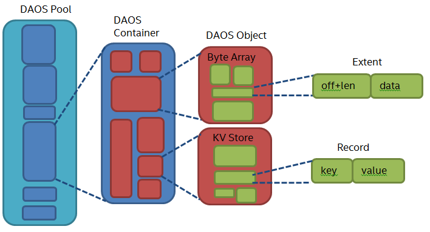
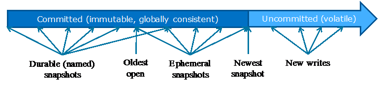

# DAOS Storage Model

In this section, we describe the DAOS storage paradigm including its transaction, security and fault models.
This document contains the following sections:

- <a href="#4.1">Architecture</a>
    -  <a href="#4.1.1">DAOS Target</a>
    - <a href="#4.1.2">DAOS Pool</a>
    - <a href="#4.1.3">DAOS Container</a>
- <a href="#4.2">Transactional Model</a>
    -  <a href="#4.2.1">Container State</a>
    - <a href="#4.2.2">Container Handle</a>
    - <a href="#4.2.3">I/O Ordering and Flushing</a>
    - <a href="#4.2.4">Concurrency Control</a>
    - <a href="#4.2.5">Cross-Container Transaction</a>
- <a href="#4.3">Fault Model</a>
    -  <a href="#4.3.1">Hierarchical Fault Domains</a>
    - <a href="#4.3.2">Fault Detection and Diagnosis</a>
    - <a href="#4.3.3">Fault Isolation</a>
    - <a href="#4.3.4">Fault Recovery</a>
- <a href="#4.4">Security Model</a>
    -  <a href="#4.4.1">Authentication</a>
    - <a href="#4.4.2">Authorization</a>

## Architecture
We consider a HPC cluster with hundreds of thousands of compute nodes interconnected via a scalable high-speed, low-latency fabric, where all or a subset of the nodes, called storage nodes, have direct access to byte-addressable persistent memory and, optionally, block-based storage as well (e.g. HDD or SSD). As shown in the <a href="#f4.1">figure </a> below, a storage node can export through the network one or more DAOS targets, each of which corresponds to a fixed-size partition of its directly-accessible storage. A target is the unit of both fault and concurrency. A storage node can host as many targets as it likes, in the limit of the available storage capacity. A DAOS pool is a collection of targets distributed across multiple different storage nodes. A pool is responsible for both data and metadata resilience. Each pool is identified by a unique UUID and maintains target membership in persistent memory.

**Example of four Storage Nodes, eight DAOS Targets and three DAOS Pools**

The <a href="#f4.2">figure </a> below represents the fundamental abstractions of the DAOS storage model. A pool can host multiple transactional object stores called DAOS containers, identified by UUIDs. Each container is a private object address space, which can be atomically modified and snapshotted independently of the other containers sharing the same pool. DAOS objects in a container are identified by a unique object address and have a type (either byte array, KV store or document store, (see <a href="#4.1.4">DAOS Object</a> for more details) which is encoded in the object ID (see <a href="#4.1.3">DAOS Container</a>). Objects can be distributed across any target of the pool for both performance and resilience.

**Architecture of DAOS Storage Model**

The following <a href="#t4.1">table</a> shows the targeted level of scalability for each DAOS concept.

**DAOS Scalability**

|DAOS Concept|Order of Magnitude|
|---|---|
|Pool|105 Targets (hundreds of thousands)|
|Pool|105 Containers (hundreds of thousands)|
|Container|109 Objects (billions)|
|Pool|1012 Objects (trillions)|
|Target|107 Objects (tens of millions)|
|Key-Value/Document Store Object|109 Records (billions)
|Byte Array Object|1015 Bytes (peta)|

### DAOS Target

A target is the basic unit of storage allocation and space management. It is associated with a reservation of persistent memory optionally combined with block-based storage for capacity. A target has a fixed capacity expressed in bytes and fails operations when it is full. Current space usage can be queried at any time and reports the total amount of bytes used by any data type stored in the target.

A target is assumed to have limited capability and to be a single point of failure. Firstly, its backend storage is assumed to be attached to a single node and hence, has no failover capability in case of storage node failure. Secondly, a target does not necessarily implement an internal redundancy schema to protect stored data against storage media failure. As a consequence, a dynamic state is associated with each target and is set to either up and running, or down and not available. Nonetheless, a target is still responsible for data integrity and thus, manages checksums internally to detect and report corruption.

A target is the unit of both performance and concurrency. Hardware components associated with the target, such as the backend storage medium, the server, and the network, have limited capability and capacity. Target performance parameters such as bandwidth and latency are exported to upper layers for optimal placement.

### DAOS Pool

A pool is a set of targets spread across different storage nodes over which data and metadata are distributed to achieve horizontal scalability, and replicated or erasure-coded to ensure durability and availability.

Each target is associated with a unique pool, which maintains the membership by storing in persistent memory in the pool map the list of participants. The membership is definitive and consistent, and membership changes are sequentially numbered. The pool map not only records the list of active targets, it also contains the storage topology under the form of a tree that is used to identify targets sharing common hardware components. For instance, the first level of the tree can represent targets sharing the same motherboard, then the second level can represent all motherboards sharing the same rack and finally the third level can represent all racks in the same cage. This framework effectively represents hierarchical fault domains, which are then used to avoid placing redundant data on targets subject to correlated failures. At any point in time, new targets can be added to the pool map and failed ones can be excluded. Moreover, the pool map is fully versioned, which effectively assigns a unique sequence to each modification of the map, more particularly for failed node removal.

Upon target failure and exclusion from the pool map, data redundancy inside the pool is automatically restored online. This process is known as data resilvering. Resilvering progress is recorded regularly in special logs in the pool stored in persistent memory to address cascading failures. When new targets are added, data is automatically migrated to the newly added targets to redistribute space usage equally among all the members. This process is known as space rebalancing and uses dedicated persistent logs as well to support interruption and restart.

A pool is only accessible to authenticated and authorized applications. Multiple security frameworks could be supported, from simple POSIX access control lists to third party-based authentication (such as Kerberos). Security is enforced when connecting to the pool. The pool stores a persistent list of containers which includes the container UUIDs and the name associated with each container. Initially, only single-user pool will be supported, which means that once connected, an application can access any container hosted in the pool. In a future implementation, authorization could be managed per-container. Moreover, a more fine-grained control (e.g. per-object, per-POSIX file, per-dataset…) could be implemented by the top-level API. Upon successful connection to the pool, a connection context is returned to the application process.

As detailed previously, a pool stores many different sorts of persistent metadata, such as the pool map, the list of containers, authentication and authorization information, and resilvering and rebalancing logs. Such metadata are critical and require the highest level of resiliency. Therefore, the pool metadata are replicated on a few nodes from distinct high-level fault domains. For very large configurations with hundreds of thousands of storage nodes, only a very small fraction of those nodes (in the order of tens) run the pool metadata service. With a limited number of storage nodes, DAOS can afford to rely on a consensus algorithm to reach agreement and to guarantee consistency in the presence of faults and to avoid split-brain syndrome. Moreover, per-container metadata may be stored in the same raft instance as the pool metadata or in a dedicated one. A pool can then contain an arbitrary set of raft engines, one of which manages the pool metadata and is used to assign the other raft engine to individual containers (discussed in <a href="#4.1.3">DAOS Container</a>). Members of the metadata service elect a leader, which is responsible for processing new metadata updates and servicing reads. Updates are validated once they have been written to a quorum of replicas. The leader sends periodic heartbeats to inform the other replicas that it is still alive. A new leader election is triggered if replicas don’t receive any heartbeat from the current leader after a certain timeout.

### DAOS Container

A container represents an object address space inside a pool. To access a container, an application must first connect to the pool and then open the container. If the application is authorized to access the container, a container handle is returned. This includes capabilities that authorize any process in the application to access the container and its contents. The opening process may share this handle with any or all of its peers. Their capabilities are revoked either on explicit container close or on request from the system resource manager. A set of processes sharing the same container handle is called a process group. A process may belong to multiple process groups corresponding to one or more containers. Multiple process groups can open the same container, regardless of their open mode, and multiple concurrent read-write handles will be supported.
Object metadata, if any, are stored in an object index table (OIT) stored in persistent memory. The purpose of this table is to store the per-object internal metadata (e.g. object schema attributes), if any. The object index table is highly resilient and supports massive-concurrent accesses; it is thus distributed and replicated over many targets in different fault domains. There is one such table per container.
Objects in a container may have different schemas for data distribution and redundancy over targets. Dynamic or static striping, replication or erasure code, algorithmic target selection and specific target affinity are as many parameters required to define the object schema. The object class defines common schema attributes for a set of objects. Each object class is assigned a unique identifier and is associated with a given schema at the pool level. A new object class can be defined at any time with a configurable schema, which is then immutable after creation, or at least until all objects belonging to the class have been destroyed. For convenience, several object classes expected to be the most commonly used will be predefined by default when the pool is created, as shown the <a href="#t4.2">table</a> below. The affinity-based class consists of objects primarily stored locally on a specific target and replicated on remote targets selected algorithmically.

**Sample of Pre-defined Object Classes**

| Object Class (RW = read/write, RM = read-mostly|Target Selection|Redundancy|Metadata in OIT, (SC = stripe count, RC = replica count, PC = parity count, TGT = target|
|---|---|---|---|
|Affinity-based	|Hybrid	|Replication	|Rank of affinity target + RC|
|Small size & RW	|Algorithmic	|Replication	|No (static SCxRC, e.g. 1x4)|
|Small size & RM	|Algorithmic	|Erasure code	|No (static SC+PC, e.g.  4+2)|
|Large size & RW	|Algorithmic	|Replication	|No (static SCxRC over max #targets)|
|Large size & RM	|Algorithmic	|Erasure code	|No (static SCx(SC+PC) w/ max #TGT)|
|Unknown size & RW	|Algorithmic	|Replication	|SCxRC (e.g. 1x4 initially and grows)|
|Unknown size & RM	|Algorithmic	|Erasure code	|SC+PC (e.g. 4+2 initially and grows)|

As shown in the following <a href="f4.3">figure</a>, each object is identified in the container by a unique 192-bit object address. On object creation, the top-level layer should provide a unique 160-bit sequence number that will be completed with the encoding of internal DAOS metadata, such as the object type and class ownership, to form the object address inside the container. It is thus the responsibility of the top-level API to implement a scalable object ID allocator. This 160-bit identifier can be used by upper layers of the stack to store their own object metadata as long as it is guaranteed to be unique inside the object address space. On successful creation, the object identifier is the full 192-bit address. An object address is for single use only and can be associated with only a single schema.

**DAOS Object ID Structure**
![HLD_Graphics/Fig_003.png][DAOS Object ID Structure]

[DAOS Object ID Structure]: HLD_Graphics/Fig_003.png "DAOS Object ID Structure"

A container is the basic unit of atomicity and versioning. All object operations are explicitly tagged by the caller with a transaction identifier called an epoch. Operations submitted against the same epoch are committed atomically to a container. Epochs are arranged in total order such that epochs less than or equal to the highest committed epoch (HCE) correspond to immutable container versions. Committed epochs for a container may periodically be aggregated to reclaim space utilized by overlapping writes and to reduce metadata complexity. A snapshot is a permanent reference that can be placed on a committed epoch to prevent aggregation.
Container metadata (epoch state, list of snapshots, container open handles, the layout of the object index table, etc.) are stored in persistent memory and maintained by a dedicated container metadata service that either uses the same raft engine as the parent metadata pool service, or has its own raft instance. This is configurable when creating a container.

### DAOS Object

DAOS supports three types of objects:

- <b>A byte array</b> is collection of extents. Each extent is addressed by a 64-bit offset. A byte array supports arbitrary extent read, write and punch.
- <b>A key-value store</b> is a collection of records. Each record is uniquely identified by a key which can be of arbitrary size and type (string, integer, …). The value associated with the key cannot be partially updated and is completely overwritten on write. A key-value store supports the following operations: lookup values associated with a list of keys, update/insert KV pairs, punch KV pairs and key enumeration.
- <b>A document store</b> is a special KV store with locality feature. The key is split into a distribution key and an attribute key. All entries with the same distribution key are guaranteed to be collocated on the same target. Enumeration of the attribute keys is provided. The value can be either atomic (i.e. value replaced on write) or a byte array (i.e. arbitrary extent read/(over)write). A document store supports the same operations as a key-value store, plus the enumeration of the attribute keys for a given distribution key. Moreover, non-atomic values support byte array operations.

In the future, all object types might be unified under the document store. Upon successful completion of a DAOS operation, the result of the update is immediately visible. However, it is not guaranteed to be persistent yet and might be buffered on the server. Therefore, the flush operation is provided to wait for all previously executed operations to become persistent. 

To avoid scaling problems and overhead common to traditional storage stack, DAOS objects are intentionally very simple. No default object metadata beyond the type and schema (object class ownership) are provided. This means that the system does not maintain time, size, owner, permissions and opener tracking attributes. All object operations are idempotent and can be processed multiple times with the same results. This guarantees that any operations can be repeated until successful or abandoned, without having to handle execute-once semantic and reply reconstruction.

To achieve high availability and horizontal scalability, many object schemas (replication/erasure code, static/dynamic striping, etc.) are provided. The schema framework is flexible and easily expandable to allow for new custom schema types in the future. The current instance of the layout is generated on clients on object open and is versioned to detect layout mismatch. The object class is extracted from the object identifier to determine the schema of the object to be opened. For some classes, additional parameters may have to be fetched to generate the actual object layout. One such example is the affinity-based class for which each object is bound to a specific target encoded in additional metadata. For the other classes, the object class, the object identifier, and the pool metadata will deterministically define the object layout, thanks to algorithmic placement. End-to-end integrity is assured by protecting both object data and metadata with checksums during network transfer and storage.

## Transactional Model

The primary goal of the DAOS transaction model is to provide a high degree of concurrency and control over durability of the application data and metadata. Applications should be able to safely update the dataset in-place and rollback to a known, consistent state on failure.

Each DAOS I/O operation is associated with an explicit, caller-selected transaction identifier called epoch. This effectively means that the DAOS transactions are exported to the top-level API, which is responsible for grouping together updates to move the data model from one consistent state to another. This approach is very different from traditional database management systems, object stores and file systems that rely on transparent transactions to guarantee internal consistency.

### Container State

As shown in the <a href="#f4.4">figure</a> below below, the state of a container evolves as a sequence of consistent snapshots. Each state transition is sequentially numbered by epoch.

**Epoch in a Container**

Epochs are arranged in order so that epochs less than or equal to the container’s highest committed epoch (HCE) correspond to immutable, globally-consistent container versions. The current container HCE may be queried at any time and consistent distributed reads on a single container are achieved by reading from the same committed epoch. In a producer/consumer workflow, consumer applications may also wait for a new container HCE so that updates can be processed as the producers commit them. The immutability of the container’s HCE guarantees that the consumer sees consistent data, even while the producers continue with new updates. Unaccessible epochs for a container may be aggregated from time to time to reclaim space utilized by overlapping writes and reduce metadata complexity. A named snapshot is a permanent reference that can be placed on a committed epoch to prevent this aggregation. Some statistics (like how much extra storage is consumed) are exported for each snapshot.

On the other hand, epochs greater than the container HCE denotes non-globally committed transactions where new writes are taking place. Those epochs are guaranteed to be applied to the container in epoch order, regardless of execution order. This allows an application not only to describe transactions in which multiple distributed processes update multiple distributed objects, but also allows it to execute any such transaction concurrently.

On successful commit of all the producers, the specified epoch becomes the new container HCE. Uncommitted epochs are also readable, but without any consistency guarantee.

### Container Handle

Access to a container is controlled by the container handle. To acquire a valid handle, an application process must open the container and pass the security checks (user/group permission, …). The opening process may then share this handle (via local2global() / global2local()) with any or all of its peers (similar to the openg() POSIX extension). A container handle is then revoked, either on explicit container close or on request from the system resource manager. All container handles along with the epoch state are stored persistently in the container metadata.

A set of processes sharing the same container handle is called a process group.  One process may belong to multiple process groups corresponding to one or more containers.  A container can be opened by multiple process groups at the same time, regardless of their open mode.

All members of a process group effectively participate in the same transaction scope. This means that all updates submitted by a process group are committed or rolled back as one. This “all or nothing” semantic eliminates the possibility of partially-integrated updates after failure.

<b>Epoch Hold and Handle HCE</b>

To modify a container, a process group must first declare its intent to change the container by obtaining an epoch hold. This operation must be performed by a single member of the process group and can take a minimal held epoch number as input parameter. On successful execution, the handle lowest held epoch (i.e., handle LHE) is returned to the caller. The handle LHE is guaranteed to be higher than the current container HCE and the specified epoch. The process group is now expected to commit every epoch greater than or equal to the handle LHE. 
Epoch commit is performed by any member of a process group, to atomically make all updates submitted by the process group, in all epochs up to the commit epoch, durable. By committing, the process group guarantees that all updates in the transaction have been applied to its satisfaction. On successful commit, the handle HCE is increased to the committed epoch and the handle LHE to the handle HCE + 1. It is the responsibility of the programming model, library or user to determine if all members of the process group have contributed changes prior to commit.
All operations submitted by a process group tagged with an epoch smaller or equal to the handle HCE are guaranteed to be applied and durable. On the other hand, operations tagged with epoch greater than the handle HCE are automatically rolled back on failure. 
A hold can be released at any time, which causes the open handle to become quiescent. On close, the hold is automatically released, if it is not already. This causes uncommitted updates submitted by this process group to all future epochs to be discarded. A member of the process group can also invoke the discard operation directly, to discard all its updates submitted in a given range of uncommitted epochs.

<b>Epoch Reference and Handle LRE</b>

On open, any container handle is granted a default read reference on the current container HCE. This reference, called the handle lowest referenced epoch (i.e., handle LRE), guarantees that the current container HCE, as well as any future globally-committed epochs, remain readable and thus cannot be aggregated. The handle LRE can be moved forward to a newer globally-committed epoch through an explicit call to epoch slip.
At the container level, the container metadata tracks the container LRE that is equal to the smallest handle LRE across all container open handles. Epoch aggregation is triggered each time the container LRE is moved forward. When all container handles are closed, the container LRE is equal to the container HCE, which is then the only available unnamed container version. As mentioned before, a named snapshot is a persistent reference on a single epoch, and isn’t associated with any container handle. A named snapshot is guaranteed to be readable until it is explicitly destroyed.

### I/O Ordering and Flushing

Prior to epoch commit, all I/O operations submitted by a process group against the to-be-committed epoch must be flushed. This assures that all caches are properly drained and updates are stored persistently. As a summary, the typical flow of a DAOS transaction is the following:

1.	Open the container
2.	Obtain an epoch hold
3.	Submit I/O operations against the lowest held epoch
4.	Flush all the operations
5.	Commit the lowest held epoch which is increased by 1
6.	Goto 3 if more updates must be submitted
7.	Release the epoch hold
8.	Close the container

I/O operations submitted with different epoch numbers from the same or different process groups are guaranteed to be applied in epoch order, regardless of execution order. Concurrency control mechanism that might be implemented on top of DAOS are strongly encouraged to serialize conflicting updates by using different epoch numbers in order to guarantee proper ordering. Therefore, conflicting I/O operations submitted by two different container handles to the same epoch is considered a programmatic error and will fail at I/O execution time.

As for conflicting I/O operations inside the same epoch submitted with the same container handle, the only guarantee is that an I/O started after the successful completion of another one won’t be reordered. This means that concurrent overlapping I/O operations are not guaranteed to be properly serialized and will generate non-deterministic results. This can be particularly harmful when overwriting the same extent of a replicated object because replicas could order I/Os differently and eventually become inconsistent. To address this problem, overwrite in the same epoch will only be supported with server-side replication, where concurrent writes can be properly ordered, whereas overwrite will generate errors with client-side synchronous replication. More details on this are provided in the MAKEREF DAOS-SR REPLICATIONsection 8.4.1. 

### Concurrency Control

While DAOS epochs can be used to support Atomicity, Consistency and Durability guarantees, the Isolation property is considered beyond the scope of the DAOS transaction model. No mechanism to detect and resolve conflicts among different transactions as well as within a transaction is provided or imposed. The top-level API is thus responsible for implementing its own concurrency control strategy (e.g., two-phase locking, timestamp ordering, etc.) depending on its own needs. DAOS provides some functionality to facilitate the development of conflict detection and resolution mechanisms on top of its transaction model:

* Middleware layered over DAOS can execute code on the DAOS target. This provides a way to run the concurrency control mechanism where the data is located. More details on this mechanism are provided in sections 4.2.3 and 4.3.2. 
* Changes submitted against any epoch can be enumerated, provided that the epoch has not been aggregated. This allows the development of an optimistic approach where conflict detection is delayed until its end, without blocking any operations. This server-side API indeed allows to iterate over the metadata tree to list all the operations submitted against a given epoch for any objects. The transaction can then be aborted if it does not meet the serializability or recoverability rules. 

### Cross-Container Transaction

The DAOS transaction model supports atomic updates across different containers from the same pool. This covers all server nodes of the pool. Cross-container transactions are achieved by committing epochs from different containers altogether by using a two-phase commit approach (see 7.8.3). Updates must be submitted independently to each container in a specific epoch. Once each individual epoch has flushed, a single commit request with a list of container handles and respective epochs can be issued. Upon success, each container has successfully committed its respective epoch and each handle HCE is updated. On failure, none of the epochs are committed. Chapter 7 provides further details on cross-container transactions.

## Fault Model

DAOS relies on massively distributed storage with no requirements on the failover capabilities of the underlying storage. Each target is thus effectively treated as a single point of failure. DAOS achieves availability and durability of both data and metadata by providing redundancy across targets in different fault domains. DAOS internal metadata are replicated via the pool metadata service with a consensus algorithm (Raft) that provides the infrastructure to store the pool map and support the epoch mechanism. DAOS objects can then be safely replicated or erasure-coded with epochs. The purpose of this section is to provide details on how DAOS achieves fault tolerance and guarantees object resilience.

### Hierarchical Fault Domains

A fault domain is a set of servers sharing the same point of failure and which are thus likely to fail altogether. DAOS assumes that fault domains are hierarchical and do no overlap. The actual hierarchy and fault domain membership must be supplied by an external database used by DAOS to generate the pool map.

Pool metadata are replicated on several nodes from different high-level fault domains for high availability, whereas object data is replicated or erasure-coded over a variable number of fault domains depending on the application requirements.

### Fault Detection and Diagnosis

DAOS delegates authority for detection of storage node failure to an external RAS service, which delivers authoritative notifications. The RAS system (Reliability, Availability, and Serviceability) is different from traditional cluster monitoring tools. It receives diagnosis inputs from multiple sources: baseboard management controllers (BMC), fabric, distributed software running on the cluster, etc. For instance, DAOS clients experiencing RPC timeout should be able to report those problems to the RAS service. All this data is carefully analyzed and correlated by the RAS system that then makes authoritative and unilateral decision on node eviction.

The RAS system then delivers eviction notifications reliably (i.e., resend until acknowledged) and in consistent order to all the processes registered to receive them. All the storage nodes running the pool metadata service typically subscribe to this notification service. This ensures that no notifications are missed, even in the case of service leader change.

The RAS system can use a consensus algorithm to assure the durability and availability of this service. Internals of the RAS system are beyond the scope of this document.

### Fault Isolation

Once the RAS system has notified the pool metadata service of a failure, the faulty node must be excluded from the pool map. This is done automatically and silently if the DAOS pool has enough internal redundancy to cope with the failure. If data has been lost, I/O errors will be returned to the applications on access. The data loss will also be reported to the administrator. Upon exclusion, the new version of the pool map is eagerly pushed to all storage targets. At this point, the pool enters a degraded mode that might require extra processing on access (e.g. reconstructing data out of erasure code). Consequently, DAOS client and storage nodes retry RPC indefinitely until they are notified of target exclusion from the pool map. At this point, all outstanding communications with the evicted target are aborted and no further messages should be sent to the target until it is explicitly reintegrated (possibly only after maintenance action).

All storage targets are promptly notified of pool map changes by the pool metadata service. This is not the case for client nodes, which are lazily informed of pool map invalidation each time they communicate with servers. To do so, clients pack in every RPC their current pool map version. Servers reply not only with the current pool map version if different, but also with the actual changes between the client and server version if the log size is reasonable. Consequently, when a DAOS client experiences RPC timeout, it regularly communicates with the other DAOS target to guarantee that its pool map is always current. Clients will then eventually be informed of the target exclusion and enter into degraded mode.

This mechanism guarantees global node eviction and that all nodes eventually share the same view of target aliveness.

Moreover, it is worth nothing that the poolmap is the authority. While the pool service listens to RAS notifications and excludes nodes accordingly, the DAOS pool service can also decide by itself to exclude nodes from the poolmap without involving RAS. This can happen if a node is found to be regularly unresponsive or misbehaving, or if the administrator asks for this node to be evicted from the poolmap.

### Fault Recovery

Upon exclusion from the pool map, each target starts the resilvering process automatically to restore data redundancy. First, each target creates a list of local objects impacted by the target exclusion. This is done by scanning a local object table maintained by the underlying storage layer. Then for each impacted object, the location of the new object shard is determined and redundancy of the object restored for the whole history (i.e., committed epochs) as well as for future transactions (i.e., uncommitted epochs). Once all impacted objects have been rebuilt, the pool map is updated a second time to report the target as failed out. This marks the end of resilvering and the exit from degraded mode for this particular fault. At this point, the system has fully recovered from the fault and client nodes can now read from the rebuilt object shards. A future optimization could be to allow each object to exit independently from degraded mode without waiting for all the impacted objects to be recovered. This could be achieved by allowing reads from the object shard being rebuilt and returning cache miss when no valid data is found. On cache miss, the client would then try to read again from another replica or reconstruct data from erasure code.

To deal with resilvering interruption and cascading failure, persistent local resilvering logs are maintained. Each target maintains locally a more fine-grained log recording the list of objects to be resilvered, what objects have been resilvered already, and which ones are in progress (potentially at which epoch and offset/hash).

This resilvering process is executed online while applications continue accessing and updating objects.

## Security Model

A pool is only accessible to authenticated and authorized jobs. The security framework to be used must be selected and configured at pool-creation time. In the future, an additional authorization level can be enforced for each container.

### Authentication
To connect to a pool, a process set must first be authenticated. To do so, we consider the following scenarios:

* The cluster is on a secure network that authenticates all incoming client connections and guarantees all communications on these connections can only be to or from the authenticated client. In this case, DAOS can just trust incoming requests. 
* The cluster is on an insecure network in which all communications must be authenticated. DAOS can then rely on a third-party service (such as Kerberos) to provide authentication.

### Authorization

Access to a pool can be restricted to a set of users, groups or jobs with either full or limited capability. For instance, a given user can only access the pool in read-only mode. By default, all containers in a pool inherit the security parameters of the parent pool. This means that once access is granted to the pool, any container can be opened. In the future, it might, however, be possible to restrict access to a container by specifying different security rules for that container.

Once granted, both the pool connection context and the container open handle are associated with capabilities that are propagated to all the targets. The capabilities specify the process group owning the context, the type of container access (read, read-write, etc.) and any other restriction that might apply. This capability list is then used each time an RPC is received by a target to validate the handle and to verify that the operation to be executed is authorized for this handle/context. 

More details on capability distribution and revocation are provided in MAKEREFchapter 7. The current list of supported capabilities are limited to read-only and read-write access, but additional features can be easily added in the future. 
