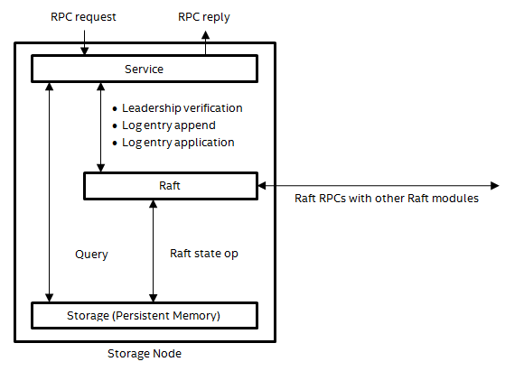

# DAOS-M

The DAOS-M layer (DSM) builds the pool and container abstractions that offer target-local objects. DSM consists of three types of services and a client library, which together implement the DSM API used by the DAOS-SR layer to build distributed objects. A major goal of DSM is to provide highly-available pool and container metadata access, enabling the DAOS-SR layer to make progress in the presence of faulty targets.

The figures below present two different views of the DSM server-side architecture. Every storage node is capable of hosting all three types of services. Multiple, different services may run on the same storage node. The client library links directly with caller processes. Library-service and service-service communications use the RPC transport described in section 4.3.
 
 
**DSM services in a pool (conceptual view)**

")
 
 
**DSM services in a pool (physical view)**

")

This section:

- introduces the client library and the three types of services
- discusses how to make the services highly available
- describes how they participate in various protocols.

## Client Library

The DSM client library exports the DSM API, which includes methods to:

- connect to pools
- add or disable targets
- create or open containers 
- do object I/Os
- flush, discard, or commit epochs
- manage snapshots
- share handles among client processes, etc.

The client library implements many of these methods by invoking RPCs to the DSM services. The DAOS-SR layer interacts with DSM by calling these methods, rather than sending RPCs to DSM services directly.

## Services

This subsection enumerates all three types of services, discussing the state each of them manages and the main RPCs each of them handles. An RPC procedure has the following format:

- **PROCEDURE**(arguments) (results). Description.
The DSM API also includes utilities that allow a group of processes to share a handle established with the services by one member process. For example, after a process has established a connection to a pool, it may call a “local2global()” method to pack the information underlying the pool handle into a buffer and broadcast the resulting buffer to all other processes that it would like to share the pool handle with. An actual implementation may restrict the pool handle to members of the same client process set defined by the RPC transport. Each of the receiving processes may call a “global2local()” method to unpack the data and reproduce the pool handle locally. All these processes sharing the pool handle then become a process group to the pool service—any member may act on behalf of the whole group.

All APIs provided by the client library can be asynchronous. (See also Fast Forward document  page 16–19 (https://nvdimm.wiki.kernel.org/)) Given a pre-created event, the API call can return immediately after submitting the I/O request, either to the network or to the underlying storage layer. This event will be linked on the Event Queue (EQ), which is the owner of this event, on completion or failure of the I/O call. The upper layer can poll on the EQ for completing events of DAOS I/O calls; the EQ poll function can either return an arbitrary number of completed events, or block the caller if it is called in blocking mode. With the event mechanism, the DAOS client library allows the upper layer to initiate many concurrent I/O operations from the context of a single thread.

### Pool Service

A pool service maintains pool metadata, including:

- **Pool connections**. Each pool connection is represented by a pool handle identified by a client-generated handle UUID. See POOL_CONNECT below. The terms “pool connection” and “pool handle” are used interchangeably in this document.
- **Pool map**. This is a versioned data structure recording the set of targets belonging to this pool, the fault domains to which the targets belong, and the status of the targets. Versioning (which is unrelated to epochs) facilitates lazy dissemination of the pool map across clients and targets. See section 8.1.
- **Pool name space**. This provides a pool-wise, flat name space of string-based, user-friendly container names. Looking up a container name in the pool name space gets the corresponding container UUID.
- **Container index**. This maps a container UUID to the ID of the corresponding container service.
- **Container service index**. This maps a container service ID to the addresses of the corresponding container service replicas.
- **Security information**. Attributes like the UID, the GID, and the mode.
- **Upper-layer pool metadata**. Attributes used by the DAOS-SR layer or layers even higher above.

A pool service handles the following RPC procedures. “pool_handle_uuid” is a UUID identifying a pool handle.

- **POOL_CONNECT**(pool_uuid, pool_handle_uuid, authenticator, capabilities) (error, pool_map). Establish a pool handle/connection. “pool_uuid” identifies the pool to connect to. “pool_handle_uuid” is generated by the client. “authenticator” contains information (e.g., the UID and the GID) required by the authentication scheme as well as a client process set identifier used by the server side for access restriction and the pool handle eviction. “capabilities” indicates the access rights (e.g., read-only or read-write) requested by the client. “pool_map” is a packed representation of the pool map, returned to the client if the pool handle is authorized.
- **POOL_DISCONNECT**(pool_handle_uuid) error. Close a pool handle/connection.
- **POOL_QUERY**(pool_handle_uuid) (error, pool_state). Query various information (e.g., size, free space, etc. returned through “pool_state”) about a pool.
- **POOL_TARGET_ADD**(pool_handle_uuid, targets) error. Add new targets to a pool. “targets” is the set of the addresses of the new targets.
- **POOL_TARGET_DISABLE**(pool_handle_uuid, targets) error. Disable existing targets in a pool. “targets” is the set of the addresses of the targets to disable.
- **POOL_CONTAINER_CREATE**(pool_handle_uuid, container_uuid, name) (error, container_addresses). Create a container with a UUID generated by the client and optional a name if “name” passes in a string.
- **POOL_CONTAINER_DESTROY**(pool_handle_uuid, container_uuid, name) error. Destroy a container identified by either UUID or name. If the container has a name, “name” shall be specified; otherwise “container_uuid” shall be specified and “name” shall be left unspecified.
- **POOL_CONTAINER_LOOKUP**(pool_handle_uuid, name) (error, container_addresses). Look up a container by name.
- **POOL_CONTAINER_RENAME**(pool_handle_uuid, from_name, container_uuid, to_name) error. Rename a container. If the container does not have an existing name, “container_uuid” shall be specified instead of “from_name”, allowing a name to be add to an anonymous container.
- **POOL_EPOCH_COMMIT**(pool_handle_uuid, container_handle_uuids, epochs) error. Commit a set of epochs in different containers atomically. “container_handle_uuids” is a list of the handle UUIDs of the containers. “epochs” is a list of the epochs. For any index i, epochs[i] is an epoch in the container referred to by container_handle_uuids[i].

### Container Service

The container service maintains container metadata, including:

- **Epoch state**. This mainly consists of the container HCE and the maximum aggregated epoch (section 7.8.5).
- **Container handles**. Each container handle is identified by a client-generated handle UUID. The metadata associated with a container handle include its capabilities (e.g., read-only or read-write) and its per-handle epoch state, which consists of its LRE, HCE, and LHE.
- **Snapshots**. These are simply the epochs that have been snapshotted.
- **Upper-layer container metadata**. Attributes used by the DAOS-SR layer or layers even higher above.

Note that DSM treats the object index table (sections 3.1.3 and 8.3) as data, rather than metadata, of DSM containers.

A container service handles the following RPC procedures. “container_handle_uuid” is a UUID identifying a container handle. “epoch_state” contains epoch-related information such as the container HCE, the LRE, HCE and LHE of this handle, the number of snapshotted epochs, etc.

- **CONTAINER_CREATE**(pool_handle_uuid, container_uuid) error. Create a container. Sent only by the pool service in response to a **POOL_CONTAINER_CREATE** request. “container_uuid” is the UUID of the container to create.
- **CONTAINER_OPEN**(pool_handle_uuid, container_uuid, container_handle_uuid, capabilities) (error, epoch_state). Establish a container handle. “container_uuid” is the UUID of the container. “container_handle_uuid” is generated by the client. “capabilities” indicates whether the client requests read-only or read-write access to this container.
- **CONTAINER_CLOSE**(pool_handle_uuid, container_handle_uuid) error. Close a container handle.
- **CONTAINER_EPOCH_FLUSH**(pool_handle_uuid, container_handle_uuid, epoch, targets) (error, epoch_state). Flush all writes in “epoch” on “targets”. “targets” is the set of the target addresses.
- **CONTAINER_EPOCH_DISCARD**(pool_handle_uuid, container_handle_uuid, from_epoch, to_epoch, targets) (error, epoch_state). Discard all writes in epoch range [“from_epoch”, “to_epoch”] on “targets”. “target” is the set of target addresses.
- **CONTAINER_EPOCH_QUERY**(pool_handle_uuid, container_handle_uuid) (error, epoch_state). Query the epoch state.
- **CONTAINER_EPOCH_HOLD**(pool_handle_uuid, container_handle_uuid, epoch) (error, epoch_state). Hold the epochs equal to or higher than “epoch” for this container handle. The resulting lowest held epoch, which may be different from “epoch”, is returned in “epoch_state”.
- **CONTAINER_EPOCH_SLIP**(pool_handle_uuid, container_handle_uuid, epoch) (error, epoch_state). Slip the LRE of this container handle to “epoch”. The resulting LRE, which may be different from “epoch”, is returned in “epoch_state”.
- **CONTAINER_EPOCH_COMMIT**(pool_handle_uuid, container_handle_uuid, epoch) (error, epoch_state). Commit “epoch” of a container.
- **CONTAINER_EPOCH_WAIT**(pool_handle_uuid, container_handle_uuid, epoch) (error, epoch_state). Wait for “epoch” to become committed.
- **CONTAINER_SNAPSHOT_LIST**(pool_handle_uuid, container_handle_uuid) (error, epochs). List the snapshotted epochs. The result is returned in “epochs”.
- **CONTAINER_SNAPSHOT_TAKE**(pool_handle_uuid, container_handle_uuid, epoch) error. Take a snapshot of “epoch”.
- **CONTAINER_SNAPSHOT_REMOVE**(pool_handle_uuid, container_handle_uuid, epoch) error. Remove the snapshot of “epoch”.

###  Target Service

The target service exports the VOS methods and abstracts the complexity of the underlying file system structures that store the persistent state of VOS and the target service itself. All object I/Os coming from the DAOS-SR layer are simply passed to VOS, without altering or verifying end-to-end data integrity checksums. This avoids one level of memory copy for each I/O. In addition, the target service provides the facility that helps implement pool and container access control, in the form of pool and container handles in volatile memory.

The target service handles the following RPC procedures in addition to those required by I/O bypasses:

- **TARGET_CONNECT**(pool_uuid, pool_handle_uuid, authenticator, capabilities) error. Establish a pool handle/connection authorized by the pool service on this target. Sent only by the pool service in response to a **POOL_CONNECT** request. “authenticator” contains information (e.g., encrypted using a key shared only among the targets) required to verify the request comes from a target rather than a client. For implementations restricting a pool handle to a client process set, the client process set identifier can also be passed through “authenticator”.
- **TARGET_DISCONNECT**(pool_handle_uuid) error. Close a pool handle/connection on this target. Sent only by the pool service in response to a **POOL_DISCONNECT** request.
- **TARGET_QUERY**(pool_handle_uuid) (error, target_state). Query various information (e.g., size, space usage, storage type, etc. returned through “target_state”) of a target.
- **TARGET_CONTAINER_OPEN**(pool_handle_uuid, container_uuid, container_handle_uuid) error. Establish a container handle authorized by the container service on this target. Sent only by the container service in response to a **CONTAINER_OPEN** request.
- **TARGET_CONTAINER_CLOSE**(pool_handle_uuid, container_handle_uuid, epoch) error. Close a container handle on this target. Sent only the container service in response to a **CONTAINER_CLOSE** request. “epoch” is the HCE of the container handle.
- **TARGET_CONTAINER_DESTROY**(pool_handle_uuid, container_uuid) error. Destroy a container on this target. Sent only by the pool service in response to a **POOL_CONTAINER_DESTROY** request.
- **TARGET_EPOCH_FLUSH**(pool_handle_uuid, container_handle_uuid, epoch) error. Flush all writes in “epoch” to this target. May be sent by both clients and the container service.
- **TARGET_EPOCH_DISCARD**(pool_handle_uuid, container_handle_uuid, from_epoch, to_epoch) error. Discard all writes in epoch range [“from_epoch”, “to_epoch”] on this target.
- **TARGET_EPOCH_AGGREGATE**(pool_handle_uuid, container_handle_uuid, from_epoch, to_epoch) error. Aggregate all writes in epoch range [“from_epoch”, “to_epoch” – 1] into epoch “to_epoch” on this target.

## Service Replication

Pool and container services are made highly available by replicating their state—pool and container metadata—using Raft-based consensus and strong leadership. A service replicated in this generic approach tolerates the failure of any minority of its replicas. By spreading replicas of each service across the fault domains, pool and container services can therefore tolerate a reasonable number of target failures.

### Architecture

A replicated service is built around a Raft replicated log. The service transforms RPCs into state queries and deterministic state updates. All state updates are committed to the replicated log first, before being applied by any of the service replicas. Since Raft guarantees consistency among log replicas, the service replicas end up applying the same set of state updates in the same order and go through identical state histories.

Among all replicas of a replicated service, only the current leader can handle service RPCs. The leader of a service is the current Raft leader (i.e., a Raft leader with the highest term number at the moment). Non-leader replicas reject all service RPCs and try to redirect the clients to the current leader to the best of their knowledge. Clients cache the addresses of the replicas as well as who current leader is. Occasionally, a client may not get any meaningful redirection hints and can find current leader by communicating to a random replicas.

The <a href="#f8.1">figure</a> below shows the modules constituting a service replica. The service module handles RPCs by transforming them into state queries and deterministic state updates. The Raft module implements the replicated log following the Raft protocol, by communicating with Raft modules on other replicas. It provides methods for the service module to perform the queries and the updates. The storage module, which in this case is the persistent memory and the file system, stores the service and Raft state. It uses the NVM library to update the state stored in persistent memory atomically.
 

**Service replication modules**

### RPC Handling

When an RPC request arrives at the leader, a service thread of the service module picks up the request and handles it by executing a handler function designed for this type of request. As far as service replication is concerned, a handler comprises state queries (e.g., reading the epoch state), state updates (writing a new version of the pool map), and RPCs to other services (e.g., TARGET_CONTAINER_OPEN RPCs sent to target services). Some handlers involve only queries, some involve updates as well as queries, and others involve all three kinds of actions; rarely, if ever, do handlers involve only updates but no queries.

A handler must assemble all its updates into a single log entry, commit the log entry, and wait for the log entry to become applicable before applying the updates to the service state. Using a single log entry per update RPC easily makes each update RPC atomic with regard to leader crashes and leadership changes. If RPCs that cannot satisfy this requirement are introduced in the future, additional transaction recovery mechanisms will be required. A leader’s service state therefore always represents the effects of all completed update RPCs this leader has handled so far.

Queries, on the other hand, can read directly from the service state, without going through the replicated log. However, to make sure a request sees the effects of all completed update RPCs handled by all leaders ever elected, the handler must ask the Raft module whether there has been any leadership changes. If there has been none, all queries made for this request so far are not stale. If the leader has lost its leadership, the handler aborts the request with an error redirecting the client to the new leader.

RPCs to other services, if they update state of destination services, must be idempotent. In case of a leadership change, the new leader may send them again, if the client resent the service request in question.

Handlers need to cope with reasonable concurrent executions. Conventional local locking on the leader is sufficient to make RPC executions linearizable. Once a leadership change happens, the old leader can no longer perform any updates or leadership verifications with-out noticing the leadership change, which causes all RPCs in execution to abort. The RPCs on the new leader are thus not in conflict with those still left on the old leader. The locks therefore do not need to be replicated as part of the service state.

### Service Management

The pool service maintains a record of every container service in the container service index (<a href="#8.2.1">Pool Service</a>) and manages the configuration (i.e., the set of replicas) of every one of them, as well as that of itself. This involves three cases:

<ol>
<li>Creating a new container. The pool service decides whether the new container uses an existing container service or a new one. If an existing one suffices, the pool service simply makes state updates to the leader of the existing container service. If a new container service is desired, the pool service decides which targets shall host the container service replicas and creates a single replica first. Other replicas are then added through configuration changes. Once all replicas are added, the pool service records the replica addresses in the container service index and makes the state updates to initialize the container metadata.
</li>
<li>
Responding to a RAS event. Before disabling the target declared dead by this RAS event, the pool service checks:
</li>
<ol>
<li>
if the target hosts any (pool or container) service replicas. Any affected replicas are replaced with new ones created on other targets and removed from corresponding services. This is achieved by a configuration change following the original Raft protocol.
</li>
<li>
If any of the replicas is a leader, the configuration change will also result in a leadership transfer (following again the original raft protocol).
</li>
</ol>
  When the configuration changes are done, the pool service records the new configurations in the container service index and updates the pool map to disable the target. It is worth noting that the pool service records the configuration of every Raft instance only as a hint for clients to find the Raft leader and any service membership change is handled through Raft.  
<li>
Executing a target exclusion request from a caller. The pool service handles this case in the same way as it handles case 2.
</li>
</ol>
In all the cases, the decision making is based on the definitive pool map maintained by the pool service, with the goal that the replicas of a service shall belong to different fault domains when possible, so that they are unlikely to fail together. And, the decisions are executed through configuration changes that follow Raft’s single-server membership change protocol. (The alternative arbitrary membership change protocol may also be considered in the future if it proves to offer meaningful performance benefits.)

In the remainder of this section, the addresses of the replicas belonging to a replicated service are collectively referred to as the service address. Pool and container services are   assumed to be highly available when discussing higher-level protocols, because the service replication internals are largely transparent and irrelevant.

## Pool Creation

Because creating a pool requires special privileges for steps related to storage allocation and fault domain querying, it is handled by the storage management module, as described in sections MAKEREF STORAGE.md4.2.4 and MAKEREF Layering.md5.1. After the target formatting is done, the storage management module calls DSM with the list of targets and their fault domains, to create and initialize a pool service. DSM creates the pool service following the principle described in *<a href="#8.3.3">Service Management</a>*. The list of targets and their fault domains are then converted into the initial version of the pool map and stored in the pool service, along with other initial pool metadata. When returning to the storage management module, DSM reports back the address of the pool service, which will eventually be passed to the application and used to address the POOL_CONNECT RPC(s).

## Pool Connections

To establish a pool connection, a client process calls the pool connect method in the client library with the pool UUID, the pool service address, and the requested capabilities. The client library sends a POOL_CONNECT request to the pool service. The pool service tries to authenticate the request using the authenticator, as defined by the security model (e.g., UID/GID in a POSIX-like model), and to authorize the requested capabilities to the client-generated pool handle UUID. If everything goes well, the pool service sends a collective TARGET_CONNECT request to all targets in the pool, with the pool handle UUID, an optional authenticator, and the granted capabilities. This authenticator also passes in the identifier of the client process set, so that the server side may restrict the pool connection to members of the same client process set. After the collective request completes successfully, the pool service replies to the client library with the pool map. The client process may then pack, transfer, and unpack the resulting connection context to its peers, using the utility methods described in *<a href="#8.1">Client Library</a>*.

To destroy a pool connection, a client process calls the pool disconnect method in the client library with the pool handle, triggering a POOL_DISCONNECT request to the pool service. The pool service sends a collective TARGET_DISCONNECT request to all targets in the pool and replies to the client library once the collective request completes. These steps destroy all state associated with the connection, including all container handles. Other client processes sharing this connection should destroy their copies of the pool handle locally, preferably before the disconnect method is called on behalf of everyone. If a group of client processes terminate prematurely, before having a chance to call the pool disconnect method, their pool connection will eventually be evicted once the pool service learns about the event from the run-time environment, using the corresponding client process set identifier.

## Container Creation

Creating a container goes through the pool service. After receiving the POOL_CONTAINER_CREATE request, the pool service either selects an existing container service from the container service index or creates a new one and sends a CONTAINER_CREATE request to the container service to initialize the container metadata. If the initialization succeeds, the container name space (if the container has a name) and the container index are updated and the POOL_CONTAINER_CREATE request is replied.

The placement policy of container metadata involves its own tradeoffs. The major parameters are the number of container services in a pool and the mapping strategy from containers to container services. On one extreme, the metadata of all container in a pool could be placed in one container service that shares the same Raft replicated log with the pool service. This would avoid two-phase commits for inter-container epochs (*<a href="#8.8.3">Inter-Container Epochs</a>*), but might raise performance concerns as the state updates of all container metadata operations for all containers in the pool would be serialized by the single Raft replicated log. On the other extreme, each container could have its own container service (i.e., dedicated Raft replicated log), which would separate metadata operations for different containers but make inter-container epochs more difficult. The initial prototype shall start with one container service (i.e., a single Raft replicated log) per pool, evaluate its performance, and implement a tunable or even run-time-determined number of container services if necessary.

## Container Handles

When a client process calls the container open method, it may specify:

1. a container name in the pool, or
2. a container UUID, or 
3. a container UUID and a container service address.

How the client process calls the open method depends on which of these choices are applicable (i.e., a container may not have a name in the pool) and already known.

In the case of (1) or (2) above, the client library first sends a POOL_CONTAINER_LOOKUP request to the pool service to look up the address of the corresponding container service. Then, or in the case (c), the client library sends a CONTAINER_OPEN request to the container service. The container service processes the request by sending a collective request with the client identifier as well as any open flags (e.g., read-only or read-write) to all enabled targets in the pool and replies to the client with a handle containing the client identifier. Similar to the case of pool handles, the client process may also share the container handle with its peers using the utility methods described in *<a href="#8.1">Client Library</a>*.

## Epoch Protocol

The epoch protocol, which involves the client library and all the three types of services, implements the epoch model described in MAKEREF Models.mdTransactional Model - section 3.2. This subsection first describes epochs within a single container, and then addresses atomicity across containers in the same pool.

### Intra-Container Epochs

The epochs of a container are managed by the matching container service. The container service maintains the definitive epoch state as part of the container metadata, whereas the target services have little knowledge of the global epoch state. Epoch commit, discard, and aggregate procedures are therefore all driven by the container service. This design choice greatly simplifies the commit procedure, making an intra-container commit operation local to the container service. On the other hand, this also puts more responsibility on application or middleware developers, because target services are unable to guard against buggy applications that submit write operations to epochs that have already been committed.

When a client process opens a container with write capability, the container service assigns a small cookie (i.e., up to 64 bits) to the resulting container handle and sends it along with the container handle to all the targets. The cookie then serves as a container handle identifier that is smaller than the 128-bit container handle UUID, and used only internally on the server side to track write operations belonging to a certain container handle. The container service guarantees that coexistent container handles get unique cookies and that each cookie remains constant throughout the life of its container handle.

On each target, the target service eagerly stores incoming write operations into the matching VOS container. For every write operation, the target service passes the cookie of the matching container handle and the epoch to VOS. If a container handle discards an epoch, VOS helps discard all write operations associated with the cookie of the container handle. When a write operation succeeds, it is immediately visible to conflicting operations in equal or higher epochs. A conflicting write operation with the same epoch will be rejected by VOS unless it has the same cookie and content as the one that is already executed. Applications require their own conflict resolution mechanism when they need to read uncommitted write operations from a different container handle, so that their write operations use a higher epoch than the one they read from, as described in section MAKEREF USECASES <a href="#65">Concurrent Producers</a>5.2.3.

Before committing an epoch, an application must ensure that a sufficient set of write operations for this epoch have been persisted by the target services. The application and the DAOS-SR layer may decide that losing some write operations is acceptable, depending on the redundancy scheme each of them employs. The flushing of each write operation involves a client-side stage and a server-side stage. On the client side, if the write operation is non-blocking, the application must wait for it to complete by calling the event methods in the client library on appropriate event queues. Then, on the server side, the local NVM transaction corresponding to the write operation must commit successfully. The application ensures this by calling the flush method in the client library, which asks for the whole container to be flushed at this epoch. The DAOS-SR layer responses by sending a CONTAINER_EPOCH_FLUSH request to the container service, which then initiates a collective TARGET_EPOCH_FLUSH request to all target services. The “targets” argument of CONTAINER_EPOCH_FLUSH and the TARGET_EPOCH_FLUSH procedure enables future DAOS-SR implementations to experiment with more selective flushing on the targets that have actually been updated in this epoch.

Committing an epoch of a container handle results in a CONTAINER_EPOCH_COMMIT request to the corresponding container service. The container service simply assembles a container metadata update that:

- increases the container handle HCE to this epoch,
- increases the container handle LHE to this epoch plus one, and
- updates the container HCE to min⁡(max⁡(container handle HCEs),min⁡(container handle LHEs)-1).

When the update becomes persistent, the container service replies the client with the new epoch state.

An epoch of a container handle may be “aborted” by first discarding the epoch and then committing it as described above. Similar to flushing an epoch, depending on how the discard method is called, discarding an epoch may result in:

- a CONTAINER_EPOCH_DISCARD request to the corresponding container service, which triggers a collective TARGET_EPOCH_DISCARD request to all target services, or
- a set of TARGET_EPOCH_DISCARD requests to the target services involved in this epoch of this container handle.

Once the discard method succeeds, all write operations from this container handle in this epoch are discarded. The commit method may then be called to commit this “empty” epoch for the container handle.

When a container service is asked to close a container handle, either by the application or the pool service when evicting the corresponding pool handle, it sends a collective TARGET_CONTAINER_CLOSE request to all target services. The HCE of the container handle is sent in this request as an argument. Each target service asks VOS to discard all write operations belonging to the matching cookie in all epochs higher than the container handle HCE. When the collective request succeeds, the container service destroys the container handle.

### Target Faults

Given hundreds of thousands of targets, the epoch protocol must allow progress in the presence of target faults. Since pool and container services are highly available, the problem is mainly concerned with target services. The solution is based on the assumption that losing some targets may not necessarily cause any application data loss, as there may be enough redundancy created by the DAOS-SR layer to hide the faults from applications. Moreover, an application might even want to ignore a particular data loss (which the DAOS-SR layer is unable to hide), for it has enough application-level redundancy to cope or it simply does not care.

When a write, flush, or discard operation fails, the DAOS-SR layer calculates if there is sufficient redundancy left to continue with the epoch. If the failure can be hidden, and assuming that the target in question has not already been disabled in the pool map (e.g., as a result of a RAS notification), the DAOS-SR layer must disable the target before committing the epoch. For the epoch protocol, the resulting pool map update effectively records the fact that the target may store an undefined set of write operations in the epoch, and should be avoided. This also applies to applications that would like to ignore similar failures which the DAOS-SR layer cannot hide.

### Inter-Container Epochs

When a client process needs to commit multiple epochs belonging to different containers atomically, it shall complete the write operations for all these epochs and flush them successfully before starting to commit any of the epochs. Any faulty targets encountered during the I/Os shall be disabled as explained above. Once a sufficient set of the write operations of all these epochs are persisted, the client may call the commit method with the list of \<container handle, epoch\> pairs. A POOL_EPOCH_COMMIT request is sent to the pool service as a result. The pool service logs the list of \<container handle, epoch\> pairs, and then sends one CONTAINER_EPOCH_COMMIT request with each \<container handle, epoch\> pair to the corresponding container services in parallel. The pool service stubbornly retries these requests if some container services are unavailable, which should rarely happen because of service replication, and at the same time makes sure that the corresponding pool handle remains even if the client process set terminates. Once all commit requests succeed, the pool service removes the list of \<container handle, epoch\> pairs from the log, and finally replies the client process (if still exists). It must be noted that if the client processes have a programming error, e.g., one of the epochs is not held before being committed, the corresponding CONTAINER_EPOCH_COMMIT request will return an error, while other requests will succeed. Introducing a two-phase commit prepare phase would help with this case. However, the performance overhead applies not only to the error cases, but also the common, well-behaving cases.

### Snapshots

The scope of a snapshot is an epoch of a container. The epoch must be equal to or higher than the handle LRE and be equal to or less than the handle HCE. A client taking a snapshot sends a CONTAINER_SNAPSHOT_TAKE request to the corresponding container service with the epoch. The container service simply generates a container metadata update that inserts the epoch into the list of snapshotted epochs. Listing and removing snapshots are similarly trivial.

<a id="8.8.5">
### Aggregation

Epoch aggregation in a container is driven by the corresponding container service as a background job. The container service maintains one bit for each snapshot ei in the container metadata, recording whether all epochs (ei-1) (or 0 if ei is the lowest snapshot), ei] have been aggregated or not, and periodically sends collective TARGET_EPOCH_AGGREGATE requests to all target services, requesting the lowest epoch range (ei-1), ei] to be aggregated. If all target services successfully aggregate the epoch range, the container service generates a container metadata update that sets the bit of ei. Otherwise, the container service leaves the bit unchanged and retries later with the latest pool map, which may have the faulty targets disabled. This process also aggregates the container handle cookies, wherein write operations from different container handles in an aggregated epoch are no longer identifiable by the cookies. After the bits of all snapshots have been set, the container service may schedule background aggregations for (emax (i.e., the highest snapshot), LRE] whenever LRE increases. When removing a snapshot ei, the container service generates a container metadata update that clears the bit of ei+1. (If ei is the highest snapshot, no change needs to be made, because the next aggregation to LRE will do the job.) The next aggregation will then aggregate (ei-1), ei+1]. In this scheme, target services do not need to track snapshot epochs. This makes snapshots lightweight and straightforward.

