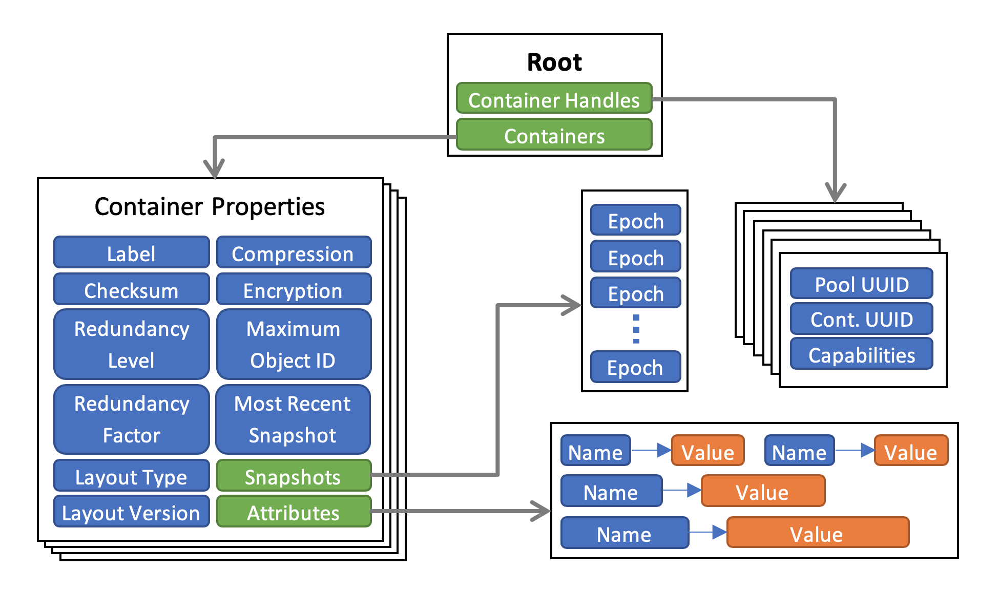

# DAOS Container

A container represents an object address space inside a pool. To access a container, an application must first connect to the pool and then open the container. If the application is authorized to access the container, it obtains a container handle. This includes capabilities that authorize any process in the application to access the container and its contents. The opening process may share this handle with any or all of its peers. Their capabilities are revoked either on explicit container close or on request from the system resource manager. A set of processes sharing the same container handle is called a process group. A process may belong to multiple process groups corresponding to one or more containers. Multiple process groups can open the same container, regardless of their open mode, and multiple concurrent read-write handles are supported.

## Container Service

The Container Service (`cont_svc`) stores the metadata for containers, and provides an API to query and update the state as well as for managing the life-cycle of a container (see: <a href="../../doc/storage_model.md#4.2.1">Container State</a>). Container metadata are organized as a hierarchy of key-value stores (KVS) that is replicated over a number of servers backed by Raft consensus protocol which uses strong leadership; client requests can only be serviced by the service leader while non-leader replicas merely respond with a hint pointing to the current leader for the client to retry (see: <a href="../src/rdb/README.md">Service Replication</a>).

#### Metadata Layout
----

The top-level KVS `root` has two children:

1. **Containers KVS:** Holds a list of Container Properties KVSs indexed by UUID of the Container which is supplied by the user at the time of creating a new container. 

2. **Container Handles KVS:** Used for storing data about container handles opened by various applications and indexed by a handle UUID which is generated by the client at the time of opening a container. The metadata associated with a container handle include its capabilities (e.g., read-only or read-write) and its per-handle epoch state, which consists of its LRE, LHE and HCE. (See <a href="../../doc/storage_model.md#4.2.1">Container Handle</a>).

##### Container Properties KVS
This is used to store per-container metadata that consists of many mutable and immutable scalar valued properties as well as other KVSs as shows in the figure above.

###### Epoch States
The LHEs and LREs of all open container handles are stored as keys in dedicated KVSs with values being their respective reference counts. These epoch-sorted KVSs enable us to quickly retrieve the minimum and maximum LHEs and LREs for various operations. When a container handle is closed, the reference count is decremented; the epoch is ultimately deleted when the count falls to zero. The GHCE and GHPCE are stored individually as scalar values.

###### Snapshots
Users can create, delete and retrieve a list persistent snapshots, which are essentially epochs that will not be aggregated away. The scope of a snapshot is an epoch of a container; the epoch must be equal to or higher than the LRE and be equal to or less than the HCE of the container handle — it is automatically generated by the client when a user requests creation of a new snapshot.

Snapshots are stored as an ordered list of epochs in the Container KVS. The list operation retrieves the array of epoch numbers stored on the server in a user-supplied buffer, while the total number of snapshots is returned in a separate argument. Destroying a snapshot causes the corresponding epoch to become a candidate for aggregation (see <a href="#8.3.1">Aggregation</a>).

###### Attributes
Users can define custom attributes for containers which are essentially name-value pairs; with the name being a null-terminated string while the value is an arbitrary sequence of bytes. The Container Service allows clients to retrieve and update multiple attributes at a time as well as to list names of stored attributes.

## Target Service

The Target Service maps the global object address space of a DAOS container onto the local object address space of a VOS container within the target's VOS pool (vpool), and and calls VOS methods on behalf of the Container Service (see: <a href="../vos/README.md#71">VOS Concepts</a>). It caches per-thread information on container objects and open handles in volatile memory for ready access.

#### Target Faults

------

Given hundreds of thousands of targets, the epoch protocol must allow progress in the presence of target faults. Since pool and container services are highly available, the problem is mainly concerned with target services. The solution is based on the assumption that losing some targets may not necessarily cause any application data loss, as there may be enough redundancy created by the DAOS-SR layer to hide the faults from applications. Moreover, an application might even want to ignore a particular data loss (which the DAOS-SR layer is unable to hide), for it has enough application-level redundancy to cope or it simply does not care.

When a write, flush, or discard operation fails, the DAOS-SR layer calculates if there is sufficient redundancy left to continue with the epoch. If the failure can be hidden, and assuming that the target in question has not already been disabled in the pool map (e.g., as a result of a RAS notification), the DAOS-SR layer must disable the target before committing the epoch. For the epoch protocol, the resulting pool map update effectively records the fact that the target may store an undefined set of write operations in the epoch, and should be avoided. This also applies to applications that would like to ignore similar failures which the DAOS-SR layer cannot hide.

#### Object ID Allocator

------

The OID allocator is a helper routine service that allows users to allocate a unique set of 64 bit unsigned integers within a container. This is helpful for applications or middleware that do not have a way to easily allocate a unique DAOS object ID in a scalable manner. The largest allocated ID is tracked in the Container Properties KVS for future access to that container. This service does not guarantee that the IDs allocated are sequential and several ID ranges may be discarded at container close.

The allocator is implemented using an Incast Variable on the server side that tracks the highest used object ID on a container on the root of the IV tree. A client may request a new allocation from any server running the Container Target Service, i.e. any node in the IV tree. When a new request arrives, the server first checks whether there are any allocated IDs available locally. If not, it forwards a request to the parent (asking for a bigger range of OIDs in that case). The parent does the same check and keeps forwarding to its parent until a request is satisfied or we reach the IV root, which updates the incast variable for the max OID allocated in the container metadata. At each tree level, the number of OIDs asked for is increased to be able to satisfy future OID allocation requests faster.

## Container Operations

A client creates a new container by sending a request to the Container Service with the pool handle and a UUID. The client must first establish a pool connection to obtain a pool handle. Optionally, the request can also contain a list of properties to be set on the newly created container. In response, the Container Service creates the corresponding Container Properties KVS with the UUID as the key.

Clients may now open a container by supplying the open pool handle and the container UUID along with flags (e.g., read-only or read-write). In addition, the client library attaches a locally generated UUID to the request. The Container Service processes the request by broadcasting the request with the client identifier as well as any open flags to all enabled targets in the pool; on successful completion it creates a new entry in the Container Handles KVS with the handle HCE and handle LRE set to be equal to the GHCE and the handle LHE set to `DAOS_EPOCH_MAX`. The handle LHE and LRE KVSs under the Container Properties KVS are also updated, with the corresponding reference counts incremented by 1. Similar to the case of pool handles, the client process may also share the container handle with its peers using the utility methods described in *<a href="../client/README.md#">Client Library</a>*.

A client can close a container handle that is no longer needed; at which point the Container Service broadcasts to all enabled targets to close the container handle. It then deletes the corresponding entry from the Container Handles KVS, decrements the reference counts for the LRE and LHE for that handle and discards all updates performed on the handle that were not committed.

Finally, a client can also destroy a container which causes the Container Service to purge all metadata and data associated with that container including all the objects within that container. The client can optionally  destroy a container forcibly in case it has handles that are currently open.

### Aggregation

Epoch aggregation in a container is driven by the corresponding container service as a background task, triggered either when the the GLRE increases or when a snapshot is deleted.

When the LRE increases, a list of epoch ranges for aggregation is calculated from the old GLRE to the new GLRE such that any snapshot falling between these two epochs will be preserved. When a snapshot Si is deleted, the aggregation range is calculated from Si-1 (or 0 if Si is the first snapshot) to $\min(S_{i+1}, GLRE)$. If Si is larger than GLRE, no aggregation is needed.

When aggregation is triggered, the Container Service calculates the epoch ranges for aggregation and sends a collective `CONT_TGT_EPOCH_AGGREGATE` request to all the target services, which in turn invoke aggregation on the specified epoch ranges within the corresponding VOS containers.

### Epoch Protocol

The epoch protocol implements the epoch model described in the <a href="../../doc/storage_model.md#4.2">Transactional Model</a>. The Container service manages the epochs of a container; it maintains the definitive epoch state as part of the container metadata, whereas the target services have little knowledge of the global epoch state. Epoch commit, discard, and aggregate procedures are therefore all driven by the container service. 

On each target, the target service eagerly stores incoming write operations into the matching VOS container. If a container handle discards an epoch, VOS helps discard all write operations associated with that container handle. When a write operation succeeds, it is immediately visible to conflicting operations in equal or higher epochs. A conflicting write operation with the same epoch will be rejected by VOS unless it is associated with the same container handle and has the same content as the one that is already executed. 

Before committing an epoch, an application must ensure that a sufficient set of write operations for this epoch have been persisted by the target services. The application and the DAOS-SR layer may decide that losing some write operations is acceptable, depending on the redundancy scheme each of them employs. Committing an epoch of a container handle results in a `CONT_EPOCH_COMMIT` request to the corresponding container service, which simply assembles a container metadata update that:

- increases the container handle HCE to this epoch,
- increases the container handle LHE to one more than this epoch, and
- updates the container HCE to $\min(\max_\forall(HCEs), \min_\forall(LHEs) + 1)$.

When the update becomes persistent, the container service replies to the client with the new epoch state.

An epoch of a container handle may be aborted by first discarding the epoch and then committing it as described above. Discarding an epoch results in a `CONT_EPOCH_DISCARD` request to the corresponding container service, which in turn triggers a collective `CONT_TGT_EPOCH_DISCARD` request to all target services. Once the discard method succeeds, all write operations from this container handle in this epoch are discarded. 