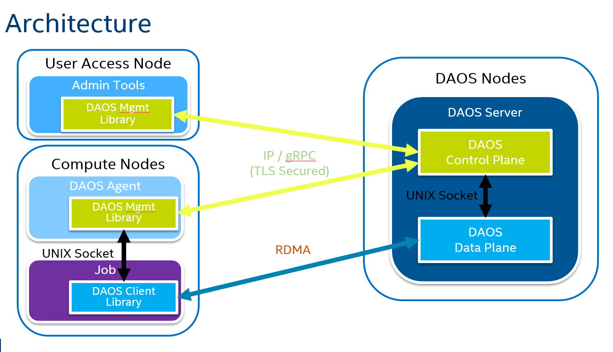

# DAOS Control Plane (daos_server)

DAOS operates over two, closely integrated planes, Control and Data. The Data plane handles the heavy lifting transport operations while the Control plane orchestrates process and storage management, facilitating the operation of the Data plane.

[DAOS Server](server/daos_server.go) implements the DAOS Control Plane and is written in Golang. It is tasked with network and storage hardware provisioning and allocation in addition to instantiation and management of the DAOS IO Servers (Data Plane written in C) running on the same host. Users of DAOS will interact directly only with the Control Plane in the form of the DAOS Server and associated tools.

The DAOS Server implements the [gRPC protocol](https://grpc.io/) to communicate with client gRPC applications and interacts with DAOS IO Servers through Unix domain sockets.

Multiple gRPC server modules are loaded by the control server. Currently included modules are security and management.

The Control Plane implements a replicated management service as part of the DAOS Server, responsible for handling distributed operations across the DAOS System.

The [shell](dmg/daos_shell) is an example client application which can connect to both the [agent](agent/daos_agent.go) to perform security functions (such as providing credentials and retrieving security contexts) and to the local management server to perform management functions (such as storage device discovery).

## Documentation

- [Management API](https://godoc.org/github.com/daos-stack/daos/src/control/client)
- [Management internals](https://godoc.org/github.com/daos-stack/daos/src/control/server)
- [Agent API](https://godoc.org/github.com/daos-stack/daos/src/control/client/agent)
- [Agent internals](https://godoc.org/github.com/daos-stack/daos/src/control/security)
- [dRPC](https://godoc.org/github.com/daos-stack/daos/src/control/drpc)

## Configuration

`daos_server` configuration file is parsed when starting `daos_server` process, it's location can be specified on the commandline (`daos_server -h` for usage) or default location (`<daos install dir>/install/etc/daos_server.yml`).

Parameters will be parsed and populated with defaults (located in `config_types.go`) if not present in configuration.

Commandline parameters take precedence over configuration file values but if not specified on commandline, configuration file values will be applied (or parsed defaults).

For convenience, active parsed config values are written to either directory where config file was read from or `/tmp/` if that fails.

If user shell executing `daos_server` has environment variable `CRT_PHY_ADDR_STR` set, user os environment will be used when spawning `daos_io_server` instances. In this situation a "Warning: using os env vars..." message will be printed to the console and no environment variables will be added as specified in the `env_vars` list within the per-server section of the server config file. This behaviour provides backward compatibility with historic mechanism of specifying all parameters through environment variables.

## Prerequisites

In addition to editing the configuration files prior to starting `daos_server`, an administrator needs to set passwordless sudo for the specific commands listed in `src/control/mgmt/init/setup_spdk.sh` (script is installed as `install/share/setup_spdk.sh`) in order for `daos_server` to enable access to the NVMe SSDs through SPDK when run as an unprivileged user.

The sudoers file can be accessed with command `visudo` and the simplest way to achieve the necessary access is to grant no-password sudo permissions to a user:
```
linuxuser ALL=(ALL) NOPASSWD: ALL
```
alternatively more fine-grained permissions can be granted e.g.:
```
linuxuser        ALL = NOPASSWD:SETENV: /home/linuxuser/projects/daos_m/install/share/spdk/scripts/setup.sh
linuxuser        ALL = NOPASSWD: /bin/chmod 777 /dev/hugepages
linuxuser        ALL = NOPASSWD: /bin/chmod 666 /dev/uio*
linuxuser        ALL = NOPASSWD: /bin/chmod 666 /sys/class/uio/uio*/device/config
linuxuser        ALL = NOPASSWD: /bin/chmod 666 /sys/class/uio/uio*/device/resource*
```

## Shell Usage

In order to run the shell to perform administrative tasks, build and run the `daos_server` as per the [quickstart guide](https://github.com/daos-stack/daos/blob/master/doc/quickstart.md).

`daos_server` is to be run as root in order to perform administrative tasks, to be run through `orterun` as root:

```
root$ orterun -np 1 -c 1 --hostfile hostfile --enable-recovery --allow-run-as-root --report-uri /tmp/urifile daos_server -c 1
```

daos_shell (the management tool to exercise the client api) is to be run as a standard, unprivileged user.  The shell can be used to connect to and interact with the gRPC server (running on port 10000 by default) as follows:
```
$ projects/daos_m/install/bin/daos_shell
DAOS Management Shell
>>> connect -t '127.0.0.1:10000'
>>> help
Commands:
  clear                 clear the screen
  connect               Connect to management infrastructure
  exit                  exit the program
  gethandle             Command to test requesting a security handle
  getmgmtfeature        Command to retrieve the description of a given feature
  getsecctx             Command to test requesting a security context from a handle
  help                  display help
  listmgmtfeatures      Command to retrieve all supported management features
  nvme                  Perform tasks on NVMe controllers
>>>
```

### NVMe subcommand

Operations on NVMe SSD devices are performed using [go-spdk bindings](./go-spdk/README.md) to issue commands over the SPDK framework.

#### NVMe Controller and Namespace Discovery

The following animation illustrates starting the control server and using the management shell to view the NVMe Namespaces discovered on a locally available NVMe Controller (assuming the quickstart_guide instructions have already been performed):


#### NVMe Controller Firmware Update

The following animation illustrates starting the control server and using the management shell to update the firmware on a locally available NVMe Controller (assuming the quickstart_guide instructions have already been performed):


#### NVMe Controller Burn-in Validation

Burn-in validation is performed using the [fio tool](https://github.com/axboe/fio) which executes workloads over the SPDK framework using the [fio_plugin](https://github.com/spdk/spdk/tree/v18.04.1/examples/nvme/fio_plugin).

## Architecture

First a view of software component architecture:



Then communication interfaces:

```
    ┌───────────────┐ ┌───────────────┐
    │  Go Shell     │ │ Other Client  │
    └───────────────┘ └───────────────┘
            │                 │
            └────────┬────────┘
                     ▼
          ┌─────────────────────┐
          │    Go daos_server   │----|
          └─────────────────────┘    |
                     │               |
                     ▼               |
       ┌───────────────────────────┐ |
       │     Unix Domain Socket    │ |
       └───────────────────────────┘ |
                     │               |
                     ▼               |
          ┌─────────────────────┐    |
          │   C daos_io_server  │    |
          └─────────────────────┘    |
                     │               |
                     ▼               |
           ┌────────────────────┐    |
           │ Persistent Storage │<---|
           └────────────────────┘
```
TODO: include details of `daos_agent` interaction

## Development Requirements

* [Golang](https://golang.org/) 1.9 or higher
* [gRPC](https://grpc.io/)
* [Protocol Buffers](https://developers.google.com/protocol-buffers/)
* [Dep](https://github.com/golang/dep/) for managing dependencies in vendor directory.

## Development setup

* If changing vendor package versions, edit `src/control/Gopkg.toml` and then run `dep ensure` from src/control.
* (Optional) protoc protocol buffer compiler

### Building the app

#### Local

* `scons` (binaries should be produced in `install/bin` directory)

### Testing the app

* Run the tests `go test` within each directory containing tests

## Coding Guidelines

### daos_server and daos_agent

* Avoid calling `os.Exit` (or `log.Fatal`, `log.Fatalf`, etc.), except for assertion purposes. Fatal errors shall be returned back to `main`, who determines the exit status based on its `err` and calls `os.Exit`, in its last deferred function call.
