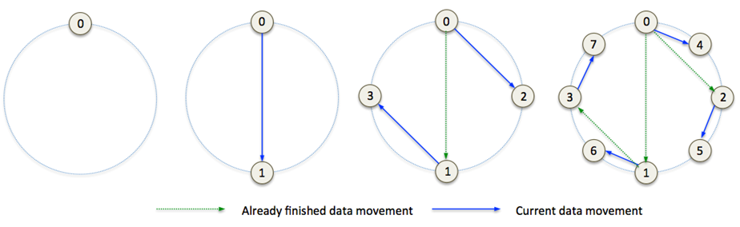

# Key Array Object

The DAOS-SR is the layer that provides object abstractions with horizontal scalability and resilience. A DAOS-SR objet is distributed to multiple targets and represented by DAOS-M objects on these targets. Each of these DAOS-M objects is called as a shard of this DAOS-SR object. DAOS-M objects for the same DAOS-SR object share the same object ID, they also have another 32 bits as the unique object shard index; in other words, DAOS-M object ID is extension of DAOS-SR object ID, it can guarantee collocated object shards will not have ID conflict.

Similar with other DAOS stack layers, DAOS-SR has its own client and server components. The client library of DAOS-SR can provide asynchronous APIs for the upper stack layers. In addition, it is responsible for distributing I/O to storage targets based on object schemas. The DAOS-SR servers are mostly responsible for resilience and data rebalancing; they can rebuild object data for a failed-out storage target, or migrate object shards between targets while extending the DAOS pool.

**Topiccs in this Chapter:**

- <a href="#10.1">Pool Map</a>
- <a href="#10.3">Scalable Object Index Table (OIT)</a>
- <a href="#10.4">Object Schema and object class</a>

## Pool Map

A pool map is the detailed description of a DAOS storage pool. It contains the status and characteristics of storage components, and relationships between components to represent hierarchical structure of a storage cluster. There are two types of DAOS pool components:

- **Domain:** A domain is a non-leaf component in a pool map. It should have a few children that can be either other domains, or targets. For example, a cabinet is a domain that has many boards as children; a board is also a domain that has a few nodes as children. A domain has no directly-attached storage.
- **Target:** A target is a leaf component in a pool map and it represents a storage device. A target should be addressable by a unique ID in the scope of a pool map.

The DAOS pool map is stored as metadata of the DAOS storage pool. To provide high availability, the pool map is replicated on a subset of storage nodes by using Raft protocol. The Raft leader will load and broadcast the pool map to all storage servers while initializing DAOS services on them, it also shares the pool map with clients that connect to the pool. These clients can propagate the pool map to all other clients while sharing the collective connection handle.

As described previously, the pool map is the common data structure for all containers within a DAOS pool, it manages target memberships for all these containers. Change of a pool map, e.g. disabling or adding a target, will trigger rebuild or rebalance of all containers within this DAOS pool.

The pool map is a versioned data structure. The version of the pool map is incremented for each change on this pool map; it is stored as an attribute of the pool map on the Raft targets. The current version of the pool map is piggybacked on all DAOS I/O messages, so the receiver can compare the latest version number known by the remote peer against its cached version. If the receiver has an older version of the pool map, it eagerly fetches the newer pool map from the consensus targets; however if the receiver has a newer version, it notifies the remote peer to update its pool map.

**Pool-map**

The pool map of a hierarchical storage pool is essentially a tree. To optimize the memory access model and reduce usage of memory and storage, the pool map is contiguously stored as a hybrid array, as shown in the <a href="#f10.1">figure</a> above. A pool map consists of domains and targets. Each domain has a pointer that points to all its child domains and direct/indirect targets within this domain, whereas a target is the leaf component and has no child. All components of a pool map have the following common attributes:

- **Type:** There could be many cluster component types, e.g. target, node, board, cabinet, rack, etc.
- **Unique ID:** Each component of the same type has a unique ID, for example, a rank within the communication group.
- **Status:** A component could be in a few states: DOWN, DOWN_OUT, UP, UP_IN. DOWN means a component is faulty and its data is being rebuilt on other targets, whereas DOWN_OUT means a component is disabled and its data has been rebuilt. UP indicates a component is being brought into the pool and its data is still being built; UP_IN indicates a component is fully functional and has all data for it. These states are only applied to targets in this design, but they could be extended to domains in the future.

A target in DOWN_OUT state should be kept in the pool map. Because DAOS-SR uses a pseudo-random algorithm to compute placement maps, removing a target from the pool map will generate a different set of placement maps and resulting in significant and unnecessary data movement. There will be a dedicated section to introduce details of Placement Map. A DOWN_OUT target is removed from the pool map only when it is replaced with a new target. For clarity, this design does not cover the protocol for failed target reintegration, rather it focuses on PM based storage, which should permit quick target rebuilds from scratch; it is therefore affordable for DSR to discard data on a failed target and treat it as a new one. The reintegration protocol could be added to support disk-based storage tiers in the future, but that is out of scope of this document.

- **Version:** The pool map version that a component was added, as mentioned earlier, it is stored as attribute of this component, as shown in the previous <a href="#f10.1">figure</a>
. With component versions, DAOS-SR can generate placement map for any version of the pool map.
- **Failure sequence:** Each time there is a target failure, the pool map assigns its current version to the failed target as the ‚failure sequence‚ of the target before increasing the pool map version number. This sequence number is used to determine where objects that became inaccessible on failure are rebuilt. This is also described in the <a href="#10.2.1">Placement Map</a> section.

To support quick search of components in a pool map, DAOS-SR creates pointer arrays for each component type when a pool map is instantiated. Pointers in each array point to components of a same type; they are sorted by ID, so any of these components can be found by a binary search of its ID.

To add more components to a pool map, instead of transferring the full pool map, only new components and their direct parents need to be propagated to storage servers, in the same format as a full pool map. DAOS services merge these new components with their own pool maps. As show in the previous <a href="#f10.1">figure</a>, (a.) is the version-1 of pool-map, (b.) is incremental changes for this pool-map, and (c.) is the merged pool-map in version 2.

## Scalable Object Index Table (OIT)

The Object Index Table (OIT) is essentially a distributed KV object that plays a special role in DAOS-SR because most objects store their IDs and metadata within it. It is distributed on all targets to achieve the scalability, IDs and metadata of different objects could therefore be hashed to different targets. When the upper layer stack tries to access an object, it must first open the object, which will query the OIT to fetch object metadata, including the object‚s distribution/redundancy schema and associated attributes. It may then compute the object distribution based on these metadata for later I/O requests.

The OIT has a well-known object ID and a fixed algorithmic schema so all nodes can compute the OIT layout. The OIT is 3-way replicated for high availability; it is placed on a ring placement map and distributed to all targets on the ring, as mentioned above, for high scalability. Because the layout of the DAOS pool can be changed over time, the OIT uses a consistent hash to distribute keys. When failing out a target or adding new targets, the OIT only needs to do necessary data movement, instead of reshuffling all KV pairs.

Each redundancy group of the OIT, which is called a tablet, includes 3 targets and is responsible for a range of hashed object IDs. In order to evenly distribute workload, tablets may overlap with each other, for example, tablet-0 resides on target-[0, 1, 2], tablet-1 resides on target-[1, 2, 3], tablet-2 resides on target-[2,3,4].

**Object index table**

The <a href="#f10.9">figure</a> above is an example of OIT, but does not include replicas of key ranges for clarity. When a failure occurs, to avoid a performance bottleneck, the OI records stored on the failed target should scatter to as many targets as possible. To achieve this goal, the OIT has a rebuild distribution factor, which is just an internally-generated constant N: OI records of the failed target should be rebuilt on N targets prior to the failed target. The rebuild target of each record should be selected either by hashed object ID modulo N, or by dividing the hash range of the target to N sub-ranges and then do range-match for hashed object ID. In the example in the <a href="#f10.9">figure</a>, the distribution factor is 4, so the hash range of the failed target-2 is split into 4 sub-ranges. The OI records of target-2 should be distributed to those 4 targets by matching their hashed IDs with the 4 sub-ranges.

The section <a href="#10.2.2.2.3">‚Load Balancing for Failure‚</a> introduced the methodology behind this, and (b) of the <a href="#f10.9">figure</a> above shows how it applies to OIT. When target-2 fails, the key-range on this target will be split into sub-ranges which are distributed to different targets, instead of throwing all OI records to a single target and doubling the workload on it.

While extending the DAOS pool, the OIT is rebalanced by splitting tablets and moving keys to new tablets. Similarly to the topic of object rebalancing, introduced in the section <a href="#10.2.2.3">‚Rebalancing for Pool Extension‚</a>, there are different approaches for different extending operations:

- While doubling domains, each key-range should be split into two ranges. For example, a tablet that is responsible for key range [16k-32k], after splitting, is responsible for key range [16k-24k] and its new neighbor is responsible for key range [24k-32k].
- While doubling targets within domains, OIT will double the global key range, as shown in the <a href="#f10.10">figure</a> below. Because the key range is doubled, half of OI records map to the extended key range, and are moved to those new targets.

**Object index table**

The following <a href="#f10.11">figure</a> is an example of OIT, in this figure, OIT is a 3-way replicated KV store, keys are object IDs and values are object metadata, which include the following:

- Target index for target affinity object
- Hash stride, or hash distance between targets within the same redundancy group, see the description above of doubling domains for details
- Metadata for dynamically striped object, which is ‚last extended offset‚ for byte array, and ‚split version‚ for KV object, more details about them are available in the section for ‚Dynamically Striped Object‚.

Although upper layers may store their metadata as object data transparently to DAOS-SR, they may also store their object metadata in the OIT. This not only takes advantage of OIT resilience but also minimizes data movement and network round trips because it can be returned on object open.

**Object index table**

## Object Schema and object class

The DAOS object schema describes the definitions for object types, data protection methods, and data distribution strategies. Based on these definitions and the requirements, upper layer stacks of DAOS-SR can register a number of object classes. An object class has a unique class ID, which is a 16-bit value, and can represent a category of objects that use the same schema and schema attributes. A successfully registered object class is stored as container metadata; it is valid in the lifetime of the container. In addition, DAOS-SR also provides some pre-defined object class for the most common use.

While creating an object, the upper level stack of DAOS always needs to provide a registered class ID. DAOS-SR uses this ID to find the corresponding object class, and then distribute and protect object data based on algorithm descriptions of this class. On completion of object creation, DAOS-SR adds the class ID into reserved bits of the object ID and returns it to the upper level stack. The upper layer should use the complete object ID to access this object in the future.

For those classes pre-defined by DAOS-SR, they are part of the common protocol that can be directly used between the DAO-SR client and server. For those customized object classes, they can never be changed after the registration, so both the DAOS-SR server and client can cache them to reduce queries.

### Replication

Replication ensures high availability of object data because objects are accessible while any replica exists. Replication can also increase read bandwidth by allowing concurrent reads from different replicas.
Generally, DAOS-SR can provide strict consistency of replicas for I/O at epoch granularity. Any read of an object at a specific epoch will return data written by the most recent epoch less than or equal the specified epoch. The data consistency between different epochs is supported by VOS and the epoch protocol:

- VOS can retain object history against different epochs
- Epoch protocol can provide a globally consistent view of data from multiple VOSs.

DAOS-SR could provide replication protocol either on the client, or on the server. They can provide different consistency guarantees for updates in the same epoch.

#### Client replication

DAOS-SR can choose the minimum replication protocol, which is synchronous and fully in the client stack, to provide high concurrency and low latency I/O for the upper layer stacks.

- I/O requests against replicas are directly issued via DAOS client; there is no sequential guarantee on writes in the same epoch, and concurrent writes for a same object can arrive at different replicas in an arbitrary order.
- Because there is no communication between servers in this way, there is no consistent guarantee if there are overlapped writes or KV updates in the same epoch. The DAOS server should detect overlapped updates in the same epoch, and return errors or warnings for the updates to the client. The only exception is multiple updates to the same extent or KV having the exactly same data. In this case, it is allowed because these updates could potentially be the resending requests.

Furthermore, when failure occurs, the client replication protocol still needs some extra mechanism to enforce consistency between replicas:

- If the DAOS-SR client can capture the failure, e.g. a target failed during I/O, because the DAOS-SR client can complete this I/O by switching to another target and resubmitting request. At the meanwhile, the DAOS-SR servers can rebuild the missing replica in the background. Therefore, DAOS-SR can still guarantee data consistency between replicas.
- If DAOS-SR cannot capture the failure, for example, the DAOS-SR client itself crashed before successfully updating all replicas so some replicas may lag behind. Based on the current replication protocol, the DAOS-SR servers cannot detect the missing I/O requests, so DAOS-SR cannot guarantee data consistency between replicas. The upper layer stack has to either re-submit the interrupted I/O requests to enforce data consistency between replicas, or abort the epoch and rollback to the consistent status of the container. For example, if an application linked to the SR client library crashed, then it should either replay uncompleted I/O requests if it has log for those I/Os, or abort the uncommitted epoch.

#### Server replication

DAOS-SR could also support server replication, which has stronger consistency of replicas with a trade-off in performance and latency, for example, a primary-copy replication protocol. With a server-side protocol, because the client only sends updates to the primary replica, conflict writes should be detected and serialized by the server, and it is safe to have overlapped writes in the same epoch.

### Erasure Code

In the case of replicating a whole object, the overhead would be 100% for each replica. This is unaffordable in some cases, so DAOS-SR also provides erasure code as another option of data protection, with better storage efficiency.

Erasure codes may be used by byte-array objects to improve resilience, with low space overhead. DAOS-SR can support synchronous erasure coding from the client stack, which means the client stack is responsible for code computing. However, to allow the client stack to compute parity before submitting data to the destination, this approach requires all writes to align with the stripe size; partial writes or un-serialized overlapped writes to a redundancy group will break the data protection and consistency.

DAOS-SR also supports semi-synchronous or asynchronous erasure coding to relax the alignment restriction on I/O patterns. In these modes, DAOS-SR client will not compute and store parities on write. Instead, a client should request servers to create empty parity chunks for dirty stripes while writing. An empty parity chunk only has a few metadata, such as the starting and ending offsets of the corresponding stripe, and epoch of the write. On the commit (semi-synchronous) or after the commit (asynchronous), each server needs to check all its empty parity chunks for the epoch. The server can compute out data localities based on metadata in each empty chunk, then pull data chunks from RDG members, and compute and fill parities into the empty chunk.

The <a href="#f10.12">figure</a> below shows the brief methodology of erasure code. Here, the object is striped across two target groups, each consisting of three targets. In a group, data chunks are stored on two of the three targets, and parity is stored on the remaining target. In order to utilize the I/O bandwidth of all targets evenly for the semi-synchronous and asynchronous erasure code, parity chunks are stored on different object shards for different stripes. In other words, each object shard is a mix of data and parity. There is no dedicated object shard for parities; this also means all RDG members can contribute to parity compute, which can improve the load balance of erasure coding.

**Erasure code of a 2-stripe object**

It is worth mentioning that in the semi-synchronous mode, there is no protection for data in uncommitted epochs. Therefore, unless the upper layer can replay I/O requests for uncommitted epochs, otherwise the container has to roll back to the HCE. In addition, the commit phase of semi-synchronous erasure code could be quite long if there is a large amount of data in the committing epoch.

In the asynchronous mode, although there is no extra latency for the commit, data may have no protection even in committed epochs, because the coding process could run in the background and take long time.

A solution for these issues is to provide a hybrid form of data protection, which uses replication to protect uncommitted data, and erasure code to protect committed data. Converting data protection methods can happen in the background after the commit phase. It means the commit phase can be quick because code computing can always be asynchronous. The <a href="#f10.13">figure</a> below is an example of converting a 3-way replicated object to a 4+2 coded object.

**Hybrid data protection**

When the underlying container is used as a persistent cache (e.g. in a multi-tier environment) of another container, the erasure code framework will have to be changed to store on each target the whole object metadata tree (e.g. EV tree for byte array or btree with epoch validity for KV store). The metadata tree will identify on each target all the extents that have been prefetched. As for the actual data, it will be available only on the target in charge of the stripe. This would then allow any target of the RDG to differentiate real holes (i.e. should return zero) from non-cached data (i.e. should trigger a cache miss) during rebuild and degraded mode.

### Single (unstriped) Object

Single (unstriped) objects always protect data by replication, they can generate the localities of replicas by the placement algorithm. For upper level that requires target affinity, instead of pseudo-randomly choosing all targets for an object, DSR places the primary copy on the affinity target and determines the localities of the other replicas by the placement algorithm. As mentioned in the section ‚Scalable Object Index Table (OIT)‚, the target affinity information must be stored in the OIT as object metadata.

A single (unstriped) object can be either a byte-array or a KV. Because a single object always has one stripe and each shard of it is a full replica, therefore, the placement algorithm is responsible only for computing the replica distribution and then DAOS-SR client can send data to all replicas on every write, without consideration of sharding object data.

### Fixed Stripe Object

A fixed stripe object has a constant number of stripes and each stripe has a fixed stripe size, which is either the stripe size in bytes for an array object or the key range for a KV. Upper levels provide values for these attributes when initializing the stripe schema, and then DAOS-SR uses these attributes when computing object layout.

#### Byte Array

Because a fixed stripe byte-array object has constant stripe size and stripe count, data localities are computed from the data offset and the layout. For example, an offset divided by stripe size modulo to the stripe count is the index of the target within the object layout. In the <a href="#f10.2">figure</a> above, assuming the stripe size is 16MB and the stripe count is 2, then 0-16MB of the object should be in the first stripe, 16MB-32MB should be in the second stripe, and 32MB-48MB should be in the first stripe again.

In addition, for objects protected by erasure code, each stripe consists of a parity group and has its distribution schema within group, which like data/parity chunk size, number of data/parity chunks. In the same <a href="#f10.2">figure</a> above, 0-8MB of the first stripe is stored on target-0, 8MB-16MB of the first stripe is stored on target-1, and their parity is stored on target-2.

#### Key Value

The KV object uses consistent hash key ranges to distribute keys to different redundancy groups. Keys and values are replicated to all members of each redundancy group. This makes it possible to support efficient range queries for some particular key types, such as integer key.

### Dynamically Striped Object

A fixed stripe object always has the same number of stripes since it was created. In contrast, a dynamically stripped object could be created with a single stripe. It will increase its stripe count as its size grows to some boundary, to achieve more storage space and better concurrent I/O performance.

#### Dynamically Striped Byte Array

A dynamically-stripped byte array always starts from a single stripe, and it can grow and extend itself to more targets.

While extending a dynamically-stripped byte array, its ‚last extended offset‚ should be stored in the OIT as object metadata, and a client should cache this attribute on open. If a client writes to offset that exceeds the current ‚last extended offset‚, it needs to request the OIT to update and store the new ‚last extended offset‚.

**Dynamically striped byte array object**

In the example shown in the <a href="#f10.4">figure</a> above, we show a dynamically-striped object that has 16MB stripe size and starts from a single stripe. If the object size exceeds 16 megabytes, it will add 3 redundancy groups to store more stripes, so the object will have 4 stripes. Each stripe can be written 64MB data with this layout (the last extended offset of this layout is 16+64\*4=272MB). After that, the layout will be changed again and more stripes will be created. In this example, the next ‚last extended offset‚ is 272+256\*8=2320MB.

It is worth mentioning that although the stripe size of the object remains the same, but the schema can increase the amount of data being written to each target while adding new stripes. In this example, the data amount can be written to each target is increased from 16MB to 64MB, then to 256MB, and then to 1024MB. In addition, DAOS-SR can quadruple or double the stripe count of the object in the initial phases, but it becomes less aggressive after increasing a few times, and it even could have an upper limit for the increment of stripe count, for example, adding 128 stripes at a time. Although complex, this approach can promptly provide parallel bandwidth from the start, and steadily grow capacity afterwards. In addition, these attributes can be customized while creating the object class.

Because the number of targets and locality of data offset can be calculated from the last extended offset, there is only small amount of metadata for this object type:

- Object ID
- The last extended offset
- Hash stride if it is based on ring placement map
- Optional: Affinity target ID for the primary replica of the first stripe (there is no target affinity for erasure coded object)

While extending the object, there is no data movement, which means even a client caches an obsolete version of the ‚last extended offset‚ of the object, it can still write to the correct target. In the meantime, the server should always reply the up-to-date ‚last extended offset‚ to the I/O client and avoid redundant requests for extending the object.

If the client wants to read from the offset beyond the last extended offset that it cached, it will send a read request to the ‚expected‚ target based on the I/O offset. If there is no data on that target, then empty extents will be returned. If there is data on that target because another process has already extended the object, then the up-to-date ‚last extended offset‚ will be returned together with data extents of this object.

Data of a dynamically-striped byte-array object can be protected by either replication or erasure codes.

#### Dynamically Striped Key Value

As described in the previous sub-section, there is no data movement while extending a byte-array object, however, this is different for dynamically striped KV object. A KV object should use consistent hash range to distribute KV records, it has to split the hash range of stripes while adding stripes, which means there is always data movement for KV object growing. For example, a single stripe object owns KVs in all hash ranges from 0 to 2^64-1, after splitting for once, the first stripe of this object should own KVs in hash range from 0 to 2^63-1, and the second stripe should own KVs in hash range from 2^63 to 2^64-1. It means that roughly half of KVs should migrate from the first stripe to the second stripe.

**Dynamically striped Key-Value object**

The <a href="#f10.15">figure</a> above shows a sequence of targets on a consistent hashing ring while growing. As an  example, if the first selected RDG on the placement map is G0, then after splitting twice, the target sequence for consistent hash is [G0, G2, G1, G3], which will be [G0, G4, G2, G5, G1, G6, G3, G7] after splitting thrice. Because this sequence or layout always can be computed out by an algorithm, there is no need to store the layout in OIT. The placement algorithm only needs to know how many times an object has been split, which is called ‚split version‚, to reproduce layout for the object. The split version should be stored as object metadata in OIT.

The splitting of an object shard could be triggered either by number of KVs or data volume of values in the object shard. When KV numbers within any shard exceeds a high water mark, this shard should notify OIT, which will then coordinate all shards of this object to split. A DAOS-SR client should cache the split version of KV, which is the most significant parameter for layout calculating and target selecting. A client should always send split version of KV with I/O request, a server should always send back its split version as part of reply.

If there are concurrent I/Os against the KV object while migrating KV records for the splitting, DSR should guarantee that read and enumeration can see all completed updates in the requested epoch and earlier epochs. To achieve this goal, updates for the KV object should be applied to both the new destination shard and the old shard for the key, and reads for the KV object should be submitted to the old shard which always has full data. After completing the splitting process, the client can switch to the new layout for both read and write; the server should reject I/O requests that carry the old split version. Similar protocol for rebalance is described in the section ‚Rebalance‚.

Metadata of dynamically striped KV only includes:

- Object ID
- The split version
- Hash stride if it is based on ring placement map
- Optional: Affinity target ID for the primary replica of the first stripe

### Document KV object

A Document KV (DKV) object is a striped KV store where each KV record of it is identified by two keys: a distribution key and an attribute key. These two keys have different functionalities for this schema.

- DAOS-SR hashes the distribution keys of different KV records to distribute them to different object shards.
- The attribute key is the local key within the scope of object shard; all KV records with the same distribution key and different attribute keys are guaranteed to be stored in the same object shard.
- Uniqueness of a KV record is provided by both of the distribution key and the attribute key.

A DKV object can fetch a set of attribute keys sharing the same distribution key in one network round-trip, because all corresponding records live in the same object shard.

While sharding a DKV object, DAOS-SR just treats it as a regular distributed KV object and splits it into shards by key ranges of the hashed distribution keys. It means that a DKV object can either be fixed stripe or dynamically split while growing, and a dynamically striped DKV object also has the ‚split version‚ as its metadata.

While searching or updating a KV record in a DKV object, DAOS-SR consistently hashes the distribution key to locate a shard for the record, then search the value in the KV shard by both distribution key and attribute key.

The <a href="#f10.16">figure</a> below is an example of DKV object.

**Documents KV object**

If DAOS just uses regular KV object of VOS to implement DKV object shard, then retrieving KV records that share the same distribution key might have to traverse all KV records in the object shard. This could be very expensive even all records can be fetched in a single network roundtrip. In order to avoid the overhead and support efficient retrieving of all KV records with the same distribution key, DAOS should use the Document Store of VOS to implement DKV object shard. Thus, all attribute keys and their values of the same distribution key are guaranteed to be stored in the same sub-tree, they can easily be found without unnecessary scanning.
