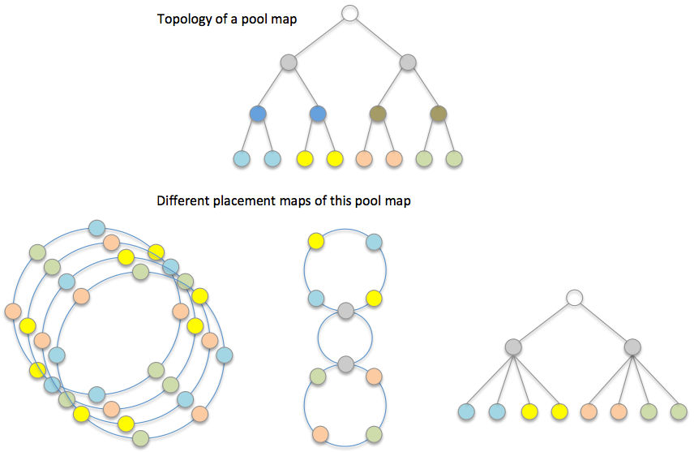

# Key Array Object (DAOS-SR)

The DAOS-SR is the layer that provides object abstractions with horizontal scalability and resilience. A DAOS-SR objet is distributed to multiple targets and represented by DAOS-M objects on these targets. Each of these DAOS-M objects is called as a shard of this DAOS-SR object. DAOS-M objects for the same DAOS-SR object share the same object ID, they also have another 32 bits as the unique object shard index; in other words, DAOS-M object ID is extension of DAOS-SR object ID, it can guarantee collocated object shards will not have ID conflict.

Similar with other DAOS stack layers, DAOS-SR has its own client and server components. The client library of DAOS-SR can provide asynchronous APIs for the upper stack layers. In addition, it is responsible for distributing I/O to storage targets based on object schemas. The DAOS-SR servers are mostly responsible for resilience and data rebalancing; they can rebuild object data for a failed-out storage target, or migrate object shards between targets while extending the DAOS pool.

**Topiccs in this Chapter:**

- <a href="#10.1">Pool Map</a>
- <a href="#10.2">Algorithmic object placement</a>
- <a href="#10.3">Scalable Object Index Table (OIT)</a>
- <a href="#10.4">Object Schema and object class</a>
- <a href="#R10.5">Rebuild</a>
- <a href="#10.6">Rebalance</a>
- <a href="#10.7">Memory-Map Support</a>

## Pool Map

A pool map is the detailed description of a DAOS storage pool. It contains the status and characteristics of storage components, and relationships between components to represent hierarchical structure of a storage cluster. There are two types of DAOS pool components:

- **Domain:** A domain is a non-leaf component in a pool map. It should have a few children that can be either other domains, or targets. For example, a cabinet is a domain that has many boards as children; a board is also a domain that has a few nodes as children. A domain has no directly-attached storage.
- **Target:** A target is a leaf component in a pool map and it represents a storage device. A target should be addressable by a unique ID in the scope of a pool map.

The DAOS pool map is stored as metadata of the DAOS storage pool. To provide high availability, the pool map is replicated on a subset of storage nodes by using Raft protocol. The Raft leader will load and broadcast the pool map to all storage servers while initializing DAOS services on them, it also shares the pool map with clients that connect to the pool. These clients can propagate the pool map to all other clients while sharing the collective connection handle.

As described previously, the pool map is the common data structure for all containers within a DAOS pool, it manages target memberships for all these containers. Change of a pool map, e.g. disabling or adding a target, will trigger rebuild or rebalance of all containers within this DAOS pool. 

The pool map is a versioned data structure. The version of the pool map is incremented for each change on this pool map; it is stored as an attribute of the pool map on the Raft targets. The current version of the pool map is piggybacked on all DAOS I/O messages, so the receiver can compare the latest version number known by the remote peer against its cached version. If the receiver has an older version of the pool map, it eagerly fetches the newer pool map from the consensus targets; however if the receiver has a newer version, it notifies the remote peer to update its pool map.
 

**Pool-map**

The pool map of a hierarchical storage pool is essentially a tree. To optimize the memory access model and reduce usage of memory and storage, the pool map is contiguously stored as a hybrid array, as shown in the <a href="#f10.1">figure</a> above. A pool map consists of domains and targets. Each domain has a pointer that points to all its child domains and direct/indirect targets within this domain, whereas a target is the leaf component and has no child. All components of a pool map have the following common attributes:

- **Type:** There could be many cluster component types, e.g. target, node, board, cabinet, rack, etc.
- **Unique ID:** Each component of the same type has a unique ID, for example, a rank within the communication group.
- **Status:** A component could be in a few states: DOWN, DOWN_OUT, UP, UP_IN. DOWN means a component is faulty and its data is being rebuilt on other targets, whereas DOWN_OUT means a component is disabled and its data has been rebuilt. UP indicates a component is being brought into the pool and its data is still being built; UP_IN indicates a component is fully functional and has all data for it. These states are only applied to targets in this design, but they could be extended to domains in the future.

A target in DOWN_OUT state should be kept in the pool map. Because DAOS-SR uses a pseudo-random algorithm to compute placement maps, removing a target from the pool map will generate a different set of placement maps and resulting in significant and unnecessary data movement. There will be a dedicated section to introduce details of Placement Map. A DOWN_OUT target is removed from the pool map only when it is replaced with a new target. For clarity, this design does not cover the protocol for failed target reintegration, rather it focuses on PM based storage, which should permit quick target rebuilds from scratch; it is therefore affordable for DSR to discard data on a failed target and treat it as a new one. The reintegration protocol could be added to support disk-based storage tiers in the future, but that is out of scope of this document.

- **Version:** The pool map version that a component was added, as mentioned earlier, it is stored as attribute of this component, as shown in the previous <a href="#f10.1">figure</a>
. With component versions, DAOS-SR can generate placement map for any version of the pool map.
- **Failure sequence:** Each time there is a target failure, the pool map assigns its current version to the failed target as the “failure sequence” of the target before increasing the pool map version number. This sequence number is used to determine where objects that became inaccessible on failure are rebuilt. This is also described in the <a href="#10.2.1">Placement Map</a> section.

To support quick search of components in a pool map, DAOS-SR creates pointer arrays for each component type when a pool map is instantiated. Pointers in each array point to components of a same type; they are sorted by ID, so any of these components can be found by a binary search of its ID.

To add more components to a pool map, instead of transferring the full pool map, only new components and their direct parents need to be propagated to storage servers, in the same format as a full pool map. DAOS services merge these new components with their own pool maps. As show in the previous <a href="#f10.1">figure</a>, (a.) is the version-1 of pool-map, (b.) is incremental changes for this pool-map, and (c.) is the merged pool-map in version 2.

## Algorithmic object placement

DAOS-SR uses the pool map to create a set of placement maps that are used to compute algorithmic object layouts and to drive consensus data distribution. This approach uses consistent hash based algorithms to generate object layout based on object ID, object schema, and one of the placement maps. The major placement map algorithm discussed in this document is the <a href="#10.2.2">“Ring Placement Map”</a>, which is a concept developed in collaboration with Argonne National Laboratory, see preliminary work in P. Carns et al, “Consistent Hashing Distance Metrics for Large-Scale Object Storage” (http://sc15.supercomputing.org/sites/all/themes/SC15images/tech_poster/tech_poster_pages/post117.html).

### Placement Map

A placement map essentially is an abstracted and permutated pool map; it does not necessarily include all details of the pool map. Instead it only retains component relationships that can be used to distribute object shards for the resilience and performance requirements of the application.

 

**Pool-map and placement maps**

A placement map does not maintain a copy of status or any characteristics of the corresponding pool map components, but only references pool map components. Each time DAOS-SR computes an object distribution based on a placement map, it also needs to check the corresponding component status and attributes from the pool map. This adds an extra step for indirect memory access, but can significantly reduce cache pollution and memory consumption in case of there are many placement maps but only one pool map in a DAOS pool.

As shown in the <a href="#f10.2">figure</a>, a storage pool may have multiple types of placement maps because different applications can have various fault tolerance and performance requirements. In addition, there can be many instances of the same placement map in order to accelerate rebuild and rebalance by workload declustering. This topic will be introduced in <a href="#10.2.3">Multi-ring Placement Map"</a>.

### Ring Placement Map

The first approach of building a placement is to place storage targets on a consistent hashing ring, called a ring placement map.
Ring placement can handle one level of fault domain to avoid data loss in the event of multiple correlated target failures. If the number of fault domains is more than size of the redundancy group of an object, then a ring placement map can guarantee that data of this object will survive even if all targets within a fault domain fail together. To achieve this goal, the ring placement map should evenly distribute targets from the same fault domain on the placement ring. For example, if there are four targets within a domain, then the distance between each two targets from this domain should be an arc of 90 degrees on the ring.

The <a href="#f10.3">figure</a> below shows how to build a ring placement map. Targets in the same color are within the same fault domain, and are evenly placed on the ring, so that arc-distances between them are always identical. To simplify the description, all domains have the same number of targets in this example, but this is not a mandatory requirement. A proposal of eliminating this limit will be introduced in the section Multi-Ring Placement Map.

It is also worth mentioning that sequences of targets are randomized in the example in the <a href="#f10.3">figure</a> below. This is unnecessary if only one ring placement map is built for the DAOS pool, but it is important if multiple placement rings are created for the pool. The reason of this will also be explained in Multi-Ring Placement Map as well.

To generate distribution of an object by using a ring placement map, DAOS-SR hashes the ID of the object to a position on the consistent hashing ring. If the object is to be striped ‘S’ ways over redundancy groups of size ‘R’, it then places the object shards on the next N=S\*R targets on the ring in the direction of consistent hash. In the <a href="#f10.3">figure</a> below, three targets in the green ellipse have been selected for a 3-way replicated object.

**Ring Placement Map**

#### Fault Tolerance

Since the ring placement map ensures targets in the same fault domain are widely spaced, then provided there are enough fault domains, the ring map will not place object shards in the same redundancy group on targets in the same fault domain. Redundant objects placed using the ring placement map can therefore tolerate the correlated failure of targets sharing the same fault domain. The number of such correlated failures that can be tolerated depends on the size of the object’s redundancy groups. As shown in the <a href="#f10.3">figure</a> above, although four targets will fail on any board failure, any two boards may fail without data loss.

#### Failure Handling and Rebuild

Although redundant object data may not be lost on target failure, the objects with shards that became inaccessible due to the failure must now operate in degraded mode. It is important to rebuild this object data as soon as possible after failure is detected for the following reasons.

- Object data is more vulnerable to loss from further failures in degraded mode since redundancy has been reduced or may even have been eliminated. 
- Performance is impacted in degraded mode. For replicated objects, reads must now be distributed over fewer shards, and for erasure coded objects, data from the failed shard may have to be reconstructed from many other shards sharing the same redundancy group.

##### Rebuild Targets

Rebuild targets are targets that will be used to reconstruct object shards that become inaccessible due to target failures. In the <a href="#f10.4">figure</a> below, an object is distributed on targets-[3, 4, 5, 6] and rebuild targets for this object are targets-[1, 2].  Rebuild targets may be selected from prior targets, in reverse consistent hash order, to the first member of a given redundancy group (RDG). Successive failures may continue to select the next rebuild target in reverse hash ring order until a target would be selected that does not share the same fault domain as any RDG member. 

When an object is striped across many RDGs and RDGs are placed contiguously on the ring, selecting a rebuild target immediate before the RDG with a failure will cause shards from the same object, albeit in different RDGs, to be located on the same target. This will degrade performance on failure because I/O will no longer be balanced.

To avoid this imbalance, widely distributed striped objects may be placed with “gaps” be-tween RDGs to leave spare targets for rebuild. Because leaving such a gap between all RDGs in an object striped over the whole DAOS pool will leave a significant proportion of targets spare before the first failure, “gaps” may be introduced at less regular intervals and shared by groups of RDGs. This increases overall performance at the expense of locating rebuild targets more distantly on the hash ring from the degraded RDG, therefore a balance must be found between these competing requirements. 
 
 
**Rebuild targets and failure sequence**

Note that after all spare targets in a gap have become rebuild targets, further failures can still be handled by selecting rebuild targets immediately prior to the first member of RDGs affected by failure, albeit at the expense of load balance. This also means that multiple shards of a same object can possibly be stored on the same target. To distinguish these collocated shards from a same object, DSR can construct DSM object ID by appending object shard index to DSR object ID.

On very small DAOS pools with relatively few fault domains, it may not be possible to allocate “gaps” of spare rebuild targets at all, because the proportion of gaps and performance loss may be unacceptably high. However, on large DAOS pools with many fault domains, sufficiently large gaps needed to ensure balanced I/O after many failures could be spaced widely and therefore occupy a sufficiently small proportion of the ring to ensure good performance.

##### Failure Sequence and Rebuild

Because members of an erasure coded RDG are all different, it is vital to track the mapping of RDG member to rebuild target correctly when the RDG member is made inaccessible by a failure. This must be done without generating any additional per-RDG or per-object metadata for truly algorithmic object layouts.

RDG members are numbered consecutively from zero and are initially placed in order on adjacent placement ring targets. As targets fail, the next available rebuild RDG must be selected, initially from spares in any prior “gap” and then from remaining rebuild target candidates. This must be done deterministically, irrespective of the order in which targets fail. As show in the <a href="#f10.4">figure</a> above, DAOS-SR must determine which of target-[1, 2] is the replacement of target-4, and which is the replacement of target-5.

Target failure-order is used to ensure deterministic mapping of RDG member to targets. DAOS pools increment the version number of the pool map on all target state changes, and record this version number with the target on failure so that failed targets can be ordered by the map version at which they failed. This sequence in turn determines the order in which candidate rebuild targets are selected. In the example of (c) in the <a href="#f10.4">figure</a> above, both target-4 and target-5 failed but it does not mean target-4 selected the near spare target-2 as replacement, because target-4 has higher failure sequence than target-5 so it should select the spare target after target-5.

##### Load Balancing for Failure

When there is no failure, the ring placement map can evenly distribute objects to all targets. However, when there is a failure, the missing object shards should be rebuilt on surviving spare targets. Because these spare targets are also regular targets for other objects, they could store more objects than other targets and have to handle more I/O requests. In this case, the I/O workload of storage cluster is imbalanced, and this could be a major source of jitter and affect the overall performance.
 

**Object distribution on rebuild targets**

In the <a href="#f10.5">figure</a> above, if all objects are 3-way replicated, and the layout of each of them is the targets connected by arcs in the same color. When target-4 fails, as each object will choose the prior target as spare target:

- A new replica of the red object will be rebuilt on target-1.
- A new replica of the purple object will be rebuilt on target-2.
- A new replica of the blue object will be rebuilt on target-3.

Therefore, targets 1, 2, and 3 will each take 33% of the objects from target-4, and they have to handle 33% more I/O requests than other targets.

One way to reduce data imbalance like this is to create multiple rings, which will be introduced later. The potential problem with multiple rings is they can consume a lot of memory and CPU cache. For example, if there are hundreds of thousands of targets in the DAOS pool, each ring may consume one megabyte of RAM, and a multi-ring approach would not be a good option. The other approach to reduce imbalance is to allow objects to choose rebuild targets at varying distances on the placement ring, instead of always selecting the nearest preceding target as a rebuild target. For example, DAOS-SR can hash the object ID and use the modulo of the hashed ID as the distance between the first object shard and the first rebuild target. In in the <a href="#f10.5">figure</a> above, if the calculated distance is zero, target-1 is still the rebuild target for the red object. However, if the calculated distance is 1, then target-0 is the rebuild target for the red object. In this way, if the ring is big enough, then the distance to a rebuild target can vary between 0 and a larger value. It means that missing object shards on the failed target can be rebuilt on many different targets, and each of these targets only takes over a small amount of data and I/O requests from the failed target.

#### Rebalancing for Pool Extension

When new storage targets are added to a DAOS pool, containers within this pool should rebalance data by migrating some of the existing object shards to the new targets. 

One of the major limits of the single-ring placement map is that it requires all domains to have exactly the same number of targets to build a symmetric ring. It also imposes some restrictions to pool change operations, to avoid reshuffling of all data. The simpler use cases considered here are, either the total number of domains or the total number of targets is doubled. Other attempts to change the DAOS pool will trigger significant amount of data movement.

##### Doubling Domains
As previously mentioned, the ring placement map can be aware of one type of domain. If the number of domains of this type in the DAOS pool is doubled while extending the DAOS pool, then ideally, half of all objects should be moved to those new domains. To achieve this goal, targets from those new domains should always be inserted between two original targets on the consistent hashing ring. In this way, the hash distance between any two original targets is unchanged, and hash distance between two new targets is the same as the original targets.

As shown in the <a href="#f10.6">figure</a> below, objects placed on the ring should either stay in place, or be moved to new targets. If overall objects are evenly distributed on all targets before extending, then only 50% of the data will migrate.

**Doubling domains for a ring placement map**

 
The shards of objects created before the new domains are added, are no longer contiguous on the ring after doubling to avoid having to move all shards except the first one. This may be achieved by keeping the hash stride between object shards constant. However, this necessitates storing the initial hash stride with the object metadata as described in the next section. Note that the distribution of an object will become increasingly sparse on the placement ring with each extending operation.

##### Doubling Targets within Domains

Another way of symmetrically extending a DAOS pool is by doubling the number of targets within each domain. The number of domains is still the same after doubling, but the hash distance between targets in the same domain becomes ½ of the original distance since new targets have to be inserted between all original targets of the same domain. However, at the position for the new target, there could already be a target from a different domain. In the example in in the <a href="#f10.7">figure</a> below, on the left ring, if a new target is added to the same domain of T0 and T1, to keep the same distance between targets from the same domain, it has to be put on the position of T4 or T5. It means T4 and T5 have to be rotated and objects on them have to migrate to other targets.

To avoid this situation, DAOS-SR doubles the consistent hashing key range. For example, in the <a href="#f10.7">figure</a> below, the key range of the hash ring is 8000 before doubling and is increased to 16000 after doubling targets. All new targets are placed on the new extended key range of the ring (left half of the large ring). When DAOS-SR places an object by hashing its ID, the hashed result should either be the same, which is 700 in this example, or become 8000+700=8700. With this approach, DAOS-SR can guarantee that only 50% of the data will be moved after doubling of targets.
  

**Doubling targets within domains**

### Multi-Ring Placement Map

As described earlier, although the single ring placement map consumes less memory, it has a few significant drawbacks:

- It can only be built from a DAOS pool that has exactly the same number of targets in all domains.
- It cannot guarantee even data distribution and reasonable data movement for arbitrary extending of a DAOS pool.
- It cannot decluster the rebuilding workload on failure; only a limited number of targets in the distance of redundancy group size can contribute to rebuild.

These drawbacks are not crucial for the NVM based storage tier because it should have extremely high bandwidth, which can support quick data movement; it also has symmetric node allocation for the best of application performance. However, these limits could be an issue for the cold storage tier, which may have spinning disk as storage devices. Spinning disk based targets have limited bandwidth and could take a long time to rebuild if only a few targets can contribute on any rebuild. In addition, for the cold storage tier, doubling is an unlikely way of extending storage, whereas progressively extending is the more likely approach.

Multi-ring placement map can resolve these issues at some level. In a multi-ring placement map, each ring is created in a similar way as single-ring placement map and a ring still includes the same number of targets from each domain. However, because a DAOS pool could have asymmetric distribution of domain targets, a ring should not include all domains, and it does not always select all targets from a domain. Different rings of the placement map should include different set of domains and targets, giving enough rings, the placement map can make fair use of all targets in the storage pool.

In the example in the <a href="#f10.8">figure</a> below, there are six domains and these domains have different number of targets. If all rings are created with all domains, then it is impossible to guarantee that appearances of targets and the hash distances between targets are the same. If rings are created with 4 domains and 2 targets from each domain, then it is possible to build 8\*N rings to guarantee appearances of each target are the same.

**Multi-ring placement map**

Given a large enough number of rings, each of them is created by a pseudo-random algorithm that selects M domains from the total of N domains, and selects T targets from each domain.

- Each domain has a weight number that is equal to the number of targets within it, for example, the weight of the gray domain is 4, and the weight of the yellow domain is 7.
- The domain ring-key is a value in a fixed range that is computed by a pseudo-random hash algorithm which takes the ring ID as a random seed and the domain ID as hash input. DAOS-SR scales ring-keys of all domains by their weights, then sorts the scaled results and selects the first M domains to build a placement ring. Because different rings have different random seeds for the hash algorithm, so each of them select a different set of domains. The domains that have more targets should have a greater chance of being selected because their ring-keys will be scaled by larger weights.
- Similarly, the target ring-key is also a value in a fixed range that is computed by a pseudo-random hash algorithm which takes the ring ID as a random seed and the target ID as hash input. DAOS-SR sorts all target ring-keys and selects the first T targets for a placement ring.

As more targets are added to a domain, the domain has more chances to be selected while creating placement rings, because it has a higher weight value as the scale factor of the domain ring-key. The extended domain will therefore replace other domains on a relatively few rings and data movement for rebalance is reduced because only those domains being replaced have to move objects to the domain with new targets.

Also, when adding a new target, if its target ring-key is higher than all other targets in the same domain, and if DAOS-SR uses the sorted target list to build a ring, then all other targets will be shifted because the new target will be put at the head of the target list. For example, in a pool map version 1, DAOS-SR needs to select 6 targets out from 8 targets in a domain, after sorting them by their ring-keys, assuming the selected targets are:

*3(v=1), 1(v=1), 7(v=1), 5(v=1), 2(v=1), 4(v=1)*

Another 2 targets (target-8 and target-9) were added to this domain in version 2, and target-8 has the highest ring-key, so the selected targets will be:

*8(v=2), 3(v=1), 1(v=1), 7(v=1), 5(v=1), 2(v=1)*

Positions for the rest of the 5 targets are changed on the ring, so objects residing on these targets will be reshuffled, which is undesirable. This situation can be avoided by the following approach:

Targets are still selected by the sorted target ring-key, but the output list is sorted again by version and ring-key where the version is the major key for sort. Targets with lower version number take precedence over targets with higher version number, so in the previous example, the output list becomes:

*3(v=1), 1(v=1), 7(v=1), 5(v=1), 2(v=1), 8(v=2)*

In this approach, only objects on target-2 are moved to target-8.

#### Rebuild Declustering
In a multi-ring placement map, targets have different neighbors on the different rings. If one target fails, all neighbors on all rings can contribute to data rebuild, which can significantly reduce the time of recovery.

In the previous <a href="#f10.8">figure</a>, neighbors of target-9 are target-2 and target-7 on the first ring, and target-3 and target-5 on the third ring. Assuming all objects are 2-way replicated, if target-9 fails, then these four targets can contribute to rebuild data for target-9, because they all have replicas for objects on target-9.

#### Widely Striped Object

In the example in the previous <a href="#f10.8">figure</a>, all 8 rings have 8 targets. An object cannot therefore have more than 8 shards, and applications cannot efficiently use the full bandwidth of the storage cluster for large objects. To resolve this problem, a multi-ring placement map may have rings with different sizes. For example, it may include a few large rings besides hundreds or thousands of small rings.

In the above example, DAOS-SR may create a few large rings with 24 targets, each of these rings has 4 targets from all 8 domains. Only widely-striped objects will be placed on these rings to achieve better I/O concurrency.

Furthermore, while adding more and more targets to the DAOS pool over time, DAOS-SR can create even larger rings. Rings that were originally large could become small because they can only cover a small set of targets in the DAOS pool, and the original small rings could be eliminated gradually.

## Scalable Object Index Table (OIT)

The Object Index Table (OIT) is essentially a distributed KV object that plays a special role in DAOS-SR because most objects store their IDs and metadata within it. It is distributed on all targets to achieve the scalability, IDs and metadata of different objects could therefore be hashed to different targets. When the upper layer stack tries to access an object, it must first open the object, which will query the OIT to fetch object metadata, including the object’s distribution/redundancy schema and associated attributes. It may then compute the object distribution based on these metadata for later I/O requests.

The OIT has a well-known object ID and a fixed algorithmic schema so all nodes can compute the OIT layout. The OIT is 3-way replicated for high availability; it is placed on a ring placement map and distributed to all targets on the ring, as mentioned above, for high scalability. Because the layout of the DAOS pool can be changed over time, the OIT uses a consistent hash to distribute keys. When failing out a target or adding new targets, the OIT only needs to do necessary data movement, instead of reshuffling all KV pairs.

Each redundancy group of the OIT, which is called a tablet, includes 3 targets and is responsible for a range of hashed object IDs. In order to evenly distribute workload, tablets may overlap with each other, for example, tablet-0 resides on target-[0, 1, 2], tablet-1 resides on target-[1, 2, 3], tablet-2 resides on target-[2,3,4].

**Object index table**

 
The <a href="#f10.9">figure</a> above is an example of OIT, but does not include replicas of key ranges for clarity. When a failure occurs, to avoid a performance bottleneck, the OI records stored on the failed target should scatter to as many targets as possible. To achieve this goal, the OIT has a rebuild distribution factor, which is just an internally-generated constant N: OI records of the failed target should be rebuilt on N targets prior to the failed target. The rebuild target of each record should be selected either by hashed object ID modulo N, or by dividing the hash range of the target to N sub-ranges and then do range-match for hashed object ID. In the example in the <a href="#f10.9">figure</a>, the distribution factor is 4, so the hash range of the failed target-2 is split into 4 sub-ranges. The OI records of target-2 should be distributed to those 4 targets by matching their hashed IDs with the 4 sub-ranges.

The section <a href="#10.2.2.2.3">“Load Balancing for Failure”</a> introduced the methodology behind this, and (b) of the <a href="#f10.9">figure</a> above shows how it applies to OIT. When target-2 fails, the key-range on this target will be split into sub-ranges which are distributed to different targets, instead of throwing all OI records to a single target and doubling the workload on it.

While extending the DAOS pool, the OIT is rebalanced by splitting tablets and moving keys to new tablets. Similarly to the topic of object rebalancing, introduced in the section <a href="#10.2.2.3">“Rebalancing for Pool Extension”</a>, there are different approaches for different extending operations:

- While doubling domains, each key-range should be split into two ranges. For example, a tablet that is responsible for key range [16k-32k], after splitting, is responsible for key range [16k-24k] and its new neighbor is responsible for key range [24k-32k].
- While doubling targets within domains, OIT will double the global key range, as shown in the <a href="#f10.10">figure</a> below. Because the key range is doubled, half of OI records map to the extended key range, and are moved to those new targets.
 

**Object index table**

The following <a href="#f10.11">figure</a> is an example of OIT, in this figure, OIT is a 3-way replicated KV store, keys are object IDs and values are object metadata, which include the following:

- Target index for target affinity object
- Hash stride, or hash distance between targets within the same redundancy group, see the description above of doubling domains for details
- Metadata for dynamically striped object, which is “last extended offset“ for byte array, and “split version” for KV object, more details about them are available in the section for “Dynamically Striped Object”. 

Although upper layers may store their metadata as object data transparently to DAOS-SR, they may also store their object metadata in the OIT. This not only takes advantage of OIT resilience but also minimizes data movement and network round trips because it can be returned on object open.

**Object index table**

 
## Object Schema and object class

The DAOS object schema describes the definitions for object types, data protection methods, and data distribution strategies. Based on these definitions and the requirements, upper layer stacks of DAOS-SR can register a number of object classes. An object class has a unique class ID, which is a 16-bit value, and can represent a category of objects that use the same schema and schema attributes. A successfully registered object class is stored as container metadata; it is valid in the lifetime of the container. In addition, DAOS-SR also provides some pre-defined object class for the most common use.

While creating an object, the upper level stack of DAOS always needs to provide a registered class ID. DAOS-SR uses this ID to find the corresponding object class, and then distribute and protect object data based on algorithm descriptions of this class. On completion of object creation, DAOS-SR adds the class ID into reserved bits of the object ID and returns it to the upper level stack. The upper layer should use the complete object ID to access this object in the future.

For those classes pre-defined by DAOS-SR, they are part of the common protocol that can be directly used between the DAO-SR client and server. For those customized object classes, they can never be changed after the registration, so both the DAOS-SR server and client can cache them to reduce queries.

### Replication

Replication ensures high availability of object data because objects are accessible while any replica exists. Replication can also increase read bandwidth by allowing concurrent reads from different replicas.
Generally, DAOS-SR can provide strict consistency of replicas for I/O at epoch granularity. Any read of an object at a specific epoch will return data written by the most recent epoch less than or equal the specified epoch. The data consistency between different epochs is supported by VOS and the epoch protocol:

- VOS can retain object history against different epochs
- Epoch protocol can provide a globally consistent view of data from multiple VOSs.

DAOS-SR could provide replication protocol either on the client, or on the server. They can provide different consistency guarantees for updates in the same epoch.

#### Client replication

DAOS-SR can choose the minimum replication protocol, which is synchronous and fully in the client stack, to provide high concurrency and low latency I/O for the upper layer stacks.

- I/O requests against replicas are directly issued via DAOS client; there is no sequential guarantee on writes in the same epoch, and concurrent writes for a same object can arrive at different replicas in an arbitrary order.
- Because there is no communication between servers in this way, there is no consistent guarantee if there are overlapped writes or KV updates in the same epoch. The DAOS server should detect overlapped updates in the same epoch, and return errors or warnings for the updates to the client. The only exception is multiple updates to the same extent or KV having the exactly same data. In this case, it is allowed because these updates could potentially be the resending requests.

Furthermore, when failure occurs, the client replication protocol still needs some extra mechanism to enforce consistency between replicas:

- If the DAOS-SR client can capture the failure, e.g. a target failed during I/O, because the DAOS-SR client can complete this I/O by switching to another target and resubmitting request. At the meanwhile, the DAOS-SR servers can rebuild the missing replica in the background. Therefore, DAOS-SR can still guarantee data consistency between replicas.
- If DAOS-SR cannot capture the failure, for example, the DAOS-SR client itself crashed before successfully updating all replicas so some replicas may lag behind. Based on the current replication protocol, the DAOS-SR servers cannot detect the missing I/O requests, so DAOS-SR cannot guarantee data consistency between replicas. The upper layer stack has to either re-submit the interrupted I/O requests to enforce data consistency between replicas, or abort the epoch and rollback to the consistent status of the container. For example, if an application linked to the SR client library crashed, then it should either replay uncompleted I/O requests if it has log for those I/Os, or abort the uncommitted epoch.

#### Server replication

DAOS-SR could also support server replication, which has stronger consistency of replicas with a trade-off in performance and latency, for example, a primary-copy replication protocol. With a server-side protocol, because the client only sends updates to the primary replica, conflict writes should be detected and serialized by the server, and it is safe to have overlapped writes in the same epoch.

### Erasure Code

In the case of replicating a whole object, the overhead would be 100% for each replica. This is unaffordable in some cases, so DAOS-SR also provides erasure code as another option of data protection, with better storage efficiency.

Erasure codes may be used by byte-array objects to improve resilience, with low space overhead. DAOS-SR can support synchronous erasure coding from the client stack, which means the client stack is responsible for code computing. However, to allow the client stack to compute parity before submitting data to the destination, this approach requires all writes to align with the stripe size; partial writes or un-serialized overlapped writes to a redundancy group will break the data protection and consistency.

DAOS-SR also supports semi-synchronous or asynchronous erasure coding to relax the alignment restriction on I/O patterns. In these modes, DAOS-SR client will not compute and store parities on write. Instead, a client should request servers to create empty parity chunks for dirty stripes while writing. An empty parity chunk only has a few metadata, such as the starting and ending offsets of the corresponding stripe, and epoch of the write. On the commit (semi-synchronous) or after the commit (asynchronous), each server needs to check all its empty parity chunks for the epoch. The server can compute out data localities based on metadata in each empty chunk, then pull data chunks from RDG members, and compute and fill parities into the empty chunk.

The <a href="#f10.12">figure</a> below shows the brief methodology of erasure code. Here, the object is striped across two target groups, each consisting of three targets. In a group, data chunks are stored on two of the three targets, and parity is stored on the remaining target. In order to utilize the I/O bandwidth of all targets evenly for the semi-synchronous and asynchronous erasure code, parity chunks are stored on different object shards for different stripes. In other words, each object shard is a mix of data and parity. There is no dedicated object shard for parities; this also means all RDG members can contribute to parity compute, which can improve the load balance of erasure coding.

**Erasure code of a 2-stripe object**

 
It is worth mentioning that in the semi-synchronous mode, there is no protection for data in uncommitted epochs. Therefore, unless the upper layer can replay I/O requests for uncommitted epochs, otherwise the container has to roll back to the HCE. In addition, the commit phase of semi-synchronous erasure code could be quite long if there is a large amount of data in the committing epoch.

In the asynchronous mode, although there is no extra latency for the commit, data may have no protection even in committed epochs, because the coding process could run in the background and take long time.

A solution for these issues is to provide a hybrid form of data protection, which uses replication to protect uncommitted data, and erasure code to protect committed data. Converting data protection methods can happen in the background after the commit phase. It means the commit phase can be quick because code computing can always be asynchronous. The <a href="#f10.13">figure</a> below is an example of converting a 3-way replicated object to a 4+2 coded object.
 

**Hybrid data protection**

When the underlying container is used as a persistent cache (e.g. in a multi-tier environment) of another container, the erasure code framework will have to be changed to store on each target the whole object metadata tree (e.g. EV tree for byte array or btree with epoch validity for KV store). The metadata tree will identify on each target all the extents that have been prefetched. As for the actual data, it will be available only on the target in charge of the stripe. This would then allow any target of the RDG to differentiate real holes (i.e. should return zero) from non-cached data (i.e. should trigger a cache miss) during rebuild and degraded mode.

### Single (unstriped) Object

Single (unstriped) objects always protect data by replication, they can generate the localities of replicas by the placement algorithm. For upper level that requires target affinity, instead of pseudo-randomly choosing all targets for an object, DSR places the primary copy on the affinity target and determines the localities of the other replicas by the placement algorithm. As mentioned in the section “Scalable Object Index Table (OIT)”, the target affinity information must be stored in the OIT as object metadata.

A single (unstriped) object can be either a byte-array or a KV. Because a single object always has one stripe and each shard of it is a full replica, therefore, the placement algorithm is responsible only for computing the replica distribution and then DAOS-SR client can send data to all replicas on every write, without consideration of sharding object data.

### Fixed Stripe Object

A fixed stripe object has a constant number of stripes and each stripe has a fixed stripe size, which is either the stripe size in bytes for an array object or the key range for a KV. Upper levels provide values for these attributes when initializing the stripe schema, and then DAOS-SR uses these attributes when computing object layout.

#### Byte Array

Because a fixed stripe byte-array object has constant stripe size and stripe count, data localities are computed from the data offset and the layout. For example, an offset divided by stripe size modulo to the stripe count is the index of the target within the object layout. In the <a href="#f10.2">figure</a> above, assuming the stripe size is 16MB and the stripe count is 2, then 0-16MB of the object should be in the first stripe, 16MB-32MB should be in the second stripe, and 32MB-48MB should be in the first stripe again.

In addition, for objects protected by erasure code, each stripe consists of a parity group and has its distribution schema within group, which like data/parity chunk size, number of data/parity chunks. In the same <a href="#f10.2">figure</a> above, 0-8MB of the first stripe is stored on target-0, 8MB-16MB of the first stripe is stored on target-1, and their parity is stored on target-2.

#### Key Value

The KV object uses consistent hash key ranges to distribute keys to different redundancy groups. Keys and values are replicated to all members of each redundancy group. This makes it possible to support efficient range queries for some particular key types, such as integer key.

### Dynamically Striped Object

A fixed stripe object always has the same number of stripes since it was created. In contrast, a dynamically stripped object could be created with a single stripe. It will increase its stripe count as its size grows to some boundary, to achieve more storage space and better concurrent I/O performance.

#### Dynamically Striped Byte Array

A dynamically-stripped byte array always starts from a single stripe, and it can grow and extend itself to more targets. 

While extending a dynamically-stripped byte array, its “last extended offset” should be stored in the OIT as object metadata, and a client should cache this attribute on open. If a client writes to offset that exceeds the current “last extended offset”, it needs to request the OIT to update and store the new “last extended offset”.

**Dynamically striped byte array object**

 
In the example shown in the <a href="#f10.4">figure</a> above, we show a dynamically-striped object that has 16MB stripe size and starts from a single stripe. If the object size exceeds 16 megabytes, it will add 3 redundancy groups to store more stripes, so the object will have 4 stripes. Each stripe can be written 64MB data with this layout (the last extended offset of this layout is 16+64\*4=272MB). After that, the layout will be changed again and more stripes will be created. In this example, the next “last extended offset” is 272+256\*8=2320MB. 

It is worth mentioning that although the stripe size of the object remains the same, but the schema can increase the amount of data being written to each target while adding new stripes. In this example, the data amount can be written to each target is increased from 16MB to 64MB, then to 256MB, and then to 1024MB. In addition, DAOS-SR can quadruple or double the stripe count of the object in the initial phases, but it becomes less aggressive after increasing a few times, and it even could have an upper limit for the increment of stripe count, for example, adding 128 stripes at a time. Although complex, this approach can promptly provide parallel bandwidth from the start, and steadily grow capacity afterwards. In addition, these attributes can be customized while creating the object class. 

Because the number of targets and locality of data offset can be calculated from the last extended offset, there is only small amount of metadata for this object type:

- Object ID
- The last extended offset
- Hash stride if it is based on ring placement map
- Optional: Affinity target ID for the primary replica of the first stripe (there is no target affinity for erasure coded object)

While extending the object, there is no data movement, which means even a client caches an obsolete version of the “last extended offset” of the object, it can still write to the correct target. In the meantime, the server should always reply the up-to-date “last extended offset” to the I/O client and avoid redundant requests for extending the object.

If the client wants to read from the offset beyond the last extended offset that it cached, it will send a read request to the “expected” target based on the I/O offset. If there is no data on that target, then empty extents will be returned. If there is data on that target because another process has already extended the object, then the up-to-date “last extended offset” will be returned together with data extents of this object.

Data of a dynamically-striped byte-array object can be protected by either replication or erasure codes.

#### Dynamically Striped Key Value

As described in the previous sub-section, there is no data movement while extending a byte-array object, however, this is different for dynamically striped KV object. A KV object should use consistent hash range to distribute KV records, it has to split the hash range of stripes while adding stripes, which means there is always data movement for KV object growing. For example, a single stripe object owns KVs in all hash ranges from 0 to 2^64-1, after splitting for once, the first stripe of this object should own KVs in hash range from 0 to 2^63-1, and the second stripe should own KVs in hash range from 2^63 to 2^64-1. It means that roughly half of KVs should migrate from the first stripe to the second stripe.

**Dynamically striped Key-Value object**
 

The <a href="#f10.15">figure</a> above shows a sequence of targets on a consistent hashing ring while growing. As an  example, if the first selected RDG on the placement map is G0, then after splitting twice, the target sequence for consistent hash is [G0, G2, G1, G3], which will be [G0, G4, G2, G5, G1, G6, G3, G7] after splitting thrice. Because this sequence or layout always can be computed out by an algorithm, there is no need to store the layout in OIT. The placement algorithm only needs to know how many times an object has been split, which is called “split version”, to reproduce layout for the object. The split version should be stored as object metadata in OIT.

The splitting of an object shard could be triggered either by number of KVs or data volume of values in the object shard. When KV numbers within any shard exceeds a high water mark, this shard should notify OIT, which will then coordinate all shards of this object to split. A DAOS-SR client should cache the split version of KV, which is the most significant parameter for layout calculating and target selecting. A client should always send split version of KV with I/O request, a server should always send back its split version as part of reply. 

If there are concurrent I/Os against the KV object while migrating KV records for the splitting, DSR should guarantee that read and enumeration can see all completed updates in the requested epoch and earlier epochs. To achieve this goal, updates for the KV object should be applied to both the new destination shard and the old shard for the key, and reads for the KV object should be submitted to the old shard which always has full data. After completing the splitting process, the client can switch to the new layout for both read and write; the server should reject I/O requests that carry the old split version. Similar protocol for rebalance is described in the section “Rebalance”.

Metadata of dynamically striped KV only includes:

- Object ID
- The split version
- Hash stride if it is based on ring placement map
- Optional: Affinity target ID for the primary replica of the first stripe

### Document KV object

A Document KV (DKV) object is a striped KV store where each KV record of it is identified by two keys: a distribution key and an attribute key. These two keys have different functionalities for this schema.

- DAOS-SR hashes the distribution keys of different KV records to distribute them to different object shards.
- The attribute key is the local key within the scope of object shard; all KV records with the same distribution key and different attribute keys are guaranteed to be stored in the same object shard.
- Uniqueness of a KV record is provided by both of the distribution key and the attribute key.

A DKV object can fetch a set of attribute keys sharing the same distribution key in one network round-trip, because all corresponding records live in the same object shard.

While sharding a DKV object, DAOS-SR just treats it as a regular distributed KV object and splits it into shards by key ranges of the hashed distribution keys. It means that a DKV object can either be fixed stripe or dynamically split while growing, and a dynamically striped DKV object also has the “split version” as its metadata.

While searching or updating a KV record in a DKV object, DAOS-SR consistently hashes the distribution key to locate a shard for the record, then search the value in the KV shard by both distribution key and attribute key.

The <a href="#f10.16">figure</a> below is an example of DKV object.
 

**Documents KV object**

If DAOS just uses regular KV object of VOS to implement DKV object shard, then retrieving KV records that share the same distribution key might have to traverse all KV records in the object shard. This could be very expensive even all records can be fetched in a single network roundtrip. In order to avoid the overhead and support efficient retrieving of all KV records with the same distribution key, DAOS should use the Document Store of VOS to implement DKV object shard. Thus, all attribute keys and their values of the same distribution key are guaranteed to be stored in the same sub-tree, they can easily be found without unnecessary scanning.

## Rebuild

When a target failed, the RAS system should promptly detect it and notify the Raft leader about the failure, the Raft leader can then collectively broadcast the failure event to all surviving targets in the DAOS pool. 

Because DAOS-SR is using algorithm to compute object distribution, it means that a target can compute out layout of an object with a few metadata:

- Object ID (Object class ID is embedded in object ID)
- The affinity target ID
- Hash stride

These metadata are tiny enough to be replicated for all object shards. Based on these metadata, any of surviving targets can independently calculate out redundancy group (RDG) members for its local object shards. If the RDG of a local object shard has a missing shard on the failed target, then data of that missing shard, in all existing epochs, should be rebuilt from the surviving shards in the RDG. To reconstruct missing object shards, DAOS-SR needs different methods to rebuild object protected by replication and erasure code, these methods are discussed in the section Rebuild Methods. 

Moreover, in order to coordinate the cluster-wide rebuild process, DAOS-SR should choose one of these two models as the generic rebuild protocol:

- Pull model: A surviving target (rebuild contributor) sends the object list to the rebuild targets (rebuild initiator). A rebuild initiator can iterate the received object list and actively pull data from the contributors and reconstruct missing object shards. This approach needs extra communication to generate the object list on the initiators, but it is simpler for multi-failure rebuild.
- Push model: After determining the objects to be rebuilt, a surviving target directly sends data of these objects to rebuild targets to recover missing object shards. This approach has less communication overhead because it eliminates the step of building the object list on the remote destination, so it is more efficient for rebuilding after a single failure, but it could be difficult to support multi-failure rebuild.

This design will choose the “pull model” to provide a better solution for multi-failure; please see the sections Rebuild Protocol and Multi-Failure for details.

### Failure Detection

Failure detection of DAOS relies on the RAS system, which should actively notify DAOS servers of the failure. As described in the sections MAKEREF"Fault Detection and Diagnosis" and MAKEREF"Fault Isolation", all surviving servers can learn the RAS failure event as a pool map change from the Raft leader; they should start the rebuild protocol straightaway. There is no direct failure notification to clients, however, all DAOS clients can eventually learn about the pool map change from their I/O peering servers. They should abort all inflight I/O requests against the faulty target, and switch to the new pool map for all future I/Os:

- They should not read from the failed target anymore (degraded read).
- They should write to the rebuild target that is replacing the failed one.

Although it is possible for a node to detect failure without RAS, however, in order to simplify the failure handling protocol in the current design, a node should infinitely retry the communication with the problematic peer until it gets the pool map change.

In addition, because the failure notification from the Raft leader can arrive at different servers in different order, so some servers and even clients may learn of the event earlier than other servers. In this case, a server may also see the pool map change notification from an I/O message, either from any client or other servers in rebuild, because all I/O messages should carry the pool map version cached on the sender.

### Global rebuild status

When the Raft leader receives a failure notification from the RAS system, it should update the pool map for the failure, and collectively broadcast a rebuild request, which carries the pool map change to all DAOS targets. Any target that receives the rebuild request should either start the rebuild process if it is not running yet, or check the rebuild status of the corresponding failure and return the status to the Raft leader. The rebuild status includes gross information such as the number of objects to be rebuilt, the number of rebuilt objects, time already consumed on the rebuild, etc.

The Raft leader can then extract the rebuild status for each target from the collective replies and put them in a status table stored in volatile memory, so the administrator is able to query the overall status at any time. It is unnecessary to store the global rebuild status persistently, because if the Raft leader failed, a new elected leader can collect the global rebuild status using a collective broadcast.

### Object Shard Index Table and Rebuild Log

Although there is no persistently stored global rebuild status, each rebuild target has a persistent rebuild log. In the PULL model, the rebuild log of a target stores IDs and metadata of all objects that need to be rebuilt on this target. While the rebuild is underway, a target also can store the progress in the rebuild log at the granularity of object. In this way, if the rebuild was suspended or interrupted the rebuild can be continued based on the rebuild log.

To generate the rebuild log, each target should maintain an Object Shard Index Table (OSIT) for each container shard on this target.

#### Object Shard Index Table (OSIT)

At the VOS level, each container shard has an Object Shard Index Table (OSIT) to index all object shards within this target. In addition to the interfaces to update/search object shard by ID, this table also provides interfaces to load and store object shard metadata from upper layers.

DSR can use this table to save its object metadata, when failure happened, DSR should be able to find out objects that need to be rebuilt by scanning IDs and their metadata in OSITs instead of querying OITs, which could be remotely stored. By this way, DSR could significantly reduce communications and latency of rebuild.

In order to reduce storage overhead, the object metadata stored in the table should be minimized and just sufficient for computing layout of objects by the placement algorithm. It means those metadata that can be generated by algorithm or changed overtime. For example, a split version of a KV object or even the explicitly enumerated layout, should not be stored in this table.

Here are the object shard metadata stored in OSIT record:

- Object ID (object class ID is embedded in it)
- Object shard index
- Object hash stride
- ID of the affinity target for dynamically stripped object (or unstriped object)

#### Rebuild Log

To generate the rebuild log, the DAOS-SR server needs to scan each record in an OSIT, and calculate the layout and determine the redundancy group (RDG) of the object shard. If the faulty target is a member of the RDG of the object shard, then DSR should compute out the rebuild target for the faulty target, and send the OSIT record for this object record to the rebuild target, which will store it into its rebuild log and process it later.

In the example in the <a href="#f10.17">figure</a> below, with the metadata record store in the OSIT, target-33 can compute out the RDG of shard-2 of object-23, which is target-[40, 3, 33]. Because this RDG does not include the failed target-251, so target-33 will skip this record. However, the RDG of shard-7 of object-79 is target-[251, 33, 19], which includes the failed target-251, so target-33 should send this record to the spare target-18, which will add the record to its rebuild log.

**Generate rebuild-log for a faulty target**

  

After this process is complete, a target may have received a list of objects that need to be rebuilt on this target from different contributors. It should store them in the rebuild log, which is a KV object indexed by object ID and object shard ID. Each failure event should have an individual rebuild log, The ID of the rebuild log (KV object) can be made up from the failure sequence number.

As mentioned previously, to support progressive rebuilding and allow resuming from an interrupted recovery, records in the target rebuild log can also be used to store fine-grained rebuild processes. For example, epoch and extents that have been recovered for each particular object shard. While resuming the interrupted rebuild, because DAOS I/O operations are idempotent, so it is safe to re-execute some log records even if the log status cannot reflect the real progress accurately.

The target rebuild log should be deleted when the Raft leader broadcasts the completion of rebuild for a particular failure.

### Rebuild Methods

While reconstructing a missing object shard, the rebuild target (rebuild initiator), which owns the rebuild log for this object shard, can algorithmically determine the source targets (rebuild contributor) for rebuilding the object shard, and call the standard DAOS-M object I/O APIs to concurrently pull different portions of the object shard from those contributors. This section introduces the methods for determining data sources and reconstructing data for both erasure code and replication.

This section will not cover the solution for online rebuild and data consistency issues; it will be discussed in a dedicated section for Online Rebuild.  

#### Rebuild replicated object

For objects protected by replication, although a missing replica can be rebuilt fully from any of the surviving replicas, however, pulling all data from a single replica could overload the target that holds the replica and inject large performance jitter to the storage cluster. Therefore, the rebuild initiator should concurrently read from all surviving replicas to distribute rebuild workloads.

In the example in the <a href="#f10.17">figure</a> above, target-18 is going to rebuild the missing object for the failed target-251 of the RDG[251, 33, 19], as there are still two surviving replicas on target-33 and target-19, so target-18 can pull extents [0-16M], [32M-48M], [64M-80M]… of the object from target-33, and pull extents [16M-32M], [48M-64M], [80M-96M]… of the object from target-19.

Because the striping strategy of a DSR KV object is based on consistent hashing, so the way of distributing rebuild workloads could use the same approach: the rebuild initiator can read different hashed key ranges from different replicas (contributors).

#### Rebuild erasure coded object

In order to rebuild object protected by erasure code, the rebuild initiator should always pull data from multiple sources, because the missing object shard has to be reconstructed from multiple object shards in the RDG.

As described in the section <a href="#10.4.2">"Erasure Code"</a>, even in the same RDG, group member indexes of different stripes are different. It means that after the initiator pulled chunks from a RDG, it needs to calculate out the group member indexes of these chunks based on their offsets, and then compute the missing chunk, which could be either data or parity, from the pulled chunks and their indexes.

Also worth mentioning is a rebuild initiator has all the compute workloads of erasure coded objects. However, with the technology described in the section <a href="#10.2.2.2.3">“Load Balancing for Failure”</a>, objects of the faulty target can be rebuilt on many different rebuild targets. In other words, many rebuild initiators are simultaneously computing, so the overall compute workloads are still widely distributed in the storage cluster.

### Rebuild Protocol

Previous sections have already introduced major components and mechanisms for rebuild. This section summarizes and describes the generic protocol of DSR rebuild. It focuses on the protocol for handling a single failure, because there will be another section to introduce Multi-Failure.

As described earlier, when the Raft leader receives a RAS notification about a target failure, it could propagate the failure notification to all surviving targets by a collective RPC. Any target that receives this notification should start to scan its OSITs (Object Shard Index Table (OSIT)) to determine the objects that lost data redundancy on the faulty target, and then send their IDs and metadata to the Rebuild Targets (rebuild initiator). In this step, the OIT (Object Index Table) object should be checked as a regular object, because it is essentially a 3-way replicated KV object, which may also lose data redundancy.

**Rebuild Protocol**

The <a href="#f10.18">figure</a> above is an example of this process: There are five objects in the cluster: object A is 3-way replicated, object B, C, D and E are 2-way replicated. When target-2 failed, target-0, which is the Raft leader, broadcasted the failure to all surviving targets to notify them to enter the degraded mode and scan OSITs:

- Target-0 found that object D lost a replica and calculated out target-1 is the rebuild target for D, so it sent object D’s ID and its metadata to target-1.
- Target-1 found that object A lost a replica and calculated out target-3 is the rebuild target for A, so it sent object A’s ID and its metadata to target-3.
- Target-4 found objects A and C lost replicas and it calculated out target-3 is the rebuild target for both objects A and C, so it sent IDs for objects A and C and their metadata to target-3.

After receiving these object IDs and their metadata, target-1 and target-3 can compute out surviving replicas of these objects, and rebuild these objects by pulling data from these replicas.

During a rebuild, a target should not actively send rebuild progress report to the Raft leader, instead it should report its status only if it got the periodical collective RPC for the same failure from the Raft leader.

After all targets have finished rebuild from the failure, the Raft leader should propagate the final collective RPC to all targets and notify them to delete their local rebuild logs for this failure, and exit from the degraded mode

### Online Rebuild

When the Raft leader broadcasts the rebuild request and pool map change to other targets, some of those targets might learn about this information earlier than other targets. In addition, a client can only learn about the pool map change when it has I/O against a server that has already known the new pool map. Therefore, there are always gaps between the time points that different nodes get the new pool map.

These gaps are okay if there is no concurrent I/O while rebuilding, because all targets will be involved in the rebuilding process at some point, so all data can be rebuilt eventually.

However, if there are concurrent writes during rebuild, the rebuild protocol should guarantee that new writes will never be lost because of those gaps. Those writes should be either directly stored in the new object shard or pulled to the new object shard by the rebuild initiator. The protocol should also ensure the rebuild initiator does not pull those new writes again if it already has received them from clients.

#### Consistency

In order to achieve the goal described above, the DSR adopts a simple protocol: 

- A DSR I/O request can complete only if underlying I/O requests against all RDG members succeeded. 
 
More particular, this protocol is for the client side data protection:

- A DSR object update can complete only if updates of all the object shards of the RDG have successfully completed.
- If any of these updates failed, the DSR client should infinitely retry until it succeeds, or there is a pool map change which shows the target failed. In the second case, the DSR client should switch to the new pool map, and send the update to the new destination, which is the rebuild target of this object.

The <a href="#f10.19">figure</a> below shows an example of this client protocol.

Also worth mentioning is that this protocol is based on assumption that Raft leader can get the RAS notification and broadcast the failure to all targets in a reasonable short time. Otherwise, the DSR I/O request can hang for long time.

**DSR client protocol for online rebuild**

 
For the server side data protection, there are many researches that introduce various protocols to provide data consistency, however, given the epoch and I/O model of DAOS, most of them are unnecessary:

- Server side erasure coding can only happen to already committed epoch, so there is no concurrent write for them.
- There is no client cache and distributed lock in DAOS, so server side replication can also be greatly simplified, for example, the primary replica can even use the similar protocol as the client replication to guarantee data consistency for online rebuild.

#### Data Fence

If an application keeps writing to the object that is in rebuilding, and the writing throughput is equal to or higher than the rebuild throughput, then the rebuilding process needs a fence for data, so it can complete the rebuild when all data have reached at the destination shard, otherwise the rebuilding process could be endless.

Because all I/O requests should carry the pool map version, the data fence can be the pool map version when an extent or KV was updated. The data fence should be stored as metadata of an extent or KV in VOS. The rebuilding process can skip those data fenced by the new pool map version. 

The data fence could also be used to resolve the conflict between application writes and rebuilding writes: application writes should overwrite rebuilding writes in the VOS data tree even they are in the same epoch.

### Multi-Failure

In a large-scale storage cluster, multiple failures might occur when a rebuild from a previous failure is still in progress. In this case, DAOS-SR should neither simultaneously handle these failures, nor interrupt and reset the earlier rebuilding progress for later failures. Otherwise, the time consumed for rebuilds for each failure might grow significantly and rebuilds may never end if new failures overlap with ongoing rebuilds.

Before describing the protocol for multi-failure rebuild, a few terms that have already been referenced in earlier sections, should be better defined:

- Rebuild initiator: This is a target which owns rebuild log is called “rebuild initiator”. In the rebuild process, it should rebuild objects in the rebuild log by pulling data from “rebuild contributors”
- Rebuild contributor: A target is “rebuild contributor” if its objects lost data redundancy in a failure. A rebuild contributor should find out these objects and provide data for rebuild initiators, so initiators can recover redundancy for these objects.
- A target can be both initiator and contributor.

Armed with these concepts, the protocol for multi-failure is summarized as follows:

- If the later failed target is the rebuild initiator of the first failure, then the object shards being rebuilt on the initiator should be ignored, because the rebuild log and progress have been lost together with the initiator.
- If the later failed target is the rebuild contributor of the first failure, because it cannot contribute data anymore, those initiators that are pulling data from it should switch to other contributors and continue the rebuild for the first failure.
- A target in rebuild does not need to re-scan its objects or reset rebuild progress for the current failure if another failure has occurred.

The following <a href="#f10.20">figure</a> is an example of this protocol.

**Multi-failure protocol**

 

- In this example, object A is 2-way replicated, object B, C and D are 3-way replicated.
- After failure of target-1, target-2 is the initiator of rebuilding object B, it is pulling data from target-3 and target-4; target-3 is the initiator of rebuilding object C, it is pulling data from target-0 and target-2.
- Target-3 failed before completing rebuild for target-1, so rebuild of object C should be abandoned at this point, because target-3 is the initiator of it. The missing data redundancy of object C will be reconstructed while rebuilding target-3.
- Because target-3 is also contributor of rebuilding object B, based on the protocol, the initiator of object B, which is target-2, should switch to target-4 and continue rebuild of object B.
- Rebuild process of target-1 can complete after finishing rebuild of object B. By this time, object C still lost a replica. This is quite understandable, because even if two failures have no overlap, object C will still lose the replica on target-3.
- In the process of rebuilding target-3, target-4 is the new initiator of rebuilding object C.

### Unrecoverable Failure

When there are multiple failures, if the number of failed targets from different domains exceeds the fault tolerance level of any schema within the container, then there could be unrecoverable errors and applications could suffer from data loss. For example, if there are a few objects protected by 2-way replication, then losing two targets in the different domains may cause data loss. In this case, upper layer stack software could see errors while sending I/O to the object that could have missing data. In addition, an administrator tool, which is not covered by this design, could scan all object classes of a container, and report if it could have lost data because of failures.

## Rebalance

Rebalance is the process of redistributing objects while extending a DAOS pool. As described in the section <a href="#10.2">"Algorithmic object placement"</a>, different placement algorithms have different rebalancing protocols. This section is based on the <a href="#10.2.2">"Ring Placement Map"</a> algorithm.

### Rebalance Protocol

Similarly with the rebuild protocol, rebalance of DAOS-SR relies on the RAS notification to discover the change of pool map, and relies on the Raft leader to propagate the change to other servers and control the global status of rebalance.

After the rebalance request, each of the original targets needs to scan its OSITs and determine objects to be migrated, and send their IDs and metadata to their new targets. Those new targets should create rebalance log for the received IDs and metadata, just like rebuild log. After that, those new targets can traverse all records in the rebalance log, and pull data from their original targets. The Raft leader should periodically send collective RPC to collective progress of rebalance, and send the completion notification when all targets have completed the rebalance.

In addition, similar to rebuild, two terminologies are used to describe failure handling of the rebalance:

- **Rebalance initiator:** A newly added target which owns and maintains the rebalance log, it actively pulls objects from "rebalance contributors".
- **Rebalance contributor:** A target which has objects to be moved out. A rebalance contributor should find out these objects and provide data for “rebalance initiators”.

During a rebalance:

- If a rebalance initiator failed, then the DSR should do nothing for it. Because the rebalance log and progress on the initiator have been lost, attempts to recreate data for the failed target could significantly prolong the time consumption of rebalance. The lost data should be recovered by the later rebuild process.
- If a rebalance contributor failed, the initiator, or new target, should use redundant data on other contributors to finish the rebalancing process.

### Online rebalance

If there is no concurrent I/O, as previously described, the rebalance protocol is quite like the rebuild. However, if there are concurrent I/Os, the protocol should have extra mechanism to guarantee data consistency.

- Read request should see all data in existing committed epochs.
- Read request should see all newly completed updates.

In order to achieve these goals, before the global completion of rebalance, the protocol requires the DSR client to run in rebalancing mode:

- Send read requests to old targets because only old targets can guarantee to provide all versions of data in rebalancing mode.
- Send update requests to both new and original targets, so later reads can see new writes as well. This approach also needs the For the server side data protection, there are many researches that introduce various protocols to provide data consistency, however, given the epoch and I/O model of DAOS, most of them are unnecessary:
- Server side erasure coding can only happen to already committed epoch, so there is no concurrent write for them.
- There is no client cache and distributed lock in DAOS, so server side replication can also be greatly simplified, for example, the primary replica can even use the similar protocol as the client replication to guarantee data consistency for online rebuild.
- Data Fence to prevent the initiator from pulling new writes again, and guarantee that online rebalance can complete in finite time.

Therefore, the overhead of rebalancing mode is high, because it will double the space usage, and double the bandwidth consumption of writes. However, given the multi-version data model of DAOS, this is the most realistic and straightforward solution. In addition, this approach does not require an extra protocol for handling target failure during rebalance, because missing data always can be reconstructed from object shards stored on old targets.

Theoretically, after the new target has pulled all data of an object shard, the old target can delete the original object shard immediately. However, because data pulling of different shards of the same object are totally independent, so it is possible that some shards of an object have already been pulled to new targets, whereas remaining shards are still stored on old targets. In this case, it is difficult for a DSR client to find out data location of the algorithmically placed object. Considering tens of thousands of clients could send I/O requests to wrong destination and get rejection, the neat solution is retaining old object shards until the global completion of rebalance. Moreover, allowing mixed object layout would add more complexities to target failure handling of the rebalance protocol. 

As described earlier, when the Raft leader finds that all targets have finished the rebalancing process, it should send a collective RPC as the global completion notification of the rebalance. After receiving the notification, the old targets should exit from the rebalancing mode and reject I/O requests to those migrated objects; the clients who learned of the completion from any server should also exit from the rebalancing mode and only deliver I/O request to new targets. However, given the asynchrony of collective RPC, the DSR protocol should handle some corner cases for this final step. 

Let’s examine this scenario: A new target has accepted some writes for an object from Client A, which has just exited from the rebalancing mode. In the meantime, an old target has not heard about the global completion yet, and it has served a read request of the object replica from Client B, who is also in the rebalancing mode. In this case, Client B cannot see the completed write from Client A.

In order to resolve this race condition, the DSR needs to add these steps to the rebalance  protocol:

- If a target has exited from the rebalancing mode, it should piggyback this information on I/O replies to clients.
- If a client in the rebalancing mode submits an update request to both old and new targets, and learns from their replies that any of those targets have exited from the rebalancing mode, this client should send extra pings to those targets that are still in the rebalancing mode, and request them to exit from the rebalancing mode. After that, this client itself should exit from the rebalancing mode, and complete the update operation.

In this way, the rebalance protocol can guarantee that old targets can always reject I/O requests if they have stale data. The following <a href="#f10.21">figure</a> is an example of this protocol.
 

**Write in rebalancing mode**

### No Multi-Rebalance

To simplify the design, multi-rebalance is not supported in this design. The user has to serialize pool-map extending operations.

## Memory-Map Support

DAOS-SR also provides direct memory-map access to byte-array objects with target affinity. 

### Feature Overview and Limitations

SR byte-array objects with specific target affinity can be mapped directly in the application process address space. This feature is supported only for processes that are collocated with the target. Through this mechanism, applications are able to execute direct load/store into the local persistent memory. This mapping can be read-only or read-write (namely, update). Each application process ID (e.g. MPI rank) can create a SR object with local affinity or query the affinity of existing objects through the DAOS-SR API. Only asynchronous replication will be offered for mapped objects for which replicas will be updated at commit time. Due to DAOS peculiarities, this memory-map feature is quite different from the traditional POSIX mmap(2), because it must co-exist and remain compatible with the other facets of the DAOS storage model.

First, this memory-map feature must be consolidated with the DAOS epoch model. A read-only mapping is associated with a DAOS snapshot that is selected when the memory mapping is created. As for update mappings, they are first populated with the initial container HCE version of the object and all updates are applied and committed to HCE+1. Upon successful commit, the update mapping is associated with the new HCE. All updates to the memory-map region must rely on the copy-on-write technique to preserve the integrity of committed versions.

Moreover, the byte-granular approach inherent to the DAOS storage model is at first sight not compatible with direct mapping which requires accessed data to be formatted in pages. To address this problem, scattered non-page-aligned extents have to be aggregated into a form that can be mapped. In other words, map will be a snapshot of a DAOS array object with extents aggregated to whole pages.

Finally, additional limitations apply to concurrent accesses to memory-mapped objects. Only a single instance of memory mapping for update is supported and writes by other processes will fail to assure deterministic behavior.

### Read-Only Mapping

A read-only mapping offers direct load access to a snapshot of a local DAOS byte-array object. This involves mapping the VOS extents associated with the object snapshot. To do so, portions of the backend NVML file storing the relevant extents will be mapped directly in read-only mode into the process address space. To handle the mmap mechanics, several solutions can be considered:

- The most basic approach could be to use one mmap(2) call for each extent, which has the side effect of causing a proliferation of virtual memory area (VMA) structures in the kernel with likely associated performance impact.
- To address the problem of VMA proliferations of the previous solution, a dedicated kernel driver can be developed to provide mapping of the relevant PM extents under a single VMA. 
- Another approach would be to rely on the userfault  patches and implement on-demand page fault and remapping in userspace. However, those patches have not been integrated in the upstream kernel, or in the POSIX standard and the solution will not work with update mappings because it is not possible to identify modified pages.
- Leverage FUSE to manage the mmap region. However, FUSE does not seem to support mmap in "direct\_io" (i.e. bypass the page cache) mode.

The second approach above, relying on a dedicated kernel driver to handle the mmap region, sounds the most efficient and likely to improve performance. As a result, a read-only mmap request will be processed as follows:

- If some or all extents in the snapshot are not properly page-aligned, the backend VOS must aggregate all sub-page extents into whole pages. This operation is performed locally on the DAOS server when the memory map region is created.
- Execute ioctls, handled by the specific kernel driver, to set up the VMA with mapping to the pages that contain the relevant extents, and map it into the application address space.

### Update Mapping and Redundancy Support

Similarly to read-only mapping, update mapping relies on a dedicated kernel driver to man-age the memory-map region. An mmap request for update will thus be handled as follows:

- Grab an hold on HCE+1 if not done already.
- Aggregate all sub-page extents of the current HCE into whole pages. 
- Disable writes to all object replicas except from the kernel mapping of the DAOS object.
- Execute ioctls, handled by the specific kernel driver, to set up the VMA with mapping to the pages that contain the relevant extents, and map it into the application address space.

In this way, any pages modified by the application are copied-on-write by the kernel driver, which tracks all the dirty pages. Prior to commit, the application must flush all changes made in the memory mapping. During this local flush, the VOS fetches the list of dirty pages from the kernel driver and indexes them under HCE+1.

Modified pages are applied to the next commit, when replicas are also updated. In case of failure, the traditional SR resilvering process will take care of restoring the redundancy for those objects.

The update mapping will also offer the ability to map scratch local DAOS object. In this case, all pages are mapped directly for read and write with no transactional update and no replication. 
