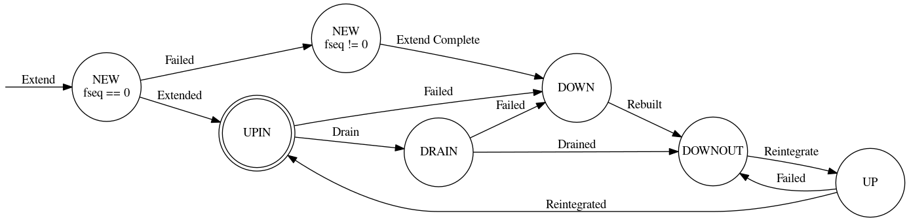

# Jump Placement Map

The Jump Placement Map utilizes the Jump Consistent Hashing algorithm in order to pseudorandomly distribute objects amongst different fault domains. This distributes them across fault domains as far apart from one another as possible in order to avoid data loss in the event of a failure affecting an entire fault domain.

## Overview

### Jump Consistent Hashing

The Jump Consistent Hashing algorithm is a consistent hashing algorithm that evenly distributes keys to a number of buckets, even when the number of buckets increase, without using extra storage. The jump consistent hashing algorithm takes a key value and a number of buckets as possible locations and returns one of the buckets.

Jump Consistent Hashing aims to satisfy the constraint that on average only 1/n keys will be relocated when extending the number of buckets. It does this by successively calculating the jump destination for a given key and when the number calculated is larger than the current number of buckets it will use the last number within the range as the current bucket for that key.

Because Jump Consistent Hashing returns a particular bucket for a given key we may have circumstances where shards within the same redundancy group would be placed in the same domain or even on the same target. To get around this the Jump Map keeps track of used targets and in case of collisions will rehash the key and attempt placements again until it finds a domain/target that has not been used.

### Jump Map Algorithm

When calculating the layout of an object, first the replica requirements are determined by the object class and metadata of the object whose layout is being calculated. The object class contains information about the number of replicas, erasure coding information, or any other defining attributes. Interpreting these requirements will result in a redundancy group number and group size which when multiplied together will be the total size of the object layout. To choose the targets that the object will be written to the algorithm first starts at the root of the pool map. Jump Consistent Hash is then used with the following inputs: a 64 bit segment of the Object ID, and the number of child components within the current fault domain. The selected component is then marked as used and then gets assigned as the current fault domain. It continues doing this for each domain level until it reaches the last domain containing only targets. A target is then selected in the same way and its ID is returned to be used as the location for this shard. During placement of subsequent shards the process is slightly different. During the selection of components, if Jump Consistent Hash produces a component that has already been marked as used, the key is incremented and run through a standard CRC hash to deterministically permute the key. Jump Consistent Hash is then called again and new hashes are calculated until a component is found that has not been used. If all nodes in a domain are marked as used, they are then all marked as unused.

CRC is used specifically because it is extremely fast on modern CPUs and produces dramatically different, evenly distributed results for an input keys that might vary by only a few bits. Without something like the CRC to permute the keys, the distribution of the results for Jump Consistent Hash using very similar input keys is not acceptably uniform in the way that it is used here.

### Fault Tolerance

The Jump Map uses the same collision tracking mechanism when selecting fall back targets to rebuild data onto when a domain fails. Each failed shard is remapped to a fall-back target independently using the same Jump Consistent Hashing algorithm which allows the fallback targets to be distributed throughout an entire DAOS Pool.

### Failure Handling and Rebuild

Although redundant object data may not be lost on target failure, the objects with shards that became inaccessible due to the failure must now operate in degraded mode. It is important to rebuild this object data as soon as possible after failure is detected for the following reasons.

- Object data is more vulnerable to loss from further failures in degraded mode since redundancy has been reduced or may even have been eliminated.
- Performance is impacted in degraded mode. For replicated objects, reads must now be distributed over fewer shards, and for erasure coded objects, data from the failed shard may have to be reconstructed from many other shards sharing the same redundancy group.

### Rebuild Targets selection

Once a target or domain has failed, Jump Map will calculate the rebuild layout of an object as part of the greater rebuild process. The layout calculation will first calculate the original layout. It then will start at the top of the pool map selecting successive child domains in the same way the base layout was calculated. However this time it will avoid selecting targets that have a failure sequence lower than the target of the shard being remapped. This is important for handling failures for shards that have already been rebuilt once before. Because Jump Map tracks collisions when selecting targets, fall-back targets will never be reused for a different shard before all other candidates have been used as fall-back targets. This also eliminates the need for targets reserved specifically to be used as spares.

#### Load Balancing for Failure

Jump Map remaps each shard of an object individually. This means that the shards of an object have an equal chance of being remapped to any target within a pool map. This results in the workload of a failed target being distributed equally among all available targets with a high degree of probability.

### Rebalancing for Pool Extension

The Jump map algorithm is well suited for Pool extension because of the incorporation of the Jump Consistent Hashing algorithm. When a domain is extended the Jump Map algorithm will recalculate the layouts as part of the rebalance operation. For each object the original layout will be calculated using the dimensions of the previous pool map. Then the layout will be recalculated now including the new domain extensions. The two layouts will then be compared and the shards that changed location will be returned to be used in the later steps of the rebalance operation.

## Use in DAOS for changing pool component state

This section details the state transitions that the jump map handles as part of DAOS.

**Pool component state transition diagram**

### Drain

Steps:
- Component set from UPIN -> DRAIN
- DRAIN is considered the same as UPIN for regular placement API operations, and DOWN for rebuild API operations
- Data migration begins
-- For scan phase, will scan only this node for objects that need to be migrated.
-- For pull phase, other nodes will pull data in a declustered way from all components that have that data, including but not limited to the draining components
- After migration complete, drained components are set from DRAIN -> DOWNOUT

#### Failure during reintegration
Regardless of whether the failure happens to a reintegrating UP component or an existing UPIN component, reintegration will run to completion before handling that failure.

If the failure was to non-reintegrating (UPIN) component, failure recovery will happen normally after the reintegration operation completes.
If the failure was to the reintegrating (UP) component, no failure recovery is needed - it is set directly to DOWNOUT, as data is already present on the fallback targets as a result of the original rebuild process for this component when it first failed.

### Reintegration

Steps:
- Component set from DOWNOUT -> UP
- Data migration copies data from other UPIN components to UP components
- After migration complete, components are set from UP -> UPIN
- Space reclamation deletes unreachable objects that were migrated

#### Failure during reintegration
Regardless of whether the failure happens to a reintegrating UP component or an existing UPIN component, reintegration will run to completion before handling that failure.

If the failure was to non-reintegrating (UPIN) component, failure recovery will happen normally after the reintegration operation completes.
If the failure was to the reintegrating (UP) component, no failure recovery is needed - it is set directly to DOWNOUT, as data is already present on the fallback targets as a result of the original rebuild process for this component when it first failed.

### Addition

Steps:
- Extend pool map by adding NEW-state components with fseq=0 at the end of their respective level
- Data migration happens, copying data to NEW components with fseq==0
- States are updated from NEW fseq==0 -> UPIN fseq==0
- Space reclamation deletes unreachable objects that were migrated

Whenever placement is invoked to generate a layout, it will ignore all NEW-state objects at the end of each level when computing how many buckets are available for placement. For example, starting with 3 ranks and adding 2, those 2 new ranks will be in state NEW. When placement is invoked, it will be called with a pool map with 5 ranks - however placement will determine that only 3 existed prior to addition, and that addition has not yet completed, so jump consistent hash will only be over the first three.

#### Failure during addition
Regardless of whether the failure happens to a NEW component or an existing UPIN component, addition will run to completion before handling that failure.

If failure was to a component that already existed before addition, the normal failure recovery process begins.

If failure happens to a component in the NEW state before addition is complete, those components have their fseq number set, indicating they failed. These are NOT set to DOWN, as a failure of the first added component would make it hard to determine the original number of buckets prior to addition.

Migration to other new components with fseq==0 will continue until complete or there are no non-failed NEW components remaining.

After addition completes, NEW components are set to UPIN (fseq==0) or DOWN (fseq!=0).
Failure recovery can then occur via the normal process.
Note that this might mean that a non-replicated object is temporarily unavailable - it might move to a NEW component that fails. During addition, the data will still be accessible (as placement is computed over the original layout size). However, once addition completes, that data will be unreachable, even though it still exists (fallback target location after failure is not the same as pre-addition location!). However, because the original data has not been deleted, when that node scans itself it will find the object and send it to the failure recovery location, at which point it will be accessible again.

