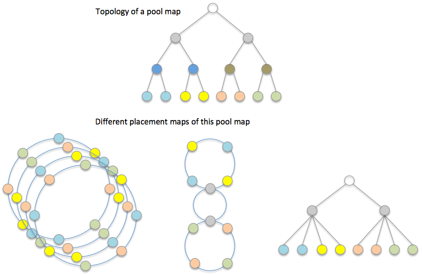

# Algorithmic object placement

DAOS uses the pool map to create a set of placement maps that are used to compute algorithmic object layouts and to drive consensus data distribution. This approach uses consistent hash based algorithms to generate object layout based on object ID, object schema, and one of the placement maps. DAOS uses a modular approach that allows different placement maps to be used by different objects to obtain the performance characteristics required by the application.

## Placement Map

A placement map is essentially an abstracted and permuted pool map; it does not necessarily include all details of the pool map. Instead it only retains component relationships that can be used to distribute object shards for the resilience and performance requirements of the application.

**Pool-map and placement maps**

A placement map does not maintain a copy of status or any characteristics of the corresponding pool map components, but only references pool map components. Each time DAOS computes an object distribution based on a placement map, it also needs to check the corresponding component status and attributes from the pool map. This adds an extra step for indirect memory access, but can significantly reduce cache pollution and memory consumption when there are many placement maps but only one pool map in a DAOS pool.

As shown in the <a href="#f10.2">figure</a>, a storage pool may have multiple types of placement maps because different applications can have various fault tolerance and performance requirements. In addition, there can be many instances of the same placement map in order to accelerate rebuild and rebalance by workload declustering.

DAOS today includes two placement map algorithms:

### [Jump Placement Map](JUMP_MAP.md)

The Jump Placement Map is the default placement map in DAOS. It utilizes the Jump Consistent Hashing algorithm in order to pseudorandomly distribute objects amongst different fault domains. This distributes them across fault domains as far apart from one another as possible in order to avoid data loss in the event of a failure affecting an entire fault domain. It was designed to efficiently move data between systems when the physical configuration of the system changes (i.e. more capacity is added).

### [Ring Placement Map](RING_MAP.md)

The Ring Placement Map was the original placement map developed for DAOS. It utilizes a ring memory structure that puts targets on the ring in a pattern such that given any random location on the ring, that location and its neighbors will be physically in separate fault domains. This makes it extremely fast to compute placement locations, but also makes it difficult to modify dynamically. It can not currently be used as it does not support several of the newer API methods required by DAOS - specifically those for server reintegration, drain, and addition.
