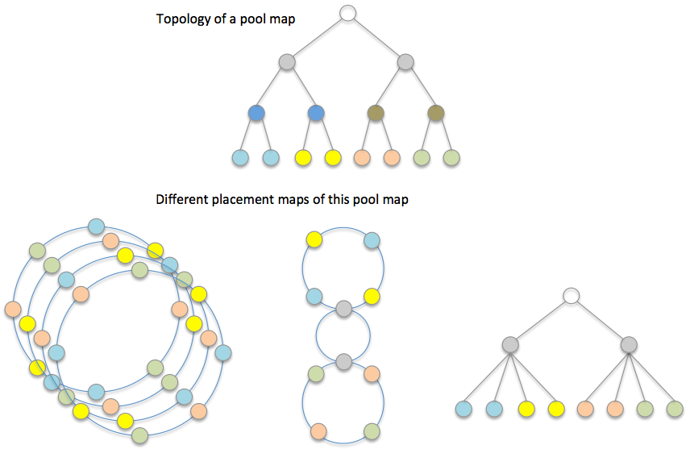

# Algorithmic object placement

DAOS-SR uses the pool map to create a set of placement maps that are used to compute algorithmic object layouts and to drive consensus data distribution. This approach uses consistent hash based algorithms to generate object layout based on object ID, object schema, and one of the placement maps. The major placement map algorithms discussed in this document are the <a href="#10.2.2">Jump Placement Map</a>, as well as the <a href="#10.2.3">Ring Placement Map</a> which is a concept developed in collaboration with Argonne National Laboratory, see preliminary work in P. Carns et al, "Consistent Hashing Distance Metrics for Large-Scale Object Storage" (http://sc15.supercomputing.org/sites/all/themes/SC15images/tech_poster/tech_poster_pages/post117.html).

## Placement Map

A placement map is essentially an abstracted and permutated pool map; it does not necessarily include all details of the pool map. Instead it only retains component relationships that can be used to distribute object shards for the resilience and performance requirements of the application.

**Pool-map and placement maps**

A placement map does not maintain a copy of status or any characteristics of the corresponding pool map components, but only references pool map components. Each time DAOS-SR computes an object distribution based on a placement map, it also needs to check the corresponding component status and attributes from the pool map. This adds an extra step for indirect memory access, but can significantly reduce cache pollution and memory consumption when there are many placement maps but only one pool map in a DAOS pool.

As shown in the <a href="#f10.2">figure</a>, a storage pool may have multiple types of placement maps because different applications can have various fault tolerance and performance requirements. In addition, there can be many instances of the same placement map in order to accelerate rebuild and rebalance by workload declustering. This topic in relation to the Ring Map will be introduced in <a href="#10.2.4">Multi-ring Placement Map"</a>.

## Jump Placement Map

The Jump Placement Map utilizes the Jump Consistent Hashing algorithm in order to pseudorandomly distribute objects amongst different fault domains. This distributes them across fault domains as far apart from one another as possible in order to avoid data loss in the event of a failure affecting an entire fault domain.

### Jump Consistent Hashing

The Jump Consistent Hashing algorithm is a consistent hashing algorithm that evenly distributes keys to a number of buckets, even when the number of buckets increase, without using extra storage. The jump consistent hashing algorithm takes a key value and a number of buckets as possible locations and returns one of the buckets.

Jump Consistent Hashing aims to satisfy the constraint that on average only 1/n keys will be relocated when extending the number of buckets. It does this by successively calculating the jump destination for a given key and when the number calculated is larger than the current number of buckets it will use the last number within the range as the current bucket for that key.

Because Jump Consistent Hashing returns a particular bucket for a given key we may have circumstances where shards within the same redundancy group would be placed in the same domain or even on the same target. To get around this the Jump Map keeps track of used targets and in case of collisions will rehash the key and attempt placements again until it finds a domain/target that has not been used.

### Jump Map Algorithm

When calculating the layout of an object, first the replica requirements are determined by the object class and metadata of the object whose layout is being calculated. The object class contains information about the number of replicas, erasure coding information, or any other defining attributes. Interpreting these requirements will result in a redundancy group number and group size which when multiplied together will be the total size of the object layout. To choose the targets that the object will be written to the algorithm first starts at the root of the pool map. Jump Consistent Hash is then used with the following inputs: a 64 bit segment of the Object ID, and the number of child components within the current fault domain. The selected component is then marked as used and then gets assigned as the current fault domain. It continues doing this for each domain level until it reaches the last domain containing only targets. A target is then selected in the same way and its ID is returned to be used as the location for this shard. During placement of subsequent shards the process is slightly different. During the selection of components, if Jump Consistent Hash produces a component that has already been marked as used, the key is incremented and run through a standard CRC hash to deterministically permute the key. Jump Consistent Hash is then called again and new hashes are calculated until a component is found that has not been used. If all nodes in a domain are marked as used, they are then all marked as unused.

CRC is used specifically because it is extremely fast on modern CPUs and produces dramatically different, evenly distributed results for an input keys that might vary by only a few bits. Without something like the CRC to permute the keys, the distribution of the results for Jump Consistent Hash using very similar input keys is not acceptably uniform in the way that it is used here.

### Fault Tolerance

The Jump Map uses the same collision tracking mechanism when selecting fall back targets to rebuild data onto when a domain fails. Each failed shard is remapped to a fall-back target independently using the same Jump Consistent Hashing algorithm which allows the fallback targets to be distributed throughout an entire DAOS Pool.

### Failure Handling and Rebuild

Although redundant object data may not be lost on target failure, the objects with shards that became inaccessible due to the failure must now operate in degraded mode. It is important to rebuild this object data as soon as possible after failure is detected for the following reasons.

- Object data is more vulnerable to loss from further failures in degraded mode since redundancy has been reduced or may even have been eliminated.
- Performance is impacted in degraded mode. For replicated objects, reads must now be distributed over fewer shards, and for erasure coded objects, data from the failed shard may have to be reconstructed from many other shards sharing the same redundancy group.

### Rebuild Targets selection

Once a target or domain has failed, Jump Map will calculate the rebuild layout of an object as part of the greater rebuild process. The layout calculation will first calculate the original layout. It then will start at the top of the pool map selecting successive child domains in the same way the base layout was calculated. However this time it will avoid selecting targets that have a failure sequence lower than the target of the shard being remapped. This is important for handling failures for shards that have already been rebuilt once before. Because Jump Map tracks collisions when selecting targets, fall-back targets will never be reused for a different shard before all other candidates have been used as fall-back targets. This also eliminates the need for targets reserved specifically to be used as spares.

#### Load Balancing for Failure

Jump Map remaps each shard of an object individually. This means that the shards of an object have an equal chance of being remapped to any target within a pool map. This results in the workload of a failed target being distributed equally among all available targets with a high degree of probability.

### Rebalancing for Pool Extension

The Jump map algorithm is well suited for Pool extension because of the incorporation of the Jump Consistent Hashing algorithm. When a domain is extended the Jump Map algorithm will recalculate the layouts as part of the rebalance operation. For each object the original layout will be calculated using the dimensions of the previous pool map. Then the layout will be recalculated now including the new domain extensions. The two layouts will then be compared and the shards that changed location will be returned to be used in the later steps of the rebalance operation.

## Ring Placement Map

The first approach of building a placement is to place storage targets on a consistent hashing ring, called a ring placement map.
Ring placement can handle one level of fault domain to avoid data loss in the event of multiple correlated target failures. If the number of fault domains is more than size of the redundancy group of an object, then a ring placement map can guarantee that data of this object will survive even if all targets within a fault domain fail together. To achieve this goal, the ring placement map should evenly distribute targets from the same fault domain on the placement ring. For example, if there are four targets within a domain, then the distance between each two targets from this domain should be an arc of 90 degrees on the ring.

The <a href="#f10.3">figure</a> below shows how to build a ring placement map. Targets in the same color are within the same fault domain, and are evenly placed on the ring, so that arc-distances between them are always identical. To simplify the description, all domains have the same number of targets in this example, but this is not a mandatory requirement. A proposal of eliminating this limit will be introduced in the section Multi-Ring Placement Map.

It is also worth mentioning that sequences of targets are randomized in the example in the <a href="#f10.3">figure</a> below. This is unnecessary if only one ring placement map is built for the DAOS pool, but it is important if multiple placement rings are created for the pool. The reason of this will also be explained in Multi-Ring Placement Map as well.

To generate distribution of an object by using a ring placement map, DAOS-SR hashes the ID of the object to a position on the consistent hashing ring. If the object is to be striped "S" ways over redundancy groups of size "R", it then places the object shards on the next N=S\*R targets on the ring in the direction of consistent hash. In the <a href="#f10.3">figure</a> below, three targets in the green ellipse have been selected for a 3-way replicated object.

**Ring Placement Map**

### Fault Tolerance

Since the ring placement map ensures targets in the same fault domain are widely spaced, then provided there are enough fault domains, the ring map will not place object shards in the same redundancy group on targets in the same fault domain. Redundant objects placed using the ring placement map can therefore tolerate the correlated failure of targets sharing the same fault domain. The number of such correlated failures that can be tolerated depends on the size of the object's redundancy groups. As shown in the <a href="#f10.3">figure</a> above, although four targets will fail on any board failure, any two boards may fail without data loss.

### Rebuild Targets

Rebuild targets are targets that will be used to reconstruct object shards that become inaccessible due to target failures. In the <a href="#f10.4">figure</a> below, an object is distributed on targets-[3, 4, 5, 6] and rebuild targets for this object are targets-[1, 2].  Rebuild targets may be selected from prior targets, in reverse consistent hash order, to the first member of a given redundancy group (RDG). Successive failures may continue to select the next rebuild target in reverse hash ring order until a target would be selected that does not share the same fault domain as any RDG member.

When an object is striped across many RDGs and RDGs are placed contiguously on the ring, selecting a rebuild target immediate before the RDG with a failure will cause shards from the same object, albeit in different RDGs, to be located on the same target. This will degrade performance on failure because I/O will no longer be balanced.

To avoid this imbalance, widely distributed striped objects may be placed with "gaps" be-tween RDGs to leave spare targets for rebuild. Because leaving such a gap between all RDGs in an object striped over the whole DAOS pool will leave a significant proportion of targets spare before the first failure, "gaps" may be introduced at less regular intervals and shared by groups of RDGs. This increases overall performance at the expense of locating rebuild targets more distantly on the hash ring from the degraded RDG, therefore a balance must be found between these competing requirements.

 
**Rebuild targets and failure sequence**

Note that after all spare targets in a gap have become rebuild targets, further failures can still be handled by selecting rebuild targets immediately prior to the first member of RDGs affected by failure, albeit at the expense of load balance. This also means that multiple shards of a same object can possibly be stored on the same target. To distinguish these collocated shards from a same object, DSR can construct DSM object ID by appending object shard index to DSR object ID.

On very small DAOS pools with relatively few fault domains, it may not be possible to allocate "gaps" of spare rebuild targets at all, because the proportion of gaps and performance loss may be unacceptably high. However, on large DAOS pools with many fault domains, sufficiently large gaps needed to ensure balanced I/O after many failures could be spaced widely and therefore occupy a sufficiently small proportion of the ring to ensure good performance.

#### Failure Sequence and Rebuild

Because members of an erasure coded RDG are all different, it is vital to track the mapping of RDG member to rebuild target correctly when the RDG member is made inaccessible by a failure. This must be done without generating any additional per-RDG or per-object metadata for truly algorithmic object layouts.

RDG members are numbered consecutively from zero and are initially placed in order on adjacent placement ring targets. As targets fail, the next available rebuild RDG must be selected, initially from spares in any prior "gap" and then from remaining rebuild target candidates. This must be done deterministically, irrespective of the order in which targets fail. As show in the <a href="#f10.4">figure</a> above, DAOS-SR must determine which of target-[1, 2] is the replacement of target-4, and which is the replacement of target-5.

Target failure-order is used to ensure deterministic mapping of RDG member to targets. DAOS pools increment the version number of the pool map on all target state changes, and record this version number with the target on failure so that failed targets can be ordered by the map version at which they failed. This sequence in turn determines the order in which candidate rebuild targets are selected. In the example of (c) in the <a href="#f10.4">figure</a> above, both target-4 and target-5 failed but it does not mean target-4 selected the near spare target-2 as replacement, because target-4 has higher failure sequence than target-5 so it should select the spare target after target-5.

#### Load Balancing for Failure

When there is no failure, the ring placement map can evenly distribute objects to all targets. However, when there is a failure, the missing object shards should be rebuilt on surviving spare targets. Because these spare targets are also regular targets for other objects, they could store more objects than other targets and have to handle more I/O requests. In this case, the I/O workload of storage cluster is imbalanced, and this could be a major source of jitter and affect the overall performance.

**Object distribution on rebuild targets**

In the <a href="#f10.5">figure</a> above, if all objects are 3-way replicated, and the layout of each of them is the targets connected by arcs in the same color. When target-4 fails, as each object will choose the prior target as spare target:

- A new replica of the red object will be rebuilt on target-1.
- A new replica of the purple object will be rebuilt on target-2.
- A new replica of the blue object will be rebuilt on target-3.

Therefore, targets 1, 2, and 3 will each take 33% of the objects from target-4, and they have to handle 33% more I/O requests than other targets.

One way to reduce data imbalance like this is to create multiple rings, which will be introduced later. The potential problem with multiple rings is they can consume a lot of memory and CPU cache. For example, if there are hundreds of thousands of targets in the DAOS pool, each ring may consume one megabyte of RAM, and a multi-ring approach would not be a good option. The other approach to reduce imbalance is to allow objects to choose rebuild targets at varying distances on the placement ring, instead of always selecting the nearest preceding target as a rebuild target. For example, DAOS-SR can hash the object ID and use the modulo of the hashed ID as the distance between the first object shard and the first rebuild target. In in the <a href="#f10.5">figure</a> above, if the calculated distance is zero, target-1 is still the rebuild target for the red object. However, if the calculated distance is 1, then target-0 is the rebuild target for the red object. In this way, if the ring is big enough, then the distance to a rebuild target can vary between 0 and a larger value. It means that missing object shards on the failed target can be rebuilt on many different targets, and each of these targets only takes over a small amount of data and I/O requests from the failed target.

### Rebalancing for Pool Extension

When new storage targets are added to a DAOS pool, containers within this pool should rebalance data by migrating some of the existing object shards to the new targets.

One of the major limits of the single-ring placement map is that it requires all domains to have exactly the same number of targets to build a symmetric ring. It also imposes some restrictions to pool change operations, to avoid reshuffling of all data. The simpler use cases considered here are, either the total number of domains or the total number of targets is doubled. Other attempts to change the DAOS pool will trigger significant amount of data movement.

#### Doubling Domains
As previously mentioned, the ring placement map can be aware of one type of domain. If the number of domains of this type in the DAOS pool is doubled while extending the DAOS pool, then ideally, half of all objects should be moved to those new domains. To achieve this goal, targets from those new domains should always be inserted between two original targets on the consistent hashing ring. In this way, the hash distance between any two original targets is unchanged, and hash distance between two new targets is the same as the original targets.

As shown in the <a href="#f10.6">figure</a> below, objects placed on the ring should either stay in place, or be moved to new targets. If overall objects are evenly distributed on all targets before extending, then only 50% of the data will migrate.

**Doubling domains for a ring placement map**

The shards of objects created before the new domains are added, are no longer contiguous on the ring after doubling to avoid having to move all shards except the first one. This may be achieved by keeping the hash stride between object shards constant. However, this necessitates storing the initial hash stride with the object metadata as described in the next section. Note that the distribution of an object will become increasingly sparse on the placement ring with each extending operation.

#### Doubling Targets within Domains

Another way of symmetrically extending a DAOS pool is by doubling the number of targets within each domain. The number of domains is still the same after doubling, but the hash distance between targets in the same domain becomes ý of the original distance since new targets have to be inserted between all original targets of the same domain. However, at the position for the new target, there could already be a target from a different domain. In the example in in the <a href="#f10.7">figure</a> below, on the left ring, if a new target is added to the same domain of T0 and T1, to keep the same distance between targets from the same domain, it has to be put on the position of T4 or T5. It means T4 and T5 have to be rotated and objects on them have to migrate to other targets.

To avoid this situation, DAOS-SR doubles the consistent hashing key range. For example, in the <a href="#f10.7">figure</a> below, the key range of the hash ring is 8000 before doubling and is increased to 16000 after doubling targets. All new targets are placed on the new extended key range of the ring (left half of the large ring). When DAOS-SR places an object by hashing its ID, the hashed result should either be the same, which is 700 in this example, or become 8000+700=8700. With this approach, DAOS-SR can guarantee that only 50% of the data will be moved after doubling of targets.

**Doubling targets within domains**

## Multi-Ring Placement Map

As described earlier, although the single ring placement map consumes less memory, it has a few significant drawbacks:

- It can only be built from a DAOS pool that has exactly the same number of targets in all domains.
- It cannot guarantee even data distribution and reasonable data movement for arbitrary extending of a DAOS pool.
- It cannot decluster the rebuilding workload on failure; only a limited number of targets in the distance of redundancy group size can contribute to rebuild.

These drawbacks are not crucial for the NVM based storage tier because it should have extremely high bandwidth, which can support quick data movement; it also has symmetric node allocation for the best of application performance. However, these limits could be an issue for the cold storage tier, which may have spinning disk as storage devices. Spinning disk based targets have limited bandwidth and could take a long time to rebuild if only a few targets can contribute on any rebuild. In addition, for the cold storage tier, doubling is an unlikely way of extending storage, whereas progressively extending is the more likely approach.

Multi-ring placement map can resolve these issues at some level. In a multi-ring placement map, each ring is created in a similar way as single-ring placement map and a ring still includes the same number of targets from each domain. However, because a DAOS pool could have asymmetric distribution of domain targets, a ring should not include all domains, and it does not always select all targets from a domain. Different rings of the placement map should include different set of domains and targets, giving enough rings, the placement map can make fair use of all targets in the storage pool.

In the example in the <a href="#f10.8">figure</a> below, there are six domains and these domains have different number of targets. If all rings are created with all domains, then it is impossible to guarantee that appearances of targets and the hash distances between targets are the same. If rings are created with 4 domains and 2 targets from each domain, then it is possible to build 8\*N rings to guarantee appearances of each target are the same.

**Multi-ring placement map**

Given a large enough number of rings, each of them is created by a pseudo-random algorithm that selects M domains from the total of N domains, and selects T targets from each domain.

- Each domain has a weight number that is equal to the number of targets within it, for example, the weight of the gray domain is 4, and the weight of the yellow domain is 7.
- The domain ring-key is a value in a fixed range that is computed by a pseudo-random hash algorithm which takes the ring ID as a random seed and the domain ID as hash input. DAOS-SR scales ring-keys of all domains by their weights, then sorts the scaled results and selects the first M domains to build a placement ring. Because different rings have different random seeds for the hash algorithm, so each of them select a different set of domains. The domains that have more targets should have a greater chance of being selected because their ring-keys will be scaled by larger weights.
- Similarly, the target ring-key is also a value in a fixed range that is computed by a pseudo-random hash algorithm which takes the ring ID as a random seed and the target ID as hash input. DAOS-SR sorts all target ring-keys and selects the first T targets for a placement ring.

As more targets are added to a domain, the domain has more chances to be selected while creating placement rings, because it has a higher weight value as the scale factor of the domain ring-key. The extended domain will therefore replace other domains on a relatively few rings and data movement for rebalance is reduced because only those domains being replaced have to move objects to the domain with new targets.

Also, when adding a new target, if its target ring-key is higher than all other targets in the same domain, and if DAOS-SR uses the sorted target list to build a ring, then all other targets will be shifted because the new target will be put at the head of the target list. For example, in a pool map version 1, DAOS-SR needs to select 6 targets out from 8 targets in a domain, after sorting them by their ring-keys, assuming the selected targets are:

*3(v=1), 1(v=1), 7(v=1), 5(v=1), 2(v=1), 4(v=1)*

Another 2 targets (target-8 and target-9) were added to this domain in version 2, and target-8 has the highest ring-key, so the selected targets will be:

*8(v=2), 3(v=1), 1(v=1), 7(v=1), 5(v=1), 2(v=1)*

Positions for the rest of the 5 targets are changed on the ring, so objects residing on these targets will be reshuffled, which is undesirable. This situation can be avoided by the following approach:

Targets are still selected by the sorted target ring-key, but the output list is sorted again by version and ring-key where the version is the major key for sort. Targets with lower version number take precedence over targets with higher version number, so in the previous example, the output list becomes:

*3(v=1), 1(v=1), 7(v=1), 5(v=1), 2(v=1), 8(v=2)*

In this approach, only objects on target-2 are moved to target-8.

### Rebuild Declustering
In a multi-ring placement map, targets have different neighbors on the different rings. If one target fails, all neighbors on all rings can contribute to data rebuild, which can significantly reduce the time of recovery.

In the previous <a href="#f10.8">figure</a>, neighbors of target-9 are target-2 and target-7 on the first ring, and target-3 and target-5 on the third ring. Assuming all objects are 2-way replicated, if target-9 fails, then these four targets can contribute to rebuild data for target-9, because they all have replicas for objects on target-9.

### Widely Striped Object

In the example in the previous <a href="#f10.8">figure</a>, all 8 rings have 8 targets. An object cannot therefore have more than 8 shards, and applications cannot efficiently use the full bandwidth of the storage cluster for large objects. To resolve this problem, a multi-ring placement map may have rings with different sizes. For example, it may include a few large rings besides hundreds or thousands of small rings.

In the above example, DAOS-SR may create a few large rings with 24 targets, each of these rings has 4 targets from all 8 domains. Only widely-striped objects will be placed on these rings to achieve better I/O concurrency.

Furthermore, while adding more and more targets to the DAOS pool over time, DAOS-SR can create even larger rings. Rings that were originally large could become small because they can only cover a small set of targets in the DAOS pool, and the original small rings could be eliminated gradually.
