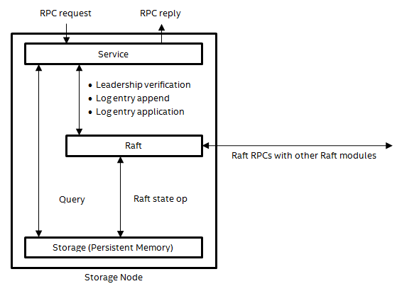

# Replicated Data Base (RDB)

Pool and container services are made highly available by replicating their internal metadata using Raft-based consensus and strong leadership. A service replicated in this generic approach tolerates the failure of any minority of its replicas. By spreading replicas of each service across the fault domains, pool and container services can therefore tolerate a reasonable number of target failures.

## Architecture

A replicated service is built around a Raft replicated log. The service transforms RPCs into state queries and deterministic state updates. All state updates are committed to the replicated log first, before being applied by any of the service replicas. Since Raft guarantees consistency among log replicas, the service replicas end up applying the same set of state updates in the same order and go through identical state histories.

Among all replicas of a replicated service, only the current leader can handle service RPCs. The leader of a service is the current Raft leader (i.e., a Raft leader with the highest term number at the moment). Non-leader replicas reject all service RPCs and try to redirect the clients to the current leader to the best of their knowledge. Clients cache the addresses of the replicas as well as who current leader is. Occasionally, a client may not get any meaningful redirection hints and can find current leader by communicating to a random replicas.

The <a href="#f8.1">figure</a> below shows the modules constituting a service replica. The service module handles RPCs by transforming them into state queries and deterministic state updates. The Raft module implements the replicated log following the Raft protocol, by communicating with Raft modules on other replicas. It provides methods for the service module to perform the queries and the updates. The storage module, which in this case is the persistent memory and the file system, stores the service and Raft state. It uses VOS to update the state stored in persistent memory atomically.

**Service replication modules**

## RPC Handling

When an RPC request arrives at the leader, a service thread of the service module picks up the request and handles it by executing a handler function designed for this type of request. As far as service replication is concerned, a handler comprises state queries (e.g., reading the pool properties), state updates (e.g., writing a new version of the pool map), and RPCs to other services (e.g., CONT_TGT_DESTROY RPCs sent to target services). Some handlers involve only queries, some involve updates as well as queries, and others involve all three kinds of actions; rarely, if ever, do handlers involve only updates but no queries.

A handler must assemble all its updates into a single log entry, commit the log entry, and wait for the log entry to become applicable before applying the updates to the service state. Using a single log entry per update RPC easily makes each update RPC atomic with regard to leader crashes and leadership changes. If RPCs that cannot satisfy this requirement are introduced in the future, additional transaction recovery mechanisms will be required. A leader's service state therefore always represents the effects of all completed update RPCs this leader has handled so far.

Queries, on the other hand, can read directly from the service state, without going through the replicated log. To make sure a request sees the effects of all completed update RPCs handled by all leaders ever elected, however, the handler must ask the Raft module whether there has been any leadership changes. If there has been none, all queries made for this request so far are not stale. If the leader has lost its leadership, the handler aborts the request with an error redirecting the client to the new leader.

RPCs to other services, if they update state of destination services, must be idempotent. In case of a leadership change, the new leader may send them again, if the client resent the service request in question.

Handlers need to cope with reasonable concurrent executions. Conventional local locking on the leader is sufficient to make RPC executions linearizable. Once a leadership change happens, the old leader can no longer perform any updates or leadership verifications with-out noticing the leadership change, which causes all RPCs in execution to abort. The RPCs on the new leader are thus not in conflict with those still left on the old leader. The locks therefore do not need to be replicated as part of the service state.
