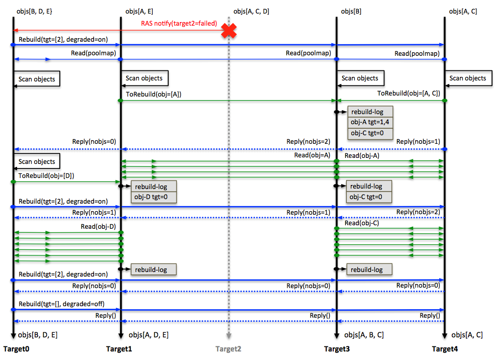
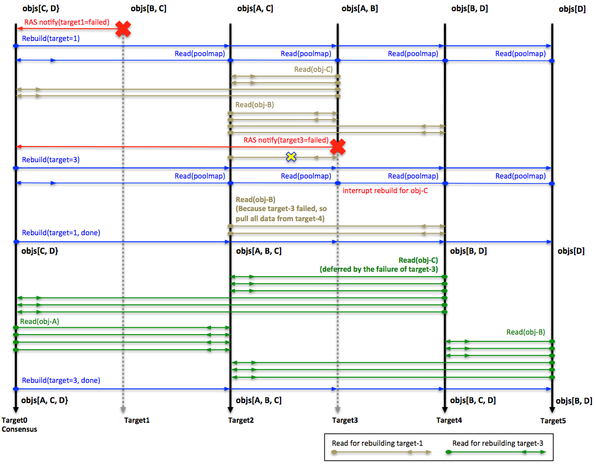

# Self-healing (aka Rebuild)

In DAOS, if the data is replicated with multiple copies on different
targets, once one of the targets fails, it's data will be rebuilt
on the other targets automatically, so the data redundancy will not be
impacted due to the target failure. In future versions, DAOS will also support
Erasure Coding to protect the data; then the rebuild process might be
updated accordingly.

## Rebuild Detection

When a target failed, it should be detected promptly and
notify the pool (Raft) leader, and then the leader will exclude
the target from the pool and trigger the rebuild process
immediately.

### Current status and long-term goal

Currently, since the raft leader can not exclude the target
automatically, the sysadmin has to manually exclude the target
from the pool, which then triggers the rebuild.

In the future, the leader should be able to detect the target failure
promptly and then trigger the rebuild automatically by itself,
without the help of the sysadmin.

## Rebuild process

The rebuild is divided into 2 phases, scan and pull.

### Scan

Initially, the leader will propagate the failure notification
to all other surviving targets by a collective RPC. Any target
that receives this RPC will start to scan its object table
to determine the objects lost data redundancy on the faulty
target. If it does, send their IDs and related metadata
to the rebuild targets(rebuild initiator). As for how to choose
the rebuild target for faulty target, it will be described in
placement/README.md

### Pull

Once the rebuild initiators get the object list from the scanning
target, it will pull the data of these objects from other
replicas and then write data locally. Each target will report
its rebuild status, rebuilding objects, records, is_finished?
etc, to the pool leader. Once the leader learned all of targets
finished its scanning and rebuilding phase, it will notify all targets
the rebuild has finished, and they can release all of the resources
held during the rebuild process.

<a id="f10.18"></a>
**Rebuild Protocol**


The <a href="#f10.18">figure</a> above is an example of this process:
There are five objects in the cluster: object A is 3-way replicated,
object B, C, D and E are 2-way replicated. When target-2 failed,
target-0, which is the Raft leader, broadcasted the failure to all
surviving targets to notify them to enter the degraded mode and scan:

- Target-0 found that object D lost a replica and calculated out target-1 is
the rebuild target for D, so it sent object D's ID and its metadata to
target-1.
- Target-1 found that object A lost a replica and calculated out target-3 is
the rebuild target for A, so it sent object A's ID and its metadata to
target-3.
- Target-4 found objects A and C lost replicas and it calculated out target-3
is the rebuild target for both objects A and C, so it sent IDs for objects A
and C and their metadata to target-3.
- After receiving these object IDs and their metadata, target-1 and target-3
can compute out surviving replicas of these objects, and rebuild these objects
by pulling data from these replicas.

### Multiple pool and targets rebuild

In a large-scale storage cluster, multiple failures might occur
when a rebuild from a previous failure is still in progress. In this
case, DAOS should neither simultaneously handle these failures, nor
interrupt and reset the earlier rebuilding progress for later
failures. Otherwise, the time consumed for rebuilds for each failure
might grow significantly and rebuilds may never end if new failures
overlap with ongoing rebuilds. So for multiple failures, these rules
are applied

- If the rebuild initiator fails during rebuild, then the object shards
being rebuilt on the initiator should be ignored, which will be handled
by next rebuild.
- If rebuild initiator can not fetch the data from other replicas due to
the failure, it will switch to other replicas if available.
- A target in rebuild does not need to re-scan its objects or reset rebuild
progress for the current failure if another failure has occurred.
- When there are multiple failures, if the number of failed targets from
different domains exceeds the fault tolerance level, there could be
unrecoverable errors and applications could suffer from data loss. In this
case, upper layer stack software could see errors while sending I/O to the
object that could have missing data.

The following <a href="#f10.20">figure</a> is an example of this protocol.

<a id="f10.20"></a>
**Multi-failure protocol**


- In this example, object A is 2-way replicated, object B, C and D are 3-way
replicated.
- After failure of target-1, target-2 is the initiator of rebuilding object B,
it is pulling data from target-3 and target-4; target-3 is the initiator of
rebuilding object C, it is pulling data from target-0 and target-2.
- Target-3 failed before completing rebuild for target-1, so rebuild of object
C should be abandoned at this point, because target-3 is the initiator of it.
The missing data redundancy of object C will be reconstructed while rebuilding
target-3.
- Because target-3 is also contributor of rebuilding object B, based on the
protocol, the initiator of object B, which is target-2, should switch to
target-4 and continue rebuild of object B.
- Rebuild process of target-1 can complete after finishing rebuild of object B.
By this time, object C still lost a replica. This is quite understandable,
because even if two failures have no overlap, object C will still lose the
replica on target-3.
- In the process of rebuilding target-3, target-4 is the new initiator of
rebuilding object C.

If there are multiple pools being impacted by the failing
target, these pools can be rebuilt concurrently.

## I/O during rebuild

If there are concurrent writes during rebuild, the rebuild protocol should
guarantee that new writes will never be lost. Those writes should be either
directly stored in the new object shard or pulled to the new object shard
by the rebuild initiator. And also fetch should be guarantee to get the
correct data. To achieve these, these protocols are applied

1. Fetch will always skip the rebuilding target.
2. Update can complete only if updates of all the object shards have
successfully completed.
- If any of these updates failed, the client will infinitely retry until
it succeeds, or there is a pool map change which shows the target failed.
In the second case, the client will switch to the new pool map, and send
the update to the new destination, which is the rebuild target of this object.
3. There are no synchronization between normal I/O and rebuild process, so during
rebuild process, the data might be written duplicately by rebuild initiator and
normal I/O.

## Rebuild resource throttle

During rebuild process, the user can set the throttle to guarantee
the rebuild will not use more resource than the user setting. The
user can only set the CPU cycle for now. For example, if the user set
the throttle to 50, then the rebuild will at most use 50% of CPU
cycle to do rebuild job. The default rebuild throttle for CPU cycle
is 30.

## Rebuild status

As described earlier, each target will report its rebuild status to
the pool leader by IV, then the leader will summarize the status of
all targets, and print out the whole rebuild status by every 2 seconds,
for example these messages.

```
Rebuild [started] (pool 8799e471 ver=41)
Rebuild [scanning] (pool 8799e471 ver=41, toberb_obj=0, rb_obj=0, rec= 0, done 0 status 0 duration=0 secs)
Rebuild [queued] (419d9c11 ver=2)
Rebuild [started] (pool 419d9c11 ver=2)
Rebuild [scanning] (pool 419d9c11 ver=2, toberb_obj=0, rb_obj=0, rec= 0, done 0 status 0 duration=0 secs)
Rebuild [pulling] (pool 8799e471 ver=41, toberb_obj=75, rb_obj=75, rec= 11937, done 0 status 0 duration=10 secs)
Rebuild [completed] (pool 419d9c11 ver=2, toberb_obj=10, rb_obj=10, rec= 1026, done 1 status 0 duration=8 secs)
Rebuild [completed] (pool 8799e471 ver=41, toberb_obj=75, rb_obj=75, rec= 13184, done 1 status 0 duration=14 secs)
```

There are 2 pools being rebuilt (pool 8799e471 and pool 419d9c11,
note: only first 8 letters of the pool uuid are shown here).

```
The 1st line means the rebuild for pool 8799e471 is started, whose pool map version is 41.
The 2nd line means the rebuild for pool 8799e471 is in scanning phase, and no objects & records are being rebuilt yet.
The 3rd line means a rebuild job for pool 419d9c11 is being queued.
The 4th line means the rebuild for pool 419d9c11 is started, whose pool map version is 2.
The 5th line means the rebuild for pool 419d9c11 is in scanning phase, and no objects & records are being rebuilt yet.
The 6th line means the rebuild for pool 8799e471 is in pulling phase, and there are 75 objects to be rebuilt(toberb_obj=75), and all of them are rebuilt(rb_obj=75), but records rebuilt for these objects are not finished yet(done 0) and only 11937 records (rec = 11937) are rebuilt.
The 7th line means the rebuild for pool 419d9c11 is done (done 1), and there are totally 10 objects and 1026 records are rebuilt, which costs about 8 seconds.
The 8th line means the rebuild for pool 8799e471 is done (done 1), and there are totally 75 objects and 13184 records are rebuilt, which costs about 14 seconds.
```

During the rebuild, if the client query the pool status to the pool leader,
which will return its rebuild status to client as well.

```C
struct daos_rebuild_status {
	/** pool map version in rebuilding or last completed rebuild */
	uint32_t		rs_version;
	/** Time (Seconds) for the rebuild */
	uint32_t		rs_seconds;
	/** errno for rebuild failure */
	int32_t			rs_errno;
	/**
	 * rebuild state, DRS_COMPLETED is valid only if @rs_version is non-zero
	 */
	union {
		int32_t			rs_state;
		int32_t			rs_done;
	};

	/* padding of rebuild status */
	int32_t			rs_padding32;

	/* Failure on which rank */
	int32_t			rs_fail_rank;
	/** # total to-be-rebuilt objects, it's non-zero and increase when
	 * rebuilding in progress, when rs_state is DRS_COMPLETED it will
	 * not change anymore and should equal to rs_obj_nr. With both
	 * rs_toberb_obj_nr and rs_obj_nr the user can know the progress
	 * of the rebuilding.
	 */
	uint64_t		rs_toberb_obj_nr;
	/** # rebuilt objects, it's non-zero only if rs_state is completed */
	uint64_t		rs_obj_nr;
	/** # rebuilt records, it's non-zero only if rs_state is completed */
	uint64_t		rs_rec_nr;

	/** rebuild space cost */
	uint64_t		rs_size;
};
```

## Rebuild failure

If the rebuild is failed due to some failures, it will be aborted, and the
related message will be shown on the leader console. For example:

```
Rebuild [aborted] (pool 8799e471 ver=41, toberb_obj=75, rb_obj=75, rec= 11937, done 1 status 0 duration=10 secs)
```

## Rebuilding with Checksums

During a rebuild, the server being rebuilt will act as a DAOS Client in the
sense that it will read the data and checksum from a replica server and verify
the integrity of the data before it uses it for the rebuild. If corrupted data
is detected, then the read will fail, and the replica server will be notified of
the corruption. The rebuild will then attempt to use a different replica.

A checksum iov parameter is available for the object list and object fetch task
API's. This is for rebuild to provide memory that the checksums can be packed
into. Otherwise, rebuild would have to recalculate the checksums while writing
to the local VOS instance. If insufficient memory is allocated in the buffer,
the iov_len will be set to the required capacity and the checksums packed into
the buffer is truncated.

The following describes "touch points" of the life of a checksum for rebuild.
The client task APIs and packing/unpacking info is included here because
rebuild is the primary user of these APIs with checksums.

### Rebuild Touch Points

- migrate_fetch_update_(inline|single|bulk) - the rebuild/migrate functions that
  write to vos locally must ensure that the checksum is also written. These must
  use the csum iov param for fetch to get the checksum, then unpack the csums
  into iod_csum.
- obj_enum.c is relied on for enumerating the objects to be rebuilt. Because the
  fetch_update functions will unpack the csums from fetch, it will also unpack
  the csums for enum, so the unpacking process in obj_enum.c will simply copy
  the csum_iov to the io (dc_obj_enum_unpack_io) structure in
  **enum_unpack_recxs()** and then deep copy to the mrone (migrate_one)
  structure in **migrate_one_insert()**.

### Client Task API Touch Points

- **dc_obj_fetch_task_create**: sets csum iov to daos_obj_fetch_t args. These
  args are set to the rw_cb_args.shard_args.api_args and accessed through an
  accessor function (rw_args2csum_iov) in cli_shard.c so that rw_args_store_csum
  can easily access it. This function, called from dc_rw_cb_csum_verify, will
  pack the data checksums received from the server into the iov.
- **dc_obj_list_obj_task_create**: sets csum iov to daos_obj_list_obj_t args.
  args.csum is then copied to obj_enum_args.csum in dc_obj_shard_list(). On enum
  callback (dc_enumerate_cb()) the packed csum buffer is copied from the rpc
  args to obj_enum_args.csum (which points to the same buffer as the caller's)

### Packing/unpacking checksums

When checksums are packed (either for fetch or
object list) only the data
checksums are included. For object list, only checksums for data that is inlined
is included. During a rebuild, if the data is not inlined, then the rebuild
process will fetch the rest of the data and also get the checksums.

- ci_serialize() - "packs" checksums by appending the struct to an iov and then
  appending the checksum info buffer to the iov. This puts the actual checksum
  just after the checksum structure that describes the checksum.
- ci_cast() - "unpacks" the checksum and describing structure. It does this by
  casting an iov's buffer to a dcs_csum_info struct and setting the csum_info's
  checksum pointer to point to the memory just after the structure. It does not
  copy anything, but really just "casts". To get all dcs_csum_infos, a caller
  would cast the iov, copy the csum_info to a destination, then move to the next
  csum_info(ci_move_next_iov) in the iov. Because this process modifies the iov
  structure it is best to use a copy of the iov as a temp structure.
