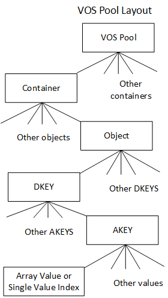
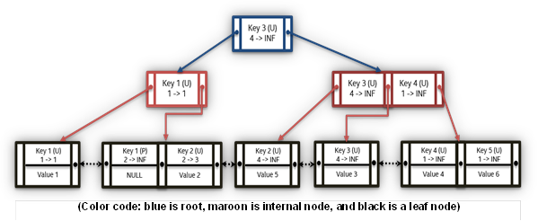
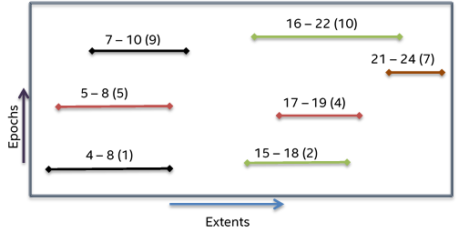
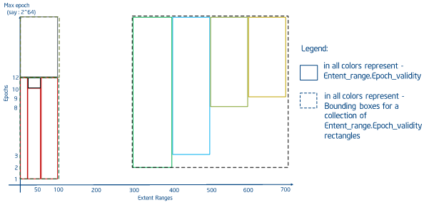
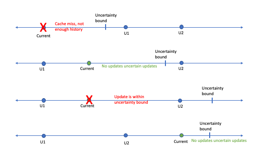
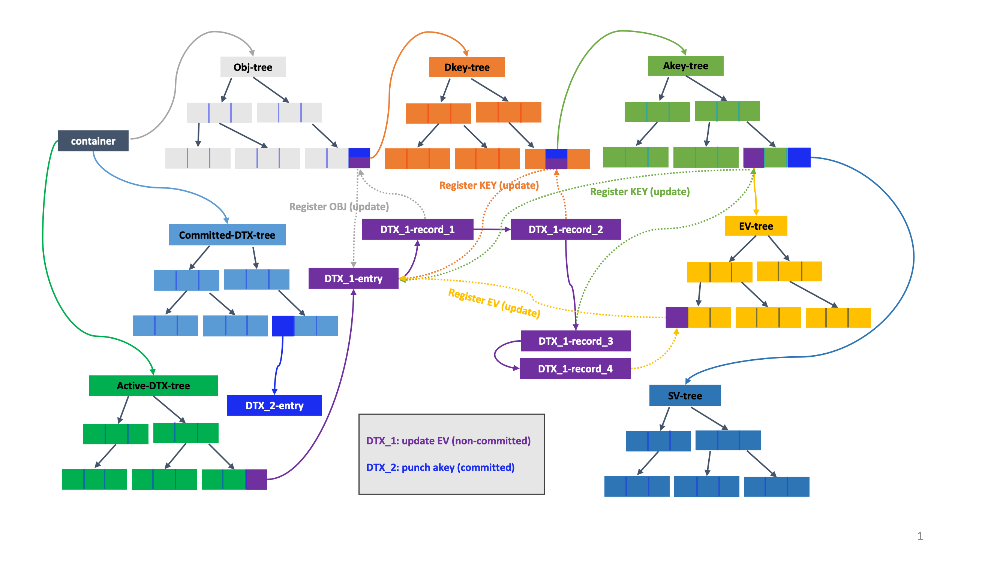

# Versioning Object Store

The Versioning Object Store (VOS) is responsible for providing and maintaining a persistent object store that supports byte-granular access and versioning for a single shard in a <a href="/docs/storage_model.md#DAOS_Pool">DAOS pool</a>.
It maintains its metadata in persistent memory and may store data either in persistent memory or on block storage, depending on available storage and performance requirements.
It must provide this functionality with minimum overhead so that performance can approach the theoretical performance of the underlying hardware as closely as possible, both with respect to latency and bandwidth.
Its internal data structures, in both persistent and non-persistent memory, must also support the highest levels of concurrency so that throughput scales over the cores of modern processor architectures.
Finally, and critically, it must validate the integrity of all persisted object data to eliminate the possibility of silent data corruption, both in normal operation and under all possible recoverable failures.

This section provides the details for achieving the design goals discussed above in building a versioning object store for DAOS.

This document contains the following sections:

- <a href="#62">Persistent Memory based Storage</a>
    - <a href="#63">In-Memory Storage</a>
    - <a href="#64">Lightweight I/O Stack: PMDK Libraries</a>
- <a href="#71">VOS Concepts</a>
    - <a href="#711">VOS Indexes</a>
    - <a href="#712">Object Listing</a>
-  <a href="#72">Key Value Stores</a>
    - <a href="#721">Operations Supported with Key Value Store</a>
    - <a href="#723">Key in VOS KV Stores</a>
    - <a href="#724">Internal Data Structures</a>
- <a href="#73">Key Array Stores</a>
- <a href="#82">Conditional Update and MVCC</a>
    - <a href="#821">VOS Timestamp Cache</a>
    - <a href="#822">Read Timestamps</a>
    - <a href="#823">Write Timestamps</a>
    - <a href="#824">MVCC Rules</a>
    - <a href="#825">Punch Propagation</a>
- <a href="#74">Epoch Based Operations</a>
    - <a href="#741">VOS Discard</a>
    - <a href="#742">VOS Aggregate</a>
- <a href="#79">VOS Checksum Management</a>
- <a href="#80">Metadata Overhead</a>
- <a href="#81">Replica Consistency</a>
    - <a href="#811">DAOS Two-phase Commit</a>
    - <a href="#812">DTX Leader Election</a>

<a id="62"></a>
## Persistent Memory based Storage

<a id="63"></a>
### In-Memory Storage

The VOS is designed to use a persistent-memory storage model that takes advantage of byte-granular, sub-microsecond storage access possible with new NVRAM technology.
This enables a disruptive change in performance compared to conventional storage systems for application and system metadata and small, fragmented, and misaligned I/O.
Direct access to byte-addressable low-latency storage opens up new horizons where metadata can be scanned in less than a second without bothering with seek time and alignment.

The VOS relies on a log-based architecture using persistent memory primarily to maintain internal persistent metadata indexes.
The actual data can be stored either in persistent memory directly or in block-based NVMe storage.
The DAOS service has two tiers of storage: Storage Class Memory (SCM) for byte-granular application data and metadata, and NVMe for bulk application data.
Similar to how PMDK is currently used to facilitate access to SCM, the Storage Performance Development Kit (<a href="https://spdk.io/">SPDK</a>) is used to provide seamless and efficient access to NVMe SSDs.
The current DAOS storage model involves three DAOS server xstreams per core, along with one main DAOS server xstream per core mapped to an NVMe SSD device.
DAOS storage allocations can occur on either SCM by using a PMDK pmemobj pool, or on NVMe, using an SPDK blob.
All local server metadata will be stored in a per-server pmemobj pool on SCM and will include all current and relevant NVMe devices, pool, and xstream mapping information.
Please refer to the <a href="../bio/README.md">Blob I/O</a> (BIO) module for more information regarding NVMe, SPDK, and per-server metadata.
Special care is taken when developing and modifying the VOS layer because any software bug could corrupt data structures in persistent memory.
The VOS, therefore, checksums its persistent data structures despite the presence of hardware ECC.

The VOS provides a lightweight I/O stack fully in user space, leveraging the <a href="pmem.io">PMDK</a> open-source libraries developed to support this programming model.

<a id="64"></a>

### Lightweight I/O Stack: PMDK Libraries
Although persistent memory is accessible via direct load/store, updates go through multiple levels of caches, including the processor L1/2/3 caches and the NVRAM controller.
Durability is guaranteed only after all those caches have been explicitly flushed.
The VOS maintains internal data structures in persistent memory that must retain some level of consistency so that operation may be resumed without loss of durable data after an unexpected crash or power outage.
The processing of a request will typically result in several memory allocations and updates that must be applied atomically.

Consequently, a transactional interface must be implemented on top of persistent memory to guarantee internal VOS consistency.
It is worth noting that such transactions are different from the DAOS transaction mechanism.
Persistent memory transactions must guarantee consistency of VOS internal data structures when processing incoming requests, regardless of their epoch number.
Transactions over persistent memory can be implemented in many different ways, e.g., undo logs, redo logs, a combination of both, or copy-on-write.

<a href="https://pmem.io">PMDK</a> is an open source collection of libraries for using persistent memory, optimized specifically for NVRAM.
Among these is the libpmemobj library, which implements relocatable persistent heaps called persistent memory pools.
This includes memory allocation, transactions, and general facilities for persistent memory programming.
The transactions are local to one thread (not multi-threaded) and rely on undo logs.
Correct use of the API ensures that all memory operations are rolled back to the last committed state upon opening a pool after a server failure.
VOS utilizes this API to ensure consistency of VOS internal data structures, even in the event of server failures.

<a id="71"></a>
## VOS Concepts

The versioning object store provides object storage local to a storage target by initializing a VOS pool (vpool) as one shard of a DAOS pool.
A vpool can hold objects for multiple object address spaces called containers.
Each vpool is given a unique UID on creation, which is different from the UID of the DAOS pool.
The VOS also maintains and provides a way to extract statistics like total space, available space, and number of objects present in a vpool.

The primary purpose of the VOS is to capture and log object updates in arbitrary time order and integrate these into an ordered epoch history that can be traversed efficiently on demand.
This provides a major scalability improvement for parallel I/O by correctly ordering conflicting updates without requiring them to be serialized in time.
For example, if two application processes agree on how to resolve a conflict on a given update, they may write their updates independently with the assurance that they will be resolved in the correct order at the VOS.

The VOS also allows all object updates associated with a given epoch and process group to be discarded.
This functionality ensures that when a DAOS transaction must be aborted, all associated updates are invisible before the epoch is committed for that process group and becomes immutable.
This ensures that distributed updates are atomic - i.e.
when a commit completes, either all updates have been applied or been discarded.

Finally, the VOS may aggregate the epoch history of objects in order to reclaim space used by inaccessible data and to speed access by simplifying indices.
For example, when an array object is "punched" from 0 to infinity in a given epoch, all data updated after the latest snapshot before this epoch becomes inaccessible once the container is closed.

Internally, the VOS maintains an index of container UUIDs that references each container stored in a particular pool.
The container itself contains three indices.
The first is an object index used to map an object ID and epoch to object metadata efficiently when servicing I/O requests.
The other two indices are for maintining active and committed <a href="#811">DTX</a> records for ensuring efficient updates across multiple replicas.

DAOS supports two types of values, each associated with a Distribution Key (DKEY) and an Attribute Key (AKEY): Single value and Array value.
The DKEY is used for placement, determining which VOS pool is used to store the data.
The AKEY identifies the data to be stored.
The ability to specify both a DKEY and an AKEY provides applications with the flexibility to either distribute or co-locate different values in DAOS.
A single value is an atomic value meaning that writes to an AKEY update the entire value and reads retrieve the latest value in its entirety.
An array value is an index of equally sized records.  Each update to an array value only affects the specified records and reads read the latest updates to each record index requested.
Each VOS pool maintains the VOS provides a per container hierarchy of containers, objects, DKEYs, AKEYs, and values as shown <a href="#7a">below</a>.
The DAOS API provides generic Key-Value and Array abstractions built on this underlying interface.  The former sets the DKEY to the user specified key and uses a fixed AKEY.
The latter uses the upper bits of the array index to create a DKEY and uses a fixed AKEY thus evenly distributing array indices over all VOS pools in the object layout.
For the remainder of the VOS description, Key-Value and Key-Array shall be used to describe the VOS layout rather than these simplifying abstractions.
In other words, they shall describe the DKEY-AKEY-Value in a single VOS pool.

VOS objects are not created explicitly but are created on the first write by creating the object metadata and inserting a reference to it in the owning container's object index.
All object updates log the data for each update, which may be an object, DKEY, AKEY, a single value, or array value punch or an update to a single value or array value.
Note that "punch" of an extent of an array object is logged as zeroed extents, rather than causing relevant array extents or key values to be discarded. A punch of an object, DKEY, AKEY, or single value is logged, so that reads at a later timestamp see no data.
This ensures that the full version history of objects remain accessible.   The DAOS api, however, only allows accessing data at snapshots so VOS aggregation can aggressively remove objects, keys, and values that are no longer accessible at a known snapshot.

<a id="7a"></a>


When performing lookup on a single value in an object, the object index is traversed to find the index node with the highest epoch number less than or equal to the requested epoch (near-epoch) that matches the key.
If a value or negative entry is found, it is returned.
Otherwise, a "miss" is returned, meaning that this key has never been updated in this VOS.
This ensures that the most recent value in the epoch history of is returned irrespective of the time-order in which they were integrated and that all updates after the requested epoch are ignored.

Similarly, when reading an array object, its index is traversed to create a gather descriptor that collects all object extent fragments in the requested extent with the highest epoch number less than or equal to the requested epoch.
Entries in the gather descriptor either reference an extent containing data, a punched extent that the requester can interpret as all zeroes, or a "miss", meaning that this VOS has received no updates in this extent.
Again, this ensures that the most recent data in the epoch history of the array is returned for all offsets in the requested extent, irrespective of the time-order in which they were written, and that all updates after the requested epoch are ignored.

<a id="711"></a>

### VOS Indexes

The value of the object index table, indexed by OID, points to a DKEY index.
The values in the DKEY index, indexed by DKEY, point to an AKEY index.
The values in the AKEY index, indexed by AKEY, point to either a Single Value index or an Array index.
A single value index is referenced by epoch and will return the latest value inserted at or prior to the epoch.
An array value is indexed by the extent and the epoch and will return portions of extents visible at the epoch.

Hints about the expectations of the object can be encoded in the object ID.
For example, an object can be replicated, erasure coded, use checksums, or have integer or lexical DKEYs and/or AKEYs.
If integer or lexical keys are used, the object index is ordered by keys, making queries, such as array size, more efficient.
Otherwise, keys are ordered by the hashed value in the index.
The object ID is 128 bits.  The upper 32 bits are used to encodes the object type, and key types while the lower 96 bits are a user defined identifier that must be unique to the container.

Each object, dkey, and akey has an associated incarnation log.  The incarnation
log can be described as an in-order log of creation and punch events for the
associated entity.   The log is checked for each entity in the path to the value
to ensure the entity, and therefore the value, is visible at the requested
time.

<a id="712"></a>

### Object Listing

VOS provides a generic iterator that can be used to iterate through containers, objects, DKEYs, AKEYs, single values, and array extents in a VOS pool.
The iteration API is shown in the <a href="#7b">figure</a> below.

<a id="7b"></a>
```C
/**
 * Iterate VOS entries (i.e., containers, objects, dkeys, etc.) and call \a
 * cb(\a arg) for each entry.
 *
 * If \a cb returns a nonzero (either > 0 or < 0) value that is not
 * -DER_NONEXIST, this function stops the iteration and returns that nonzero
 * value from \a cb. If \a cb returns -DER_NONEXIST, this function completes
 * the iteration and returns 0. If \a cb returns 0, the iteration continues.
 *
 * \param[in]		param		iteration parameters
 * \param[in]		type		entry type of starting level
 * \param[in]		recursive	iterate in lower level recursively
 * \param[in]		anchors		array of anchors, one for each
 *					iteration level
 * \param[in]		cb		iteration callback
 * \param[in]		arg		callback argument
 *
 * \retval		0	iteration complete
 * \retval		> 0	callback return value
 * \retval		-DER_*	error (but never -DER_NONEXIST)
 */
int
vos_iterate(vos_iter_param_t *param, vos_iter_type_t type, bool recursive,
	    struct vos_iter_anchors *anchors, vos_iter_cb_t cb, void *arg);
```

The generic VOS iterator API enables both the DAOS enumeration API as well as DAOS internal features supporting rebuild, aggregation, and discard.
It is flexible enough to iterate through all keys, single values, and extents for a specified epoch range.
Additionally, it supports iteration through visible extents.

<a id="72"></a>

## Key Value Stores (Single Value)

High-performance simulations generating large quantities of data require indexing and analysis of data, to achieve good insight.
Key Value (KV) stores can play a vital role in simplifying the storage of such complex data and allowing efficient processing.

VOS provides a multi-version, concurrent KV store on persistent memory that can grow dynamically and provide quick near-epoch retrieval and enumeration of key values.

Although there is an array of previous work on KV stores, most of them focus on cloud environments and do not provide effective versioning support.
Some KV stores provide versioning support but expect monotonically increasing ordering of versions and further, do not have the concept of near-epoch retrieval.

VOS must be able to accept insertion of KV pairs at any epoch and must be able to provide good scalability for concurrent updates and lookups on any key-value object.
KV objects must also be able to support any type and size of keys and values.


<a id="721"></a>

### Operations Supported with Key Value Store

VOS supports large keys and values with four types of operations; update, lookup, punch, and key enumeration.

The update and punch operations add a new key to a KV store or log a new value of an existing key.
Punch logs the special value "punched", effectively a negative entry, to record the epoch when the key was deleted.
Sharing the same epoch for both an update and a punch of the same object, key, value, or extent is disallowed, and VOS will return an error when such is attempted.

Lookup traverses the KV metadata to determine the state of the given key at the given epoch.
If the key is not found at all, a "miss" is returned to indicate that the key is absent from this VOS.
Otherwise, the value at the near-epoch or greatest epoch less than or equal to the requested epoch is returned.
If this is the special "punched" value, it means the key was deleted in the requested epoch.
The value here refers to the value in the internal tree-data structure.
The key-value record of the KV-object is stored in the tree as the value of its node.
So in case of punch this value contains a "special" return code/flag to identify the punch operation.

VOS also supports the enumeration of keys belonging to a particular epoch.

<a id="723"></a>

### Key in VOS KV Stores

VOS KV supports key sizes from small keys to extremely large keys.
For AKEYs and DKEYs, VOS supports either hashed keys or one of two types of
"direct" keys: lexical or integer.
#### Hashed Keys
The most flexible key type is the hashed key.   VOS runs two fast hash
algorithms on the user supplied key and uses the combined hashed key values for
the index.  The intention of the combined hash is to avoid collisions between
keys. The actual key still must be compared for correctness.
#### Direct Keys
The use of hashed keys results in unordered keys.  This is problematic in cases
where the user's algorithms may benefit from ordering.   Therefore, VOS supports
two types of keys that are not hashed but rather interpreted directly.
##### Lexical Keys
Lexical keys are compared using a lexical ordering.  This enables usage such as
sorted strings.   Presently, lexical keys are limited in length, however to
80 characters.
##### Integer Keys
Integer keys are unsigned 64-bit integers and are compared as such.   This
enables use cases such as DAOS array API using the upper bits of the index
as a dkey and the lower bits as an offset. This enables such objects to use the
the DAOS key query API to calculate the size more efficiently.

KV stores in VOS allow the user to maintain versions of the different KV pairs in random order.
For example, an update can happen in epoch 10, and followed by another update in epoch 5, where HCE is less than 5.
To provide this level of flexibility, each key in the KV store must maintain the epoch of update/punch along with the key.
The ordering of entries in index trees first happens based on the key, and then based on the epochs.
This kind of ordering allows epochs of the same key to land in the same subtree, thereby minimizing search costs.
Conflict resolution and tracking is performed using <a href="#81">DTX</a> described later.
DTX ensures that replicas are consistent, and failed or uncommitted updates are not visible externally.

<a id="724"></a>

### Internal Data Structures

Designing a VOS KV store requires a tree data structure that can grow dynamically and remain self-balanced.
The tree needs to be balanced to ensure that time complexity does not increase with an increase in tree size.
Tree data structures considered are red-black trees and B+ Trees, the former is a binary search tree, and the latter an n-ary search tree.

Although red-black trees provide less rigid balancing compared to AVL trees, they compensate by having cheaper rebalancing cost.
Red-black trees are more widely used in examples such as the Linux kernel, the java-util library, and the C++ standard template library.
B+ trees differ from B trees in the fact they do not have data associated with their internal nodes.
This can facilitate fitting more keys on a page of memory.
In addition, leaf-nodes of B+ trees are linked; this means doing a full scan would require just one linear pass through all the leaf nodes, which can potentially minimize cache misses to access data in comparison to a B Tree.

To support update and punch as mentioned in the previous section (<a href="#721">Operations Supported with Key Value Stores</a>), an epoch-validity range is set along with the associated key for every update or punch request, which marks the key to be valid from the current epoch until the highest possible epoch.
Updates to the same key on a future epoch or past epoch modify the end epoch validity of the previous update or punch accordingly.
This way only one key has a validity range for any given key-epoch pair lookup while the entire history of updates to the key is recorded.
This facilitates nearest-epoch search.
Both punch and update have similar keys, except for a simple flag identifying the operation on the queried epoch.
Lookups must be able to search a given key in a given epoch and return the associated value.
In addition to the epoch-validity range, the container handle cookie generated by DAOS is also stored along with the key of the tree.
This cookie is required to identify behavior in case of overwrites on the same epoch.

A simple example input for crearting a KV store is listed in the <a href="#7c">Table</a> below.
Both a B+ Tree based index and a red-black tree based index are shown in the <a href="#7c">Table</a> and <a href="#7d"> figure</a> below, respectively.
For explanation purposes, representative keys and values are used in the example.

<a id="7c"></a>
<b>Example VOS KV Store input for Update/Punch</b>

|Key|Value|Epoch|Update (U/P)|
|---|---|---|---|
|Key 1|Value 1|1|U|
|Key 2|Value 2|2|U|
|Key 3|Value 3|4|U|
|Key 4|Value 4|1|U|
|Key 1|NIL|2|P|
|Key 2|Value 5|4|U|
|Key 3|Value 6|1|U|

<a id="7d"></a>



The red-black tree, like any traditional binary tree, organizes the keys lesser than the root to the left subtree and keys greater than the root to the right subtree.
Value pointers are stored along with the keys in each node.
On the other hand, a B+ Tree-based index stores keys in ascending order at the leaves, which is where the value is stored.
The root nodes and internal nodes (color-coded in blue and maroon accordingly) facilitate locating the appropriate leaf node.
Each B+ Tree node has multiple slots, where the number of slots is determined from the order.
The nodes can have a maximum of order-1 slots.
The container handle cookie must be stored with every key in case of red-black trees, but in case of B+ Trees having cookies only in leaf nodes would suffice, since cookies are not used in traversing.

In the <a href="#7e">table</a> below, n is the number of entries in the tree, m is the number of keys, k is the number of the key, epoch entries between two unique keys.

<b>Comparison of average case computational complexity for index</b>
<a id="7e"></a>

|Operation|Red-black tree|B+Tree|
|---|---|---|
|Update|O(log2n)|O(log<sub>b</sub>n)|
|Lookup|O(log2n)|O(log<sub>b</sub>n)|
|Delete|O(log2n)|O(log<sub>b</sub>n)|
|Enumeration|O(m* log<sub>2</sub>(n) + log<sub>2</sub>(n))|O(m * k + log<sub>b</sub> (n))|

Although both these solutions are viable implementations, determining the ideal data structure would depend on the performance of these data structures on persistent memory hardware.

VOS also supports concurrent access to these structures, which mandates that the data structure of choice provides good scalability while there are concurrent updates.
Compared to B+ Tree, rebalancing in red-black trees causes more intrusive tree structure change; accordingly, B+ Trees may provide better performance with concurrent accesses.
Furthermore, because B+ Tree nodes contain many slots depending on the size of each node, prefetching in cache can potentially be easier.
In addition, the sequential computational complexities in the <a href="#7e">Table</a> above show that a B+ Tree-based KV store with a reasonable order, can perform better in comparison to a Red-black tree.

VOS supports enumerating keys valid in a given epoch.
VOS provides an iterator-based approach to extract all the keys and values from a KV object.
Primarily, KV indexes are ordered by keys and then by epochs.
With each key holding a long history of updates, the size of a tree can be huge.
Enumeration with a tree-successors approach can result in an asymptotic complexity of O(m* log (n) + log (n)) with red-black trees, where m is the number of keys valid in the requested epoch.
It takes O(log2 (n)) to locate the first element in the tree and O(log2 (n)) to locate a successor.
Because "m" keys need to be retrieved, O( m * log2 (n)) would be the complexity of this enumeration.

In the case of B+-trees, leaf nodes are in ascending order, and enumeration would be to parse the leaf nodes directly.
The complexity would be O (m * k + logbn), where m is the number of keys valid in an epoch, k is the number of entries between two different keys in B+ tree leaf nodes, and b is the order for the B+tree.
Having "k" epoch entries between two distinct keys incurs in a complexity of O(m * k).
The additional O(logbn) is required to locate the first leftmost key in the tree.
The generic iterator interfaces as shown in <a href="#7d">Figure</a> above would be used for KV enumeration also.

In addition to the enumeration of keys for an object valid in an epoch, VOS also supports enumerating keys of an object modified between two epochs.
The epoch index table provides keys updated in each epoch.
On aggregating the list of keys associated with each epoch, (by keeping the latest update of the key and discarding the older versions) VOS can generate a list of keys with their latest epoch.
By looking up each key from the list in its associated index data structure, VOS can extract values with an iterator-based approach.

<a id="73"></a>

## Key Array Stores

The second type of object supported by VOS is a Key-Array object.
Array objects, similar to KV stores, allow multiple versions and must be able to write, read, and punch any part of the byte extent range concurrently.
The <a href="#7f">figure</a> below shows a simple example of the extents and epoch arrangement within a Key-Array object.
In this example, the different lines represent the actual data stored in the respective extents and the color-coding points to different threads writing that extent range.

<a id="7f"></a>

<b>Example of extents and epochs in a Key Array object</b>



In the <a href="7f">above</a> example, there is significant overlap between different extent ranges.
VOS supports nearest-epoch access, which necessitates reading the latest value for any given extent range.
For example, in the <a href="#7f">figure</a> above, if there is a read request for extent range 4 - 10 at epoch 10, the resulting read buffer should contain extent 7-10 from epoch 9, extent 5-7 from epoch 8, and extent 4-5 from epoch 1.
VOS array objects also support punch over both partial and complete extent ranges.

<a id="7g"></a>

<b>Example Input for Extent Epoch Table</b>

|Extent Range|Epoch |Write (or) Punch|
|---|---|---|
|0 - 100|1|Write|
|300 - 400|2|Write
|400 - 500|3|Write|
|30 - 60|10|Punch|
|500 - 600|8|Write|
|600 - 700|9|Write|

<a id="7j"></a>

R-Trees provide a reasonable way to represent both extent and epoch validity ranges in such a way as to limit the search space required to handle a read request.
VOS provides a specialized R-Tree, called an Extent-Validity tree (EV-Tree) to store and query versioned array indices.
In a traditional R-Tree implementation, rectangles are bounded and immutable.
In VOS, the "rectangle" consists of the extent range on one axis and the epoch validity range on the other.
However, the epoch validity range is unknown at the time of insert so all rectangles are inserted assuming an upper bound of infinity.
Originally, the DAOS design called for splitting such in-tree rectangles on insert to bound the validity range but a few factors resulted in the decision to keep the original validity range.  First, updates to persistent memory are an order of magnitude more expensive than lookups.  Second, overwrites between snapshots can be deleted by aggregation, thus maintaining a reasonably small history of overlapping writes.   As such, the EV-Tree implements a two part algorithm on fetch.
1. Find all overlapping extents.  This will include all writes that happened before the requested epoch, even if they are covered by a subsequent write.
2. Sort this by extent start and then by epoch
3. Walk through the sorted array, splitting extents if necessary and marking them as visible as applicable
4. Re-sort the array.  This final sort can optionally keep or discard holes and covered extents, depending on the use case.

TODO: Create a new figure
<a id="7k"></a>
<b>Rectangles representing extent_range.epoch_validity arranged in 2-D space for an order-4 EV-Tree using input in the table <a href="#7g">above</a></b>



The figure <a href="7l">below</a> shows the rectangles constructed with splitting and trimming operations of EV-Tree for the example in the previous <a href="#7g">table</a> with an additional write at offset {0 - 100} introduced to consider the case for extensive splitting.
The figure <a href="#7k">above</a> shows the EV-Tree construction for the same example.

<a id="7l"></a>

<b>Tree (order - 4) for the example in Table 6 3 (pictorial representation shown in the figure <a href="#7g">above</a></b>


Inserts in an EV-Tree locate the appropriate leaf-node to insert, by checking for overlap.
If multiple bounding boxes overlap, the bounding box with the least enlargement is chosen.
Further ties are resolved by choosing the bounding box with the least area.
The maximum cost of each insert can be O (log<sub>b</sub>n).

Searching an EV-Tree would work similar to R-Tree, aside from the false overlap issue described above.
All overlapping internal nodes must be pursued, till there are matching internal nodes and leaves.
Since extent ranges can span across multiple rectangles, a single search can hit multiple rectangles.
In an ideal case (where the entire extent range falls on one rectangle), the read cost is O(log<sub>b</sub>n) where b is the order of the tree.
The sorting and splitting phase adds the additional overhead of O(n log n) where n is the number of matching extents.
In the worst case, this is equivalent to all extents in the tree, but this is mitigated by aggregation and the expectation that the tree associated with a single shard of a single key will be relatively small.

For deleting nodes from an EV-Tree, the same approach as search can be used to locate nodes, and nodes/slots can be deleted.
Once deleted, to coalesce multiple leaf-nodes that have less than order/2 entries, reinsertion is done.
EV-tree reinserts are done (instead of merging leaf-nodes as in B+ trees) because on deletion of leaf node/slots, the size of bounding boxes changes, and it is important to make sure the rectangles are organized into minimum bounding boxes without unnecessary overlaps.
In VOS, delete is required only during aggregation and discard operations.
These operations are discussed in a following section (<a href="#74">Epoch Based Operations</a>).

<a id="82"></a>
## Conditional Update and MVCC

VOS supports conditional operations on individual dkeys and akeys.  The
following operations are supported:

- Conditional fetch:  Fetch if the key exists, fail with -DER_NONEXIST otherwise
- Conditional update: Update if the key exists, fail with -DER_NONEXIST otherwise
- Conditional insert: Update if the key doesn't exist, fail with -DER_EXIST otherwise
- Conditional punch:  Punch if the key exists, fail with -DER_NONEXIST otherwise

These operations provide atomic operations enabling certain use cases that
require such.  Conditional operations are implemented using a combination of
existence checks and read timestamps.   The read timestamps enable limited
MVCC to prevent read/write races and provide serializability guarantees.

<a id="821"><a>
### VOS Timestamp Cache

VOS maintains an in-memory cache of read and write timestamps in order to
enforce MVCC semantics.  The timestamp cache itself consists of two parts:

1. Negative entry cache. A global array per target for each type of entity
including objects, dkeys, and akeys.  The index at each level is determined by
the combination of the index of the parent entity, or 0 in the case of
containers, and the hash of the entity in question.   If two different keys map
to the same index, they share timestamp entries.   This will result in some
false conflicts but does not affect correctness so long as progress can be made.
The purpose of this array is to store timestamps for entries that do not exist
in the VOS tree.   Once an entry is created, it will use the mechanism described
in #2 below.  Note that multiple pools in the same target use this shared
cache so it is also possible for false conflicts across pools before an
entity exists.  These entries are initialized at startup using the global
time of the starting server.   This ensures that any updates at an earlier
time are forced to restart to ensure we maintain automicity since timestamp
data is lost when a server goes down.
2. Positive entry cache. An LRU cache per target for existing containers,
objects, dkeys, and akeys.  One LRU array is used for each level such that
containers, objects, dkeys, and akeys only conflict with cache entries of the
same type.  Some accuracy is lost when existing items are evicted from the cache
as the values will be merged with the corresponding negative entry described in
#1 above until such time as the entry is brought back into cache.   The index of
the cached entry is stored in the VOS tree though it is only valid at runtime.
On server restarts, the LRU cache is initialized from the global time when the
restart occurs and all entries are automatically invalidated.  When a new entry
is brought into the LRU, it is initialized using the corresponding negative
entry.  The index of the LRU entry is stored in the VOS tree providing O(1)
lookup on subsequent accesses.

<a id="822"></a>
### Read Timestamps

Each entry in the timestamp cache contains two read timestamps in order to
provide serializability guarantees for DAOS operations.  These timestamps are

1. A low timestamp (entity.low) indicating that _all_ nodes in the subtree
rooted at the entity have been read at entity.low
2. A high timestamp (entity.high) indicating that _at least_ one node in the
subtree rooted at the entity has been read at entity.high.

For any leaf node (i.e., akey), low == high; for any non-leaf node, low <= high.

The usage of these timestamps is described <a href="#824">below</a>

<a id="823"></a>
### Write Timestamps

In order to detect epoch uncertainty violations, VOS also maintains a pair of
write timestamps for each container, object, dkey, and akey. Logically,
the timestamps represent the latest two updates to either the entity itself
or to an entity in a subtree. At least two timestamps are required to avoid
assuming uncertainty if there are any later updates.  The figure
<a href="#8a">below</a> shows the need for at least two timestamps.  With a
single timestamp only, the first, second, and third cases would be
indistinguishable and would be rejected as uncertain.  The most accurate write
timestamp is used in all cases.  For instance, if the access is an array fetch,
we will check for conflicting extents in the absence of an uncertain punch of
the corresponding key or object.

<a id="8a"></a>
<b>Scenarios illustrating utility of write timestamp cache</b>



<a id="824"></a>
### MVCC Rules

Every DAOS I/O operation belongs to a transaction. If a user does not associate
an operation with a transaction, DAOS regards this operation as a
single-operation transaction. A conditional update, as defined above, is
therefore regarded as a transaction comprising a conditional check, and if the
check passes, an update, or punch operation.

Every transaction gets an epoch. Single-operation transactions and conditional
updates get their epochs from the redundancy group servers they access,
snapshot read transactions get their epoch from the snapshot records and every
other transaction gets its epoch from the HLC of the first server it accesses.
(Earlier implementations use client HLCs to choose epochs in the last case. To
relax the clock synchronization requirement for clients, later implementations
have moved to use server HLCs to choose epochs, while introducing client HLC
Trackers that track the highest server HLC timestamps clients have heard of.) A
transaction performs all operations using its epoch.

The MVCC rules ensure that transactions execute as if they are serialized in
their epoch order while ensuring that every transaction observes all
conflicting transactions commit before it opens, as long as the
system clock offsets are always within the expected maximum system clock offset
(epsilon). For convenience, the rules classify the I/O operations into reads
and writes:

  - Reads
      - Fetch akeys [akey level]
      - Check object emptiness [object level]
      - Check dkey emptiness [dkey level]
      - Check akey emptiness [akey level]
      - List objects under container [container level]
      - List dkeys under object [object level]
      - List akeys under dkey [dkey level]
      - List recx under akey [akey level]
      - Query min/max dkeys under object [object level]
      - Query min/max akeys under dkey [dkey level]
      - Query min/max recx under akey [akey level]
  - Writes
      - Update akeys [akey level]
      - Punch akeys [akey level]
      - Punch dkey [dkey level]
      - Punch object [object level]

And each read or write is at one of the four levels: container, object, dkey,
and akey. An operation is regarded as an access to the whole subtree rooted at
its level. Although this introduces a few false conflicts (e.g., a list
operation versus a lower level update that does not change the list result),
the assumption simplifies the rules.

A read at epoch e follows these rules:

    // Epoch uncertainty check
    if e is uncertain
        if there is any overlapping, unaborted write in (e, e_orig + epsilon]
            reject

    find the highest overlapping, unaborted write in [0, e]
    if the write is not committed
        wait for the write to commit or abort
        if aborted
            retry the find skipping this write

    // Read timestamp update
    for level i from container to the read's level lv
        update i.high
    update lv.low

A write at epoch e follows these rules:

    // Epoch uncertainty check
    if e is uncertain
        if there is any overlapping, unaborted write in (e, e_orig + epsilon]
            reject

    // Read timestamp check
    for level i from container to one level above the write
        if (i.low > e) || ((i.low == e) && (other reader @ i.low))
            reject
    if (i.high > e) || ((i.high == e) && (other reader @ i.high))
        reject

    find if there is any overlapping write at e
    if found and from a different transaction
        reject

A transaction involving both reads and writes must follow both sets of rules.
As optimizations, single-read transactions and snapshot (read) transactions
do not need to update read timestamps. Snapshot creations, however, must
update the read timestamps as if it is a transaction reading the whole
container.

When a transaction is rejected, it restarts with the same transaction ID but a
higher epoch. If the epoch becomes higher than the original epoch plus epsilon,
the epoch becomes certain, guaranteeing the restarts due to the epoch
uncertainty checks are bounded.

Deadlocks among transactions are impossible. A transaction t_1 with epoch e_1
may block a transaction t_2 with epoch e_2 only when t_2 needs to wait for
t_1's writes to commit. Since the client caching is used, t_1 must be
committing, whereas t_2 may be reading or committing. If t_2 is reading, then
e_1 <= e_2. If t_2 is committing, then e_1 < e_2. Suppose there is a cycle of
transactions reaching a deadlock. If the cycle includes a committing-committing
edge, then the epochs along the cycle must increase and then decrease, causing
a contradiction. If all edges are committing-reading, then there must be two
such edges together, causing a contradiction that a reading transaction cannot
block other transactions. Deadlocks are, therefore, not a concern.

If an entity keeps getting reads with increasing epochs, writes to this entity
may keep being rejected due to the entity's ever-increasing read timestamps.
Exponential backoffs with randomizations (see d_backoff_seq) have been
introduced during daos_tx_restart calls. These are effective for dfs_move
workloads, where readers also write.

<a id="825"></a>
### Punch propagation

Since conditional operations rely on an emptiness semantic, VOS read
operations, particularly listing can be very expensive because they would
require potentially reading the subtree to see if the entity is empty or not.
In order to alieviate this problem, VOS instead does punch propagation.
On a punch operation, the parent tree is read to see if the punch
causes it to be empty.  If it does, the parent tree is punched as well.
Propagation presently stops at the dkey level, meaning the object will
not be punched. Punch propagation only applies when punching keys, not
values.

<a id="74"></a>

## Epoch Based Operations

Epochs provide a way for modifying VOS objects without destroying the history of updates/writes.
Each update consumes memory and discarding unused history can help reclaim unused space.
VOS provides methods to compact the history of writes/updates and reclaim space in every storage node.
VOS also supports rollback of history in case transactions are aborted.
The DAOS API timestamp corresponds to a VOS epoch.
The API only allows reading either the latest state or from a persistent snapshot, which is simply a reference on a given epoch.

To compact epochs, VOS allows all epochs between snapshots to be aggregated, i.e., the value/extent-data of the latest epoch of any key is always kept over older epochs.
This also ensures that merging history does not cause loss of exclusive updates/writes made to an epoch.
To rollback history, VOS provides the discard operation.

```C
int vos_aggregate(daos_handle_t coh, daos_epoch_range_t *epr);
int vos_discard(daos_handle_t coh, daos_epoch_range_t *epr);
int vos_epoch_flush(daos_handle_t coh, daos_epoch_t epoch);
```

Aggregate and discard operations in VOS accept a range of epochs to be aggregated normally corresponding to ranges between persistent snapshots.

<a id="741"></a>

### VOS Discard

Discard forcefully removes epochs without aggregation.
This operation is necessary only when the value/extent-data associated with a pair needs to be discarded.
During this operation, VOS looks up all objects associated with each cookie in the requested epoch range from the cookie index table and removes the records directly from the respective object trees by looking at their respective epoch validity.
DAOS requires a discard to service abort requests.
Abort operations require a discard to be synchronous.

During discard, keys and byte-array rectangles need to be searched for nodes/slots whose end-epoch is (discard_epoch -  1).
This means that there was an update before the now discarded epoch, and its validity got modified to support near-epoch lookup.
This epoch validity of the previous update has to be extended to infinity to ensure future lookups at near-epoch would fetch the last known updated value for the key/extent range.

<a id="742"></a>

### VOS Aggregate

During aggregation, VOS must retain the latest update to a key/extent-range discarding the others and any updates visible at a persistent snapshot.
VOS can freely remove or consolidate keys or extents so long as it doesn't alter the view visible at the latest timestamp or any persistent snapshot epoch.
Aggregation makes use of the vos_iterate API to find both visible and hidden entries between persistent snapshots and removes hidden keys and extents and merges contiguous partial extents to reduce metadata overhead.
Aggregation can be an expensive operation but doesn't need to consume cycles on the critical path.
A special aggregation ULT processes aggregation, frequently yielding to avoid blocking the continuing I/O.

<a id="79"></a>

## VOS Checksum Management

VOS is responsible for storing checksums during an object update and retrieve
checksums on an object fetch. Checksums will be stored with other VOS metadata
in storage class memory. For Single Value types, a single checksum is stored.
For Array Value types, multiple checksums can be stored based on the chunk size.

The **Chunk Size** is defined as the maximum number of bytes of data that a
checksum is derived from. While extents are defined in terms of records, the
chunk size is defined in terms of bytes. When calculating the number of
checksums needed for an extent, the number of records and the record size is
needed. Checksums should typically be derived from Chunk Size bytes, however, if
the extent is smaller than Chunk Size or an extent is not "Chunk Aligned," then
a checksum might be derived from bytes smaller than Chunk Size.

The **Chunk Alignment** will have an absolute offset, not an I/O offset. So even
if an extent is exactly, or less than, Chunk Size bytes long, it may have more
than one Chunk if it crosses the alignment barrier.

### Configuration
Checksums will be configured for a container when a container is created.
Checksum specific properties can be included in the daos_cont_create API. This
configuration has not been fully implemented yet, but properties might include
checksum type, chunk size, and server side verification.

### Storage
Checksums will be stored in a record(vos_irec_df) or extent(evt_desc) structure
for Single Value types and Array Value types respectfully. Because the checksum
can be of variable size, depending on the type of checksum configured, the
checksum itself will be appended to the end of the structure. The size needed
for checksums is included while allocating memory for the persistent structures
on SCM (vos_reserve_single/vos_reserve_recx).

The following diagram illustrates the overall VOS layout and where checksums
will be stored. Note that the checksum type isn't actually stored in vos_cont_df
yet.


### Checksum VOS Flow (vos_obj_update/vos_obj_fetch)

On update, the checksum(s) are part of the I/O Descriptor. Then, in
akey_update_single/akey_update_recx, the checksum buffer pointer is included in
the internal structures used for tree updates (vos_rec_bundle for SV and
evt_entry_in for EV). As already mentioned, the size of the persistent structure
allocated includes the size of the checksum(s). Finally, while storing the
record (svt_rec_store) or extent (evt_insert), the checksum(s) are copied to the
end of the persistent structure.

On a fetch, the update flow is essentially reversed.

For reference, key junction points in the flows are:
 - SV Update: 	vos_update_end 	-> akey_update_single 	-> svt_rec_store
 - Sv Fetch: 	vos_fetch_begin -> akey_fetch_single 	-> svt_rec_load
 - EV Update: 	vos_update_end 	-> akey_update_recx 	-> evt_insert
 - EV Fetch: 	vos_fetch_begin -> akey_fetch_recx 	-> evt_fill_entry

### Marking data as corrupted
When data is discovered as being corrupted, the bio_addr will be marked with a
corrupted flag to prevent subsequent verifications on data that is already known
to be corrupted. Because the checksum scrubber will be iterating the vos
objects, the vos_iter API is used to mark objects as corrupt. The
vos_iter_process() will take the iter handle that the corruptions was discovered
on and will call into the btree/evtree to update the durable format structure
that contains the bio_addr.

<a id="80"></a>

## Metadata Overhead

There is a tool available to estimate the metadata overhead. It is described on the <a href="https://github.com/daos-stack/daos/blob/master/src/vos/storage_estimator/README.md">storage estimator</a> section.

<a id="81"></a>

## Replica Consistency

DAOS supports multiple replicas for data high availability.  Inconsistency
between replicas is possible when a target fails during an update to a
replicated object and when concurrent updates are applied on replicated targets
in an inconsistent order.

The most intuitive solution to the inconsistency problem is distributed lock
(DLM), used by some distributed systems, such as Lustre.  For DAOS, a user-space
system with powerful, next generation hardware, maintaining distributed locks
among multiple, independent application spaces will introduce unacceptable
overhead and complexity.  DAOS instead uses an optimized two-phase commit
transaction to guarantee consistency among replicas.

<a id="811"></a>
### Single redundancy group based DAOS Two-Phase Commit (DTX)

When an application wants to modify (update or punch) a multiple replicated
object or EC object, the client sends the modification RPC to the leader shard
(via <a href="#812">DTX Leader Election</a> algorithm discussed below). The
leader dispatches the RPC to the other related shards, and each shard makes
its modification in parallel.  Bulk transfers are not forwarded by the leader
but rather transferred directly from the client, improving load balance and
decreasing latency by utilizing the full client-server bandwidth.

Before modifications are made, a local transaction, called 'DTX', is started
on each related shard (both leader and non-leaders) with a client generated
DTX identifier that is unique for the modification within the container. All
the modifications in a DTX are logged in the DTX transaction table and back
references to the table are kept in related modified record.  After local
modifications are done, each non-leader marks the DTX state as 'prepared' and
replies to the leader. The leader sets the DTX state to 'committable' as soon
as it has completed its modifications and has received successful replies from
all non-leaders.  If any shard(s) fail to execute the modification, it will
reply to the leader with failure, and the leader will globally abort the DTX.
Once the DTX is set by the leader to 'committable' or 'aborted', it replies to
the client with the appropriate status.

The client may consider a modification complete as soon as it receives a
successful reply from the leader, regardless of whether the DTX is actually
'committed' or not. It is the responsibility of the leader to commit the
'committable' DTX asynchronously. This can happen if the 'committable' count
or DTX age exceed some thresholds or the DTX is piggybacked via other
dispatched RPCs due to potential conflict with subsequent modifications.

When an application wants to read something from an object with multiple
replicas, the client can send the RPC to any replica.  On the server side,
if the related DTX has been committed or is committable, the record can be
returned to. If the DTX state is prepared, and the replica is not the leader,
it will reply to the client telling it to send the RPC to the leader instead.
If it is the leader and is in the state 'committed' or 'committable', then
such entry is visible to the application. Otherwise, if the DTX on the leader
is also 'prepared', then for transactional read, ask the client to wait and
retry via returning -DER_INPROGRESS; for non-transactional read, related entry
is ignored and the latest committed modification is returned to the client.

If the read operation refers to an EC object and the data read from a data
shard (non-leader) has a 'prepared' DTX, the data may be 'committable' on the
leader due to the aforementioned asynchronous batched commit mechanism.
In such case, the non-leader will refresh related DTX status with the leader.
If the DTX status after refresh is 'committed', then related data can be
returned to the client; otherwise, if the DTX state is still 'prepared', then
for transactional read, ask the client to wait and retry via returning
-DER_INPROGRESS; for non-transactional read, related entry is ignored and the
latest committed modification is returned to the client.

The DTX model is built inside a DAOS container. Each container maintains its own
DTX table that is organized as two B+trees in SCM: one for active DTXs and the
other for committed DTXs.
The following diagram represents the modification of a replicated object under
the DTX model.

<b>Modify multiple replicated object under DTX model</b>



<a id="812"></a>

### Single redundancy group based DTX Leader Election

In single redundancy group based DTX model, the leader selection is done for
each object or dkey following these general guidelines:

R1: When different replicated objects share the same redundancy group, the same
leader should not be used for each object.

R2: When a replicated object with multiple DKEYs span multiple redundancy
groups, the leaders in different redundancy groups should be on different
servers.

R3: Servers that fail frequently should be avoided in leader selection to avoid
frequent leader migration.

R4: For EC object, the leader will be one of the parity nodes within current
redundancy group.
