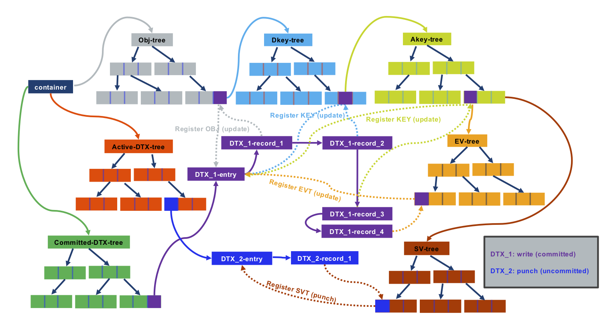

# Versioning Object Store

The Versioning Object Store (VOS) is responsible for providing and maintaining a persistent object store that supports byte-granular access and versioning for a single shard in a DAOS pool.
It maintains its own metadata in persistent memory and may store data either in persistent memory or on block storage, depending on available storage and performance requirements.
It must provide this functionality with minimum overhead so that performance can approach the theoretical performance of the underlying hardware as closely as possible, both with respect to latency and bandwidth.
Its internal data structures, in both persistent and non-persistent memory, must also support the highest levels of concurrency so that throughput scales over the cores of modern processor architectures.
Finally, and critically, it must validate the integrity of all persisted object data to eliminate the possibility of silent data corruption, both in normal operation and under all possible recoverable failures.

This section provides the details for achieving the aforementioned design goals in building a versioning object store for DAOS.

This document contains the following sections:

- <a href="#62">Persistent Memory based Storage</a>
    - <a href="#63">In-Memory Storage</a>
    - <a href="#64">Lightweight I/O Stack: NVM Library</a>
- <a href="#71">VOS Concepts</a>
    - <a href="#711">VOS Indexes</a>
    - <a href="#712">Object Listing</a>
-  <a href="#72">Key Value Stores</a>
    - <a href="#721">Operations Supported with Key Value Store</a>
    - <a href="#723">Key in VOS KV Stores</a>
    - <a href="#724">Internal Data Structures</a>
- <a href="#73">Key Array Stores</a>
- <a href="#75">Epoch Based Operations</a>
    - <a href="#751">VOS Discard</a>
    - <a href="#752">VOS Aggregate</a>
    - <a href="#753">VOS Flush</a>
- <a href="#76">VOS over NVM Library</a>
    - <a href="#761">Root Object</a>
- <a href="#77">Layout for Index Tables</a>
- <a href="#78">Transactions and Recovery</a>
    - <a href="#781">Discussions on Transaction Model</a>
- <a href="#79">VOS Checksum Management</a>
- <a href="#80">Metadata Overhead</a>
- <a href="#81">Replica Consistency</a>
    - <a href="#811">DAOS Two-phase Commit</a>
    - <a href="#812">DTX Leader Election</a>

## Persistent Memory based Storage

### In-Memory Storage

The VOS is designed to use a persistent-memory storage model that takes advantage of byte-granular, sub-microsecond storage access possible with new NVRAM technology.
This enables a disruptive change in performance compared to conventional storage systems for application and system metadata, and small, fragmented and misaligned I/O.
Direct access to byte-addressable low-latency storage opens up new horizons where metadata can be scanned in less than a second without bothering with seek time and alignment.

The VOS relies on a log-based architecture using persistent memory primarily to maintain internal persistent metadata indexes.
The actual data can be stored either in persistent memory directly or in block-based storage (via <a href="https://spdk.io/">SPDK</a> for instance).
The DAOS service has two tiers of storage: Storage Class Memory (SCM) for byte-granular application data and metadata, and NVMe for bulk application data.
Similar to how PMDK is currently used to faciliate access to SCM, the Storage Performance Development Kit (SPDK) is used to provide seamless and efficient access to NVMe SSDs.
The current DAOS storage model involves three DAOS server xstreams per core, along with one main DAOS server xstream per core mapped to an NVMe SSD device.
DAOS storage allocations can occur on either SCM by using a PMDK pmemobj pool, or on NVMe, using an SPDK blob.
All local server metadata will be stored in a per-server pmemobj pool on SCM and will include all current and relevant NVMe device, pool, and xstream mapping information.
Please refer to the Blob I/O (BIO) module for more information regarding NVMe, SPDK, and per-server metadata.
Special care will be taken when developing the VOS layer because any software bug could corrupt data structures in persistent memory.
The VOS therefore checksums its persistent data structures despite the presence of hardware ECC.

The VOS provides a lightweight I/O stack fully in user space, leveraging the PMDK open source libraries developed to support this programming model.

### Lightweight I/O Stack: PMDK Libraries
Although persistent memory is accessible via direct load/store, updates go through multiple levels of caches including the processor L1/2/3 caches and the NVRAM controller.
Durability is guaranteed only after all those caches have been explicitly flushed.
The VOS maintains internal data structures in persistent memory that must retain some level of consistency so that operation may be resumed without loss of durable data after an unexpected crash, or power outage.
The processing of a request will typically result in several memory allocations and updates that must be applied atomically.

Consequently, a transactional interface must be implemented on top of persistent memory to guarantee internal VOS consistency.
It is worth noting that such transactions are different from the DAOS transaction mechanism.
Persistent memory transactions must guarantee consistency of VOS internal data structures when processing incoming requests, regardless of their epoch number.
Transactions over persistent memory can be implemented in many different ways, e.g., undo logs, redo logs, a combination of both, or copy-on-write.

<a href="https://pmem.io">PMDK</a> is an open source collection of libraries for using persistent memory, optimized specifically for NVRAM.
Among these is the libpmemobj library, which implements relocatable persistent heaps called persistent memory pools.
This includes memory allocation, transactions, and general facilities for persistent memory programming.
The transactions are local to one thread (not multi-threaded) and rely on undo logs.
Correct use of the API ensures that all memory operations are rolled back to the last committed state upon opening a pool after a server failure.
VOS utilizes this API to ensure consistency of VOS internal data structures, even in the event of server failures.

## VOS Concepts

The versioning object store provides object storage local to a storage target by initializing a VOS pool (vpool) as one shard of a DAOS pool.
A vpool can hold objects for multiple object address spaces called containers.
Each vpool is given a unique UID on creation, which is different from the UID of the DAOS pool.
The VOS also maintains and provides a way to extract statistics like total space, available space, and number of objects present in a vpool.

The primary purpose of the VOS is to capture and log object updates in arbitrary time order and integrate these into an ordered epoch history that can be traversed efficiently on demand.
This provides a major scalability improvement for parallel I/O by correctly ordering conflicting updates without requiring them to be serialized in time.
For example, if two application processes agree how to resolve a conflict on a given update, they may write their updates independently with the assurance that they will be resolved in correct order at the VOS.

The VOS also allows all object updates associated with a given epoch and process group to be discarded.
This functionality ensures that when a DAOS transaction must be aborted, all associated updates are invisible before the epoch is committed for that process group and becomes immutable.
This ensures that distributed updates are atomic - i.e.
when a commit completes, either all updates have been applied or been discarded.

Finally, the VOS may aggregate the epoch history of objects in order to reclaim space used by inaccessible data and to speed access by simplifying indices.
For example, when an array object is "punched" from 0 to infinity in a given epoch, all data updated after the latest snapshot before this epoch, becomes inaccessible once the container is closed.

Internally, the VOS maintains an index of container UUIDs that references each container stored in a particular pool.
The container itself contains three indices.
The first is an object index used to map an object ID and epoch to object metadata efficiently when servicing I/O requests.
The other two indicies are for maintining active and committed <a href="#811">DTX</a> records for ensuring efficient updates across multiple replicas.

DAOS supports two types of values, each associated with a Distribution Key (DKEY) and an Attribute Key (AKEY): Single value and Array value.
An update to a single value replaces the entire value whereas an array update only replaces the records specified in the update.
The DAOS API provides generic Key-Value and Array abstractions built on this underlying interface.
For the remainder of this document, Key-Value will describe DKEY-AKEY-Single Value whereas Key-Array will describe DKEY-AKEY-Array.

VOS objects are not created explicitly, but are created on first write by creating the object metadata and inserting a reference to it in the owning container's object index.
All object updates log the data for each update, which may be an object, DKEY, AKEY, single value, or array value punch or an update to a single value or array value.
Note that "punch" of an extent of an array object is logged as zeroed extents, rather than causing relevant array extents or key values to be discarded. A punch of an object, DKEY, AKEY, or single value is logged so that reads at a later timestamp see no data.
This ensures that the full version history of objects remain accessible.   The DAOS api, however, only allows accessing data at snapshots so VOS aggregation can aggresively remove objects, keys, and values that are no longer accessible at a known snapshot.

TODO: Placeholder for new VOS figure

When performing lookup on a single value in an object, the object index is traversed to find the index node with the highest epoch number less than or equal to the requested epoch (near-epoch) that matches the key.
If a value or negative entry is found, it is returned.
Otherwise a "miss" is returned meaning that this key has never been updated in this VOS.
This ensures that the most recent value in the epoch history of is returned irrespective of the time-order in which they were integrated, and that all updates after the requested epoch are ignored.

Similarly, when reading an array object, its index is traversed to create a gather descriptor that collects all object extent fragments in the requested extent with the highest epoch number less than or equal to the requested epoch.
Entries in the gather descriptor either reference an extent containing data, a punched extent that the requestor can interpret as all zeroes, or a "miss", meaning that this VOS has received no updates in this extent.
Again, this ensures that the most recent data in the epoch history of the array is returned for all offsets in the requested extent, irrespective of the time-order in which they were written, and that all updates after the requested epoch are ignored.

### VOS Indexes

The value of the object index table points to a DKEY index.
The values in the DKEY index, indexed by DKEY and epoch, point to an AKEY index.
The values in the AKEY index, indexed by AKEY and epoch, point to either a Single Value index or an Array index.
A single value index is referenced by epoch and will return the latest value inserted at or prior to the epoch.
An array value is indexed by the extent and the epoch and will return portions of extents visible at the epoch.

Hints about the expectations of the object can be encoded in the object ID.
For example, an object can be replicated, erasure coded, use checksums, or have integer or lexical DKEYs and/or AKEYs.
If integer or lexical keys are used, the object index is ordered by keys, making queries, such as array size, more efficient.
Otherwise, keys are ordered by the hashed value in the index.
The type of object is identified from the object ID.

### Object Listing

VOS provides a generic iterator that can be used to iterate through objects, DKEYs, AKEYs, single values, and array extents in a container.
The object ID is 64 bits and encodes the object type, dkey and akey types, and a user definable identifier that must be unique to the container of 64 bits.
This can allow enumeration of object IDs for a type of object.
Interfaces to enumerate byte array and key value objects are shown in the <a href="#7b">figure</a> below.
At all times, the object index hash table holds only object IDs that are non-empty, i.e., if an index tree associated with an object is empty (after an aggregation/discard), the object ID and its associated indexes are removed from the object index hash table.

TODO: Fix this figure.  Figure out if there is a way to just reference the header which will always be up-to-date

The interfaces shown in the <a href="7b">figure</a> above track the next object ID to extract with the help of an iterator.
The same iterator routines would be used within VOS for enumeration of containers, all object types, DKEYs, AKEYs, single values, and array extents.

## Key Value Stores (Single Value)

High performance simulations generating large quantities of data require indexing and analysis of data, to achieve good insight.
Key Value (KV) stores can play a vital role in simplifying storage of such complex data and allowing efficient processing.

VOS provides a multi-version, concurrent KV store on persistent memory that can grow dynamically and provide quick near-epoch retrieval and enumeration of key values.

Although there is an array of previous work on KV stores, most of them focus on cloud environments and do not provide effective versioning support.
Some KV stores , provide versioning support, but expect monotonically increasing ordering of versions and further, do not have the concept of near-epoch retrieval.

VOS must be able to accept insertion of KV pairs at any epoch, and must be able to provide good scalability for concurrent updates and lookups on any key-value object.
KV objects must also be able to support any type and size of keys and values.

### Operations Supported with Key Value Store

VOS supports large keys and values with four types of operations namely, update, lookup, punch, and key enumeration.

The update and punch operations add a new key to a KV store or log a new value of an existing key.
Punch logs the special value "punched", effectively a negative entry, to record the epoch when the key was deleted.
Sharing the same epoch for both an update and a punch of the same object, key, value, or extent is disallowed and VOS will return an error when such is attempted.

Lookup traverses the KV metadata to determine the state of the given key at the given epoch.
If the key is not found at all, a "miss" is returned to indicate that the key is absent from this VOS.
Otherwise the value at the near-epoch or greatest epoch less than or equal to the requested epoch is returned.
If this is the special "punched" value, it means the key was deleted in the requested epoch.
The value here refers to the value in the internal tree-data structure.
The key-value record of the KV-object is stored in the tree as value of its node.
So in case of punch this value contains a "special" return code/flag to identify the punch operation.

VOS also supports enumeration of keys belonging to a particular epoch.
VOS uses iterators that can iterate through the KV store in listing all the keys and their associated values to support this enumeration.

### Key in VOS KV Stores

VOS KV supports key sizes from small keys to extremely large keys.
To provide this level of flexibility VOS hashes the keys with an assumption that with a fast and consistent hash function one can get the same hash-value for the same key.
This way the actual key is stored once along with the value, and the hash-value of the key is used in the index structure.
A lightweight hash function like xxHash MurMur64 can be used.
To verify hash collisions, the "actual key" in the KV store must be compared with the "actual key" being inserted or searched, once the node is located.
Although with a good hash function collision is a remote chance, comparison of keys is required for correctness.
But the approach of hashing keys still avoids having to compare every huge key in the search path, which would save lot of CPU cycles especially during lookups.

Additionally, VOS supports specialized integer and lexical key types.
These types of keys are specified when creating the object id.
When such keys are used, VOS doesn't hash the keys but rather uses the original key value for comparisons resulting in a key-ordered index, numerically or lexically sorted, respectively.

KV stores in VOS allow the user to maintain versions of the different KV pairs in random order.
For example, an update can happen in epoch 10 and followed by another update in epoch 5, where HCE is less than 5.
To provide this level of flexibility, each key in the KV store must maintain the epoch of update/punch along with the key.
The ordering of entries in index trees first happens based on the key, and then based on the epochs.
This kind of ordering allows epochs of the same key to land in the same subtree, thereby minimizing search costs.
Conflict resolution and tracking is performed using <a href="#81">DTX</a> described later.
DTX ensures that replicas are consistent and failed or uncommitted updates are not visible externally.

### Internal Data Structures

Designing a VOS KV store requires a tree data structure that can grow dynamically and re-main self-balanced.
The tree needs to be balanced to ensure that time complexity does not increase with increase in tree size.
Tree data structures considered are red-black trees and B+ Trees, the former a binary search tree and the latter an n-ary search tree.

Although red-black trees provide less rigid balancing compared to AVL trees, they compensate by having cheaper rebalancing cost.
Red-black trees are more widely used in examples such as the Linux kernel, the java-util library and the C++ standard template library.
B+ trees differ from B trees in the fact they do not have data associated with their internal nodes.
This can facilitate fitting more keys on a page of memory.
In addition, leaf-nodes of a B+ trees are linked; this means doing a full scan would require just one linear pass through all the leaf nodes, which can potentially minimize cache misses to access data in comparison to a B Tree.

To support update and punch as mentioned in the previous section (<a href="#721">Operations Supported with Key Value Stores</a>), an epoch-validity range is set along with the associated key for every update or punch request, which marks the key to be valid from the current epoch until the highest possible epoch.
Updates to the same key on a future epoch or past epoch, modifies the end epoch validity of the previous update or punch accordingly.
This way only one key has a validity range for any given key-epoch pair lookup while the entire history of updates to the key are recorded.
This facilitates nearest-epoch search.
Both punch and update have similar keys, except for a simple flag identifying the operation on the queried epoch.
Lookups must be able to search a given key in a given epoch and return the associated value.
In addition to the epoch-validity range the container handle cookie generated by DAOS is also stored along with the key of the tree.
This cookie is required to identify behavior in case of overwrites on the same epoch.

A simple example input for crearting a KV store is listed in the <a href="#7c">Table</a> below.
Both a B+ Tree based index and a red-black tree based index are shown in the <a href="#7c">Table</a> and <a href="#7d"> figure</a> below, respectively.
For explanation purposes, representative keys and values are used in the example.

<b>Example VOS KV Store input for Update/Punch</b>

|Key|Value|Epoch|Update (U/P)|
|---|---|---|---|
|Key 1|Value 1|1|U|
|Key 2|Value 2|2|U|
|Key 3|Value 3|4|U|
|Key 4|Value 4|1|U|
|Key 1|NIL|2|P|
|Key 2|Value 5|4|U|
|Key 3|Value 6|1|U|

The red black tree, like any traditional binary tree, organizes the keys lesser than the root to the left subtree and keys greater than the root to the right subtree.
Value pointers are stored along with the keys in each node.
On the other hand, a B+ Tree based index stores keys in ascending order at the leaves, which is where the value is stored.
The root nodes and internal nodes (color-coded in blue and maroon accordingly) facilitate locating the appropriate leaf node.
Each B+ Tree node has multiple slots, where the number of slots is determined from the order.
The nodes can have a maximum of order-1 slots.
The container handle cookie must be stored with every key in case of red black trees, but in case of B+ Trees having cookies only in leaf nodes would suffice, since cookies are not used in traversing.

In the <a href="#7e">table</a> below, n is number of entries in tree, m is the number of keys, k is the number of the key, epoch entries between two unique keys.

<b>Comparison of average case computational complexity for index</b>

|Operation|Reb-black tree|B+Tree|
|---|---|---|
|Update|O(log2n)|O(logbn)|
|Lookup|O(log2n)|O(logbn)|
|Delete|O(log2n)|O(logbn)|
|Enumeration|O(m* log2(n) + log2(n))|O(m * k + logb (n))|

Although both these solutions are viable implementations, determining the ideal data structure would depend on the performance of these data structures on persistent memory hardware.

VOS also supports concurrent access to these structures, which mandates that the data structure of choice provide good scalability while there are concurrent updates.
Compared to B+ Tree, rebalancing in red-black trees causes more intrusive tree structure change; accordingly, B+ Trees may provide better performance with concurrent accesses.
Furthermore, because B+ Tree nodes contain many slots depending on the size of each node, prefetching in cache can potentially be easier.
In addition, the sequential computational complexities in the <a href="#7e">Table</a> above show that a B+ Tree-based KV store with a reasonable order, can perform better in comparison to a Red-black tree.

VOS supports enumerating keys valid in a given epoch.
VOS provides an iterator-based approach, to extract all the keys and values from a KV object.
Primarily, KV indexes are ordered by keys and then by epochs.
With each key holding a long history of updates, the size of a tree can be huge.
Enumeration with a tree-successors approach can result in an asymptotic complexity of O(m* log (n) + log (n)) with red-black trees, where m is the number of keys valid in the requested epoch.
It takes O(log2 (n)) to locate the first element in the tree and O(log2 (n)) to locate a successor.
Because "m" keys need to be retrieved, O( m * log2 (n)) would be the complexity of this enumeration.

In the case of B+-trees, leaf nodes are in ascending order, and enumeration would be to parse the leaf nodes directly.
The complexity would be O (m * k + logbn), where m is the number of keys valid in an epoch, k is the number of entries between two different keys in B+ tree leaf nodes, and b is the order for the B+tree.
Having "k" epoch entries between two distinct keys incurs in a complexity of O(m * k).
The additional O(logbn) is required to locate first leftmost key in the tree.
The generic iterator interfaces as shown in <a href="#7d">Figure</a> above would be used for KV enumeration also.

In addition to enumeration of keys for an object valid in an epoch, VOS also supports enumerating keys of an object modified between two epochs.
The epoch index table provides keys updated in each epoch.
On aggregating the list of keys associated with each epoch, (by keeping the latest update of the key and discarding the older versions) VOS can generate a list of keys, with their latest epoch.
By looking up each key from the list in its associated index data structure, VOS can extract values with an iterator-based approach.

## Key Array Stores

The second type of object supported by VOS is a Key-Array object.
Array objects, similar to KV stores, allow multiple versions and must be able to write, read, and punch any part of the byte extent range concurrently.
The <a href="#7f">figure</a> below shows a simple example of the extents and epoch arrangement within a Key-Array object.
In this example, the different lines represent the actual data stored in the respective extents and the color-coding points to different threads writing that extent range.

<b>Example of extents and epochs in a Key Array object</b>

In the <a href="7f">above</a> example, there is significant overlap between different extent ranges.
VOS supports nearest-epoch access, which necessitates reading the latest value for any given extent range.
For example, in the <a href="#7f">figure</a> above, if there is a read request for extent range 4 - 10 at epoch 10, the resulting read buffer should contain extent 7-10 from epoch 9, extent 5-7 from epoch 8, and extent 4-5 from epoch 1.
VOS array objects also support punch over both partial and complete extent ranges.

<b>Example Input for Extent Epoch Table</b>

|Extent Range|Epoch |Write (or) Punch|
|---|---|---|
|0 - 100|1|Write|
|300 - 400|2|Write
|400 - 500|3|Write|
|30 - 60|10|Punch|
|500 - 600|8|Write|
|600 - 700|9|Write|

R-Trees provide a reasonable way to represent both extent and epoch validity ranges in such a way as to limit the search space required to handle a read request.
VOS provides a specialied R-Tree, caled an Extent-Validity tree (EV-Tree) to store and query versioned array indicies.
In a traditional R-Tree implementation, rectangles are bounded and immutable.
In VOS, the "rectangle" consists of the extent range on one axis and the epoch validity range on the other.
However, the epoch validity range is unknown at the time of insert so all rectangles are inserted assuming an upper bound of infinity.
Originally, the DAOS design called for splitting such in-tree rectangles on insert to bound the validity range but a few factors resulted in the decision to keep the original validity range.  First, updates to persistent memory are an order of magnitude more expensive than lookups.  Second, overwrites between snapshots can be deleted by aggregation thus maintaining a reasonably small history of overlapping writes.   As such, the EV-Tree implements a two part algorithm on fetch.
1. Find all overlapping extents.  This will include all writes that happened before the requested epoch even if they are covered by a subsequent write.
2. Sort this by extent start and then by epoch
3. Walk through the sorted array, splitting extents if necessary and marking them as visible as applicable
4. Re-sort the array.  This final sort can optionally keep or discard holes and covered extents, depending on the use case.

TODO: Create a new figure
<b>Rectangles representing extent_range.epoch_validity arranged in 2-D space for an order-4 EV-Tree using input in the table <a href="#7g">above</a></b>

The figure <a href="7l">below</a> shows the rectangles constructed with splitting and trimming operations of EV-Tree for the example in the previous <a href="#7g">table</a> with an additional write at offset {0 - 100} introduced to consider the case for extensive splitting.
The figure <a href="#7k">above</a> shows the EV-Tree construction for the same example.

<b>Tree (order - 4) for the example in Table 6 3 (pictorial representation shown in the figure <a href="#7g">above</a></b>

Inserts in an EV-Tree locate the appropriate leaf-node to insert, by checking for overlap.
If multiple bounding boxes overlap, the bounding box with least enlargement is chosen.
Further ties are resolved by choosing the bounding box with the least area.
The maximum cost of each insert can be O (logbn).

Searching an EV-Tree would work similar to R-Tree, aside from the false overlap issue described above.
All overlapping internal nodes must be pursued, till there are matching internal nodes and leaves.
Since extent ranges can span across multiple rectangles, a single search can hit multiple rectangles.
In an ideal case (where the entire extent range falls on one rectangle) the read cost is O(logbn) where b is the order of the tree.
The sorting and splitting phase adds additional overhead of O(n log n) where n is the number of matching extents.
In the worst case, this is equivalent to all extents in the tree but this is mitigated by aggregation and the expectation that the tree associated with a single shard of a single key will be relatively small.

For deleting nodes from an EV-Tree, same approach as search can be used to locate nodes, and nodes/slots can be deleted.
Once deleted, to coalesce multiple leaf-nodes that have less than order/2 entries, reinsertion is done.
EV-tree reinserts are done (instead of merging leaf-nodes as in B+ trees) because on deletion of leaf node/slots, the size of bounding boxes changes, and it is important to make sure the rectangles are organized into minimum bounding boxes without unnecessary overlaps.
In VOS, delete is required only during aggregation and discard operations.
These operations are discussed in a following section (<a hfer="#75">Epoch Based Operations</a>).

## Epoch Based Operations

TODO: This section needs a rewrite
Epochs provide a way for modifying VOS objects without destroying the history of updates/writes.
Each update consumes memory and discarding unused history can help reclaim unused space.
VOS provides methods to compact the history of writes/updates and reclaim space in every storage node.
VOS also supports rollback of history incase transactions are aborted.

To compact epochs, VOS allows epochs to be aggregated, i.e., the value/extent-data of the latest epoch of any key is always kept over older epochs.
This also ensures that merging history does not cause loss of exclusive updates/writes made to an epoch.
To rollback history VOS provides the discard operation.

Aggregate and discard operations in VOS accept a range of epochs to be aggregated normally corresponding to ranges between persistent snapshots.

### VOS Discard

Discard forcefully removes epochs without aggregation.
Use of this operation is necessary only when value/extent-data associated with a {container handle cookie, epoch} pair needs to be discarded.
During this operation, VOS looks up all objects associated with each cookie in the requested epoch range from the cookie index table and removes the records directly from the respective object trees by looking at their respective epoch validity.
DAOS requires discard to service abort requests.
Abort operations require discard to be synchronous.

During discard, keys and byte-array rectangles need to be searched for nodes/slots whose end-epoch is (discard_epoch -  1).
This means that there was an update before the now discarded epoch and its validity got modified to support near-epoch lookup.
This epoch validity of the previous update has to be extended to infinity to ensure future lookups at near-epoch would fetch the last known updated value for the key/extent range.

### VOS Aggregate

During aggregation, VOS must retain only the latest update to a key/extent-range discarding the others.
VOS looks up the lists of object ID from the epoch index table for the requested epoch range, and determines for each entry in these lists, whether to delete them or update their epoch.
The epoch index table maintains a list of all object IDs that were updated in an epoch and facilitates looking up object IDs ordered by epochs.
Each entry in the list is looked up in their associated index tree.
Based on the epoch validity of those entries, the decision is made whether to retain the entries and/or increase their lower bound epoch validity to the highest epoch in the aggregate range, or discard them.
Specifically, if the key or extent range is valid for highest epoch in the aggregate range it is retained, if not it is discarded.
The epoch index table allows all object IDs associated with an epoch that needs to be aggregated to be fetched with an O(1) lookup.
For example, if there are 1 billion objects in VOS and only one object has history in the epoch range to be aggregated, the epoch index table restricts the search to one object ID rather than a billion objects.

Another aspect of aggregation in the case of byte-array objects is, to merge nodes in the index tree that were previously split due to I/O operations in epochs, which are now aggregated.
Specifically, if the start epoch for a set of split extent ranges are the same, they can be merged to form one extent range.
This optimization further reduces the metadata overhead and eliminates unwanted splits for contiguous extent ranges on the same epoch.

Aggregate can be an expensive operation, but using a different thread in the background for the operation by the caller (typically the DAOS server) can help hide the cost.
Although this operation does alter the respective individual object tree-indexes, this would not be an issue while using a concurrent tree data structure as discussed in sections 6.2 and 6.3.

## VOS over NVM Library

VOS accesses persistent memory (pmem) with the help of the Non-volatile memory library (PMDK) .
A persistent-memory aware file system exposes persistent memory to the operating system.
Unlike traditional page-cache based file systems, the pmem aware file-system provides the shortest-path to the storage (i.e., a non-paged load/store).
This allows applications to access the underlying persistent memory directly.
Although there is direct access, using malloc() or free() to allocate directly from the pool of persistent memory would not work because these interfaces do not support persistence and this can lead to persistent memory leaks on program failures.
Persistent memory stores can potentially go through processor cache, which without explicit flushing, can also lead to persistent memory leaks.
In addition, cache-line evictions can lead to dirty data still residing in the memory sub-system, which need explicit flushing to the persistent memory.
This necessitates the need for transactional interfaces to guarantee that the objects and data are consistent in the persistent memory in the case of failures or crashes.
NVM Library (PMDK) provides ways to persistently perform malloc() and free() directly from the application.
The library as shown in the <a href="#7q">figure</a> below resides in user space.

<b>Architecture of PMDK on persistent memory using a PM-Aware File System </b>

PMDK builds on the Direct Access (DAX) changes in Linux.
PMDK offers a collection of libraries amongst which libpmemobj, which offers transaction based persistent memory, handling is the one discussed in this section.
Typically a DAX device is mounted on a ext4 file system.
Libpmemobj provides API to memory-map a persistent memory file to get direct access from the DAX file system.
VOS can create and maintain its data structures using a pmem file and libpmemobj, such that it remains consistent on system failures.
This section elaborates on creating a VOS pool and its internal data structures using PMDK specifically libpmemobj APIs and constructs.

### Root Object

The root object in PMDK facilitates locating the superblock of a Versioning object store.
The superblock is the starting point of accessing the versioning object store and contains information of the location of containers stored inside the pool, the unique uid of the VOS pool, compatibility flags and a lock for synchronization.
The following code in the <a href="#7r">Figure</a> below shows the creation of root object for VOS using PMDK pointers.

TODO: Figure out how to link the vos data structure in header
<b>Code block showing the creation of root object for VOS using PMDK pointers</b>

Pointers in PMDK contain the offset from the beginning of the pool rather than the virtual address space and a unique ID of the pool.
Internally, PMDK uses the pool ID to locate the actual virtual address of the pool stored in a hash table.
The actual virtual address of the pointer is determined by looking up the address of the pool, using the pool ID and adding the associated offset to it.
PMDK represents persistent pointers as PMEMoid, and the pmemobj_direct(PMEMoid oid) converts it to a virtual memory pointer.
Although PMDK provides a way for accessing persistent memory pointers as void\*, operating on such pointers can be error-prone because there is no type associated with the pmem pointers.
PMDK addresses this issue with the help of named unions and macros as shown in Figure 6.16.
PMDK also provides additional macros D_RW and D_RO to convert typed PMEMoid pointers to direct pointers of their associated types, which are equivalents of using pmemobj_direct on the oids and converting the resultant void* pointers to their respective types.

The root object in PMDK is created with the pmemobj_root() API or the macro POBJ_ROOT to return a typed pointer.
The root object for VOS created with PMDK pointers is shown in the first <a href="#7s">example</a>.

<b>Code block showing TOID macros for defining typed pointers in PMDK</b>

<b>Internal Representation of List Entry Macros in PMDK</b>

## Layout for Index Tables

**Code Block representing the layout of container index table structures with PMDK pointers and ListsCode Block representing the layout of container index table structures with PMDK pointers and Lists**

The three main index tables for VOS are the container index table, object index table and epoch index table.
VOS uses PMDK TOID pointers as shown in the previous <a href="#761">section</a>, to construct all the three index tables The PMDK library libpmemobj also provides a set of list interfaces to create persistent lists.
These persistent lists provide separate chaining for hash buckets in the hash table.
Persistent list operations represented with POBJ_LIST_* macros and their internal representation are shown in the <a href="7u">Figure</a> above.
Each container created in VOS has its own object index and epoch index tables.
The container table is a hash table that hashes the container uuid to a value.
The value comprises of the persistent memory pointer to both the object and the epoch index tables, and the lowest and highest epoch of that container.

**Code Block representing the layout of object index and epoch index entry**

**Code Block Representing the layout for B+ Tree in PMDK**

**Layout definition for VOS over PMDK**

**Code block representing the pool creation, pool open and root-object creation**

The first <a href="#7u">figure</a> shows the detailed layout of the container index table with PMDK pointers and list API.
Layouts of object table and epoch table are similar to the container index table shown in this <a href="#7v">figure</a>.
Each object table entry would have the object id, PMEM pointer to the tree based index structure (either rb-tree/b+-tree).

An epoch-table entry would be comprised of the epoch number and its respective key.
Key in the epoch-table is generic and can take the type as byte-array extents or KV keys, and has been left as a void\* persistent memory pointer for that reason.
The following code in the previous<a href="#7w">Figure</a> represents the layout for B+ Tree in PMDK.
A similar construction would be necessary for the container handle cookie index table.
The code in previous<a href="#7w">Figure</a> presents a layout definition for VOS over PMDK.

In addition to providing persistent memory friendly definitions for all the data structures required to maintain metadata in the VOS pool, PMDK requires a clearly defined layout for the PMDK pool.
PMDK provides run-time and compile-time safety with specially-defined macros.
previous<a href="#7x">Figure</a> shows layout definition for VOS.
Both POBJ_LAYOUT_ROOT and POBJ_LAYOUT_TOID perform a TOID_DECLARE as show in with an additional type_id argument.

POBJ_LAYOUT_BEGIN starts a counter to assign type IDs consecutively until end.
This is useful in verifying whether the current version of the layout matches with the existing objects and their type numbers.
PMDK provides a TOID_VALID macro to verify type numbers.

On definition of the layout, VOS initializes the pool using pmemobj_create.
The pmemobj_open interface allows us to open the pool for future use.
PMDK provides the pmemobj_root or its equivalent macro POBJ_ROOT for defining the root object for the pool.
The POBJ_LAYOUT_NAME is just a wrapper to translate the layout string created using POBJ_LAYOUT_BEGIN/END to an internal representation of PMDK.

In the case of persistent memory, the actual data apart from the metadata is also stored in the same pool.
VOS allocates the pool to be sufficiently larger to support all objects and their metadata.
This choice of design is to ensure effective use of underlying storage.

PMDK supports allocation, resizing and freeing objects from the persistent memory pool in a thread-safe and fail-safe manner with interfaces like pmemobj_alloc and pmemobj_free.
These routines are atomic with respect to other threads or any power-failure interruption.
In the event of program failure or system crash, on recovery the allocations made are guaranteed to be entirely completed or discarded, leaving the persistent memory heap and internal object containers in a consistent state.

A detailed list of these interfaces is available in the manpage for libpmemobj.
The alloc and free interfaces discussed here are non-transactional.
libpmemobj offers transactional interfaces to guarantee consistency at all time.
The following <a href="#78">section</a> discusses transactions within PMDK for VOS.

## Transactions and Recovery

Transactions are required with persistent memory to ensure a consistent state at all times.
The following code sample shows transaction flow with the different stages using macros.

<b>Transaction flow with the different stages using macros</b>

PMDK, specifically libpmemobj, provides a set of transactional interfaces to use persistent memory in a fail-safe manner.
Libpmemobj transactions allow enclosing a set of operations between start and commit and ensuring a durable and consistent state of the underlying PMEM on transaction commit.
In case of a power failure or system crash, libpmemobj guarantees that all uncommitted changes roll back on restart, thereby restoring the consistent state of memory pool from the time when the transaction started.

<b>B+Tree KV tree creation with PMDK transactions</b>

The library libpmemobj offers a set of functions to create and manage transactions.
Each transaction goes through a series of stages namely, TX_STAGE_NONE, TX_STAGE_WORK, TX_STAGE_ONABORT, TX_STAGE_FINALLY and TX_STAGE_ONCOMMIT.

A set of pmemobj_tx_* functions are also provided to change the different stages.
libpmemobj also offers macros to eliminate boilerplate code while creating and managing transactions, for example pmemobj_begin() requires the user to set a jmp_buf with setjmp function every time a new transaction is created; this will be enclosed in a macro TX_BEGIN.
This section will use macros provided by libpmemobj to explain VOS use of transactions.

The API libpmemobj represents the complete transaction flow represented with macros as shown in the <a href="#7y">figure</a>
above.
The second <a href="#7z">figure</a> shows a simple example of creating a new KV store with B+ tree with the help of PMDK transactions.
TX_ZNEW macro creates a typed, zeroed object of size type.
libpmemobj also offers several transactional allocations like TX_ALLOC, TX_ZALLOC, and TX_REALLOC among others.
The detail list of APIs is available in [1].

The pmemobj_tx_add_range_direct interface used in this example takes a snapshot of a persistent memory block of a given size, located at the address ptr in virtual memory spaces and saves it to undo log.
On failure, the library rolls back all changes associated with this memory range.
The code example in the <a href="#7aa">figure</a>
below uses B+ Tree based KV store for usage of adding fields to ensure tracking in undo logs for recovery (implementations for bplus_tree_insert_empty_leaf and bplus_tree_insert_into_leaf are not shown for simplicity).

<b>Simple example using B+ Tree based KV store for usage of adding fields to ensure tracking in undo logs for recovery</b>

To ensure consistency for all objects modified within a transaction, libpmemobj expects all fields to be explicitly added to the transaction to make it a part of the transaction.
This is because the library maintains an undo-log to track objects added to a transaction.
This log is persistent and is key to rolling back modifications in case of failure.
If a particular object is missing in the undo-log, then libpmemobj does not track modifications made to this object causing a persistent memory leak on failure.
The code sample in the <a href="#7aa">Figure</a> above shows a partial implementation for insert into a B+ tree for a KV store.
This example is an extension of the layout definition of B+ Trees provided in <a href="#7w">*Layout definition for VOS over PMDK\</a>.
*A simple 64-bit integer key and a void* value is considered in this example and it is seen that a transaction is started/insert and whenever a particular object is modified, for example the root node in this case, it has to be added to the transaction beforehand.

### Discussions on Transaction Model

Although PMDK transactions provide guarantees for data consistency, that does not come without a price.
PMDK creates, persists and maintains undo logs to provide necessary guarantees for recovery on failure.
However, maintaining undo logs is expensive.
VOS can group operations on its internal data structures and perform updates to data structures in batches, in order to minimize the overhead from undo-logs.

In addition, PMDK transactions currently only support single-threaded transactions where threads currently do not cooperate within a single transaction and so there is no contention management or conflict detection, which is generally a characteristic of software transactional memories.
This is a potential problem because VOS requires concurrent access to its internal data structures, which can increase the number of undo logs to ensure consistency.

There are two possible directions being considered to address this problem.
The PMDK team has proposed one solution, in which every thread has its own copy of the tree that, which would be kept in-sync with the help of an insert-only, lock-free, singly-linked list, to which all memory ranges (only offset and size) are appended.

A second approach is to use copy-on-write, where writes do not change existing nodes, but rather create a new node at a new location for providing updates.
Once the update is successful, the tree's pointers point to the new node, rather than the old node, and reclaim space by freeing old nodes.
The primary benefit of this approach is that updates happen at a separate location without touching the original tree structure.
This facilitates discarding all the latest updates to the tree without causing persistent memory leaks.
In this case, discarding updates on failure would mean simply discarding all allocated objects for the new updates, as there was no modification to existing data.
Constant allocation and freeing of persistent memory can lead to fragmentation.
Jemalloc is a heap manager which uses algorithms and approaches to avoid fragmentation .
PMDK uses Jemalloc to manage its allocations through memkind .
By using PMDK to handle PMEM allocations, VOS can leverage the defragmentation benefits of jemalloc.
In addition, auto-defragmentation tools can also be developed in future to address defragmentation due to copy-on-write style approach, similar to files-systems like btrfs.

## VOS Checksum Management

One of the guarantees that VOS provides is end-to-end data integrity.
Data corruption in VOS can happen while reading or writing data due to a various
reasons, including leaks or failures in persistent memory, or during data
transmission through the wire. VOS supports data integrity check with checksums.

Client side (HDF5, DAOS-SR, and DAOS) of the stack provides checksum for both
byte extents and key value stores on writes and updates, respectively.

The VOS API for updates and writes will require checksums as arguments from its
upper layer(s). VOS requires checksum for both keys and values in case of KV
objects.  VOS stores the checksum along with the data.

A Lookup operation on a KV will verify the checksum by computing the checksum
for the key and value. If reads in byte-arrays spans over multiple extent
ranges, VOS would have to recompute the checksum at the server for each
individual extent range for verifying their integrity and return the computed
checksum of the entire requested extent range to the client.  In case if a read
requests a partial byte array extent of an existing extent range, VOS would
compute the checksum of the existing extent to verify correctness and then
return the requested extent range to the client with its computed checksum.
When byte array extents are aggregated, VOS individually re-computes checksum of
all extent ranges to be merged to verify correctness, and finally computes and saves the checksum for the merged extent range.

Because checksum computation involves multiple layers of stack to be in-sync, VOS plans to leverage and extend either the mchecksum library or the
<a href="https://01.org/intel&#174;-storage-acceleration-library-open-source-version">
Intel&#174; Storage acceleration library</a>.

## Metadata Overhead

VOS has many internal data structure making the amount of metadata to maintain object an important factor.
Although it would be challenging to provide the exact amount of metadata associated with creating and maintaining different objects within VOS, with certain assumptions we can get an estimate of how much metadata would be required for certain object kinds.
This section provides an estimate of the amount of metadata space required for creating and maintaining a single KV object.
The primary purpose of this analysis is to present an idea of the metadata costs associated with creating and maintaining objects in VOS.
The numbers presented provide approximations rather than modeling or quantifying the exact metadata overhead consumption.

**Assumptions:**

B+-tree with a tree order "8" is used for implementing the KV object and all the index tables in a VOS pool.
Let us assume that:
<ol>
<li>each node header consumes, 32 bytes</li>
<li>A btree record would consume a total of 56bytes where:
  <ol>
  <li>hkey_size takes 16 bytes (128 bits)</li>
  <li>pmem value pointer consumes 16 bytes</li>
  <li>epochs takes 16 bytes</li>
  <li>key and value size consume 8 bytes each</li></ol>
<li>creating a node would cost = ~576bytes (after adjusting for cache alignment</li>
<li>tree root to hold (order, depth, class, feature) would consume 40bytes.
Creating tree root would be an one time cost.</li>
</ol>

**Scenarios**
<ol>
<li>In the best case case when the record position in empty in a leaf, the metadata cost would be:
  <ol>
  <li>16 (KV record pointer) + 16 (hkey_size) + 2 (key_count/node) + 32 (additional metadata) = 64 bytes.</li>
  <li>Additional metadata includes epochs, key and value size.</li>
  </ol>
<li>In the most general or average case, with an assumption that the tree is 50% full with a reasonable depth, the metadata cost can be approximately calculated using
</li>
<li>tree root to hold (order, depth, class, feature) would consume 40bytes.
Creating tree root would be an one time cost.
<ol>
  <li>(btr_record_metadata + key_count + depth) * 2 * (1 + 1/8 + 1/64 + ...)</li>
  <li>(64 + 2) * 2 * (1 + 1/8 + 1/64 + ...) = ~151bytes</li>
  <li>Since the order assumed is 8, the 1/8 refers to the point that 1 parent record points to 8 leaf records and so on until root.</li>
  </ol>
<li>Metadata initial setup cost for creating one record in a KV including all indexes associated.
<ol>
  <li>create_cookie_tree + create_object_tree + create_kv_object (with one record) + create_epoch_tree</li>
  <li>Create one tree node for every table/object starting from a empty b-tree</li>
  <li>(btr_tree_node + btree_root) = 4 * (544 + 40) = ~2.36kbytes (after padding for cache alignment)</li>
  </ol>
  <li>Once all indexes are created and individual trees have reasonable depth, we can use the average case to determine the metadata cost
  <ol>
  <li>1 object with a million KV records, with 1000 epoch and cookies would consume:  (1 + 1000000 + 1000 + 1000) * 151 = ~145MB
Which is 145MB/106   =  ~152bytes/record</li>
</ol></li>
</ol>

While using KV we would have additional cost involved in creating one root-tree node for every level on each insert.
To keep the analysis simpler, let us assume one distribution key and many attribute keys.
Each attribute key would have a separate value tree.
The initial metadata cost is high but the overall update cost in the best case and the average case would still remain the same as in case of the single level b-tree.
This is because, once a value tree for a key is created all updates are added directly to the value tree.
And once the different levels of the trees have been initialized, at no point will two levels of the trees would get rebalanced simultaneously.

<ol>
<li>Creating one KV - record (initial setup)
<ol>
<li>create_cookie_tree + create_object_tree + create_kv_object (with one record) + create_epoch_tree</li>
<li>Create one tree node for every table/object</li>
<li>6 * (btr_tree_node + root) + 1 * record = (6 * 616) + 64 = ~3.8kbytes</li>
</ol>
<li>Creating one object with one million keys with overwrites at 1000 epochs with 1000 cookies (average case)
<ol>
<li>initial setup cost + (1000 + 1000 + 1) * btree_average_update_metadata_cost = (1000000 * 616) + (1000 + 1000 + 1) * 151 = ~588MB, which is 588MB/106 = ~616 bytes/record
</ol></li>
</ol>

## Replica Consistency

DAOS supports multiple replicas for data high availability.  Inconsistency
between replicas is possible when a target fails during an update to a
replicated object and when concurrent updates are applied on replicated targets
in an inconsistent order.

The most intuitive solution to the inconsistency problem is distributed lock
(DLM), used by some distributed systems, such as Lustre.  For DAOS, a user-space
system with powerful, next generation hardware, maintaining distributed locks
among multiple, independent application spaces will introduce unacceptable
overhead and complexity.  DAOS instead uses an optimized two-phase commit
transaction to guarantee consistency among replicas.

### DAOS Two-Phase Commit (DTX)

When an application wants to modify (update or punch) an object with multiple
replicas, the client sends the modification RPC to the leader replica (Via
<a href="#812">DTX Leader Election</a> algorithm discussed below).  The leader
dispatches the RPC to the other replicas and each replica makes its own
modification in parallel.  Bulk transfers are not forwarded by the leader but
rather transferred directly from the client, improving load balance and
decreasing latency by utilizing the full client-server bandwidth.

Before modifications are made, a local transaction, called 'DTX', is started on
each replica with a client selected DTX identifier that is unique for the
current RPC within the container.  All modifications in a DTX are logged in a
DTX transaction table and back references to the table are kept in each modified
record.  After local modifications are done, each non-leader replica marks the
DTX state as 'prepared' and replies to the leader replica.  The leader sets the
DTX state to 'committable' as soon as it has completed its own modifications and
has received successful replies from all replicas.  If any replica(s) failed to
execute the modification, it will reply to the leader with failure and the
leader will ask remaining replicas to 'abort' the DTX.   Once the DTX is set
by the leader to 'committable' or 'abort', it replies to the client with the
appropriate status.

The client may consider a modification complete as soon as it receives a
successful reply from the leader, regardless of whether the DTX is actually
'committed' or not.   It is the responsibilty of the leader replica to commit
the 'committable' DTX asynchronously, when the 'committable' DTX count exceeds
some threshold or piggybacked via dispatched RPCs due to potential conflict with
subsequent modifications.

When an application wants to read something from an object with multiple
replicas, the client can send the RPC to any replica.  On the server side, if
related DTX has been committed or is committable, the record can be returned to
If the DTX state is prepared and the replica is not the leader, it will reply
to the client telling it to send the RPC to the leader instead.  If it is the
leader and is in any state other than 'committed' or 'committable', the entry
is ignored and the latest committed modification is returned to the client.

The DTX model is built inside DAOS container.  Each container maintains its own
DTX table that is organized as two B+tree in SCM: one for active DTXs and the
other for committed DTXs.
The following diagram represents the modification of a replicated object under
DTX model.

<b>Modify multiple replicated object under DTX model</b>

### DTX Leader Election

In the DTX model, the leader is a special replica that does more work than other
replicas, including:

1. All modification RPCs are sent to the leader.  The leader performs necessary
sanity checks before dispatching modifications to other replicas.

2. Non-leader replicas tell client to redirect reads in 'prepared' DTX state to
the leader replica.  The leader, therefore, may handle a heaver load on reads
than non-leaders.

To avoid general load imbalance, leader selection is done for each object or
dkey following these general guidelines:

R1: When different replicated objects share the same redundancy group, the same
leader should not be used for each object.

R2: When a replicated object with multiple DKEYs spans multiple redundancy
groups, the leaders in different redundancy groups should be on different
servers.

R3: Servers that fail frequently should be avoided in leader selection to avoid
too frequent leader migration.
